# Android 源码设计模式解析

本文件汇总了任务表中已完成的 11 篇设计模式解析，并按 GoF 的创建型、结构型和行为型模式分类。各篇原文仅调整了标题层级及本地图片路径；图片已统一放入 [`assets/design-patterns`](assets/design-patterns/) 目录。

## 目录

- 创建型模式：[单例](#singleton)、[Builder](#builder)、[原型](#prototype)
- 结构型模式：[外观](#facade)、[代理](#proxy)、[桥接](#bridge)
- 行为型模式：[模板方法](#template-method)、[策略](#strategy)、[迭代器](#iterator)、[责任链](#chain-of-responsibility)、[命令](#command)

## 创建型模式

<a id="singleton"></a>

### 单例模式
> 本文为 [Android 设计模式源码解析](https://github.com/simple-android-framework-exchange/android_design_patterns_analysis) 中 单例模式 分析  
> Android系统版本： 2.3        
> 分析者：[Mr.Simple](https://github.com/bboyfeiyu)，分析状态：完成，校对者：[Mr.Simple](https://github.com/bboyfeiyu)，校对状态：完成   
 

#### 1. 模式介绍  
 
#####  模式的定义
确保某一个类只有一个实例，而且自行实例化并向整个系统提供这个实例。


##### 模式的使用场景
确保某个类有且只有一个对象的场景，例如创建一个对象需要消耗的资源过多，如要访问 IO 和数据库等资源。
 

#### 2. UML类图
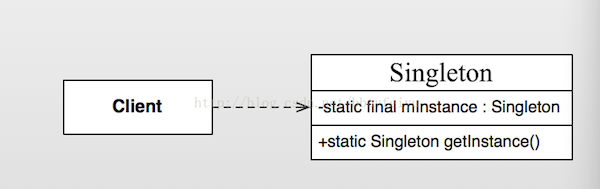  

##### 角色介绍
* Client : 高层客户端。
* Singleton : 单例类。


#### 3. 模式的简单实现
#####  简单实现的介绍
单例模式是设计模式中最简单的，只有一个单例类，没有其他的层次结构与抽象。该模式需要确保该类只能生成一个对象，通常是该类需要消耗太多的资源或者没有没有多个实例的理由。例如一个公司只有一个CEO、一台电脑通常只有一个显示器等。下面我们以公司里的CEO为例来简单演示一下，一个公司可以有几个VP，无数个员工，但是CEO只有一个，请看下面示例。 

##### 实现源码

```java
package com.dp.example.singleton;
/**
 * 人的基类
 * @author mrsimple
 *
 */
public abstract class Person {
	public abstract void talk() ;
}

// 普通员工
public class Staff extends Person {

	@Override
	public void talk() {

	}

}

// 副总裁
public class VP extends Person {

	@Override
	public void talk() {

	}
}

// CEO， 单例模式
public class CEO extends Person {

	private static final CEO mCeo = new CEO();

	private CEO() {
	}

	public static CEO getCeo() {
		return mCeo;
	}

	@Override
	public void talk() {
		System.out.println("CEO发表讲话");
	}

}

// 公司类
import java.util.ArrayList;
import java.util.List;

public class Company {
	private List<Person> allPersons = new ArrayList<Person>();

	public void addStaff(Person per) {
		allPersons.add(per);
	}

	public void showAllStaffs() {
		for (Person per : allPersons) {
			System.out.println("Obj : " + per.toString());
		}
	}
}

// test
public class Test {
	public static void main(String[] args) {
		Company cp = new Company() ;
		Person ceo1 = CEO.getCeo() ;
		Person ceo2 = CEO.getCeo() ;
		cp.addStaff(ceo1);
		cp.addStaff(ceo2);
		
		Person vp1 = new VP() ;
		Person vp2 = new VP() ;
		
		Person staff1 = new Staff() ;
		Person staff2 = new Staff() ;
		Person staff3 = new Staff() ;
		
		cp.addStaff(vp1);
		cp.addStaff(vp2);
		cp.addStaff(staff1);
		cp.addStaff(staff2);
		cp.addStaff(staff3);
		
		cp.showAllStaffs();
	}
}
```    

输出结果如下 : 
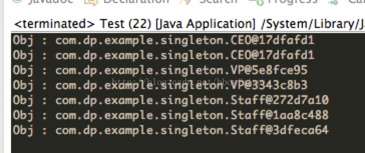    

可以看到, CEO两次输出的CEO对象的文字描述都是一样的，而VP、Staff类的对象都是不同的。即CEO是唯一实例，而其他类型都是不同的实例。这个实现的核心在于将CEO类的构造方法私有化，使得外部程序不能通过构造函数来构造CEO对象，而CEO类通过一个静态方法返回一个唯一的对象。


##### 单例模式的其他实现

```java
package com.dp.example.singleton;

public class Singleton {
	private static Singleton mInstance = null;

	private Singleton() {

	}

	public void doSomething() {
		System.out.println("do sth.");
	}

	/**
	 * 方式二、double-check， 避免并发时创建了多个实例, 该方式不能完全避免并发带来的破坏.
	 * 
	 * @return
	 */
	public static Singleton getInstance() {
		if (mInstance == null) {
			synchronized (Singleton.class) {
				if (mInstance == null) {
					mInstance = new Singleton();
				}
			}
		}
		return mInstance;
	}

	/**
	 * 方式三 : 在第一次加载SingletonHolder时初始化一次mOnlyInstance对象, 保证唯一性, 也延迟了单例的实例化,
	 * 如果该单例比较耗资源可以使用这种模式.
	 * 
	 * @return
	 */
	public static Singleton getInstanceFromHolder() {
		return SingletonHolder.mOnlyInstance;
	}

	/**
	 * 静态内部类
	 * 
	 * @author mrsimple
	 *
	 */
	private static class SingletonHolder {
		private static final Singleton mOnlyInstance = new Singleton();
	}

	/**
	 *  方式四 : 枚举单例, 线程安全
	 * @author mrsimple
	 *
	 */
	enum SingletonEnum {
		INSTANCE;
		public void doSomething() {
			System.out.println("do sth.");
		}
	}

	/**
	 * 方式五 : 注册到容器, 根据key获取对象.一般都会有多种相同属性类型的对象会注册到一个map中
	 * instance容器
	 */
	private static Map<string singleton=""> objMap = new HashMap<string singleton="">();
	/**
	 * 注册对象到map中
	 * @param key
	 * @param instance
	 */
	public static void registerService(String key, Singleton instance) {
		if (!objMap.containsKey(key) ) {
			objMap.put(key, instance) ;
		}
	}
	
	/**
	 * 根据key获取对象
	 * @param key
	 * @return
	 */
	public static Singleton getService(String key) {
		return objMap.get(key) ;
	}

}
```    
不管以哪种形式实现单例模式，它们的核心原理都是将构造函数私有化，并且通过静态方法获取一个唯一的实例，在这个获取的过程中你必须保证线程安全、反序列化导致重新生成实例对象等问题，该模式简单，但使用率较高。       

#### Android源码中的模式实现
在Android系统中，我们经常会通过Context获取系统级别的服务，比如WindowsManagerService, ActivityManagerService等，更常用的是一个叫LayoutInflater的类。这些服务会在合适的时候以单例的形式注册在系统中，在我们需要的时候就通过Context的getSystemService(String name)获取。我们以LayoutInflater为例来说明, 平时我们使用LayoutInflater较为常见的地方是在ListView的getView方法中。 

```java
@Override
public View getView(int position, View convertView, ViewGroup parent)	
	View itemView = null;
	if (convertView == null) {
		itemView = LayoutInflater.from(mContext).inflate(mLayoutId, null);
		// 其他代码
	} else {
		itemView = convertView;
	}
	// 获取Holder
	// 初始化每项的数据
	return itemView;
}
```

通常我们使用LayoutInflater.from(Context)来获取LayoutInflater服务, 下面我们看看LayoutInflater.from(Context)的实现。

```
    /**
     * Obtains the LayoutInflater from the given context.
     */
    public static LayoutInflater from(Context context) {
        LayoutInflater LayoutInflater =
                (LayoutInflater) context.getSystemService(Context.LAYOUT_INFLATER_SERVICE);
        if (LayoutInflater == null) {
            throw new AssertionError("LayoutInflater not found.");
        }
        return LayoutInflater;
    }
```  

可以看到from(Context)函数内部调用的是Context类的getSystemService(String key)方法，我们跟踪到Context类看到, 该类是抽象类。

```java
public abstract class Context {
    // 省略
}
```     

使用的getView中使用的Context对象的具体实现类是什么呢 ？其实在Application，Activity, Service,中都会存在一个Context对象，即Context的总个数为Activity个数 + Service个数 + 1。而ListView通常都是显示在Activity中，那么我们就以Activity中的Context来分析。    

我们知道，一个Activity的入口是ActivityThread的main函数。在该main函数中创建一个新的ActivityThread对象，并且启动消息循环(UI线程)，创建新的Activity、新的Context对象，然后将该Context对象传递给Activity。下面我们看看ActivityThread源码。    

```java
    public static void main(String[] args) {
        SamplingProfilerIntegration.start();

        // CloseGuard defaults to true and can be quite spammy.  We
        // disable it here, but selectively enable it later (via
        // StrictMode) on debug builds, but using DropBox, not logs.
        CloseGuard.setEnabled(false);

        Environment.initForCurrentUser();

        // Set the reporter for event logging in libcore
        EventLogger.setReporter(new EventLoggingReporter());
        Process.setArgV0("<pre-initialized>");
        // 主线程消息循环
        Looper.prepareMainLooper();
        // 创建ActivityThread对象
        ActivityThread thread = new ActivityThread();
        thread.attach(false);

        if (sMainThreadHandler == null) {
            sMainThreadHandler = thread.getHandler();
        }

        AsyncTask.init();

        if (false) {
            Looper.myLooper().setMessageLogging(new
                    LogPrinter(Log.DEBUG, "ActivityThread"));
        }

        Looper.loop();

        throw new RuntimeException("Main thread loop unexpectedly exited");
    }

    private void attach(boolean system) {
        sThreadLocal.set(this);
        mSystemThread = system;
        if (!system) {
            ViewRootImpl.addFirstDrawHandler(new Runnable() {
                public void run() {
                    ensureJitEnabled();
                }
            });
            android.ddm.DdmHandleAppName.setAppName("<pre-initialized>",
                                                    UserHandle.myUserId());
            RuntimeInit.setApplicationObject(mAppThread.asBinder());
            IActivityManager mgr = ActivityManagerNative.getDefault();
            try {
                mgr.attachApplication(mAppThread);
            } catch (RemoteException ex) {
                // Ignore
            }
        } else {
               // 省略
        }
}
```    

在main方法中，我们创建一个ActivityThread对象后，调用了其attach函数，并且参数为false. 在attach函数中， 参数为false的情况下， 会通过Binder机制与ActivityManagerService通信，并且最终调用handleLaunchActivity函数 ( 具体分析请参考老罗的博客 : [Activity的启动流程](http://blog.csdn.net/luoshengyang/article/details/6689748))，我们看看该函数的实现 。     

```java

    private void handleLaunchActivity(ActivityClientRecord r, Intent customIntent) {
        // 代码省略
        Activity a = performLaunchActivity(r, customIntent);
        // 代码省略
    }
    
     private Activity performLaunchActivity(ActivityClientRecord r, Intent customIntent) {
        // System.out.println("##### [" + System.currentTimeMillis() + "] ActivityThread.performLaunchActivity(" + r + ")");
        // 代码省略
        Activity activity = null;
        try {
            java.lang.ClassLoader cl = r.packageInfo.getClassLoader();
            activity = mInstrumentation.newActivity(         // 1 : 创建Activity
                    cl, component.getClassName(), r.intent);
         // 代码省略
        } catch (Exception e) {
         // 省略
        }

        try {
            Application app = r.packageInfo.makeApplication(false, mInstrumentation);

            if (activity != null) {
                Context appContext = createBaseContextForActivity(r, activity); // 2 : 获取Context对象
                CharSequence title = r.activityInfo.loadLabel(appContext.getPackageManager());
                Configuration config = new Configuration(mCompatConfiguration);
                // 3: 将appContext等对象attach到activity中
                activity.attach(appContext, this, getInstrumentation(), r.token,
                        r.ident, app, r.intent, r.activityInfo, title, r.parent,
                        r.embeddedID, r.lastNonConfigurationInstances, config);

                // 代码省略
                // 4 ： 调用Activity的onCreate方法
                mInstrumentation.callActivityOnCreate(activity, r.state);
                // 代码省略
        } catch (SuperNotCalledException e) {
            throw e;
        } catch (Exception e) {
            // 代码省略
        }

        return activity;
    }


    private Context createBaseContextForActivity(ActivityClientRecord r,
            final Activity activity) {
        // 5 ： 创建Context对象, 可以看到实现类是ContextImpl
        ContextImpl appContext = new ContextImpl();           appContext.init(r.packageInfo, r.token, this);
        appContext.setOuterContext(activity);

        // 代码省略
        return baseContext;
    }
    
```   

通过上面1~5的代码分析可以知道， Context的实现类为ComtextImpl类。我们继续跟踪到ContextImpl类。 

```java
class ContextImpl extends Context {
  
    // 代码省略
    /**
     * Override this class when the system service constructor needs a
     * ContextImpl.  Else, use StaticServiceFetcher below.
     */
     static class ServiceFetcher {
        int mContextCacheIndex = -1;

        /**
         * Main entrypoint; only override if you don't need caching.
         */
        public Object getService(ContextImpl ctx) {
            ArrayList<Object> cache = ctx.mServiceCache;
            Object service;
            synchronized (cache) {
                if (cache.size() == 0) {
                    for (int i = 0; i < sNextPerContextServiceCacheIndex; i++) {
                        cache.add(null);
                    }
                } else {
                    service = cache.get(mContextCacheIndex);
                    if (service != null) {
                        return service;
                    }
                }
                service = createService(ctx);
                cache.set(mContextCacheIndex, service);
                return service;
            }
        }

        /**
         * Override this to create a new per-Context instance of the
         * service.  getService() will handle locking and caching.
         */
        public Object createService(ContextImpl ctx) {
            throw new RuntimeException("Not implemented");
        }
    }

    // 1 : service容器
    private static final HashMap<String, ServiceFetcher> SYSTEM_SERVICE_MAP =
            new HashMap<String, ServiceFetcher>();

    private static int sNextPerContextServiceCacheIndex = 0;
    // 2: 注册服务器
    private static void registerService(String serviceName, ServiceFetcher fetcher) {
        if (!(fetcher instanceof StaticServiceFetcher)) {
            fetcher.mContextCacheIndex = sNextPerContextServiceCacheIndex++;
        }
        SYSTEM_SERVICE_MAP.put(serviceName, fetcher);
    }


    // 3: 静态语句块, 第一次加载该类时执行 ( 只执行一次, 保证实例的唯一性. )
    static {
        //  代码省略
        // 注册Activity Servicer
        registerService(ACTIVITY_SERVICE, new ServiceFetcher() {
                public Object createService(ContextImpl ctx) {
                    return new ActivityManager(ctx.getOuterContext(), ctx.mMainThread.getHandler());
                }});

        // 注册LayoutInflater service
        registerService(LAYOUT_INFLATER_SERVICE, new ServiceFetcher() {
                public Object createService(ContextImpl ctx) {
                    return PolicyManager.makeNewLayoutInflater(ctx.getOuterContext());
                }});
        // 代码省略
    }

    // 4: 根据key获取对应的服务, 
    @Override
    public Object getSystemService(String name) {
        // 根据name来获取服务
        ServiceFetcher fetcher = SYSTEM_SERVICE_MAP.get(name);
        return fetcher == null ? null : fetcher.getService(this);
    }

    // 代码省略
}

```     

从ContextImpl类的部分代码中可以看到，在虚拟机第一次加载该类时会注册各种服务，其中就包含了LayoutInflater Service, 将这些服务以键值对的形式存储在一个HashMap中，用户使用时只需要根据key来获取到对应的服务，从而达到单例的效果。这种模式就是上文中提到的“单例模式的实现方式5”。系统核心服务以单例形式存在，减少了资源消耗。         


#### 4. 杂谈
##### 优点与缺点
###### 优点  
* 由于单例模式在内存中只有一个实例，减少了内存开支，特别是一个对象需要频繁地创建、销毁时，而且创建或销毁时性能又无法优化，单例模式的优势就非常明显。
* 由于单例模式只生成一个实例，所以减少了系统的性能开销，当一个对象的产生需要比较多的资源时，如读取配置、产生其他依赖对象时，则可以通过在应用启动时直接产生一个单例对象，然后用永久驻留内存的方式来解决；
* 单例模式可以避免对资源的多重占用，例如一个写文件动作，由于只有一个实例存在内存中，避免对同一个资源文件的同时写操作。
* 单例模式可以在系统设置全局的访问点，优化和共享资源访问，例如可以设计一个单例类，负责所有数据表的映射处理。

###### 缺点 
* 单例模式一般没有接口，扩展很困难，若要扩展，除了修改代码基本上没有第二种途径可以实现。 

<a id="builder"></a>

### Builder 模式
> 本文为 [Android 设计模式源码解析](https://github.com/simple-android-framework-exchange/android_design_patterns_analysis) 中 Builder模式 分析  
> Android系统版本： 2.3        
> 分析者：[Mr.Simple](https://github.com/bboyfeiyu)，分析状态：完成，校对者：[Mr.Simple](https://github.com/bboyfeiyu)，校对状态：完成   
 

#### 1. 模式介绍  
 
#####  模式的定义
将一个复杂对象的构建与它的表示分离，使得同样的构建过程可以创建不同的表示。

##### 模式的使用场景
1. 相同的方法，不同的执行顺序，产生不同的事件结果时；   
2. 多个部件或零件，都可以装配到一个对象中，但是产生的运行结果又不相同时；
3. 产品类非常复杂，或者产品类中的调用顺序不同产生了不同的效能，这个时候使用建造者模式非常合适；
 

#### 2. UML类图
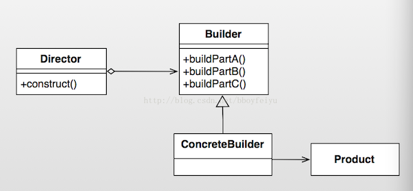  

##### 角色介绍
* Product 产品类 :  产品的抽象类。
* Builder : 抽象类， 规范产品的组建，一般是由子类实现具体的组件过程。
* ConcreteBuilder : 具体的构建器.
* Director : 统一组装过程(可省略)。


#### 3. 模式的简单实现
#####  简单实现的介绍
电脑的组装过程较为复杂，步骤繁多，但是顺序却是不固定的。下面我们以组装电脑为例来演示一下简单且经典的builder模式。

##### 实现源码

```java
package com.dp.example.builder;

/**
 * Computer产品抽象类, 为了例子简单, 只列出这几个属性
 * 
 * @author mrsimple
 *
 */
public abstract class Computer {

	protected int mCpuCore = 1;
	protected int mRamSize = 0;
	protected String mOs = "Dos";

	protected Computer() {

	}

	// 设置CPU核心数
	public abstract void setCPU(int core);

	// 设置内存
	public abstract void setRAM(int gb);

	// 设置操作系统
	public abstract void setOs(String os);

	@Override
	public String toString() {
		return "Computer [mCpuCore=" + mCpuCore + ", mRamSize=" + mRamSize
				+ ", mOs=" + mOs + "]";
	}

}

package com.dp.example.builder;

/**
 * Apple电脑
 */
public class AppleComputer extends Computer {

	protected AppleComputer() {

	}

	@Override
	public void setCPU(int core) {
		mCpuCore = core;
	}

	@Override
	public void setRAM(int gb) {
		mRamSize = gb;
	}

	@Override
	public void setOs(String os) {
		mOs = os;
	}

}

package com.dp.example.builder;


package com.dp.example.builder;

/**
 * builder抽象类
 *
 */
public abstract class Builder {
	// 设置CPU核心数
	public abstract void buildCPU(int core);

	// 设置内存
	public abstract void buildRAM(int gb);

	// 设置操作系统
	public abstract void buildOs(String os);

	// 创建Computer
	public abstract Computer create();

}

package com.dp.example.builder;

public class ApplePCBuilder extends Builder {
	private Computer mApplePc = new AppleComputer();

	@Override
	public void buildCPU(int core) {
		mApplePc.setCPU(core);
	}

	@Override
	public void buildRAM(int gb) {
		mApplePc.setRAM(gb);
	}

	@Override
	public void buildOs(String os) {
		mApplePc.setOs(os);
	}

	@Override
	public Computer create() {
		return mApplePc;
	}

}

package com.dp.example.builder;

public class Director {
	Builder mBuilder = null;

	/**
	 * 
	 * @param builder
	 */
	public Director(Builder builder) {
		mBuilder = builder;
	}

	/**
	 * 构建对象
	 * 
	 * @param cpu
	 * @param ram
	 * @param os
	 */
	public void construct(int cpu, int ram, String os) {
		mBuilder.buildCPU(cpu);
		mBuilder.buildRAM(ram);
		mBuilder.buildOs(os);
	}
}

/**
 * 经典实现较为繁琐
 * 
 * @author mrsimple
 *
 */
public class Test {
	public static void main(String[] args) {
		// 构建器
		Builder builder = new ApplePCBuilder();
		// Director
		Director pcDirector = new Director(builder);
		// 封装构建过程, 4核, 内存2GB, Mac系统
		pcDirector.construct(4, 2, "Mac OS X 10.9.1");
		// 构建电脑, 输出相关信息
		System.out.println("Computer Info : " + builder.create().toString());
	}
}
```    

通过Builder来构建产品对象, 而Director封装了构建复杂产品对象对象的过程，不对外隐藏构建细节。


#### Android源码中的模式实现
在Android源码中，我们最常用到的Builder模式就是AlertDialog.Builder， 使用该Builder来构建复杂的AlertDialog对象。简单示例如下 : 

```java
    //显示基本的AlertDialog  
    private void showDialog(Context context) {  
        AlertDialog.Builder builder = new AlertDialog.Builder(context);  
        builder.setIcon(R.drawable.icon);  
        builder.setTitle("Title");  
        builder.setMessage("Message");  
        builder.setPositiveButton("Button1",  
                new DialogInterface.OnClickListener() {  
                    public void onClick(DialogInterface dialog, int whichButton) {  
                        setTitle("点击了对话框上的Button1");  
                    }  
                });  
        builder.setNeutralButton("Button2",  
                new DialogInterface.OnClickListener() {  
                    public void onClick(DialogInterface dialog, int whichButton) {  
                        setTitle("点击了对话框上的Button2");  
                    }  
                });  
        builder.setNegativeButton("Button3",  
                new DialogInterface.OnClickListener() {  
                    public void onClick(DialogInterface dialog, int whichButton) {  
                        setTitle("点击了对话框上的Button3");  
                    }  
                });  
        builder.create().show();  // 构建AlertDialog， 并且显示
    } 
```

结果 : 
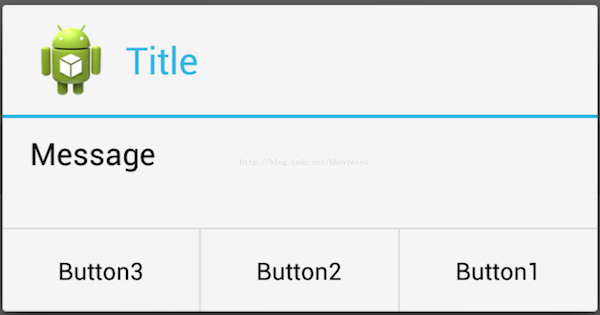     

下面我们看看AlertDialog的相关源码 :

```java
// AlertDialog
public class AlertDialog extends Dialog implements DialogInterface {
    // Controller, 接受Builder成员变量P中的各个参数
    private AlertController mAlert;

    // 构造函数
    protected AlertDialog(Context context, int theme) {
        this(context, theme, true);
    }

    // 4 : 构造AlertDialog
    AlertDialog(Context context, int theme, boolean createContextWrapper) {
        super(context, resolveDialogTheme(context, theme), createContextWrapper);
        mWindow.alwaysReadCloseOnTouchAttr();
        mAlert = new AlertController(getContext(), this, getWindow());
    }

    // 实际上调用的是mAlert的setTitle方法
    @Override
    public void setTitle(CharSequence title) {
        super.setTitle(title);
        mAlert.setTitle(title);
    }

    // 实际上调用的是mAlert的setCustomTitle方法
    public void setCustomTitle(View customTitleView) {
        mAlert.setCustomTitle(customTitleView);
    }
    
    public void setMessage(CharSequence message) {
        mAlert.setMessage(message);
    }

    // AlertDialog其他的代码省略
    
    // ************  Builder为AlertDialog的内部类   *******************
    public static class Builder {
        // 1 : 存储AlertDialog的各个参数, 例如title, message, icon等.
        private final AlertController.AlertParams P;
        // 属性省略
        
        /**
         * Constructor using a context for this builder and the {@link AlertDialog} it creates.
         */
        public Builder(Context context) {
            this(context, resolveDialogTheme(context, 0));
        }


        public Builder(Context context, int theme) {
            P = new AlertController.AlertParams(new ContextThemeWrapper(
                    context, resolveDialogTheme(context, theme)));
            mTheme = theme;
        }
        
        // Builder的其他代码省略 ......

        // 2 : 设置各种参数
        public Builder setTitle(CharSequence title) {
            P.mTitle = title;
            return this;
        }
        
        
        public Builder setMessage(CharSequence message) {
            P.mMessage = message;
            return this;
        }

        public Builder setIcon(int iconId) {
            P.mIconId = iconId;
            return this;
        }
        
        public Builder setPositiveButton(CharSequence text, final OnClickListener listener) {
            P.mPositiveButtonText = text;
            P.mPositiveButtonListener = listener;
            return this;
        }
        
        
        public Builder setView(View view) {
            P.mView = view;
            P.mViewSpacingSpecified = false;
            return this;
        }
        
        // 3 : 构建AlertDialog, 传递参数
        public AlertDialog create() {
            // 调用new AlertDialog构造对象， 并且将参数传递个体AlertDialog 
            final AlertDialog dialog = new AlertDialog(P.mContext, mTheme, false);
            // 5 : 将P中的参数应用的dialog中的mAlert对象中
            P.apply(dialog.mAlert);
            dialog.setCancelable(P.mCancelable);
            if (P.mCancelable) {
                dialog.setCanceledOnTouchOutside(true);
            }
            dialog.setOnCancelListener(P.mOnCancelListener);
            if (P.mOnKeyListener != null) {
                dialog.setOnKeyListener(P.mOnKeyListener);
            }
            return dialog;
        }
    }
    
}
``` 
可以看到，通过Builder来设置AlertDialog中的title, message, button等参数， 这些参数都存储在类型为AlertController.AlertParams的成员变量P中，AlertController.AlertParams中包含了与之对应的成员变量。在调用Builder类的create函数时才创建AlertDialog, 并且将Builder成员变量P中保存的参数应用到AlertDialog的mAlert对象中，即P.apply(dialog.mAlert)代码段。我们看看apply函数的实现 : 

```java
        public void apply(AlertController dialog) {
            if (mCustomTitleView != null) {
                dialog.setCustomTitle(mCustomTitleView);
            } else {
                if (mTitle != null) {
                    dialog.setTitle(mTitle);
                }
                if (mIcon != null) {
                    dialog.setIcon(mIcon);
                }
                if (mIconId >= 0) {
                    dialog.setIcon(mIconId);
                }
                if (mIconAttrId > 0) {
                    dialog.setIcon(dialog.getIconAttributeResId(mIconAttrId));
                }
            }
            if (mMessage != null) {
                dialog.setMessage(mMessage);
            }
            if (mPositiveButtonText != null) {
                dialog.setButton(DialogInterface.BUTTON_POSITIVE, mPositiveButtonText,
                        mPositiveButtonListener, null);
            }
            if (mNegativeButtonText != null) {
                dialog.setButton(DialogInterface.BUTTON_NEGATIVE, mNegativeButtonText,
                        mNegativeButtonListener, null);
            }
            if (mNeutralButtonText != null) {
                dialog.setButton(DialogInterface.BUTTON_NEUTRAL, mNeutralButtonText,
                        mNeutralButtonListener, null);
            }
            if (mForceInverseBackground) {
                dialog.setInverseBackgroundForced(true);
            }
            // For a list, the client can either supply an array of items or an
            // adapter or a cursor
            if ((mItems != null) || (mCursor != null) || (mAdapter != null)) {
                createListView(dialog);
            }
            if (mView != null) {
                if (mViewSpacingSpecified) {
                    dialog.setView(mView, mViewSpacingLeft, mViewSpacingTop, mViewSpacingRight,
                            mViewSpacingBottom);
                } else {
                    dialog.setView(mView);
                }
            }
        }
```
实际上就是把P中的参数挨个的设置到AlertController中， 也就是AlertDialog中的mAlert对象。从AlertDialog的各个setter方法中我们也可以看到，实际上也都是调用了mAlert对应的setter方法。在这里，Builder同时扮演了上文中提到的builder、ConcreteBuilder、Director的角色，简化了Builder模式的设计。       


#### 4. 杂谈
##### 优点与缺点
###### 优点  
* 良好的封装性， 使用建造者模式可以使客户端不必知道产品内部组成的细节；
* 建造者独立，容易扩展；
* 在对象创建过程中会使用到系统中的一些其它对象，这些对象在产品对象的创建过程中不易得到。

###### 缺点 
* 会产生多余的Builder对象以及Director对象，消耗内存；
* 对象的构建过程暴露。 

<a id="prototype"></a>

### 原型模式
> 本文为 [Android 设计模式源码解析](https://github.com/simple-android-framework-exchange/android_design_patterns_analysis) 中 原型模式 分析  
> Android系统版本： 2.3         
> 分析者：[Mr.Simple](https://github.com/bboyfeiyu)，分析状态：未完成，校对者：[Mr.Simple](https://github.com/bboyfeiyu)，校对状态：完成    

#### 1. 模式介绍  
 
#####  模式的定义
用原型实例指定创建对象的种类，并通过拷贝这些原型创建新的对象。


##### 模式的使用场景
1. 类初始化需要消化非常多的资源，这个资源包括数据、硬件资源等，通过原型拷贝避免这些消耗；
2. 通过 new 产生一个对象需要非常繁琐的数据准备或访问权限，则可以使用原型模式；
3. 一个对象需要提供给其他对象访问，而且各个调用者可能都需要修改其值时，可以考虑使用原型模式拷贝多个对象供调用者使用，即保护性拷贝。 
 

#### 2. UML类图
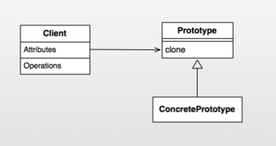

##### 角色介绍
* Client  :  客户端用户。
* Prototype : 抽象类或者接口，声明具备clone能力。
* ConcretePrototype : 具体的原型类.


#### 3. 模式的简单实现
#####  简单实现的介绍   

下面我们以简单的文档拷贝为例来演示一下简单的原型模式模式。     

##### 实现源码

```java
package com.dp.example.builder;


package com.dp.example.prototype;

import java.util.ArrayList;
import java.util.List;

/**
 * 文档类型, 扮演的是ConcretePrototype角色，而cloneable是代表prototype角色
 * 
 * @author mrsimple
 */
public class WordDocument implements Cloneable {
    /**
     * 文本
     */
    private String mText;
    /**
     * 图片名列表
     */
    private ArrayList<String><string> mImages = new ArrayList<String><string>();

    public WordDocument() {
        System.out.println("----------- WordDocument构造函数 -----------");
    }

    /**
     * 克隆对象
     */
    @Override
    protected WordDocument clone() {
        try {
            WordDocument doc = (WordDocument) super.clone();
            doc.mText = this.mText;
            doc.mImages = this.mImages;
            return doc;
        } catch (Exception e) {
        }

        return null;
    }

    public String getText() {
        return mText;
    }

    public void setText(String mText) {
        this.mText = mText;
    }

    public List<string> getImages() {
        return mImages;
    }

    /**
     * @param img
     */
    public void addImage(String img) {
        this.mImages.add(img);
    }

    /**
     * 打印文档内容
     */
    public void showDocument() {
        System.out.println("----------- Word Content Start -----------");
        System.out.println("Text : " + mText);
        System.out.println("Images List: ");
        for (String imgName : mImages) {
            System.out.println("image name : " + imgName);
        }
        System.out.println("----------- Word Content End -----------");
    }
}
```

通过WordDocument类模拟了word文档中的基本元素，即文字和图片。WordDocument的在该原型模式示例中扮演的角色为ConcretePrototype， 而Cloneable的角色则为Prototype。WordDocument实现了clone方法以实现对象克隆。下面我们看看Client端的使用 :       

```java
public class Client {
    public static void main(String[] args) {
        WordDocument originDoc = new WordDocument();
        originDoc.setText("这是一篇文档");
        originDoc.addImage("图片1");
        originDoc.addImage("图片2");
        originDoc.addImage("图片3");
        originDoc.showDocument();

        WordDocument doc2 = originDoc.clone();
        doc2.showDocument();
        
        doc2.setText("这是修改过的Doc2文本");
        doc2.showDocument();
         
        originDoc.showDocument();
    }

}
```
输出结果如下 :     
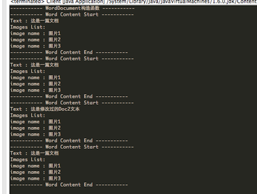

可以看到，doc2是通过originDoc.clone()创建的，并且doc2第一次输出的时候和originDoc输出是一样的。即doc2是originDoc的一份拷贝，他们的内容是一样的，而doc2修改了文本内容以后并不会影响originDoc的文本内容。需要注意的是通过clone拷贝对象的时候并不会执行构造函数！


##### 浅拷贝和深拷贝
将main函数的内容修改为如下 :    

```java
    public static void main(String[] args) {
        WordDocument originDoc = new WordDocument();
        originDoc.setText("这是一篇文档");
        originDoc.addImage("图片1");
        originDoc.addImage("图片2");
        originDoc.addImage("图片3");
        originDoc.showDocument();

        WordDocument doc2 = originDoc.clone();
        
        doc2.showDocument();
        
        doc2.setText("这是修改过的Doc2文本");
        doc2.addImage("哈哈.jpg");
        doc2.showDocument();
        
        originDoc.showDocument();
    }
```

输出结果如下 :  
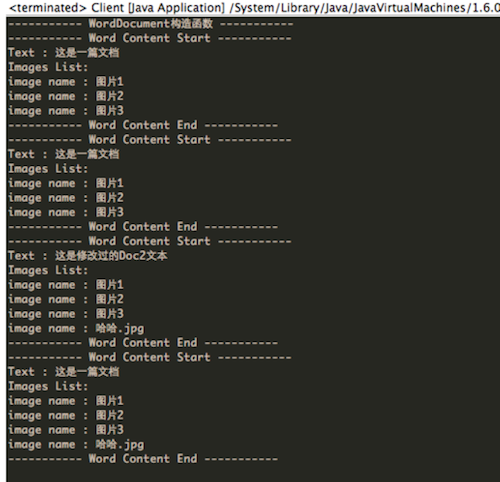       
细心的朋友可能发现了，在doc2添加了一张名为"哈哈.jpg"的照片，但是却也显示在originDoc中？这是怎么回事呢？  其实学习过C++的朋友都知道，这是因为上文中WordDocument的clone方法中只是简单的进行浅拷贝，引用类型的新对象doc2的mImages只是单纯的指向了this.mImages引用，而并没有进行拷贝。doc2的mImages添加了新的图片，实际上也就是往originDoc里添加了新的图片，所以originDoc里面也有"哈哈.jpg" 。那如何解决这个问题呢？  那就是采用深拷贝，即在拷贝对象时，对于引用型的字段也要采用拷贝的形式，而不是单纯引用的形式。示例如下 :       

```java
    /**
     * 克隆对象
     */
    @Override
    protected WordDocument clone() {
        try {
            WordDocument doc = (WordDocument) super.clone();
            doc.mText = this.mText;
//            doc.mImages = this.mImages;
            doc.mImages = (ArrayList<String>) this.mImages.clone();
            return doc;
        } catch (Exception e) {
        }

        return null;
    }
```

如上代码所示，将doc.mImages指向this.mImages的一份拷贝， 而不是this.mImages本身，这样在doc2添加图片时并不会影响originDoc，如图所示 :      
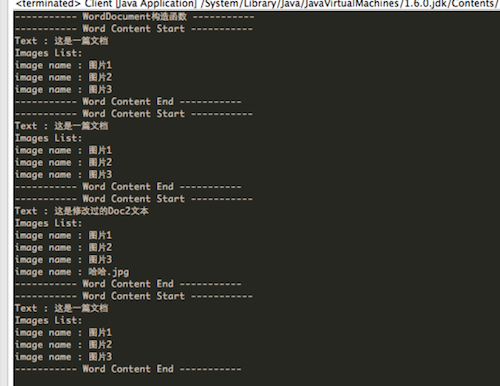        
 	

#### Android源码中的模式实现
在Android源码中，我们以熟悉的Intent来分析源码中的原型模式。简单示例如下 :      

```java
    Uri uri = Uri.parse("smsto:0800000123");    
    Intent shareIntent = new Intent(Intent.ACTION_SENDTO, uri);    
    shareIntent.putExtra("sms_body", "The SMS text");    
    
    Intent intent = (Intent)shareIntent.clone() ;
    startActivity(intent);
```

结果如下 :

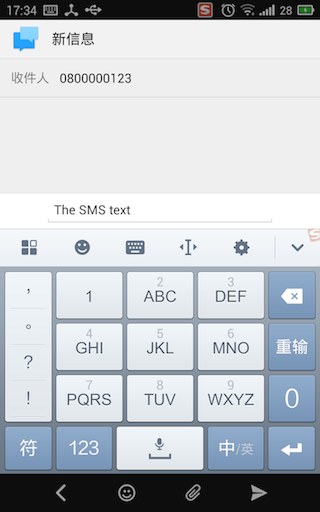        

可以看到，我们通过shareIntent.clone方法拷贝了一个对象intent, 然后执行startActivity(intent)， 随即就进入了短信页面，号码为0800000123,文本内容为The SMS text，即这些内容都与shareIntent一致。   

```java
    @Override
    public Object clone() {
        return new Intent(this);
    }

    /**
     * Copy constructor.
     */
    public Intent(Intent o) {
        this.mAction = o.mAction;
        this.mData = o.mData;
        this.mType = o.mType;
        this.mPackage = o.mPackage;
        this.mComponent = o.mComponent;
        this.mFlags = o.mFlags;
        if (o.mCategories != null) {
            this.mCategories = new ArraySet<String>(o.mCategories);
        }
        if (o.mExtras != null) {
            this.mExtras = new Bundle(o.mExtras);
        }
        if (o.mSourceBounds != null) {
            this.mSourceBounds = new Rect(o.mSourceBounds);
        }
        if (o.mSelector != null) {
            this.mSelector = new Intent(o.mSelector);
        }
        if (o.mClipData != null) {
            this.mClipData = new ClipData(o.mClipData);
        }
    }
```

 可以看到，clone方法实际上在内部调用了new Intent(this); 这就和C++中的拷贝构造函数完全一致了，而且是深拷贝。由于该模式比较简单，就不做太多说明。   
 

#### 4. 杂谈
##### 优点与缺点
* 优点    
原型模式是在内存二进制流的拷贝，要比直接 new 一个对象性能好很多，特别是要在一个循环体内产生大量的对象时，原型模式可以更好地体现其优点。

* 缺点   
这既是它的优点也是缺点，直接在内存中拷贝，构造函数是不会执行的，在实际开发当中应该注意这个潜在的问题。优点就是减少了约束，缺点也是减少了约束，需要大家在实际应用时考虑。


## 结构型模式

<a id="facade"></a>

### 外观模式（Facade）
> 本文为 [Android 设计模式源码解析](https://github.com/simple-android-framework-exchange/android_design_patterns_analysis) 中 外观模式 分析  
> Android系统版本： 2.3         
> 分析者：[elsdnwn](https://github.com/elsdnwn)、[Mr.Simple](https://github.com/bboyfeiyu)，分析状态：已完成，校对者：[Mr.Simple](https://github.com/bboyfeiyu)，校对状态：未开始   


#### 1. 模式介绍  
 
#####  模式的定义
外观模式(也成为门面模式)要求一个子系统的外部与其内部的通信必须通过一个统一的对象进行。它提供一个高层次的接口，使得子系统更易于使用。

##### 模式的使用场景
1. 在设计初期阶段，将不同的两个层分离；
2. 在开发阶段，子系统往往因为不断的重构演化而变得越来越复杂，大多数的模式使用时也都会产生很多很小的类，这本是好事，但也给外部调用它们的用户程序带来了使用上的困难，增加外观Facade可以提供一个简单的接口，减少它们之间的依赖。
3. 在维护一个遗留的大型系统时，可能这个系统已经非常难以维护和扩展了，但因为它包含非常重要的功能，新的需求开发必须依赖于它。

#### 2. UML类图
 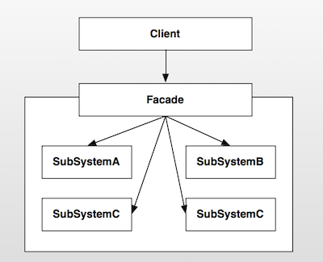

##### 角色介绍
* Client : 客户端程序。
* Facade : 对外的统一入口,即外观对象。
* SubSystemA : 子系统A。
* SubSystemB : 子系统B。
* SubSystemC : 子系统C。
* SubSystemD : 子系统D。

#### 不使用外观模式
 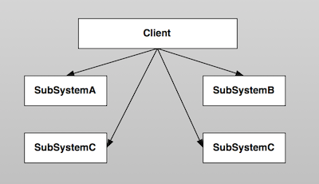     
如上述所说，门面模式提供一个高层次的接口，使得子系统更易于使用。因此在不使用该模式的情况下，客户端程序使用相关功能的成本就会比较的复杂，需要和各个子系统进行交互 ( 如上图 )，这样就使得系统的稳定性受到影响，用户的使用成本也相对较高。      


#### 3. 模式的简单实现
#####  简单实现的介绍
电视遥控器是现实生活中一个比较好的外观模式的运用，遥控器可以控制电源的开源、声音的调整、频道的切换等。这个遥控器就是我们这里说的外观或者门面，而电源、声音、频道切换系统就是我们的子系统。遥控器统一对这些子模块的控制，我想你没有用过多个遥控器来分别控制电源开关、声音控制等功能。下面我们就来简单模拟一下这个系统。     

##### 实现源码
TvController.java   

```java
public class TvController {
    private PowerSystem mPowerSystem = new PowerSystem();
    private VoiceSystem mVoiceSystem = new VoiceSystem();
    private ChannelSystem mChannelSystem = new ChannelSystem();

    public void powerOn() {
        mPowerSystem.powerOn();
    }

    public void powerOff() {
        mPowerSystem.powerOff();
    }

    public void turnUp() {
        mVoiceSystem.turnUp();
    }

    public void turnDown() {
        mVoiceSystem.turnDown();
    }

    public void nextChannel() {
        mChannelSystem.next();
    }

    public void prevChannel() {
        mChannelSystem.prev();
    }
}
```
PowerSystem.java

```java
/**
 * 电源控制系统
 */
 class PowerSystem {
    public void powerOn() {
        System.out.println("开机");
    }

    public void powerOff() {
        System.out.println("关机");
    }
}
```

VoiceSystem.java

```java
/**
 * 声音控制系统
 */
class VoiceSystem {
    public void turnUp() {
        System.out.println("音量增大");
    }

    public void turnDown() {
        System.out.println("音量减小");
    }
}
```


ChannelSystem.java

```java
/**
 * 频道控制系统
 */
class ChannelSystem {
    public void next() {
        System.out.println("下一频道");
    }

    public void prev() {
        System.out.println("上一频道");
    }
}
```

测试代码 :     

```java
public class TvController {
    private PowerSystem mPowerSystem = new PowerSystem();
    private VoiceSystem mVoiceSystem = new VoiceSystem();
    private ChannelSystem mChannelSystem = new ChannelSystem();

    public void powerOn() {
        mPowerSystem.powerOn();
    }

    public void powerOff() {
        mPowerSystem.powerOff();
    }

    public void turnUp() {
        mVoiceSystem.turnUp();
    }

    public void turnDown() {
        mVoiceSystem.turnDown();
    }

    public void nextChannel() {
        mChannelSystem.next();
    }

    public void prevChannel() {
        mChannelSystem.prev();
    }
}

``` 

输出结果：   

```
开机
下一频道
音量增大
关机
``` 
上面的TvController封装了对电源、声音、频道切换的操作，为用户提供了一个统一的接口。使得用户控制电视机更加的方便、更易于使用。        

#### Android源码中的模式实现
在开发过程中，Context是最重要的一个类型。它封装了很多重要的操作，比如startActivity()、sendBroadcast()等，几乎是开发者对应用操作的统一入口。Context是一个抽象类，它只是定义了抽象接口，真正的实现在ContextImpl类中。它就是今天我们要分析的外观类。      

在应用启动时，首先会fork一个子进程，并且调用ActivityThread.main方法启动该进程。ActivityThread又会构建Application对象，然后和Activity、ContextImpl关联起来，然后再调用Activity的onCreate、onStart、onResume函数使Activity运行起来。我们看看下面的相关代码:       

```
private final void handleLaunchActivity(ActivityClientRecord r, Intent customIntent) {
		// 代码省略

        // 1、创建并且加载Activity，调用其onCreate函数
        Activity a = performLaunchActivity(r, customIntent);

        if (a != null) {
            r.createdConfig = new Configuration(mConfiguration);
            Bundle oldState = r.state;
            // 2、调用Activity的onResume方法，使Activity变得可见
            handleResumeActivity(r.token, false, r.isForward);

        }
    }


     private final Activity performLaunchActivity(ActivityClientRecord r, Intent customIntent) {
        // System.out.println("##### [" + System.currentTimeMillis() + "] ActivityThread.performLaunchActivity(" + r + ")");
		// 代码省略

        Activity activity = null;
        try {
            java.lang.ClassLoader cl = r.packageInfo.getClassLoader();
            // 1、创建Activity
            activity = mInstrumentation.newActivity(
                    cl, component.getClassName(), r.intent);
            r.intent.setExtrasClassLoader(cl);
            if (r.state != null) {
                r.state.setClassLoader(cl);
            }
        } catch (Exception e) {
            if (!mInstrumentation.onException(activity, e)) {
                throw new RuntimeException(
                    "Unable to instantiate activity " + component
                    + ": " + e.toString(), e);
            }
        }

        try {
            // 2、创建Application
            Application app = r.packageInfo.makeApplication(false, mInstrumentation);

            if (activity != null) {
                // ***** 构建ContextImpl  ****** 
                ContextImpl appContext = new ContextImpl();
                appContext.init(r.packageInfo, r.token, this);
                appContext.setOuterContext(activity);
                // 获取Activity的title
                CharSequence title = r.activityInfo.loadLabel(appContext.getPackageManager());
                Configuration config = new Configuration(mConfiguration);
            
                 // 3、Activity与context, Application关联起来
                activity.attach(appContext, this, getInstrumentation(), r.token,
                        r.ident, app, r.intent, r.activityInfo, title, r.parent,
                        r.embeddedID, r.lastNonConfigurationInstance,
                        r.lastNonConfigurationChildInstances, config);
				// 代码省略

                // 4、回调Activity的onCreate方法
                mInstrumentation.callActivityOnCreate(activity, r.state);
           
                // 代码省略
            }
            r.paused = true;

            mActivities.put(r.token, r);

        } catch (SuperNotCalledException e) {
            throw e;

        } catch (Exception e) {
      
        }

        return activity;
    }


    final void handleResumeActivity(IBinder token, boolean clearHide, boolean isForward) {
   
        unscheduleGcIdler();

        // 1、最终调用Activity的onResume方法
        ActivityClientRecord r = performResumeActivity(token, clearHide);
        // 代码省略
        // 2、这里是重点，在这里使DecorView变得可见
        if (r.window == null && !a.mFinished && willBeVisible) {
                // 获取Window，即PhoneWindow类型
                r.window = r.activity.getWindow();
                // 3、获取Window的顶级视图，并且使它可见
                View decor = r.window.getDecorView();
                decor.setVisibility(View.INVISIBLE);
                // 4、获取WindowManager
                ViewManager wm = a.getWindowManager();
                // 5、构建LayoutParams参数
                WindowManager.LayoutParams l = r.window.getAttributes();
                a.mDecor = decor;
                l.type = WindowManager.LayoutParams.TYPE_BASE_APPLICATION;
                l.softInputMode |= forwardBit;
                if (a.mVisibleFromClient) {
                    a.mWindowAdded = true;
                    // 6、将DecorView添加到WindowManager中，最终的操作是通过WindowManagerService的addView来操作
                    wm.addView(decor, l);
                }
            } else if (!willBeVisible) {
                if (localLOGV) Slog.v(
                    TAG, "Launch " + r + " mStartedActivity set");
                r.hideForNow = true;
            }
            // 代码省略
    }

 public final ActivityClientRecord performResumeActivity(IBinder token,
            boolean clearHide) {
        ActivityClientRecord r = mActivities.get(token);
       
        if (r != null && !r.activity.mFinished) {
                try {
                // 代码省略
                // 执行onResume
                r.activity.performResume();
				// 代码省略
            } catch (Exception e) {
   
            }
        }
        return r;
    }
```    

Activity启动之后，Android给我们提供了操作系统服务的统一入口，也就是Activity本身。这些工作并不是Activity自己实现的，而是将操作委托给Activity父类ContextThemeWrapper的mBase对象，这个对象的实现类就是ContextImpl ( 也就是performLaunchActivity方法中构建的ContextImpl )。


```java
class ContextImpl extends Context {
    private final static String TAG = "ApplicationContext";
    private final static boolean DEBUG = false;
    private final static boolean DEBUG_ICONS = false;

    private static final Object sSync = new Object();
    private static AlarmManager sAlarmManager;
    private static PowerManager sPowerManager;
    private static ConnectivityManager sConnectivityManager;
    private AudioManager mAudioManager;
    LoadedApk mPackageInfo;
    private Resources mResources;
    private PackageManager mPackageManager;
    private NotificationManager mNotificationManager = null;
    private ActivityManager mActivityManager = null;
    
	// 代码省略
    
        @Override
    public void sendBroadcast(Intent intent) {
        String resolvedType = intent.resolveTypeIfNeeded(getContentResolver());
        try {
            ActivityManagerNative.getDefault().broadcastIntent(
                mMainThread.getApplicationThread(), intent, resolvedType, null,
                Activity.RESULT_OK, null, null, null, false, false);
        } catch (RemoteException e) {
        }
    }
    
    
        @Override
    public void startActivity(Intent intent) {
        if ((intent.getFlags()&Intent.FLAG_ACTIVITY_NEW_TASK) == 0) {
            throw new AndroidRuntimeException(
                    "Calling startActivity() from outside of an Activity "
                    + " context requires the FLAG_ACTIVITY_NEW_TASK flag."
                    + " Is this really what you want?");
        }
        mMainThread.getInstrumentation().execStartActivity(
            getOuterContext(), mMainThread.getApplicationThread(), null, null, intent, -1);
    }
    
    
        @Override
    public ComponentName startService(Intent service) {
        try {
            ComponentName cn = ActivityManagerNative.getDefault().startService(
                mMainThread.getApplicationThread(), service,
                service.resolveTypeIfNeeded(getContentResolver()));
            if (cn != null && cn.getPackageName().equals("!")) {
                throw new SecurityException(
                        "Not allowed to start service " + service
                        + " without permission " + cn.getClassName());
            }
            return cn;
        } catch (RemoteException e) {
            return null;
        }
    }
    
        @Override
    public String getPackageName() {
        if (mPackageInfo != null) {
            return mPackageInfo.getPackageName();
        }
        throw new RuntimeException("Not supported in system context");
    }
}
```
可以看到，ContextImpl内部有很多xxxManager类的对象，也就是我们上文所说的各种子系统的角色。ContextImpl内部封装了一些系统级别的操作，有的子系统功能虽然没有实现，但是也提供了访问该子系统的接口，比如获取ActivityManager的getActivityManager方法。      

比如我们要启动一个Activity的时候，我们调用的是startActivity方法，这个功能的内部实现实际上是Instrumentation完成的。ContextImpl封装了这个功能，使得用户根本不需要知晓Instrumentation相关的信息，直接使用startActivity即可完成相应的工作。其他的子系统功能也是类似的实现，比如启动Service和发送广播内部使用的是ActivityManagerNative等。ContextImpl的结构图如下 :            
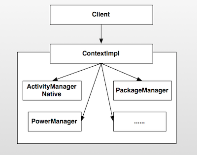

外观模式非常的简单，只是封装了子系统的操作，并且暴露接口让用户使用，避免了用户需要与多个子系统进行交互，降低了系统的耦合度、复杂度。如果没有外观模式的封装，那么用户就必须知道各个子系统的相关细节，子系统之间的交互必然造成纠缠不清的关系，影响系统的稳定性、复杂度。              


#### 4. 杂谈
##### 优点与缺点
###### 优点  
* 使用方便，使用外观模式客户端完全不需要知道子系统的实现过程；
* 降低客户端与子系统的耦合；
* 更好的划分访问层次；

###### 缺点 
* 减少了可变性和灵活性；
* 在不引入抽象外观类的情况下，增加新的子系统可能需要修改外观类或客户端的源代码，违背了“开闭原则”；


<a id="proxy"></a>

### 代理模式
> 本文为 [Android 设计模式源码解析](https://github.com/simple-android-framework-exchange/android_design_patterns_analysis) 中 Proxy模式 分析  
> Android系统版本： 5.0       
> 分析者：[singwhatiwanna](https://github.com/singwhatiwanna)，分析状态：完成，校对者：[Mr.Simple](https://github.com/bboyfeiyu)，校对状态：未校对     

###Binder中的代理模式

再说Binder中的代理模式之前，我们需要先看看代理模式的简单实现，这一部分内容采用了[《JAVA与模式》之代理模式](http://www.cnblogs.com/java-my-life/archive/2012/04/23/2466712.html)这篇文章中的代码示例和uml类图。

#### 1. 模式介绍  
代理模式是对象的结构模式。代理模式给某一个对象提供一个代理对象，并由代理对象控制对原对象的引用。

##### 模式的使用场景
就是一个人或者机构代表另一个人或者机构采取行动。在一些情况下，一个客户不想或者不能够直接引用一个对象，而代理对象可以在客户端和目标对象之间起到中介的作用。

#### 2. UML类图
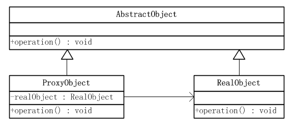

##### 角色介绍
* 抽象对象角色：声明了目标对象和代理对象的共同接口，这样一来在任何可以使用目标对象的地方都可以使用代理对象。

* 目标对象角色：定义了代理对象所代表的目标对象。

* 代理对象角色：代理对象内部含有目标对象的引用，从而可以在任何时候操作目标对象；代理对象提供一个与目标对象相同的接口，以便可以在任何时候替代目标对象。代理对象通常在客户端调用传递给目标对象之前或之后，执行某个操作，而不是单纯地将调用传递给目标对象。

#### 3. 模式的简单实现
#####  简单实现的介绍
下面通过一种抽象的方式来实现下代理模式

##### 实现源码
抽象对象角色

```
public abstract class AbstractObject {
    //操作
    public abstract void operation();
}
```

目标对象角色
```
public class RealObject extends AbstractObject {
    @Override
    public void operation() {
        //一些操作
        System.out.println("一些操作");
    }
}
```

代理对象角色
```
public class ProxyObject extends AbstractObject{
    RealObject realObject = new RealObject();
    @Override
    public void operation() {
        //调用目标对象之前可以做相关操作
        System.out.println("before");        
        realObject.operation();        
        //调用目标对象之后可以做相关操作
        System.out.println("after");
    }
}
```

客户端
```
public class Client {
    public static void main(String[] args) {
        AbstractObject obj = new ProxyObject();
        obj.operation();
    }
}
```
#### 4. 代理模式在Binder中的使用
直观来说，Binder是Android中的一个类，它继承了IBinder接口。从IPC角度来说，Binder是Android中的一种跨进程通信方式，Binder还可以理解为一种虚拟的物理设备，它的设备驱动是/dev/binder，该通信方式在linux中没有；从Android Framework角度来说，Binder是ServiceManager连接各种Manager（ActivityManager、WindowManager，etc）和相应ManagerService的桥梁；从Android应用层来说，Binder是客户端和服务端进行通信的媒介，当你bindService的时候，服务端会返回一个包含了服务端业务调用的Binder对象，通过这个Binder对象，客户端就可以获取服务端提供的服务或者数据，这里的服务包括普通服务和基于AIDL的服务。

Binder一个很重要的作用是：将客户端的请求参数通过Parcel包装后传到远程服务端，远程服务端解析数据并执行对应的操作，同时客户端线程挂起，当服务端方法执行完毕后，再将返回结果写入到另外一个Parcel中并将其通过Binder传回到客户端，客户端接收到返回数据的Parcel后，Binder会解析数据包中的内容并将原始结果返回给客户端，至此，整个Binder的工作过程就完成了。由此可见，Binder更像一个数据通道，Parcel对象就在这个通道中跨进程传输，至于双方如何通信，这并不负责，只需要双方按照约定好的规范去打包和解包数据即可。

为了更好地说明Binder，这里我们先手动实现了一个Binder。为了使得逻辑更清晰，这里简化一下，我们来模拟一个银行系统，这个银行提供的功能只有一个：即查询余额，只有传递一个int的id过来，银行就会将你的余额设置为id*10，满足下大家的发财梦。

1. 先定义一个Binder接口
 ```
package com.ryg.design.manualbinder;

import android.os.IBinder;
import android.os.IInterface;
import android.os.RemoteException;

public interface IBank extends IInterface {

    static final String DESCRIPTOR = "com.ryg.design.manualbinder.IBank";

    static final int TRANSACTION_queryMoney = (IBinder.FIRST_CALL_TRANSACTION + 0);

    public long queryMoney(int uid) throws RemoteException;

}
```

2.创建一个Binder并实现这个上述接口
```
package com.ryg.design.manualbinder;

import android.os.Binder;
import android.os.IBinder;
import android.os.Parcel;
import android.os.RemoteException;

public class BankImpl extends Binder implements IBank {

    public BankImpl() {
        this.attachInterface(this, DESCRIPTOR);
    }

    public static IBank asInterface(IBinder obj) {
        if ((obj == null)) {
            return null;
        }
        android.os.IInterface iin = obj.queryLocalInterface(DESCRIPTOR);
        if (((iin != null) && (iin instanceof IBank))) {
            return ((IBank) iin);
        }
        return new BankImpl.Proxy(obj);
    }

    @Override
    public IBinder asBinder() {
        return this;
    }

    @Override
    public boolean onTransact(int code, Parcel data, Parcel reply, int flags)
            throws RemoteException {
        switch (code) {
        case INTERFACE_TRANSACTION: {
            reply.writeString(DESCRIPTOR);
            return true;
        }
        case TRANSACTION_queryMoney: {
            data.enforceInterface(DESCRIPTOR);
            int uid = data.readInt();
            long result = this.queryMoney(uid);
            reply.writeNoException();
            reply.writeLong(result);
            return true;
        }
        }
        return super.onTransact(code, data, reply, flags);
    }

    @Override
    public long queryMoney(int uid) throws RemoteException {
        return uid * 10l;
    }

    private static class Proxy implements IBank {
        private IBinder mRemote;

        Proxy(IBinder remote) {
            mRemote = remote;
        }

        @Override
        public IBinder asBinder() {
            return mRemote;
        }

        public java.lang.String getInterfaceDescriptor() {
            return DESCRIPTOR;
        }

        @Override
        public long queryMoney(int uid) throws RemoteException {
            Parcel data = Parcel.obtain();
            Parcel reply = Parcel.obtain();
            long result;
            try {
                data.writeInterfaceToken(DESCRIPTOR);
                data.writeInt(uid);
                mRemote.transact(TRANSACTION_queryMoney, data, reply, 0);
                reply.readException();
                result = reply.readLong();
            } finally {
                reply.recycle();
                data.recycle();
            }
            return result;
        }

    }

}
```
ok，到此为止，我们的Binder就完成了，这里只要创建服务端和客户端，二者就能通过我们的Binder来通信了。这里就不做这个示例了，我们的目的是分析代理模式在Binder中的使用。

我们看上述Binder的实现中，有一个叫做“Proxy”的类，它的构造方法如下：
```
  Proxy(IBinder remote) {
      mRemote = remote;
  }
```
Proxy类接收一个IBinder参数，这个参数实际上就是服务端Service中的onBind方法返回的Binder对象在客户端重新打包后的结果，因为客户端无法直接通过这个打包的Binder和服务端通信，因此客户端必须借助Proxy类来和服务端通信，这里Proxy的作用就是代理的作用，客户端所有的请求全部通过Proxy来代理，具体工作流程为：Proxy接收到客户端的请求后，会将客户端的请求参数打包到Parcel对象中，然后将Parcel对象通过它内部持有的Ibinder对象传送到服务端，服务端接收数据、执行方法后返回结果给客户端的Proxy，Proxy解析数据后返回给客户端的真正调用者。很显然，上述所分析的就是典型的代理模式。至于Binder如何传输数据，这涉及到很底层的知识，这个很难搞懂，但是数据传输的核心思想是共享内存。

#### 5. 杂谈
##### 优点与缺点
###### 优点  
* 给对象增加了本地化的扩展性，增加了存取操作控制

###### 缺点 
* 会产生多余的代理类

<a id="bridge"></a>

> 注：原文引用的两张 CSDN UML 图片现已无法取得（原链接返回 404）。为保证汇总文档可离线阅读，以下两图按原文描述重绘并本地化。

### 桥接模式
> 本文为 [Android 设计模式源码解析](https://github.com/simple-android-framework-exchange/android_design_patterns_analysis) 中 桥接模式 分析  
> Android系统版本： 4.2         
> 分析者：[shen0834](https://github.com/shen0834)，分析状态：未完成，校对者：[Mr.Simple](https://github.com/bboyfeiyu)，校对状态：完成   

#### 模式介绍

##### 模式的定义

将抽象部分与实现部分分离，使它们都可以独立的变化。

##### 模式的使用场景
* 如果一个系统需要在构件的抽象化角色和具体化角色之间添加更多的灵活性，避免在两个层次之间建立静态的联系。
* 设计要求实现化角色的任何改变不应当影响客户端，或者实现化角色的改变对客户端是完全透明的。
* 需要跨越多个平台的图形和窗口系统上。
* 一个类存在两个独立变化的维度，且两个维度都需要进行扩展。

##### UML类图

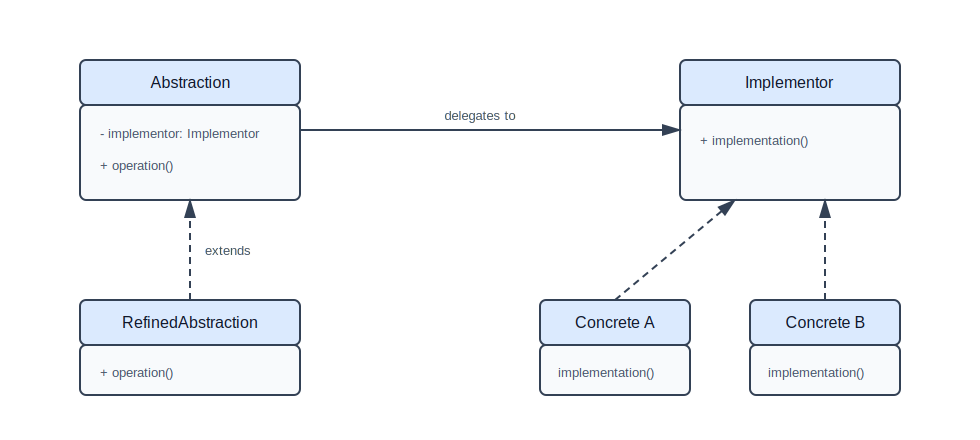

##### 角色介绍

* 抽象化(Abstraction)角色：抽象化给出的定义，并保存一个对实现化对象的引用。
修正抽象化(Refined Abstraction)角色：扩展抽象化角色，改变和修正父类对抽象化的定义。
* 实现化(Implementor)角色：这个角色给出实现化角色的接口，但不给出具体的实现。必须指出的是，这个接 口不一定和抽象化角色的接口定义相同，实际上，这两个接口可以非常不一样。实现化角色应当只给出底层操作，而抽象化角色应当只给出基于底层操作的更高一层的操作。
* 具体实现化(ConcreteImplementor)角色：这个角色给出实现化角色接口的具体实现。

#### 模式的简单实现

##### 介绍

其实Java的虚拟机就是一个很好的例子，在不同平台平台上，用不同的虚拟机进行实现，这样只需把Java程序编译成符合虚拟机规范的文件，且只用编译一次，便在不同平台上都能工作。 但是这样说比较抽象，用一个简单的例子来实现bridge模式。

 编写一个程序，使用两个绘图的程序的其中一个来绘制矩形或者原型，同时，在实例化矩形的时候，它要知道使用绘图程序1（DP1）还是绘图程序2（DP2）。

(ps:假设dp1和dp2的绘制方式不一样，它们是用不同方式进行绘制，示例代码，不讨论过多细节)

##### 实现源码

```java
    首先是两个绘图程序dp1,dp2
//具体的绘图程序类dp1
public class DP1 {
	
	public void draw_1_Rantanle(){
		System.out.println("使用DP1的程序画矩形");
	}
	
	public void draw_1_Circle(){
		System.out.println("使用DP1的程序画圆形");
	}
}
//具体的绘图程序类dp2
public class DP2 {
  
	public void drawRantanle(){
		System.out.println("使用DP2的程序画矩形");
	}
	
	public void drawCircle(){
		System.out.println("使用DP2的程序画圆形");
	}
	
}
接着​抽象的形状Shape和两个派生类：矩形Rantanle和圆形Circle
//抽象化角色Abstraction
abstract class Shape {
	//持有实现的角色Implementor(作图类)
	protected Drawing myDrawing;
	
	public Shape(Drawing drawing) {
		this.myDrawing = drawing;
	}
	
	abstract public void draw();

	//保护方法drawRectangle
	protected void drawRectangle(){
       //this.impl.implmentation()
		myDrawing.drawRantangle();
	}

	//保护方法drawCircle
	protected void drawCircle(){
        //this.impl.implmentation()
		myDrawing.drawCircle();
	}
}
//修正抽象化角色Refined Abstraction(矩形)
public class Rantangle extends Shape{
	public Rantangle(Drawing drawing) {
		super(drawing);
	}
     
	@Override
	public void draw() {
		drawRectangle();
	}
}
//修正抽象化角色Refined Abstraction(圆形)
public class Circle extends Shape {
	public Circle(Drawing drawing) {
		super(drawing);
	}
	@Override
	public void draw() {
		drawCircle();
	}
}
最后，我们的实现绘图的Drawing和分别实现dp1的V1Drawing和dp2的V2Drawing
//实现化角色Implementor
//implmentation两个方法，画圆和画矩形
public interface Drawing {
	public void drawRantangle();
	public void drawCircle();
}
//具体实现化逻辑ConcreteImplementor
//实现了接口方法，使用DP1进行绘图
public class V1Drawing implements Drawing{
 
	DP1 dp1;
	
	public V1Drawing() {
		dp1 = new DP1();
	}
	@Override
	public void drawRantangle() {
		dp1.draw_1_Rantanle();
	}
	@Override
	public void drawCircle() {
		dp1.draw_1_Circle();
	}			
}
//具体实现化逻辑ConcreteImplementor
//实现了接口方法，使用DP2进行绘图
public class V2Drawing implements Drawing{
	DP2 dp2;
	
	public V2Drawing() {
		dp2 = new DP2();
	}
	
	@Override
	public void drawRantangle() {
		dp2.drawRantanle();
	}
	@Override
	public void drawCircle() {
		dp2.drawCircle();
	}
}
```

   ​在这个示例中，图形Shape类有两种类型，圆形和矩形，为了使用不同的绘图程序绘制图形，把实现的部分进行了分离，构成了Drawing类层次结构，包括V1Drawing和V2Drawing。在具体实现类中，V1Drawing控制着DP1程序进行绘图，V2Drawing控制着DP2程序进行绘图，以及保护的方法drawRantangle,drawCircle(Shape类中) 。

#### Android源码中的模式实现

在Android中也运用到了Bridge模式，我们使用很多的ListView和BaseAdpater其实就是Bridge模式的运行，很多人会问这个不是Adapter模式，接下来根据源码来分析。

首先ListAdapter.java：

```java
public interface ListAdapter extends Adapter{
    //继承自Adapter，扩展了自己的两个实现方法
      public boolean areAllItemsEnabled();
      boolean isEnabled(int position);
}  
```

这里先来看一下父类AdapterView。
   
```java   
public abstract class AdapterView<T extends Adapter> extends ViewGroup {  
    //这里需要一个泛型的Adapter
      public abstract T getAdapter();
     public abstract void setAdapter(T adapter);  
}  
```

接着来看ListView的父类AbsListView，继承自AdapterView

```java
public abstract class AbsListView extends AdapterView<ListAdapter>   
    //继承自AdapterView,并且指明了T为ListAdapter
    /**
     * The adapter containing the data to be displayed by this view
     */
    ListAdapter mAdapter;  
    //代码省略
    //这里实现了setAdapter的方法，实例了对实现化对象的引用
    public void setAdapter(ListAdapter adapter) {
        //这的adapter是从子类传入上来，也就是listview，拿到了具体实现化的对象
        if (adapter != null) {
            mAdapterHasStableIds = mAdapter.hasStableIds();
            if (mChoiceMode != CHOICE_MODE_NONE && mAdapterHasStableIds &&
                    mCheckedIdStates == null) {
                mCheckedIdStates = new LongSparseArray<Integer>();
            }
        }
        if (mCheckStates != null) {
            mCheckStates.clear();
        }
        if (mCheckedIdStates != null) {
            mCheckedIdStates.clear();
        }
    }
```

大家都知道，构建一个listview，adapter中最重要的两个方法，getCount()告知数量，getview()告知具体的view类型，接下来看看AbsListView作为一个视图的集合是如何来根据实现化对象adapter来实现的具体的view呢？

```java
   protected void onAttachedToWindow() {
        super.onAttachedToWindow();
        
            //省略代码，
            //这里在加入window的时候，getCount()确定了集合的个数
            mDataChanged = true;
            mOldItemCount = mItemCount;
            mItemCount = mAdapter.getCount();
        }
    }
```
    
接着来看

```java
 View obtainView(int position, boolean[] isScrap) {
        //代码省略
      ​//这里根据位置显示具体的view,return的child是从持有的实现对象mAdapter里面的具体实现的
      ​//方法getview来得到的。
        final View child = mAdapter.getView(position, scrapView, this);
        //代码省略
        return child;
    }  
```

   接下来在ListView中，onMeasure调用了obtainView来确定宽高，在扩展自己的方法来排列这些view。知道了

这些以后，我们来画一个简易的UML图来看下:

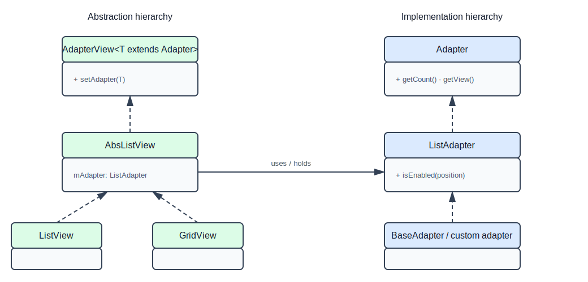

对比下GOF的上图，是不是发现很像呢？实际上最开始研究Adapter模式的时候,越看越不对啊，于是整理结构，画了UML发现这更像是一个bridge模式，那时候对设计模式也是模模糊糊的，于是静下来研究。抽象化的角色一个视图的集合AdapterView，它扩展了AbsListView，AbsSpinner，接下来他们分别扩展了ListView，GridView，Spinner,Gallery，用不同方式来展现这些ItemViews，我们继续扩展类似ListView的PulltoRefreshView等等。而实现化角色Adapter扩展了ListAdpater,SpinnerAdapter，接着具体的实现化角色BaseAdapter实现了他们，我们通过继承BaseAdapter又实现了我们各式各样的ItemView。


#### 杂谈

这里就是Android工程师的牛X之处了，用一个bridge和adapter来解决了一个大的难题。试想一下，视图的排列方式是无穷尽，是人们每个人开发的视图也是无穷尽的。如果你正常开发，你需要多少类来完成呢？而Android把最常用用的展现方式全部都封装了出来，而在实现角色通过Adapter模式来应变无穷无尽的视图需要。抽象化了一个容器使用适配器来给容器里面添加视图，容器的形状(或理解为展现的方式)以及怎么样来绘制容器内的视图，你都可以独自的变化，双双不会干扰，真正的脱耦，就要最开始说的那样：“将抽象部分与实现部分分离，使它们都可以独立的变化。”

从上面的两个案例，我们可以看出，我们在两个解决方案中都用到bridge和adapter模式，那是因为我们必须使用给定的绘图程序(adapter适配器)，绘图程序(adapter适配器)有已经存在的接口必须要遵循，因此需要使用Adapter进行适配，然后才能用同样的方式处理他们,他们经常一起使用，并且相似，但是Adapter并不是Bridge的一部分。

##### 优点与缺点
实现与使用实现的对象解耦，提供了可扩展性，客户对象无需担心操作的实现问题。  如果你采用了bridge模式，在处理新的实现将会非常容易。你只需定义一个新的具体实现类，并且实现它就好了，不需要修改任何其他的东西。但是如果你出现了一个新的具体情况，需要对实现进行修改时，就得先修改抽象的接口，再对其派生类进行修改，但是这种修改只会存在于局部,并且这种修改将变化的英雄控制在局部，并且降低了出现副作用的风险，而且类之间的关系十分清晰，如何实现一目了然。

## 行为型模式

<a id="template-method"></a>

### 模板方法模式
> 本文为 [Android 设计模式源码解析](https://github.com/simple-android-framework-exchange/android_design_patterns_analysis) 中 模板方法模式 分析  
> Android系统版本： 2.3        
> 分析者：[Mr.Simple](https://github.com/bboyfeiyu)，分析状态：完成，校对者：[Mr.Simple](https://github.com/bboyfeiyu)，校对状态：完成   
 

#### 1. 模式介绍  
 
#####  模式的定义
定义一个操作中的算法的框架，而将一些步骤延迟到子类中。使得子类可以不改变一个算法的结构即可重定义该算法的某些特定步骤。


##### 模式的使用场景
1. 多个子类有公有的方法，并且逻辑基本相同时。
2. 重要、复杂的算法，可以把核心算法设计为模板方法，周边的相关细节功能则由各个子类实现。
3. 重构时，模板方法模式是一个经常使用的模式，把相同的代码抽取到父类中，然后通过钩子函数约束其行为。
 

#### 2. UML类图
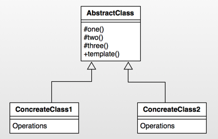  

##### 角色介绍
* AbstractClass : 抽象类，定义了一套算法框架。 
* ConcreteClass1 : 具体实现类1；
* ConcreteClass2： 具体实现类2；


#### 3. 模式的简单实现
#####  简单实现的介绍
模板方法实际上是封装一个算法框架，就像是一套模板一样。而子类可以有不同的算法实现，在框架不被修改的情况下实现算法的替换。下面我们以开电脑这个动作来简单演示一下模板方法。开电脑的整个过程都是相对稳定的，首先打开电脑电源，电脑检测自身状态没有问题时将进入操作系统，对用户进行验证之后即可登录电脑，下面我们使用模板方法来模拟一下这个过程。 

##### 实现源码

```java
package com.dp.example.templatemethod;

/**
 * 抽象的Computer
 * @author mrsimple
 *
 */
public abstract class AbstractComputer {

    protected void powerOn() {
        System.out.println("开启电源");
    }

    protected void checkHardware() {
        System.out.println("硬件检查");
    }

    protected void loadOS() {
        System.out.println("载入操作系统");
    }

    protected void login() {
        System.out.println("小白的电脑无验证，直接进入系统");
    }

    /**
     * 启动电脑方法, 步骤固定为开启电源、系统检查、加载操作系统、用户登录。该方法为final， 防止算法框架被覆写.
     */
    public final void startUp() {
        System.out.println("------ 开机 START ------");
        powerOn();
        checkHardware();
        loadOS();
        login();
        System.out.println("------ 开机 END ------");
    }
}


package com.dp.example.templatemethod;

/**
 * 码农的计算机
 * 
 * @author mrsimple
 */
public class CoderComputer extends AbstractComputer {
    @Override
    protected void login() {
        System.out.println("码农只需要进行用户和密码验证就可以了");
    }
}


package com.dp.example.templatemethod;

/**
 * 军用计算机
 * 
 * @author mrsimple
 */
public class MilitaryComputer extends AbstractComputer {
    
 
    @Override
    protected void checkHardware() {
        super.checkHardware();
        System.out.println("检查硬件防火墙");
    }
    
    @Override
    protected void login() {
        System.out.println("进行指纹之别等复杂的用户验证");
    }
}


package com.dp.example.templatemethod;

public class Test {
    public static void main(String[] args) {
        AbstractComputer comp = new CoderComputer();
        comp.startUp();

        comp = new MilitaryComputer();
        comp.startUp();

    }
}

```    

输出结果如下 :    

```
------ 开机 START ------
开启电源
硬件检查
载入操作系统
码农只需要进行用户和密码验证就可以了
------ 开机 END ------
------ 开机 START ------
开启电源
硬件检查
检查硬件防火墙
载入操作系统
进行指纹之别等复杂的用户验证
------ 开机 END ------
```
   
通过上面的例子可以看到，在startUp方法中有一些固定的步骤，依次为开启电源、检查硬件、加载系统、用户登录四个步骤，这四个步骤是电脑开机过程中不会变动的四个过程。但是不同用户的这几个步骤的实现可能各不相同，因此他们可以用不同的实现。而startUp为final方法，即保证了算法框架不能修改，具体算法实现却可以灵活改变。startUp中的这几个算法步骤我们可以称为是一个套路，即可称为模板方法。因此，模板方法是定义一个操作中的算法的框架，而将一些步骤延迟到子类中。使得子类可以不改变一个算法的结构即可重定义该算法的某些特定步骤。如图 :    

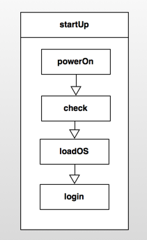


#### Android源码中的模式实现
在Android中，使用了模板方法且为我们熟知的一个典型类就是AsyncTask了，关于AsyncTask的更详细的分析请移步Android中AsyncTask的使用与源码分析，我们这里只分析在该类中使用的模板方法模式。     

在使用AsyncTask时，我们都有知道耗时的方法要放在doInBackground(Params... params)中，在doInBackground之前如果还想做一些类似初始化的操作可以写在onPreExecute方法中，当doInBackground方法执行完成后，会执行onPostExecute方法，而我们只需要构建AsyncTask对象，然后执行execute方法即可。我们可以看到，它整个执行过程其实是一个框架，具体的实现都需要子类来完成。而且它执行的算法框架是固定的，调用execute后会依次执行onPreExecute,doInBackground,onPostExecute,当然你也可以通过onProgressUpdate来更新进度。我们可以简单的理解为如下图的模式  :
	
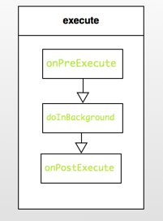	   

下面我们看源码，首先我们看执行异步任务的入口, 即execute方法 :     


```java
 public final AsyncTask<Params, Progress, Result> execute(Params... params) {
        return executeOnExecutor(sDefaultExecutor, params);
    }

    public final AsyncTask<Params, Progress, Result> executeOnExecutor(Executor exec,
            Params... params) {
        if (mStatus != Status.PENDING) {
            switch (mStatus) {
                case RUNNING:
                    throw new IllegalStateException("Cannot execute task:"
                            + " the task is already running.");
                case FINISHED:
                    throw new IllegalStateException("Cannot execute task:"
                            + " the task has already been executed "
                            + "(a task can be executed only once)");
            }
        }

        mStatus = Status.RUNNING;

        onPreExecute();

        mWorker.mParams = params;
        exec.execute(mFuture);

        return this;
    }

```

可以看到execute方法(为final类型的方法)调用了executeOnExecutor方法，在该方法中会判断该任务的状态，如果不是PENDING状态则抛出异常，这也解释了为什么AsyncTask只能被执行一次，因此如果该任务已经被执行过的话那么它的状态就会变成FINISHED。继续往下看，我们看到在executeOnExecutor方法中首先执行了onPreExecute方法，并且该方法执行在UI线程。然后将params参数传递给了mWorker对象的mParams字段，然后执行了exec.execute(mFuture)方法。        

mWorker和mFuture又是什么呢？其实mWorker只是实现了Callable接口，并添加了一个参数数组字段，关于Callable和FutureTask的资料请参考[Java中的Runnable、Callable、Future、FutureTask的区别与示例](http://blog.csdn.net/bboyfeiyu/article/details/24851847)，我们挨个来分析吧，跟踪代码我们可以看到，这两个字段都是在构造函数中初始化。

```java
   public AsyncTask() {
        mWorker = new WorkerRunnable<Params, Result>() {
            public Result call() throws Exception {
                mTaskInvoked.set(true);

                Process.setThreadPriority(Process.THREAD_PRIORITY_BACKGROUND);
                return postResult(doInBackground(mParams));
            }
        };

        mFuture = new FutureTask<Result>(mWorker) {
            @Override
            protected void done() {
                try {
                    final Result result = get();

                    postResultIfNotInvoked(result);
                } catch (InterruptedException e) {
                    android.util.Log.w(LOG_TAG, e);
                } catch (ExecutionException e) {
                    throw new RuntimeException("An error occured while executing doInBackground()",
                            e.getCause());
                } catch (CancellationException e) {
                    postResultIfNotInvoked(null);
                } catch (Throwable t) {
                    throw new RuntimeException("An error occured while executing "
                            + "doInBackground()", t);
                }
            }
        };
    }
```  

简单的说就是mFuture就包装了这个mWorker对象，会调用mWorker对象的call方法，并且将之返回给调用者。      
	关于AsyncTask的更详细的分析请移步[Android中AsyncTask的使用与源码分析](http://blog.csdn.net/bboyfeiyu/article/details/8973058)，我们这里只分析模板方法模式。总之，call方法会在子线程中调用，而在call方法中又调用了doInBackground方法，因此doInBackground会执行在子线程。doInBackground会返回结果，最终通过postResult投递给UI线程。
	我们再看看postResult的实现 :     
	
```java
    private Result postResult(Result result) {
        Message message = sHandler.obtainMessage(MESSAGE_POST_RESULT,
                new AsyncTaskResult<Result>(this, result));
        message.sendToTarget();
        return result;
    }

    private static class InternalHandler extends Handler {
        @SuppressWarnings({"unchecked", "RawUseOfParameterizedType"})
        @Override
        public void handleMessage(Message msg) {
            AsyncTaskResult result = (AsyncTaskResult) msg.obj;
            switch (msg.what) {
                case MESSAGE_POST_RESULT:
                    // There is only one result
                    result.mTask.finish(result.mData[0]);
                    break;
                case MESSAGE_POST_PROGRESS:
                    result.mTask.onProgressUpdate(result.mData);
                    break;
            }
        }
    }


    private void finish(Result result) {
        if (isCancelled()) {
            onCancelled(result);
        } else {
            onPostExecute(result);
        }
        mStatus = Status.FINISHED;
    }

```     

可以看到，postResult就是把一个消息( msg.what == MESSAGE_POST_RESULT)发送给sHandler，sHandler类型为InternalHandler类型，当InternalHandler接到MESSAGE_POST_RESULT类型的消息时就会调用result.mTask.finish(result.mData[0])方法。我们可以看到result为AsyncTaskResult类型，源码如下  :     
   

```java
    @SuppressWarnings({"RawUseOfParameterizedType"})
    private static class AsyncTaskResult<Data> {
        final AsyncTask mTask;
        final Data[] mData;

        AsyncTaskResult(AsyncTask task, Data... data) {
            mTask = task;
            mData = data;
        }
    }
```    

**可以看到mTask就是AsyncTask对象**，调用AsyncTask对象的finish方法时又调用了onPostExecute，这个时候整个执行过程就完成了。
	总之，execute方法内部封装了onPreExecute, doInBackground, onPostExecute这个算法框架，用户可以根据自己的需求来在覆写这几个方法，使得用户可以很方便的使用异步任务来完成耗时操作，又可以通过onPostExecute来完成更新UI线程的工作。       
	另一个比较好的模板方法示例就是Activity的声明周期函数，例如Activity从onCreate、onStart、onResume这些程式化的执行模板，这就是一个Activity的模板方法。       

#### 4. 杂谈
##### 优点与缺点
###### 优点  
* 封装不变部分，扩展可变部分
* 提取公共部分代码，便于维护

###### 缺点 
* 模板方法会带来代码阅读的难度，会让心觉得难以理解。 

<a id="strategy"></a>

### 策略模式
> 本文为 [Android 设计模式源码解析](https://github.com/simple-android-framework/android_design_patterns_analysis) 中策略模式分析  
> Android系统版本：4.4.2         
> 分析者：[GKerison](https://github.com/GKerison)，分析状态：已完成，校对者：[Mr.Simple](https://github.com/bboyfeiyu)，校对状态：完成   

#### 1. 模式介绍  
 
#####  模式的定义
**策略模式定义了一系列的算法，并将每一个算法封装起来，而且使它们还可以相互替换。策略模式让算法独立于使用它的客户而独立变化。**

`注：针对同一类型操作，将复杂多样的处理方式分别开来，有选择的实现各自特有的操作。`

##### 模式的使用场景
* 针对同一类型问题的多种处理方式，仅仅是具体行为有差别时。
* 需要安全的封装多种同一类型的操作时。
* 出现同一抽象多个子类，而又需要使用if-else 或者 switch-case来选择时。
 

#### 2. UML类图
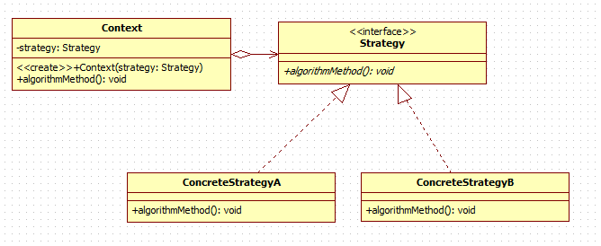  

##### 角色介绍
* Context：用来操作策略的上下文环境。
* Strategy : 策略的抽象。
* ConcreteStrategyA、ConcreteStrategyB : 具体的策略实现。


#### 3. 模式的简单实现
#####  简单实现的介绍
通常如果一个问题有多个解决方案或者稍有区别的操作时，最简单的方式就是利用if-else or switch-case方式来解决，对于简单的解决方案这样做无疑是比较简单、方便、快捷的，但是如果解决方案中包括大量的处理逻辑需要封装，或者处理方式变动较大的时候则就显得混乱、复杂，而策略模式则很好的解决了这样的问题，它将各种方案分离开来，让操作者根据具体的需求来动态的选择不同的策略方案。
这里以简单的计算操作(+、-、*、/)作为示例：

##### 未使用策略模式

```java
	public static double calc(String op, double paramA, double paramB) {
		if ("+".equals(op)) {
			System.out.println("执行加法...");
			return paramA + paramB;
		} else if ("-".equals(op)) {
			System.out.println("执行减法...");
			return paramA - paramB;
		} else if ("*".equals(op)) {
			System.out.println("执行乘法...");
			return paramA * paramB;
		} else if ("/".equals(op)) {
			System.out.println("执行除法...");
			if (paramB == 0) {
				throw new IllegalArgumentException("除数不能为0!");
			}
			return paramA / paramB;
		} else {
			throw new IllegalArgumentException("未找到计算方法!");
		}
	}
```

##### 使用策略模式
UML类图
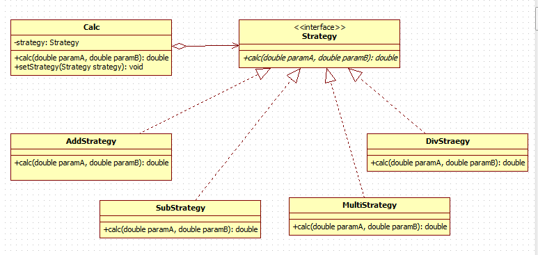  

* Calc：进行计算操作的上下文环境。
* Strategy : 计算操作的抽象。
* AddStrategy、SubStrategy、MultiStrategy、DivStrategy : 具体的 +、-、*、/ 实现。

具体实现代码如下：

```java 
	//针对操作进行抽象
	public interface Strategy {
		public double calc(double paramA, double paramB);
	}
	
	//加法的具体实现策略
	public class AddStrategy implements Strategy {
		@Override
		public double calc(double paramA, double paramB) {
			// TODO Auto-generated method stub
			System.out.println("执行加法策略...");
			return paramA + paramB;
		}
	}

	//减法的具体实现策略
	public class SubStrategy implements Strategy {
		@Override
		public double calc(double paramA, double paramB) {
			// TODO Auto-generated method stub
			System.out.println("执行减法策略...");
			return paramA - paramB;
		}
	}

	//乘法的具体实现策略
	public class MultiStrategy implements Strategy {
		@Override
		public double calc(double paramA, double paramB) {
			// TODO Auto-generated method stub
			System.out.println("执行乘法策略...");
			return paramA * paramB;
		}
	}

	//除法的具体实现策略
	public class DivStrategy implements Strategy {
		@Override
		public double calc(double paramA, double paramB) {
			// TODO Auto-generated method stub
			System.out.println("执行除法策略...");
			if (paramB == 0) {
				throw new IllegalArgumentException("除数不能为0!");
			}
			return paramA / paramB;
		}
	}

	//上下文环境的实现
	public class Calc {
		private Strategy strategy;
		public void setStrategy(Strategy strategy) {
			this.strategy = strategy;
		}
		
		public double calc(double paramA, double paramB) {
			// TODO Auto-generated method stub
			// doing something
			if (this.strategy == null) {
				throw new IllegalStateException("你还没有设置计算的策略");
			}
			return this.strategy.calc(paramA, paramB);
		}
	}


	//执行方法
	public static double calc(Strategy strategy, double paramA, double paramB) {
		Calc calc = new Calc();
		calc.setStrategy(strategy);
		return calc.calc(paramA, paramB);
	}
```

二者运行：

```java
	public static void main(String[] args) {
		double paramA = 5;
		double paramB = 21;
		
		System.out.println("------------- 普通形式 ----------------");
		System.out.println("加法结果是：" + calc("+", paramA, paramB));
		System.out.println("减法结果是：" + calc("-", paramA, paramB));
		System.out.println("乘法结果是：" + calc("*", paramA, paramB));
		System.out.println("除法结果是：" + calc("/", paramA, paramB));
		
		System.out.println("------------ 策略模式  ----------------");
		System.out.println("加法结果是：" + calc(new AddStrategy(), paramA, paramB));
		System.out.println("减法结果是：" + calc(new SubStrategy(), paramA, paramB));
		System.out.println("乘法结果是：" + calc(new MultiStrategy(), paramA, paramB));
		System.out.println("除法结果是：" + calc(new DivStrategy(), paramA, paramB));
	}
```
	
结果为：

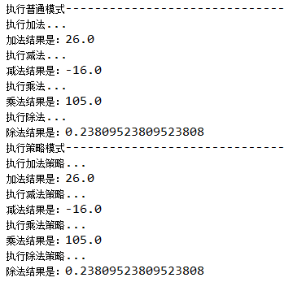  

##### 总结

通过简单的代码可以清晰的看出二者的优势所在，前者通过简单的if-else来解决问题，在解决简单问题事会更简单、方便，后者则是通过给予不同的具体策略来获取不同的结果，对于较为复杂的业务逻辑显得更为直观，扩展也更为方便。


#### Android源码中的模式实现
日常的Android开发中经常会用到动画，Android中最简单的动画就是Tween Animation了，当然帧动画和属性动画也挺方便的，但是基本原理都类似，毕竟动画的本质都是一帧一帧的展现给用户的，只不要当fps小于60的时候，人眼基本看不出间隔，也就成了所谓的流畅动画。（注：属性动画是3.0以后才有的，低版本可采用[NineOldAndroids](https://github.com/JakeWharton/NineOldAndroids)来兼容。而动画的动态效果往往也取决于插值器Interpolator不同，我们只需要对Animation对象设置不同的Interpolator就可以实现不同的效果，这是怎么实现的呢？

首先要想知道动画的执行流程，还是得从View入手，因为Android中主要针对的操作对象还是View，所以我们首先到View中查找，我们找到了View.startAnimation(Animation animation)这个方法。   

```java
	public void startAnimation(Animation animation) {
		//初始化动画开始时间
        animation.setStartTime(Animation.START_ON_FIRST_FRAME);
		//对View设置动画
        setAnimation(animation); 
		//刷新父类缓存
        invalidateParentCaches();
		//刷新View本身及子View
        invalidate(true);
    }
```
考虑到View一般不会单独存在，都是存在于某个ViewGroup中，所以google使用动画绘制的地方选择了在ViewGroup中的drawChild(Canvas canvas, View child, long drawingTime)方法中进行调用子View的绘制。

```java	
	protected boolean drawChild(Canvas canvas, View child, long drawingTime) {
        return child.draw(canvas, this, drawingTime);
    }
```

再看下View中的draw(Canvas canvas, ViewGroup parent, long drawingTime)方法中是如何调用使用Animation的

```java
	boolean draw(Canvas canvas, ViewGroup parent, long drawingTime) {
		//...
		
		//查看是否需要清除动画信息
		final int flags = parent.mGroupFlags;
        if ((flags & ViewGroup.FLAG_CLEAR_TRANSFORMATION) == ViewGroup.FLAG_CLEAR_TRANSFORMATION) {
            parent.getChildTransformation().clear();
            parent.mGroupFlags &= ~ViewGroup.FLAG_CLEAR_TRANSFORMATION;
        }
	
		//获取设置的动画信息
	   	final Animation a = getAnimation();
        if (a != null) {
			//绘制动画
            more = drawAnimation(parent, drawingTime, a, scalingRequired);
            concatMatrix = a.willChangeTransformationMatrix();
            if (concatMatrix) {
                mPrivateFlags3 |= PFLAG3_VIEW_IS_ANIMATING_TRANSFORM;
            }
            transformToApply = parent.getChildTransformation();
        } else {
			//...
		}
	}
```

可以看出在父类调用View的draw方法中，会先判断是否设置了清除到需要做该表的标记，然后再获取设置的动画的信息，如果设置了动画，就会调用View中的drawAnimation方法，具体如下：

```java
	private boolean drawAnimation(ViewGroup parent, long drawingTime,
            Animation a, boolean scalingRequired) {

		Transformation invalidationTransform;
        final int flags = parent.mGroupFlags;
		//判断动画是否已经初始化过
        final boolean initialized = a.isInitialized();
        if (!initialized) {
            a.initialize(mRight - mLeft, mBottom - mTop, parent.getWidth(), parent.getHeight());
            a.initializeInvalidateRegion(0, 0, mRight - mLeft, mBottom - mTop);
            if (mAttachInfo != null) a.setListenerHandler(mAttachInfo.mHandler);
            onAnimationStart();
        }
		
		//判断View是否需要进行缩放
		final Transformation t = parent.getChildTransformation();
        boolean more = a.getTransformation(drawingTime, t, 1f);
        if (scalingRequired && mAttachInfo.mApplicationScale != 1f) {
            if (parent.mInvalidationTransformation == null) {
                parent.mInvalidationTransformation = new Transformation();
            }
            invalidationTransform = parent.mInvalidationTransformation;
            a.getTransformation(drawingTime, invalidationTransform, 1f);
        } else {
            invalidationTransform = t;
        }

		if (more) {
			//根据具体实现，判断当前动画类型是否需要进行调整位置大小，然后刷新不同的区域
            if (!a.willChangeBounds()) {
				//...
 				
			}else{
				//...
			}
		}
		return more;
	}
```

其中主要的操作是动画始化、动画操作、界面刷新。动画的具体实现是调用了Animation中的getTransformation(long currentTime, Transformation outTransformation,float scale)方法。

```java

	public boolean getTransformation(long currentTime, Transformation outTransformation,
            float scale) {
        mScaleFactor = scale;
        return getTransformation(currentTime, outTransformation);
    }
```

在上面的方法中主要是获取缩放系数和调用Animation.getTransformation(long currentTime, Transformation outTransformation)来计算和应用动画效果。
	
```java
	Interpolator mInterpolator;  //成员变量
	public boolean getTransformation(long currentTime, Transformation outTransformation) {
			//计算处理当前动画的时间点...
            final float interpolatedTime = mInterpolator.getInterpolation(normalizedTime);
			//后续处理，以此来应用动画效果...
            applyTransformation(interpolatedTime, outTransformation);
	    return mMore;
    }
```    

很容易发现Android系统中在处理动画的时候会调用插值器中的getInterpolation(float input)方法来获取当前的时间点，依次来计算当前变化的情况。这就不得不说到Android中的插值器Interpolator，它的作用是根据时间流逝的百分比来计算出当前属性值改变的百分比，系统预置的有LinearInterpolator（线性插值器：匀速动画）、AccelerateDecelerateInterpolator（加速减速插值器：动画两头慢中间快）和DecelerateInterpolator（减速插值器：动画越来越慢）等，如图：

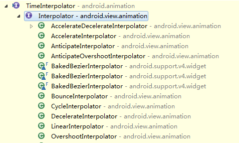 

由于初期比较旧的版本采用的插值器是TimeInterpolator抽象，google采用了多加一层接口继承来实现兼容也不足为怪了。很显然策略模式在这里作了很好的实现，Interpolator就是处理动画时间的抽象，LinearInterpolator、CycleInterpolator等插值器就是具体的实现策略。插值器与Animation的关系图如下：

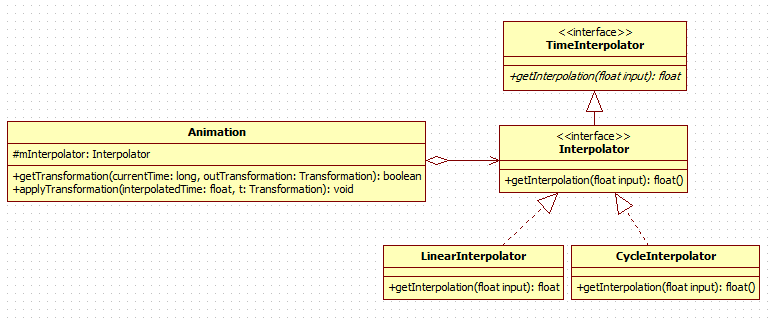 

这里以LinearInterpolator和CycleInterpolator为例：

- LinearInterpolator
	 
		public float getInterpolation(float input) {
	        return input;
	    }

- CycleInterpolator

	  	public float getInterpolation(float input) {
	        return (float)(Math.sin(2 * mCycles * Math.PI * input));
	    }    
	    
可以看出LinearInterpolator中计算当前时间的方法是做线性运算，也就是返回input*1，所以动画会成直线匀速播放出来，而CycleInterpolator是按照正弦运算，所以动画会正反方向跑一次，其它插值器依次类推。不同的插值器的计算方法都有所差别，用户设置插值器以实现动画速率的算法替换。       


#### 4. 杂谈
策略模式主要用来分离算法，根据相同的行为抽象来做不同的具体策略实现。

通过以上也可以看出策略模式的优缺点：

优点：

* 结构清晰明了、使用简单直观。
* 耦合度相对而言较低，扩展方便。
* 操作封装也更为彻底，数据更为安全。

缺点：

* 随着策略的增加，子类也会变得繁多。

<a id="iterator"></a>

### 迭代器模式
> 本文为 [Android 设计模式源码解析](https://github.com/simple-android-framework-exchange/android_design_patterns_analysis) 中 迭代器模式 分析  
> Android系统版本： 5.0        
> 分析者： [haoxiqiang](https://github.com/Haoxiqiang)，分析状态：完成，校对者：，校对状态：未完成


#### 1. 模式介绍
##### 模式的定义
迭代器（Iterator）模式，又叫做游标（Cursor）模式。GOF给出的定义为：提供一种方法访问一个容器（container）对象中各个元素，而又不需暴露该对象的内部细节。

##### 模式的使用场景
　　Java JDK 1.2 版开始支持迭代器。每一个迭代器提供next()以及hasNext()方法，同时也支持remove()(1.8的时候remove已经成为default throw new UnsupportedOperationException("remove"))。对Android来说,集合Collection实现了Iterable接口,就是说,无论是List的一大家子还是Map的一大家子,我们都可以使用Iterator来遍历里面的元素,[可以使用Iterator的集合](http://docs.oracle.com/javase/8/docs/api/java/util/package-tree.html)      

#### 2. UML类图
　　　
　   

##### 角色介绍　　 
* 迭代器接口Iterator：该接口必须定义实现迭代功能的最小定义方法集比如提供hasNext()和next()方法。
* 迭代器实现类：迭代器接口Iterator的实现类。可以根据具体情况加以实现。
* 容器接口：定义基本功能以及提供类似Iterator iterator()的方法。
* 容器实现类：容器接口的实现类。必须实现Iterator iterator()方法。


#### 3. 模式的简单实现
#####  简单实现的介绍
我们有一个数组,对其遍历的过程我们希望使用者像ArrayList一样的使用,我们就可以用过iterator来实现.

##### 实现源码 
下面我们自己实现一个Iterator的集合

```
...
public Iterator<Mileage> iterator() {
    return new ArrayIterator();
}

private class ArrayIterator implements Iterator<Mileage> {
/**
 * Number of elements remaining in this iteration
 */
private int remaining = size;

/**
 * Index of element that remove() would remove, or -1 if no such elt
 */
private int removalIndex = -1;

@Override
public boolean hasNext() {
    return remaining != 0;
}

@Override
public Mileage next() {
    Mileage mileage = new Mileage();
    removalIndex = size-remaining;
    mileage.name = String.valueOf(versionCodes[removalIndex]);
    mileage.value = versionMileages[removalIndex];
    remaining-=1;
    return mileage;
}

@Override
public void remove() {
    versionCodes[removalIndex]=-1;
    versionMileages[removalIndex]="It was set null";
}
}
...
```
使用的过程如下,我们特意使用了remove方法,注意这个只是一个示例,和大多数的集合相比,该实现并不严谨

```
AndroidMileage androidMileage = new AndroidMileage();
Iterator<AndroidMileage.Mileage> iterator =androidMileage.iterator();
while (iterator.hasNext()){
    AndroidMileage.Mileage mileage = iterator.next();
    if(mileage.name.equalsIgnoreCase("16")){
    	//remove掉的是当前的这个,暂时只是置空,并未真的移掉
        iterator.remove();
    }
    Log.e("mileage",mileage.toString());
}
```

下面直接写出几种集合的遍历方式,大家可以对比一下
  
*  HashMap的遍历
```
HashMap<String, String> colorMap=new HashMap<>();
colorMap.put("Color1","Red");
colorMap.put("Color2","Blue");
Iterator iterator = colorMap.keySet().iterator();
while( iterator. hasNext() ){
    String key = (String) iterator.next();
    String value = colorMap.get(key);
}
```       
* JSONObject的遍历
```
String paramString = "{menu:{\"1\":\"sql\", \"2\":\"android\", \"3\":\"mvc\"}}";
JSONObject menuJSONObj  = new JSONObject(paramString);
JSONObject  menuObj = menuJSONObj.getJSONObject("menu");
Iterator iter = menuObj.keys();
while(iter.hasNext()){
    String key = (String)iter.next();
    String value = menuObj.getString(key);
}
```      
就目前而言，各种高级语言都有对迭代器的基本实现，没必要自己实现迭代器，使用内置的迭代器即可满足日常需求。         

#### Android源码中的模式实现
一个集合想要实现Iterator很是很简单的,需要注意的是每次需要重新生成一个Iterator来进行遍历.且遍历过程是单方向的,HashMap是通过一个类似HashIterator来实现的,我们为了解释简单,这里只是研究ArrayList(此处以Android L源码为例,其他版本略有不同)

```
@Override public Iterator<E> iterator() {
    return new ArrayListIterator();
}

private class ArrayListIterator implements Iterator<E> {
    /** Number of elements remaining in this iteration */
    private int remaining = size;

    /** Index of element that remove() would remove, or -1 if no such elt */
    private int removalIndex = -1;

    /** The expected modCount value */
    private int expectedModCount = modCount;

    public boolean hasNext() {
        return remaining != 0;
    }

    @SuppressWarnings("unchecked") public E next() {
        ArrayList<E> ourList = ArrayList.this;
        int rem = remaining;
        if (ourList.modCount != expectedModCount) {
            throw new ConcurrentModificationException();
        }
        if (rem == 0) {
            throw new NoSuchElementException();
        }
        remaining = rem - 1;
        return (E) ourList.array[removalIndex = ourList.size - rem];
    }

    public void remove() {
        Object[] a = array;
        int removalIdx = removalIndex;
        if (modCount != expectedModCount) {
            throw new ConcurrentModificationException();
        }
        if (removalIdx < 0) {
            throw new IllegalStateException();
        }
        System.arraycopy(a, removalIdx + 1, a, removalIdx, remaining);
        a[--size] = null;  // Prevent memory leak
        removalIndex = -1;
        expectedModCount = ++modCount;
    }
}
```

* java中的写法一般都是通过iterator()来生成Iterator,保证iterator()每次生成新的实例
* remaining初始化使用整个list的size大小,removalIndex表示remove掉的位置,modCount在集合大小发生变化的时候后都会进行一次modCount++操作,避免数据不一致,前面我写的例子这方面没有写,请务必注意这点
* hasNext方法中,因为remaining是一个size->0的变化过程,这样只需要判断非0就可以得知当前遍历的是否还有未完成的元素
* next,第一次调用的时候返回array[0]的元素,这个过程中removalIndex会被设置成当前array的index
* remove的实现是直接操作的内存中的数据,是能够直接删掉元素的,不展开了


#### 4. 杂谈
##### 优点与缺点
###### 优点  
* 面向对象设计原则中的单一职责原则，对于不同的功能,我们要尽可能的把这个功能分解出单一的职责，不同的类去承担不同的职责。Iterator模式就是分离了集合对象的遍历行为，抽象出一个迭代器类来负责，这样不暴露集合的内部结构，又可让外部代码透明的访问集合内部的数据。

###### 缺点 
* 会产生多余的对象，消耗内存；
* 遍历过程是一个单向且不可逆的遍历
* 如果你在遍历的过程中,集合发生改变,变多变少,内容变化都是算,就会抛出来ConcurrentModificationException异常.


<a id="chain-of-responsibility"></a>

### 责任链模式
> 本文为 [Android 设计模式源码解析](https://github.com/simple-android-framework-exchange/android_design_patterns_analysis) 中责任链模式分析  
> Android系统版本： 4.4.4        
> 分析者：[Aige](https://github.com/AigeStudio)，分析状态：完成，校对者：[SM哥](https://github.com/bboyfeiyu)，校对状态：撒丫校对中  
 
#### 1. 模式介绍  
 
#####  模式的定义
一个请求沿着一条“链”传递，直到该“链”上的某个处理者处理它为止。


##### 模式的使用场景
 一个请求可以被多个处理者处理或处理者未明确指定时。
 

#### 2. UML类图
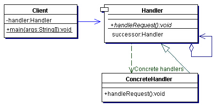

##### 角色介绍
Client：客户端

Handler：抽象处理者

ConcreteHandler：具体处理者


#### 3. 模式的简单实现
#####  简单实现的介绍
责任链模式非常简单异常好理解，相信我它比单例模式还简单易懂，其应用也几乎无所不在，甚至可以这么说……从你敲代码的第一天起你就不知不觉用过了它最原始的裸体结构：分支语句：
```java
public class SimpleResponsibility {
	public static void main(String[] args) {
		int request = (int) (Math.random() * 3);
		switch (request) {
		case 0:
			System.out.println("SMBother handle it: " + request);
			break;
		case 1:
			System.out.println("Aige handle it: " + request);
			break;
		case 2:
			System.out.println("7Bother handle it: " + request);
			break;
		default:
			break;
		}
	}
}
```
谁敢说没用过上面这种结构体的站出来我保证不打屎他，没用过swith至少if-else用过吧，if-else都没用过你怎么知道github的……上面的这段代码其实就是一种最最简单的责任链模式，其根据request的值进行不同的处理。当然这只是个不恰当的例子来让大家尽快对责任链模式有个简单的理解，因为可能很多童鞋第一次听说这个模式，而人对未知事物总是恐惧的，为了消除大家的这种恐惧，我将大家最常见的code搬出来相信熟悉的代码对大家来说有一种亲切的感觉，当然我们实际应用中的责任链模式绝逼不是这么Mr.Simple，但是也不会复杂不到哪去。责任链模式，顾名思义，必定与责任Responsibility相关，其实质呢就像上面定义中说的那样一个请求（比如上面代码中的request值）沿着一条“链”（比如上面代码中我们的switch分支语句）传递，当某个处于“链”上的处理者（case定义的条件）处理它时完成处理。其实现实生活中关于责任者模式的例子数不胜数，最常见的就是工作中上下级之间的责任请求关系了。比如：
>程序猿狗屎运被派出去异国出差一周，这时候就要去申请一定的差旅费了，你心里小算一笔加上各种车马费估计大概要个两三万，于是先向小组长汇报申请，可是大于一千块小组长没权利批复，于是只好去找项目主管，项目主管一看妈蛋这么狠要这么多我只能批小于五千块的，于是你只能再跑去找部门经理，部门经理看了下一阵淫笑后说没法批我只能批小于一万的，于是你只能狗血地去跪求老总，老总一看哟！小伙子心忒黑啊！老总话虽如此但还是把钱批给你了毕竟是给公司办事，到此申请处理完毕，你也可以屁颠屁颠地滚了。

如果把上面的场景应用到责任链模式，那么我们的request请求就是申请经费，组长主管经理老总们就是一个个具体的责任人他们可以对请求做出处理但是他们只能在自己的责任范围内处理该处理的请求，而程序猿只是个底层狗请求者向责任人们发起请求…………苦逼的猿。

##### 实现源码
上面的场景我们可以使用使用如下的代码来模拟实现：

首先定义一个程序员类：
```Java
/**
 * 程序猿类
 * 
 * @author Aige{@link https://github.com/AigeStudio}
 *
 */
public class ProgramApe {
	private int expenses;// 声明整型成员变量表示出差费用
	private String apply = "爹要点钱出差";// 声明字符串型成员变量表示差旅申请

	/*
	 * 含参构造方法
	 */
	public ProgramApe(int expenses) {
		this.expenses = expenses;
	}

	/*
	 * 获取程序员具体的差旅费用
	 */
	public int getExpenses() {
		return expenses;
	}

	/*
	 * 获取差旅费申请
	 */
	public String getApply() {
		return apply;
	}
}
```

然后依次是各个大爷类：

```Java
/**
 * 小组长类
 * 
 * @author Aige{@link https://github.com/AigeStudio}
 *
 */
public class GroupLeader {

	/**
	 * 处理请求
	 * 
	 * @param ape
	 *            具体的猿
	 */
	public void handleRequest(ProgramApe ape) {
		System.out.println(ape.getApply());
		System.out.println("GroupLeader: Of course Yes!");
	}
}
```

```Java
/**
 * 项目主管类
 * 
 * @author Aige{@link https://github.com/AigeStudio}
 *
 */
public class Director {
	/**
	 * 处理请求
	 * 
	 * @param ape
	 *            具体的猿
	 */
	public void handleRequest(ProgramApe ape) {
		System.out.println(ape.getApply());
		System.out.println("Director: Of course Yes!");
	}
}
```

```Java
/**
 * 部门经理类
 * 
 * @author Aige{@link https://github.com/AigeStudio}
 *
 */
public class Manager {
	/**
	 * 处理请求
	 * 
	 * @param ape
	 *            具体的猿
	 */
	public void handleRequest(ProgramApe ape) {
		System.out.println(ape.getApply());
		System.out.println("Manager: Of course Yes!");
	}
}
```

```Java
/**
 * 老总类
 * 
 * @author Aige{@link https://github.com/AigeStudio}
 *
 */
public class Boss {
	/**
	 * 处理请求
	 * 
	 * @param ape
	 *            具体的猿
	 */
	public void handleRequest(ProgramApe ape) {
		System.out.println(ape.getApply());
		System.out.println("Boss: Of course Yes!");
	}
}
```

好了，万事俱备只欠场景，现在我们模拟一下整个场景过程：

```Java
/**
 * 场景模拟类
 * 
 * @author Aige{@link https://github.com/AigeStudio}
 *
 */
public class Client {
	public static void main(String[] args) {
		/*
		 * 先来一个程序猿 这里给他一个三万以内的随机值表示需要申请的差旅费
		 */
		ProgramApe ape = new ProgramApe((int) (Math.random() * 30000));

		/*
		 * 再来四个老大
		 */
		GroupLeader leader = new GroupLeader();
		Director director = new Director();
		Manager manager = new Manager();
		Boss boss = new Boss();

		/*
		 * 处理申请
		 */
		if (ape.getExpenses() <= 1000) {
			leader.handleRequest(ape);
		} else if (ape.getExpenses() <= 5000) {
			director.handleRequest(ape);
		} else if (ape.getExpenses() <= 10000) {
			manager.handleRequest(ape);
		} else {
			boss.handleRequest(ape);
		}
	}
}
```

运行一下，我的结果输出如下（注：由于随机值的原因你的结果也许与我不一样）：

>爹要点钱出差
>
>Manager: Of course Yes!

是不是感觉有点懂了？当然上面的代码虽然在一定程度上体现了责任链模式的思想，但是确是非常terrible的。作为一个code新手可以原谅，但是对有一定经验的code+来说就不可饶恕了，很明显所有的老大都有共同的handleRequest方法而程序猿也有不同类型的，比如一个公司的php、c/c++、Android、IOS等等，所有的这些共性我们都可以将其抽象为一个抽象类或接口，比如我们的程序猿抽象父类：

```java
/**
 * 程序猿抽象接口
 * 
 * @author Aige{@link https://github.com/AigeStudio}
 *
 */
public abstract class ProgramApes {
	/**
	 * 获取程序员具体的差旅费用
	 * 
	 * @return 要多少钱
	 */
	public abstract int getExpenses();

	/**
	 * 获取差旅费申请
	 * 
	 * @return Just a request
	 */
	public abstract String getApply();
}
```

这时我们就可以实现该接口使用呆毛具现化一个具体的程序猿，比如Android猿：

```java
/**
 * Android程序猿类
 * 
 * @author Aige{@link https://github.com/AigeStudio}
 *
 */
public class AndroidApe extends ProgramApes {
	private int expenses;// 声明整型成员变量表示出差费用
	private String apply = "爹要点钱出差";// 声明字符串型成员变量表示差旅申请

	/*
	 * 含参构造方法
	 */
	public AndroidApe(int expenses) {
		this.expenses = expenses;
	}

	@Override
	public int getExpenses() {
		return expenses;
	}

	@Override
	public String getApply() {
		return apply;
	}
}
```
同样的，所有的老大都有一个批复经费申请的权利，我们把这个权利抽象为一个IPower接口：

```java
/**
 * 老大们的权利接口
 * 
 * @author Aige{@link https://github.com/AigeStudio}
 *
 */
public interface IPower {
	/**
	 * 处理请求
	 * 
	 * @param ape
	 *            具体的猿
	 */
	public void handleRequest(ProgramApe ape);
}
```

然后让所有的老大们实现该接口即可其它不变，而场景类Client中也只是修改各个老大的引用类型为IPower而已，具体代码就不贴了，运行效果也类似。

然而上面的代码依然问题重重，为什么呢？大家想想，当程序猿发出一个申请时却是在场景类中做出判断决定的……然而这个职责事实上应该由老大们来承担并作出决定，上面的代码搞反了……既然知道了错误，那么我们就来再次重构一下代码：

把所有老大抽象为一个leader抽象类，在该抽象类中实现处理逻辑：

```java
/**
 * 领导人抽象类
 * 
 * @author Aige{@link https://github.com/AigeStudio}
 *
 */
public abstract class Leader {
	private int expenses;// 当前领导能批复的金额
	private Leader mSuperiorLeader;// 上级领导

	/**
	 * 含参构造方法
	 * 
	 * @param expenses
	 *            当前领导能批复的金额
	 */
	public Leader(int expenses) {
		this.expenses = expenses;
	}

	/**
	 * 回应程序猿
	 * 
	 * @param ape
	 *            具体的程序猿
	 */
	protected abstract void reply(ProgramApe ape);

	/**
	 * 处理请求
	 * 
	 * @param ape
	 *            具体的程序猿
	 */
	public void handleRequest(ProgramApe ape) {
		/*
		 * 如果说程序猿申请的money在当前领导的批复范围内
		 */
		if (ape.getExpenses() <= expenses) {
			// 那么就由当前领导批复即可
			reply(ape);
		} else {
			/*
			 * 否则看看当前领导有木有上级
			 */
			if (null != mSuperiorLeader) {
				// 有的话简单撒直接扔给上级处理即可
				mSuperiorLeader.handleRequest(ape);
			} else {
				// 没有上级的话就批复不了老……不过在这个场景中总会有领导批复的淡定
				System.out.println("Goodbye my money......");
			}
		}
	}

	/**
	 * 为当前领导设置一个上级领导
	 * 
	 * @param superiorLeader
	 *            上级领导
	 */
	public void setLeader(Leader superiorLeader) {
		this.mSuperiorLeader = superiorLeader;
	}
}
```

这么一来，我们的领导老大们就有了实实在在的权利职责去处理底层苦逼程序猿的请求。OK，接下来要做的事就是让所有的领导继承该类：

```Java
/**
 * 小组长类
 * 
 * @author Aige{@link https://github.com/AigeStudio}
 *
 */
public class GroupLeader extends Leader {

	public GroupLeader() {
		super(1000);
	}

	@Override
	protected void reply(ProgramApe ape) {
		System.out.println(ape.getApply());
		System.out.println("GroupLeader: Of course Yes!");
	}
}
```

```java
/**
 * 项目主管类
 * 
 * @author Aige{@link https://github.com/AigeStudio}
 *
 */
public class Director extends Leader{
	public Director() {
		super(5000);
	}

	@Override
	protected void reply(ProgramApe ape) {
		System.out.println(ape.getApply());
		System.out.println("Director: Of course Yes!");		
	}
}
```

```java
/**
 * 部门经理类
 * 
 * @author Aige{@link https://github.com/AigeStudio}
 *
 */
public class Manager extends Leader {
	public Manager() {
		super(10000);
	}

	@Override
	protected void reply(ProgramApe ape) {
		System.out.println(ape.getApply());
		System.out.println("Manager: Of course Yes!");
	}
}
```

```java
/**
 * 老总类
 * 
 * @author Aige{@link https://github.com/AigeStudio}
 *
 */
public class Boss extends Leader {
	public Boss() {
		super(40000);
	}

	@Override
	protected void reply(ProgramApe ape) {
		System.out.println(ape.getApply());
		System.out.println("Boss: Of course Yes!");
	}
}
```

最后，更新我们的场景类，将其从责任人的角色中解放出来：

```java
/**
 * 场景模拟类
 * 
 * @author Aige{@link https://github.com/AigeStudio}
 *
 */
public class Client {
	public static void main(String[] args) {
		/*
		 * 先来一个程序猿 这里给他一个三万以内的随机值表示需要申请的差旅费
		 */
		ProgramApe ape = new ProgramApe((int) (Math.random() * 30000));

		/*
		 * 再来四个老大
		 */
		Leader leader = new GroupLeader();
		Leader director = new Director();
		Leader manager = new Manager();
		Leader boss = new Boss();

		/*
		 * 设置老大的上一个老大
		 */
		leader.setLeader(director);
		director.setLeader(manager);
		manager.setLeader(boss);

		// 处理申请
		leader.handleRequest(ape);
	}
}
```

运行三次，下面是三次运行的结果（注：由于随机值的原因你的结果也许与我不一样）：

>爹要点钱出差
>
>Boss: Of course Yes!
***
>爹要点钱出差
>
>Director: Of course Yes!
***
>爹要点钱出差
>
>Boss: Of course Yes!

##### 总结

OK，这样我们就将请求和处理分离开来，对于程序猿来说，不需要知道是谁给他批复的钱，而对于领导们来说，也不需要确切地知道是批给哪个程序猿，只要根据自己的责任做出处理即可，由此将两者优雅地解耦。

#### Android源码中的模式实现
Android中关于责任链模式比较明显的体现就是在事件分发过程中对事件的投递，其实严格来说，事件投递的模式并不是严格的责任链模式，但是其是责任链模式的一种变种体现，在ViewGroup中对事件处理者的查找方式如下：

```java
@Override
public boolean dispatchTouchEvent(MotionEvent ev) {
    // 省略两行代码…………

    boolean handled = false;
    if (onFilterTouchEventForSecurity(ev)) {

        // 省略N行代码…………

        /*
         * 如果事件未被取消并未被拦截
         */
        if (!canceled && !intercepted) {
        	/*
         	 * 如果事件为起始事件
         	 */
            if (actionMasked == MotionEvent.ACTION_DOWN
                    || (split && actionMasked == MotionEvent.ACTION_POINTER_DOWN)
                    || actionMasked == MotionEvent.ACTION_HOVER_MOVE) {

                // 省掉部分逻辑…………

                final int childrenCount = mChildrenCount;

                /*
         		 * 如果TouchTarget为空并且子元素不为0
         		 */
                if (newTouchTarget == null && childrenCount != 0) {
                    final float x = ev.getX(actionIndex);
                    final float y = ev.getY(actionIndex);

                    final View[] children = mChildren;

                    final boolean customOrder = isChildrenDrawingOrderEnabled();

                   /*
         		 	* 遍历子元素
         		 	*/
                    for (int i = childrenCount - 1; i >= 0; i--) {
                        final int childIndex = customOrder ?
                                getChildDrawingOrder(childrenCount, i) : i;
                        final View child = children[childIndex];

                       /*
         		 		* 如果这个子元素无法接收Pointer Event或这个事件点压根就没有落在子元素的边界范围内
         		 		*/
                        if (!canViewReceivePointerEvents(child)
                                || !isTransformedTouchPointInView(x, y, child, null)) {
                            // 那么就跳出该次循环继续遍历
                            continue;
                        }

                        // 找到Event该由哪个子元素持有
                        newTouchTarget = getTouchTarget(child);


                        if (newTouchTarget != null) {
                            newTouchTarget.pointerIdBits |= idBitsToAssign;
                            break;
                        }

                        resetCancelNextUpFlag(child);

                       /*
         		 		* 投递事件执行触摸操作
         		 		* 如果子元素还是一个ViewGroup则递归调用重复此过程
         		 		* 如果子元素是一个View那么则会调用View的dispatchTouchEvent并最终由onTouchEvent处理
         		 		*/
                        if (dispatchTransformedTouchEvent(ev, false, child, idBitsToAssign)) {
                            mLastTouchDownTime = ev.getDownTime();
                            mLastTouchDownIndex = childIndex;
                            mLastTouchDownX = ev.getX();
                            mLastTouchDownY = ev.getY();
                            newTouchTarget = addTouchTarget(child, idBitsToAssign);
                            alreadyDispatchedToNewTouchTarget = true;
                            break;
                        }
                    }
                }

               /*
 		 		* 如果发现没有子元素可以持有该次事件
 		 		*/
                if (newTouchTarget == null && mFirstTouchTarget != null) {
                    newTouchTarget = mFirstTouchTarget;
                    while (newTouchTarget.next != null) {
                        newTouchTarget = newTouchTarget.next;
                    }
                    newTouchTarget.pointerIdBits |= idBitsToAssign;
                }
            }
        }

        // 省去不必要代码……
    }

    // 省去一行代码……

    return handled;
}
```

再来看看dispatchTransformedTouchEvent方法是如何调度子元素dispatchTouchEvent方法的：

```java
private boolean dispatchTransformedTouchEvent(MotionEvent event, boolean cancel,
        View child, int desiredPointerIdBits) {
    final boolean handled;

    final int oldAction = event.getAction();

    /*
     * 如果事件被取消
     */
    if (cancel || oldAction == MotionEvent.ACTION_CANCEL) {
        event.setAction(MotionEvent.ACTION_CANCEL);

       /*
     	* 如果没有子元素
     	*/
        if (child == null) {
        	// 那么就直接调用父类的dispatchTouchEvent注意这里的父类终会为View类
            handled = super.dispatchTouchEvent(event);
        } else {
        	// 如果有子元素则传递cancle事件
            handled = child.dispatchTouchEvent(event);
        }
        event.setAction(oldAction);
        return handled;
    }

    /*
     * 计算即将被传递的点的数量
     */
    final int oldPointerIdBits = event.getPointerIdBits();
    final int newPointerIdBits = oldPointerIdBits & desiredPointerIdBits;

    /*
     * 如果事件木有相应的点那么就丢弃该次事件
     */
    if (newPointerIdBits == 0) {
        return false;
    }

    // 声明临时变量保存坐标转换后的MotionEvent
    final MotionEvent transformedEvent;

    /*
     * 如果事件点的数量一致
     */
    if (newPointerIdBits == oldPointerIdBits) {
        /*
    	 * 子元素为空或子元素有一个单位矩阵
    	 */
        if (child == null || child.hasIdentityMatrix()) {
            /*
    		 * 再次区分子元素为空的情况
    		 */
            if (child == null) {
            	// 为空则调用父类dispatchTouchEvent
                handled = super.dispatchTouchEvent(event);
            } else {
            	// 否则尝试获取xy方向上的偏移量（如果通过scrollTo或scrollBy对子视图进行滚动的话）
                final float offsetX = mScrollX - child.mLeft;
                final float offsetY = mScrollY - child.mTop;

                // 将MotionEvent进行坐标变换
                event.offsetLocation(offsetX, offsetY);

                // 再将变换后的MotionEvent传递给子元素
                handled = child.dispatchTouchEvent(event);

                // 复位MotionEvent以便之后再次使用
                event.offsetLocation(-offsetX, -offsetY);
            }

            // 如果通过以上的逻辑判断当前事件被持有则可以直接返回
            return handled;
        }
        transformedEvent = MotionEvent.obtain(event);
    } else {
        transformedEvent = event.split(newPointerIdBits);
    }

    /*
     * 下述雷同不再累赘
     */
    if (child == null) {
        handled = super.dispatchTouchEvent(transformedEvent);
    } else {
        final float offsetX = mScrollX - child.mLeft;
        final float offsetY = mScrollY - child.mTop;
        transformedEvent.offsetLocation(offsetX, offsetY);
        if (! child.hasIdentityMatrix()) {
            transformedEvent.transform(child.getInverseMatrix());
        }

        handled = child.dispatchTouchEvent(transformedEvent);
    }

    transformedEvent.recycle();
    return handled;
}
```

ViewGroup事件投递的递归调用就类似于一条责任链，一旦其寻找到责任者，那么将由责任者持有并消费掉该次事件，具体的体现在View的onTouchEvent方法中返回值的设置（这里介于篇幅就不具体介绍ViewGroup对事件的处理了），如果onTouchEvent返回false那么意味着当前View不会是该次事件的责任人将不会对其持有，如果为true则相反，此时View会持有该事件并不再向外传递。

#### 4. 杂谈
世界不是完美的，所以不会有完美的事物存在。就像所有的设计模式一样，  有优点优缺点，但是总的来说优点必定大于缺点或者说缺点相对于优点来说更可控。责任链模式也一样，有点显而易见，可以对请求者和处理者关系的解耦提高代码的灵活性，比如上面我们的例子中如果在主管和经理之间多了一个总监，那么总监可以批复小于7500的经费，这时候根据我们上面重构的模式，仅需新建一个总监类继承Leader即可其它所有的存在类都可保持不变。责任链模式的最大缺点是对链中责任人的遍历，如果责任人太多那么遍历必定会影响性能，特别是在一些递归调用中，要慎重。


<a id="command"></a>

### 命令模式
> 本文为 [Android 设计模式源码解析](https://github.com/simple-android-framework-exchange/android_design_patterns_analysis) 中 命令模式 分析  
> Android系统版本： 2.3        
> 分析者：[lijunhuayc](https://github.com/lijunhuayc)，分析状态：完成，校对者：[Mr.Simple](https://github.com/bboyfeiyu)，校对状态：未开始   

#### 1. 模式介绍  
 
#####  模式的定义
将一个请求封装成一个对象，从而使你可用不同的请求对客户进行参数化，对请求排队或记录请求日志，以及支持可撤销的操作。

##### 模式的使用场景
1. 系统需要将请求调用者和请求接收者解耦，使得调用者和接收者不直接交互。
2. 系统需要在不同的时间指定请求、将请求排队和执行请求。
3. 系统需要支持命令的撤销(Undo)操作和恢复(Redo)操作。
4. 系统需要将一组操作组合在一起，即支持宏命令。

#### 2. UML类图
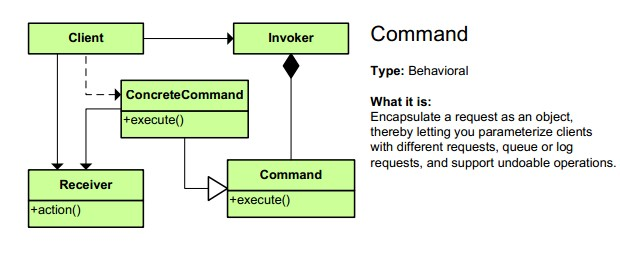 


##### 角色介绍
* 命令角色（Command）：定义命令的接口，声明具体命令类需要执行的方法。这是一个抽象角色。

* 具体命令角色（ConcreteCommand）：命令接口的具体实现对象，通常会持有接收者，并调用接收者的功能来完成命令要执行的操作。

* 调用者角色（Invoker）：负责调用命令对象执行请求，通常会持有命令对象（可以持有多个命令对象）。Invoker是Client真正触发命令并要求命令执行相应操作的地方（使用命令对象的入口）。

* 接受者角色（Receiver）：Receiver是真正执行命令的对象。任何类都可能成为一个接收者，只要它能够实现命令要求实现的相应功能。

* 客户角色（Client）：Client可以创建具体的命令对象，并且设置命令对象的接收者。Tips：不能把Clinet理解为我们平常说的客户端，这里的Client是一个组装命令对象和接受者对象的角色，或者你把它理解为一个装配者。

#### 3. 模式的简单实现
#####  简单实现的介绍
命令模式其实就是对命令进行封装，将命令请求者和命令执行者的责任分离开来实现松耦合。
这里我们通过一个简单的实例来剖析一下命令模式：命令接收者ReceiverRole拥有一个PeopleBean类型成员，通过Invoker发出不同的命令来修改PeopleBean的相对应的属性，具体命令实现类ConcreteCommandImpl1执行修改年龄命令，ConcreteCommandImpl2执行修改姓名的命令等等，ClientRole负责组装各个部分。
例子代码如下（resource目录下也可以查看）。

##### 实现源码

```java
    package com.command;
    /**
     * 命令接口    [命令角色]
     */
    public interface Command {
    	public void execute();
    	public void undo();
    	public void redo();
    }
    
```

ConcreteCommandImpl1.java类.     


```java    

    package com.command;
    /**
     * 更新年龄的命令类  [ 具体命令角色 ]
     */
    public class ConcreteCommandImpl1 implements Command{
    	private ReceiverRole receiverRole1;
    
    	public ConcreteCommandImpl1(ReceiverRole receiverRole1) {
    		this.receiverRole1 = receiverRole1;
    	}
    	
    	@Override
    	public void execute() {
    		/*
    		 * 可以加入命令排队等等，未执行的命令支持redo操作
    		 */
    		receiverRole1.opActionUpdateAge(1001);//执行具体的命令操作
    	}
    
    	@Override
    	public void undo() {
    		receiverRole1.rollBackAge();//执行具体的撤销回滚操作
    	}
    
    	@Override
    	public void redo() {
    		//在命令执行前可以修改命令的执行
    	}
    }
```

ConcreteCommandImpl2.java类.    

```java
    package com.command;
    /**
     * 更新姓名的命令类[具体命令角色]
     */
    public class ConcreteCommandImpl2 implements Command{
    	private ReceiverRole receiverRole1;
    
    	public ConcreteCommandImpl2(ReceiverRole receiverRole1) {
    		this.receiverRole1 = receiverRole1;
    	}
    	
    	@Override
    	public void execute() {
    		/*
    		 * 可以加入命令排队等等，未执行的命令支持redo操作
    		 */
    		receiverRole1.opActionUpdateName("lijunhuayc");//执行具体的命令操作
    	}
    
    	@Override
    	public void undo() {
    		receiverRole1.rollBackName();//执行具体的撤销回滚操作
    	}
    
    	@Override
    	public void redo() {
    		//在命令执行前可以修改命令的执行
    	}
    	
    }
```

InvokerRole.java.      

```java
    package com.command;
    /**
     * 命令调用[调用者角色]
     */
    public class InvokerRole {
    	private Command command1;
    	private Command command2;
    	//持有多个命令对象[实际的情况也可能是一个命令对象的集合来保存命令对象]
    	
    	public void setCommand1(Command command1) {
    		this.command1 = command1;
    	}
    	public void setCommand2(Command command2) {
    		this.command2 = command2;
    	}
    	
    	/**
    	 * 执行正常命令，1执行回滚命令
    	 */
    	public void invoke(int args) {
    		//可以根据具体情况选择执行某些命令
    		if(args == 0){
    			command1.execute();
    			command2.execute();
    		}else if(args == 1){
    			command1.undo();
    			command2.undo();
    		}
    	}
    	
    }
```

ReceiverRole.java.    

```java
    package com.command;
    /**
     * 命令的具体执行类[接收者角色], 命令接收者可以是任意的类，只要实现了命令要求实现的相应功能即可。
     */
    public class ReceiverRole {
    	private PeopleBean people;
    	//具体命令操作的缓存栈，用于回滚。这里为了方便就用一个PeopleBean来代替    
    	private PeopleBean peopleCache = new PeopleBean();     	public ReceiverRole() {
    		this.people = new PeopleBean(-1, "NULL");//初始化年龄为-1，姓名为NULL
    	}
    	
    	public ReceiverRole(PeopleBean people) {
    		this.people = people;
    	}
	
	/**
	 * 具体操作方法[修改年龄和姓名]
	 */
	public void opActionUpdateAge(int age) {
		System.out.println("执行命令前："+people.toString());
		this.people.update(age);
		System.out.println("执行命令后："+people.toString()+"\n");
	}
	
	//修改姓名
	public void opActionUpdateName(String name) {
		System.out.println("执行命令前："+people.toString());
		this.people.update(name);
		System.out.println("执行命令后："+people.toString()+"\n");
	}
	
	/**
	 * 回滚操作，用于撤销opAction执行的改变
	 */
	public void rollBackAge() {
		people.setAge(peopleCache.getAge());
		System.out.println("命令回滚后："+people.toString()+"\n");
	}
	public void rollBackName() {
		people.setName(peopleCache.getName());
		System.out.println("命令回滚后："+people.toString()+"\n");
	}
}
```

PeopleBean.java     

```java
    package com.command;
    /**
     * @Desc: 辅助类，作为接收者Receiver的成员，包含两个属性，用来观察命令的执行情况
     * @author ljh
     * @date 2015-3-16 上午11:29:11
     */
    public class PeopleBean {
    	private int age = -1;	//年龄
    	private String name = "NULL";	//姓名
    	public PeopleBean() {
    	}
    	public PeopleBean(int age, String name) {
    		this.age = age;
    		this.name = name;
    	}
    	public void update(int age, String name) {
    		this.age = age;
    		this.name = name;
    	}
    	public void update(int age) {
    		this.age = age;
    	}
    	public void update(String name) {
    		this.name = name;
    	}
    	/**
    	 * @return 返回一个PeopleBean的克隆对象
    	 */
    	protected PeopleBean clone(){
    		return new PeopleBean(age, name);
    	}
    	@Override
    	public String toString() {
    		return " 【年龄：" + age + "\t姓名：" + name + "】";
    	}
    	// setter and getter 
    	
    }
```     

ClientRole.java    

```java
    package com.command;
    /**
     * 命令对象和接受者对象的组装类[客户角色].
     * 我这把类名定义成ClientRole更方便读者理解这只是命令模式中的一个客户角色，而不是我们常规意义上说的客户端
     */
    public class ClientRole {
    	/**
    	 * 组装操作
    	 */
    	public void assembleAction() {
    		//创建一个命令接收者
    		ReceiverRole receiverRole1 = new ReceiverRole();    			//创建一个命令的具体实现对象，并指定命令接收者
    		Command command1 = new ConcreteCommandImpl1(receiverRole1);           		    Command command2 = new ConcreteCommandImpl2(receiverRole1);
    
    		InvokerRole invokerRole = new InvokerRole();//创建一个命令调用者
    		invokerRole.setCommand1(command1);//为调用者指定命令对象1
    		invokerRole.setCommand2(command2);//为调用者指定命令对象2
    		invokerRole.invoke(0);				//发起调用命令请求
    		invokerRole.invoke(1);				//发起调用命令请求
    	}
    }
```

测试类.    

```java
    package com.command;

    public class MainTest {
    	public static void main(String[] args) {
    		ClientRole client = new ClientRole();
    		client.assembleAction();
    	}
    }
```

输出结果如下：       

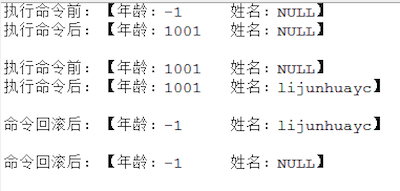

##### 总结
* 每一个命令都是一个操作：请求的一方发出请求，要求执行一个操作；接收的一方收到请求，并执行操作。
* 命令模式允许请求的一方和接收的一方独立开来，使得请求的一方不必知道接收请求的一方的接口，更不必知道请求是怎么被接收，以及操作是否被执行、何时被执行，以及是怎么被执行的。
* 命令模式使请求本身成为一个对象，这个对象和其他对象一样可以被存储和传递。
* 命令模式的关键在于引入了抽象命令接口，且发送者针对抽象命令接口编程，只有实现了抽象命令接口的具体命令才能与接收者相关联。

#### Android源码中的模式实现
Command接口中定义了一个execute方法，客户端通过Invoker调用命令操作再来调用Recriver执行命令；把对Receiver的操作请求封装在具体的命令中，使得命令发起者和命令接收者解耦。
以Android中大家常见的Runnable为例：客户端只需要new Thread(new Runnable(){}).start()就开始执行一系列相关的请求，这些请求大部分都是实现Runnable接口的匿名类。
【O_o 模式就在我们身边~】

命令接口Runnable接口定义如下：    

```
package java.lang;
/**
 * Represents a command that can be executed. Often used to run code in a
 * different {@link Thread}.
 */
public interface Runnable {

    /**
     * Starts executing the active part of the class' code. This method is
     * called when a thread is started that has been created with a class which
     * implements {@code Runnable}.
     */
    public void run();
}
```

调用者Thread源码如下（省略部分代码）：
Tips：命令模式在这里本来不需要继承Runnable接口，但为了方便性等，继承了Runnable接口实现了run方法，这个run是Thread自身的运行run的方法，而不是命令Runnable的run。    

```
public class Thread implements Runnable {
    //省略部分无关代码...
    /* some of these are accessed directly by the VM; do not rename them */
    volatile VMThread vmThread;
    volatile ThreadGroup group;
    volatile boolean daemon;
    volatile String name;
    volatile int priority;
    volatile long stackSize;
    Runnable target;
    private static int count = 0;
    
    public synchronized void start() {
        if (hasBeenStarted) {
            throw new IllegalThreadStateException("Thread already started."); // TODO Externalize?
        }

        hasBeenStarted = true;

        VMThread.create(this, stackSize);
    }
    //省略部分代码...
}
```    

上面可以看到执行start()方法的时候实际执行了VMThread.create(this, stackSize)方法；create是VMThread的本地方法，其JNI实现在 android/dalvik/vm/native/java_lang_VMThread.cpp 中的 Dalvik_java_lang_VMThread_create方法，如下：      

```
static void Dalvik_java_lang_VMThread_create(const u4* args, JValue* pResult)
{
    Object* threadObj = (Object*) args[0];
    s8 stackSize = GET_ARG_LONG(args, 1);

    /* copying collector will pin threadObj for us since it was an argument */
    dvmCreateInterpThread(threadObj, (int) stackSize);
    RETURN_VOID();
}
```    

而dvmCreateInterpThread的实现在Thread.app中，如下：    

```
bool dvmCreateInterpThread(Object* threadObj, int reqStackSize){
    Thread* self = dvmThreadSelf();
    
    Thread* newThread = allocThread(stackSize); 
    newThread->threadObj = threadObj;
    
    Object* vmThreadObj = dvmAllocObject(gDvm.classJavaLangVMThread, ALLOC_DEFAULT);
    dvmSetFieldInt(vmThreadObj, gDvm.offJavaLangVMThread_vmData, (u4)newThread);
    dvmSetFieldObject(threadObj, gDvm.offJavaLangThread_vmThread, vmThreadObj);
    
    pthread_t threadHandle;
    int cc = pthread_create(&threadHandle, &threadAttr, interpThreadStart, newThread);

    dvmLockThreadList(self);

    assert(newThread->status == THREAD_STARTING);
    newThread->status = THREAD_VMWAIT;
    pthread_cond_broadcast(&gDvm.threadStartCond);

    dvmUnlockThreadList();
    
}

static Thread* allocThread(int interpStackSize)
{
    Thread* thread;
    thread = (Thread*) calloc(1, sizeof(Thread));
    
    thread->status = THREAD_INITIALIZING;
}
```   

这里是底层代码，简单介绍下就行了：
第4行通过调用 allocThread 创建一个名为newThread的dalvik Thread并设置一些属性，第5行设置其成员变量threadObj为传入的Android Thread，这样dalvik Thread就与Android Thread对象关联起来了；第7行然后创建一个名为vmThreadObj的VMThread对象，设置其成员变量vmData为前面创建的newThread，设置 Android Thread threadObj的成员变量vmThread为这个vmThreadObj，这样Android Thread通过VMThread的成员变量vmData就和dalvik Thread关联起来了。       

接下来在12行通过pthread_create创建pthread线程，并让这个线程start，这样就会进入该线程的thread entry运行，下来我们来看新线程的thread entry方法 interpThreadStart，同样只列出关键的地方：

```
//pthread entry function for threads started from interpreted code.
static void* interpThreadStart(void* arg){
    Thread* self = (Thread*) arg;
    std::string threadName(dvmGetThreadName(self));
    setThreadName(threadName.c_str());

    //Finish initializing the Thread struct.
    dvmLockThreadList(self);
    prepareThread(self);

    while (self->status != THREAD_VMWAIT)
        pthread_cond_wait(&gDvm.threadStartCond, &gDvm.threadListLock);

    dvmUnlockThreadList();

    /*
     * Add a JNI context.
     */
    self->jniEnv = dvmCreateJNIEnv(self);

    //修改状态为THREAD_RUNNING
    dvmChangeStatus(self, THREAD_RUNNING);
    
    //执行run方法
    Method* run = self->threadObj->clazz->vtable[gDvm.voffJavaLangThread_run];

    JValue unused;
    ALOGV("threadid=%d: calling run()", self->threadId);
    assert(strcmp(run->name, "run") == 0);
    dvmCallMethod(self, run, self->threadObj, &unused);
    ALOGV("threadid=%d: exiting", self->threadId);
    
    //移出线程并释放资源
    dvmDetachCurrentThread();
    return NULL;
}

//Finish initialization of a Thread struct.
static bool prepareThread(Thread* thread){
    assignThreadId(thread);
    thread->handle = pthread_self();
    thread->systemTid = dvmGetSysThreadId();
    setThreadSelf(thread);
    return true;
}

//Explore our sense of self.  Stuffs the thread pointer into TLS.
static void setThreadSelf(Thread* thread){
    int cc;
    cc = pthread_setspecific(gDvm.pthreadKeySelf, thread);
}
```    

在新线程的interpThreadStart方法中，首先设置线程的名字，然后调用prepareThread设置线程id以及其它一些属性，其中调用了setThreadSelf将新dalvik Thread自身保存在TLS中，这样之后就能通过dvmThreadSelf方法从TLS中获取它。然后在29行处修改状态为THREAD_RUNNING，并在36行调用对应Android Thread的run()方法，其中调用了Runnable的run方法，运行我们自己的代码。
绕这么深才执行到我们的run方法，累不累？ v_v      

```
    /**
     * Calls the <code>run()</code> method of the Runnable object the receiver
     * holds. If no Runnable is set, does nothing.
     * @see Thread#start
     */
    public void run() {
        if (target != null) {
            target.run();
        }
    }
```   

到此我们已经完成一次命令调用，至于底层run调用完毕后续执行代码，读者可以自行跟进看看~~~


#### 4. 杂谈
#####优点与缺点
######优点
1. 降低对象之间的耦合度。
2. 新的命令可以很容易地加入到系统中。
3. 可以比较容易地设计一个组合命令。
4. 调用同一方法实现不同的功能

######缺点
使用命令模式可能会导致某些系统有过多的具体命令类。因为针对每一个命令都需要设计一个具体命令类，因此某些系统可能需要大量具体命令类，这将影响命令模式的使用。       
比如上面的PeopleBean的属性增加，Receiver针对PeopleBean一个属性一个执行方法，一个Command的实现可以调用Receiver的一个执行方法，由此得需要设计多少个具体命令类呀！！

