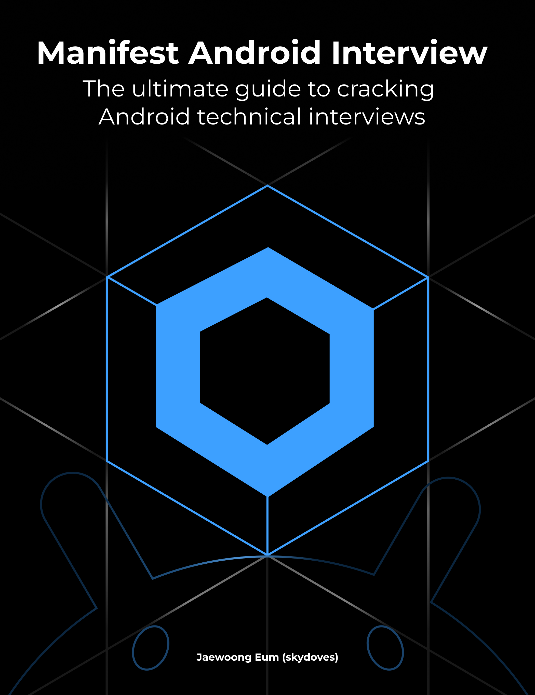
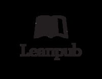

# 前置内容

> 原书页码：1–7  
> 翻译状态：已完成

# Manifest Android 面试

## 攻克 Android 技术面试的终极指南

Jaewoong Eum

本书可在 https://leanpub.com/manifest-android-interview 获取。  
本版本发布于 2025-06-16。ISBN 979-8285926436。

这是一本 Leanpub 图书。Leanpub 通过 Lean Publishing（精益出版）流程赋能作者和出版方：使用轻量工具发布仍在编写中的电子书，通过多次迭代收集读者反馈，持续调整以找到正确方向，并在此过程中建立读者基础。

© 2025 Jaewoong Eum

---

# 目录

- 前言
- 推荐语
- 关于本书
  - 写给面试者
  - 写给面试官
  - 问题报告与讨论
- 赞助商
- 0. Android 面试题
  - 类别 0：Android 框架
  - 类别 1：Android UI — View
  - 类别 2：Jetpack 库
  - 类别 3：业务逻辑
- 1. Jetpack Compose 面试题
  - 类别 0：Compose 基础
  - 类别 1：Compose Runtime
  - 类别 2：Compose UI

---

# 前言

我是 Jaewoong Eum（也被称为 skydoves¹），Google 的 Android、Kotlin 和 Firebase 开发者专家（GDE）。我创建了 80 多个开源库和项目，全球开发者每年的下载总量超过 1,500 万次。我还是 DoveLetter² 的创始人；这是一个订阅制知识库，我会在其中分享、探索和讨论 Android、Jetpack Compose 与 Kotlin 相关主题。

我希望通过技术解决方案、开源贡献和技术内容让世界变得更好、带来积极影响；我相信这本书是这段旅程中令人振奋的新篇章。我要向一路支持我的开发者社区、朋友和家人致以最诚挚的感谢。写作本书不仅是一项里程碑，更是赋能 Android 生态中其他人的第一步。

我希望本书能帮助你获得新的视角，磨练解决问题的能力，并建立对 Android 开发及整体生态的系统理解。学习应当是一段持续的旅程；你克服的每一个挑战都会让你成为更好的工程师。无论你是在准备下一场技术面试，还是希望掌握 Android 知识，我都鼓励你不止关注实现本身：理解背后的原因，尝试不同方法，并始终以好奇心和热情继续学习。

一如既往，祝你编码愉快，并在 Android 之旅中一切顺利！

— Jaewoong Eum（skydoves）³

如果这本书是别人免费转给你的，也没关系——我不会责备你。只是如果有一天我们在世界某处相遇，欢迎请我喝杯咖啡。

¹ https://github.com/skydoves  
² https://github.com/doveletter/  
³ https://github.com/skydoves/

---

# 推荐语

## Manuel Vivo（Bumble 的 Android 员工级工程师，前 Google Android DevRel）

“《Manifest Android 面试》是准备理论性较强技术面试的 Android 开发者不可或缺的指南。它将深入的技术洞见、实用示例和精心设计的‘精通专业提示’部分自然结合。本书的知识能帮助读者从容应对并成功通过 Android 面试，是极具价值的资源。”

## Matt McKenna（Block 高级 Android 工程师，Android GDE）

“《Manifest Android 面试》非常适合复习基础知识、准备面试和回顾最佳实践。其结构清晰、便于检索；经过深思熟虑的问题使它成为学习和重温 Android 核心概念的首选资源。”

## Alejandra Stamato（HubSpot 首席 Android 工程师，前 Google Android DevRel）

“借助精心设计的问题、富有洞见的提示和清晰的代码示例，《Manifest Android 面试》不仅帮助你巩固 Android 核心概念（如清单文件、生命周期、Intent、服务、内容提供程序、广播接收器和深层链接），还会带你探索 Android 软件构建的方方面面：从 ViewModel、View 系统一直到 Jetpack Compose，以及二者之间的所有内容。无论经验水平如何，每位读者都能从本书中获益。无论你是在准备理想职位，还是只想拓展对这个我们共同热爱的平台的专业能力，本书都会成为旅程中无比宝贵的伙伴。”

¹ https://bsky.app/profile/manuelvicnt.bsky.social  
² https://bsky.app/profile/mmckenna.me  
³ https://bsky.app/profile/astamato.bsky.social

---

# 推荐语（续）

## Simona Milanovic（高级 Android 开发者关系工程师）

“Jaewoong（Android 社区中许多人都以 skydoves 之名认识他）及其新书《Manifest Android 面试》，是所有准备面试或希望温习 Android 技能的人都值得拥有的资源。

本书内容广泛、详尽且结构良好，涵盖从基础知识到 Compose Runtime 与 UI 深入细节的所有主题。出于个人偏好，我特别关注 Jetpack Compose 部分，发现它非常有帮助，尤其适合面试准备。

本书持续回答棘手而实用的‘为什么’与‘如何做’，以非常贴近真实面试内容的方式帮助你学习并提升问题解决能力。无论你是 Compose 新手，还是正在准备面试，本书都能显著提升你的 Android 知识和面试信心。”

注：推荐语的排序没有特殊含义，只是 `Random.nextInt(4)` 的结果。

⁴ https://bsky.app/profile/anomiss.bsky.social

---

# 关于本书

欢迎阅读《Manifest Android 面试》——这是一本综合性指南，旨在通过 108 道附有详细答案的面试题、162 道额外实战题，以及 50 多个“精通专业提示”章节，提升你的 Android 开发能力。

面试题主要聚焦 Android 开发，包括框架、UI、Jetpack 库和业务逻辑，同时也涵盖 Jetpack Compose 的基础、Runtime 和 UI。

每个问题都提供深入说明，以结构化的学习路径带你学习 Android 和 Jetpack Compose，并巩固你对关键概念的理解。每道题末尾还有用于模拟真实面试场景的实战题，帮助你磨炼问题解决能力，更有效地准备技术讨论。

本书为希望在书中内容之外继续学习的读者提供了相关资源和补充参考。对于陌生或复杂的关键术语，作者尽可能提供脚注，使初学者也能轻松掌握有难度的概念，同时深化理解。

“精通专业提示”部分会更深入地探讨高级主题，揭示内部 API 结构并提供专家见解，让高级开发者也能保持投入。对中级开发者而言，本部分是强化 Android 专业能力、培养更具分析性的技术问题处理方式的宝贵资源。

本书系统而全面地探索 Android 与 Jetpack Compose 的多个领域，既包含基础概念，也涉及高级 API 或库。不过，它并非 Android 开发每个方面的穷尽性参考资料，也不是声称能让你一夜成为专家的“精通宝典”。相反，它提供坚实基础，帮助你有策略地准备面试，并根据具体职业目标定制学习计划。

此外，本书不聚焦高度专业化的第三方库或较底层的硬件功能，例如相机 API、蓝牙或深度系统级主题。若这些领域符合你的学习目标，请用其他资源补充学习。祝你在 Android 开发学习与职业发展之路上一切顺利！

---

# 写给面试者

《Manifest Android 面试》是一份旨在提升 Android 开发专业能力、拓宽你对 Android 生态理解的综合指南。但需要再次强调：这不是一本保证你一夜精通的“精通宝典”。虽然它广泛覆盖了关键主题，却不可能囊括世上每一道面试题，因为每家公司和岗位都有各自的要求。

如果目标岗位要求你掌握本书未充分涵盖的特定领域，应主动寻找更多资源并继续独立学习。最重要的是根据职位描述、所需技能和团队期望来定制准备。与其从头到尾线性阅读本书，不如先分析职位描述、识别相关技能，再聚焦书中与你需求相符的主题。这种选择性的方式能让你更有效地利用学习时间。

面试形式可能差异很大——有的包含 LeetCode 风格的编程面试、家庭作业或系统设计讨论。了解每种面试流程的结构，有助于确定应优先准备哪些领域。请有策略地使用本书，并使其内容适应不同面试风格和要求。

此外，许多面试官会追问以评估更深层的理解。准备未来的面试时，请思考本书问题可能出现的追问或变体。从面试官角度阅读本书，能锻炼你的分析思维，增强处理意外问题的能力，并提高技术讨论时的信心。

我希望本书能作为一份综合指南，在强化你 Android 和 Jetpack Compose 知识的同时，也加深你对更广泛 Android 生态及重点领域的理解。如果它能帮助你顺利通过下一场面试，它的使命便已达成。

---

# 写给面试官

如果你是新面试官，或团队缺少结构化的面试题库，要确定恰当问题以正确评估候选人并避免误判，可能相当困难。本书可作为有用的参考，提供符合团队技术规范的面试题思路，尤其适用于所有成员都必须熟悉的核心系统或常用技术。

你可以使用本书中的问题，但关键是建立清晰的评分标准，而不是期望每位候选人都给出完美答案。例如，若团队高度依赖 Jetpack ViewModel，就应预先定义关键要点或期望答案——最好基于真实使用场景以及项目中实际使用 ViewModel 的方式。

若候选人覆盖了其中至少 70%（例如）的要点，你可以考虑判定该题通过。追问也能帮助候选人走向正确答案，因为许多人在面试中会感到紧张。营造舒适、支持性的环境，能让候选人更有效地展示能力。

这只是评估候选人的一种做法；你可以根据团队需要探索不同方法。即使是面试官，也不总能完整掌握每个主题，因此在面试前复习相关内容非常重要，尤其在缺乏面试经验时。

优秀的面试官与优秀的候选人同样重要，因为这是挑选未来同事的关键流程。我希望本书能成为有价值的资源，帮助你完善面试方法，并找到能够壮大团队的最佳候选人。

---

# 问题报告与讨论

如果你发现任何问题、错别字或过时内容，请在 GitHub¹ 创建 issue 进行报告和贡献。你的反馈有助于改进本书及更广泛的开发者生态。由于本书主要以电子书形式发布，因而可以频繁、迭代地更新。

如果想与其他开发者交流，欢迎加入本书作者管理的 Discord 频道²；你可以在那里与读者和开发者讨论面试主题，尤其是实战面试题。开展技术讨论、寻找模拟面试伙伴，并拓展你的人脉。

让我们一起把它打造成最好的资源！

¹ http://github.com/skydoves/manifest-android-interview  
² https://discord.gg/emq2zw3YA7

---

# 赞助商

以下是《Manifest Android 面试》的主要赞助商。他们的支持使本书得以计划于 6 月出版纸质版、提升整体质量、资助翻译，并设计贯穿全书的视觉插图。

## Stream

Stream（https://getstream.io/）借助由全球边缘网络和企业级基础设施驱动的 Chat、Video、Audio、Feeds 与 Moderation API 和 SDK，帮助开发者构建能够扩展至数百万用户的高互动应用。

¹ https://getstream.io/video/sdk/android/?utm_source=website&utm_medium=referral&utm_content=&utm_campaign=

---
