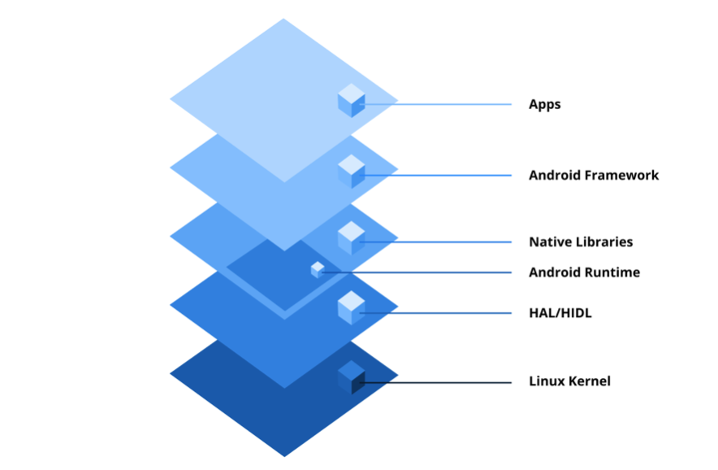
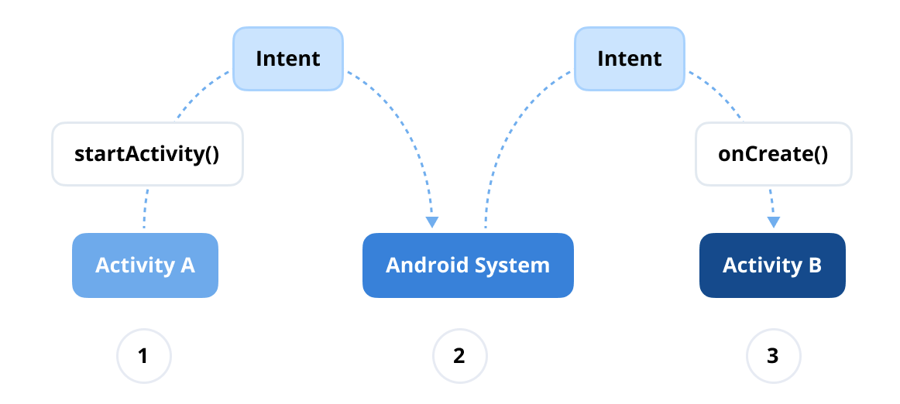
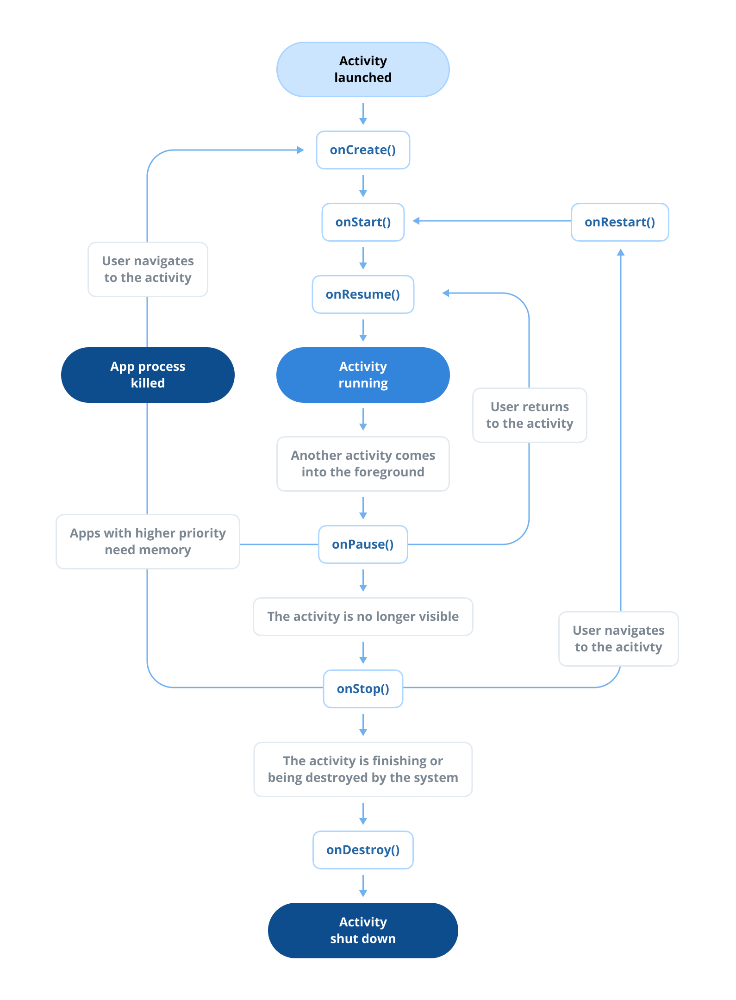
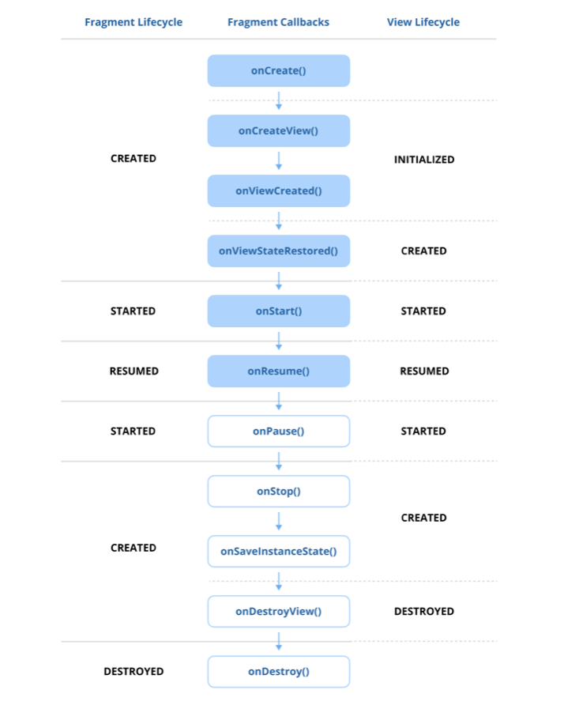
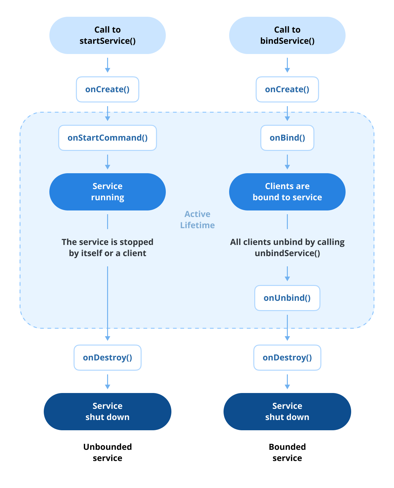
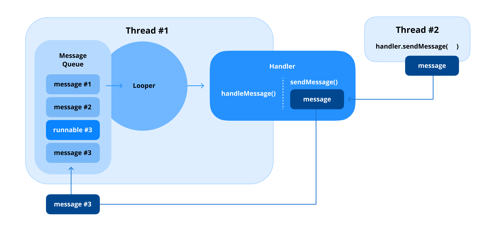

# 0. Android 面试题

## 类别 0：Android 框架

> 原书页码：8–117  
> 翻译状态：已完成（问题 0–32）


Android 自 2008 年 9 月 23 日发布以来经历了显著演进。多年来，Android SDK 与生态发生了重大变化，不断出现新的工具和解决方案，例如 Android Architecture Components（AAC）、Jetpack 库和 Jetpack Compose。尽管持续增长与创新，支撑 Android 的基础系统——如 Intent、Window 和核心 View 架构——仍大体保持一致。

每家公司构建 Android 应用的方式和技术栈各不相同。因此，务必使面试准备与职位描述中列出的最低资格要求，以及目标组织使用的具体技术相匹配。理解其技术要求能帮助你更有效地集中精力。

面试题的复杂度会因公司和面试官而显著不同。与其单纯背诵答案，建议深入理解概念并练习运用。书中的问题旨在作为你准备 Android 技术面试的资源，而不是囊括所有可能面试题的权威或穷尽性教材。

有些公司可能聚焦底层 Android 系统操作与架构，以评估你对 Android 基础的理解；另一些则着重高级 API 或库，以判断你能多快将其整合到产品中。不同组织的评分标准也不同，因此并不存在适用于每道题的唯一“完美”答案。这里提供的答案只是起点；鼓励你在此基础上拓展，探索更深入的知识，以获得更充分的准备。

本书并非为了覆盖广阔 Android 开发领域中所有可设想的问题。它提供的是坚实基础，帮助你有效准备，并依据目标岗位的具体要求调整学习。还应注意，本书不会深入讲解高级第三方库或较底层的硬件功能，例如相机 API、蓝牙或类似主题。若这些领域与你的目标相关，需要主动寻找其他资源并独立扩展知识。祝你准备 Android 面试顺利！

---


Android 框架是构建 Android 应用所需的基础知识，涵盖 Android SDK、内部结构、Android Runtime 系统等。这些组件与 Android 基础系统深度整合，因此理解框架是成为 Android 开发者的第一步。

在本类别中，你将深入 Android SDK 的核心内容，包括 Activity、Fragment 与 Android UI，以及对现代 Android 开发有用的 Jetpack 库等补充知识。你还会学习 Android 系统，以及在真实场景中运行 Android 应用所必需的业务逻辑。

请记住，本类别并不旨在覆盖全世界所有可能的面试题。同样，提供的答案也不应被视为每位面试官都会期待的最终答案。应将其作为参考，从中获得洞见，并引导自己的学习旅程，以更深入地理解 Android 框架。

## 问题 0：什么是 Android？

Android 是一个主要面向智能手机和平板电脑等移动设备的开源操作系统。它由 Google 开发和维护，并以 Linux 内核为基础。Android 提供强大而灵活的平台，支持广泛的硬件配置和设备类型。

### Android 操作系统的关键特性

1. **开源且可定制：** Android 是开源的（Android Open Source Project¹），因此开发者和制造商可以根据需求修改和定制它。这种灵活性推动了其广泛采用和创新，覆盖可穿戴设备、电视和 IoT 设备等多种设备。
2. **使用 SDK 开发应用：** Android 应用主要使用 Java 或 Kotlin，并结合 Android Software Development Kit（SDK）构建。开发者可使用 Android Studio 等工具设计、开发和调试平台应用。
3. **丰富的应用生态：** Google Play 商店是 Android 的官方应用分发平台，提供从游戏到生产力工具等不同类别的数百万款应用。开发者也可以通过第三方商店或直接下载独立分发应用。

¹ https://source.android.com/

4. **多任务与资源管理：** Android 支持多任务，允许用户同时运行多个应用。它使用受管理的内存系统和高效的垃圾回收，在各种设备上优化性能。
5. **多样化硬件支持：** Android 驱动着从经济型手机到高端旗舰机型的广泛设备，对不同屏幕尺寸、分辨率和硬件配置具有很强的兼容性。

### Android 架构

Android 的平台架构² 采用模块化分层设计，由多个组件构成：

图 1：android-architecture 



² https://developer.android.com/guide/platform

---

- **Linux 内核：** Linux 内核构成 Android 操作系统的基础。它处理硬件抽象，确保软件与硬件能够无缝交互。主要职责包括内存与进程管理、安全机制实施，以及管理 Wi‑Fi、蓝牙和显示器等硬件组件的设备驱动程序。
- **硬件抽象层（HAL）：** 硬件抽象层（HAL）提供标准接口，将 Android 的 Java API 框架连接至设备硬件。它由库模块构成，每个模块针对相机或蓝牙等特定硬件组件。当框架 API 请求访问硬件时，Android 系统会动态加载相应 HAL 模块来完成该请求。
- **Android Runtime（ART）和核心库：** Android Runtime（ART）运行由 Kotlin 或 Java 编译而来的字节码应用。ART 支持预先编译（AOT）³ 与即时编译（JIT）⁴，以优化性能。核心库提供数据结构、文件操作、线程等所需的基础 API，为应用开发提供完整环境。
- **原生 C/C++ 库：** Android 包含一组以 C 和 C++ 编写的原生库，用于支持关键功能。OpenGL 等库管理图形渲染，SQLite 支持数据库操作，WebKit 用于显示网页内容。这些库既供 Android 框架使用，也可由应用直接用于性能密集型任务。
- **Android 框架（API）：** 应用框架层为应用开发提供更高层的服务和 API，包括 `ActivityManager`、`NotificationManager`、内容提供程序等，使开发者能够构建 Android 应用。该层让开发者可以高效利用 Android 系统功能。
- **应用：** 最顶层包含面向用户的所有应用，例如系统应用（如通讯录、设置）和使用 Android SDK 创建的第三方应用。这些应用依赖下层组件，为用户无缝提供功能与体验。

### 小结

Android 是全球使用最广泛的移动操作系统，占有主导市场份额。它鼓励创新，并为开发者创建面向数十亿用户的应用提供机会。其适应性与开源特性使 Android 能在多样市场中蓬勃发展，并成为智能手机以外众多设备的基础。

³ **预先编译（AOT）** 指在运行前将代码编译为机器码的过程，从而无需在执行期间进行即时编译（JIT）。该方法通过生成经过优化、预先编译的二进制文件来提升性能并减少运行时开销。  
⁴ **即时编译（JIT）** 是一种运行时过程：在代码即将执行前，动态将字节码翻译为机器码。运行时环境可依据实际执行模式优化代码，从而提升常用代码路径的性能。

### 实战题

**问：** Android 平台架构由多个层构成，包括 Linux 内核、Android Runtime（ART）和硬件抽象层（HAL）。请说明这些组件如何协同工作，以保证应用执行和硬件交互？

**答：** Android 应用运行在应用框架之上：Framework 提供 Activity、Window、Package、Location 等系统服务 API；应用代码经 D8/R8 转成 DEX，由 ART 负责执行、垃圾回收和基于 Profile 的 JIT/AOT 编译。应用通常运行在独立 Linux 进程和 UID 沙箱中，跨进程请求通过 Binder 进入 system_server 或厂商服务。需要访问相机、音频、传感器等硬件时，Framework 服务调用稳定的 HAL 接口；HAL 再通过厂商驱动与 Linux 内核的设备驱动交互。内核负责调度、内存、网络、电源和驱动隔离，并将结果沿相反路径返回。因此，应用不直接操作驱动，既获得统一 API，也保留权限检查、进程隔离和硬件实现可替换性。

---

## 问题 1：什么是 Intent？

`Intent`⁵ 是对将要执行操作的抽象描述。它充当消息对象，使 Activity、Service 和广播接收器能够相互通信。Intent 通常用于启动 Activity、发送广播或启动 Service；它还可在组件之间传递数据，因此是 Android 基于组件架构的基础部分。

Android 中有两种主要的 Intent：**显式 Intent** 和 **隐式 Intent**。

### 1. 显式 Intent

- **定义：** 显式 Intent 通过直接指定名称，精确声明要调用的组件（Activity 或 Service）。
- **使用场景：** 当你已知目标组件时使用显式 Intent，例如在应用内部启动特定 Activity。
- **示例情形：** 在同一应用中从一个 Activity 切换到另一个 Activity 时，使用显式 Intent。

可按如下代码使用显式 Intent：

```kotlin
val intent = Intent(this, TargetActivity::class.java)
startActivity(intent)
```

⁵ https://developer.android.com/reference/android/content/Intent

---

### 2. 隐式 Intent

- **定义：** 隐式 Intent 不指定具体组件，而是声明需要执行的通用操作。系统会基于 action、category 和 data，解析能处理该 Intent 的组件。
- **使用场景：** 当希望执行可由其他应用或系统组件处理的操作时，隐式 Intent 很有用，例如打开 URL 或分享内容。
- **示例情形：** 在浏览器中打开网页或与其他应用分享内容时，应使用隐式 Intent。系统会决定由哪个应用处理该 Intent。

可按如下示例使用隐式 Intent：

```kotlin
val intent = Intent(Intent.ACTION_VIEW)
intent.data = Uri.parse("https://www.example.com")
startActivity(intent)
```

### 小结

显式 Intent 用于已知目标组件的应用内部导航；隐式 Intent 则用于可能由外部应用或其他组件处理、但不直接指定目标的操作。这让 Android 生态更加灵活，也使应用之间能够顺畅协作。

### 实战题

**问：** 显式 Intent 与隐式 Intent 的关键差异是什么？分别应在什么场景中使用？

**答：** 显式 Intent 通过包名和组件类名精确指定目标，例如启动本应用的 `DetailActivity`；目标确定、可控，适合应用内部跳转或调用已知组件。隐式 Intent 只描述要完成的动作、数据和类别，例如 `ACTION_VIEW` 一个 HTTPS URI，由系统根据已安装组件的 `intent-filter` 解析；适合打开网页、分享内容、拍照等希望交给系统或第三方应用处理的场景。涉及敏感操作时应优先显式指定可信组件，或先用 `PackageManager` 校验可处理目标。

**问：** Android 系统如何决定由哪个应用处理隐式 Intent？如果没有合适的应用会发生什么？

**答：** PackageManager 会将 Intent 的 `action`、`data`（URI/MIME type）和 `category` 与清单中的 `intent-filter` 匹配：Intent 中的每个 category 都必须被过滤器包含，data 必须匹配相应规则；未指定 data 时按规则处理。只有一个匹配组件时可直接启动，多个匹配项时系统可能显示默认选择界面；若要始终展示选择器可使用 `Intent.createChooser()`。没有匹配的 Activity 时，`startActivity()` 会抛出 `ActivityNotFoundException`，因此应先 `resolveActivity()` 或捕获异常并提供降级提示。

### 精通专业提示：什么是 Intent Filter？


Android 中的 Intent Filter⁶ 定义应用组件如何响应特定 Intent，例如打开链接或处理广播。它相当于一个筛选器，用于在 `AndroidManifest.xml` 中声明 Activity、Service 或广播接收器可处理的 Intent 类型。每个 Intent Filter 都可包含 action、category 和 data 类型，以精确匹配传入的 Intent。正确地定义 Intent Filter 能确保应用与其他应用及系统组件无缝交互，提升功能完整性。

发送隐式 Intent 时，Android 系统会将 Intent 的属性与已安装应用清单文件中定义的 Intent Filter 进行匹配，从而确定要启动的合适组件。若找到匹配项，系统便启动相应组件并向其传递 Intent 对象；若多个组件都匹配，系统会展示选择器对话框，让用户选择希望用于处理该操作的应用。

图 4：intent-filter



⁶ https://developer.android.com/guide/components/intents-filters

---

## 问题 2：PendingIntent 的用途是什么？

`PendingIntent` 是一种特殊的 `Intent`：它授予其他应用或系统组件代表你的应用在稍后执行预先定义 Intent 的能力。这对于需要在应用生命周期之外触发的操作尤其有用，例如通知或与 Service 的交互。

### PendingIntent 的关键特性

`PendingIntent` 可看作普通 Intent 的包装器，使它能够在应用生命周期结束后依然存在。它会以与你的应用相同的权限，把 Intent 的执行委托给另一个应用或系统服务。可为 Activity、Service 或广播接收器创建 PendingIntent。

PendingIntent 有三种主要形式：

- **Activity：** 启动一个 Activity。
- **Service：** 启动一个 Service。
- **Broadcast：** 发送一条广播。

可使用 `PendingIntent.getActivity()`、`PendingIntent.getService()` 或 `PendingIntent.getBroadcast()` 等工厂方法创建 PendingIntent。

图 5：为通知创建 PendingIntent

```kotlin
val intent = Intent(this, MyActivity::class.java)
val pendingIntent = PendingIntent.getActivity(
    this,
    0,
    intent,
    PendingIntent.FLAG_UPDATE_CURRENT
)
val notification = NotificationCompat.Builder(this, CHANNEL_ID)
    .setContentTitle("Title")
    .setContentText("Content")
    .setSmallIcon(R.drawable.ic_notification)
    .setContentIntent(pendingIntent) // 点击通知时触发
    .build()
NotificationManagerCompat.from(this).notify(NOTIFICATION_ID, notification)
```

PendingIntent 支持多种 flag，用于控制自身行为以及与系统或其他组件的交互方式：

- `FLAG_UPDATE_CURRENT`：使用新数据更新已有 PendingIntent。
- `FLAG_CANCEL_CURRENT`：在创建新 PendingIntent 前取消已有 PendingIntent。
- `FLAG_IMMUTABLE`：使 PendingIntent 不可变，接收方无法修改它。
- `FLAG_ONE_SHOT`：确保 PendingIntent 只能使用一次。

### 使用场景

1. **通知：** 例如用户点击通知时打开一个 Activity。
2. **闹钟：** 使用 `AlarmManager` 调度任务。
3. **服务：** 将后台操作委托给 `ForegroundService` 或 `BroadcastReceiver`。

### 安全注意事项

应始终为 PendingIntent 设置 `FLAG_IMMUTABLE`，避免恶意应用修改底层 Intent。自 Android 12（API 级别 31）起，这一点尤为关键：在某些场景中 `FLAG_IMMUTABLE` 是必需的。

### 小结

PendingIntent 是 Android 的核心机制，即使应用未在活跃运行，也能让你的应用与系统组件或其他应用顺畅通信。通过谨慎管理 flag 和权限，可确保延迟任务安全且高效地执行。

### 实战题

**问：** 什么是 PendingIntent？它与普通 Intent 有何区别？请给出一个必须使用 PendingIntent 的场景。

**答：** `PendingIntent` 是交给系统或其他应用、允许其在将来以创建者身份执行指定 Intent 的令牌；普通 Intent 只是一次立即发起组件调用的消息描述。它常用于通知点击、App Widget、AlarmManager 和系统快捷操作：例如下载完成通知的点击事件必须由 System UI 在稍后代表应用启动详情页，因此需要 `PendingIntent.getActivity()`。应使用显式 Intent，按需设置唯一的 requestCode/`FLAG_UPDATE_CURRENT`，并在 Android 12+ 明确声明 `FLAG_IMMUTABLE`；只有确实需要接收方补充内容时才使用 `FLAG_MUTABLE`，避免 Intent 被篡改。

---

## 问题 3：Serializable 和 Parcelable 有什么区别？

在 Android 中，`Serializable` 和 `Parcelable` 都可用于在不同组件（如 Activity 或 Fragment）之间传递数据，但它们在性能和实现方式上有所不同。比较如下。

### Serializable

- **Java 标准接口：** Serializable 是 Java 标准接口，用于将对象转换为字节流，以便在 Activity 之间传递或写入磁盘。
- **基于反射：** 它通过 Java 反射工作，即系统在运行时动态检查类及其字段来序列化对象。
- **性能：** 由于反射过程较慢，Serializable 比 Parcelable 慢；序列化过程中还会产生大量临时对象，增加内存开销。
- **使用场景：** 当性能并不关键，或处理非 Android 专用代码库时，Serializable 很有用。

### Parcelable

- **Android 专用接口：** Parcelable 是 Android 专用接口，专为 Android 组件内的高性能进程间通信（IPC）⁷ 设计。
- **性能：** Parcelable 比 Serializable 更快，因为它针对 Android 优化且不依赖反射。它通过避免创建大量临时对象来减少垃圾回收。
- **使用场景：** 当性能重要时，Parcelable 更适合用于 Android 中的数据传递，尤其是 IPC 或在 Activity、Service 之间传递数据。

在现代 Android 开发中，`kotlin-parcelize` 插件⁸ 会自动生成实现，从而简化 Parcelable 对象的创建流程。这种方式比早期手写机制更高效。只需为类添加 `@Parcelize` 注解，插件即可生成必要的 Parcelable 实现。

⁷ **进程间通信（IPC）** 是一种使不同进程能够相互通信和共享数据的机制，从而让独立应用或系统服务可以协作。在 Android 上，IPC 通过 Binder、Intent、ContentProvider 和 Messenger 等组件实现；这些组件可在进程之间安全、高效地交换数据。  
⁸ https://plugins.gradle.org/plugin/org.jetbrains.kotlin.plugin.parcelize

```kotlin
import kotlinx.parcelize.Parcelize
import android.os.Parcelable

@Parcelize
class User(val firstName: String, val lastName: String, val age: Int) : Parcelable
```

采用这种方式后，无需重写 `writeToParcel` 等方法，也不必实现 `CREATOR`，可显著减少样板代码并提升可读性。

**补充提示：** 如果类标记了 `@Parcelize`，却包含既不是基本类型、也未标记为 `@Parcelize` 的属性，会遇到如下错误：`Type is not directly supported by 'Parcelize'. Annotate the parameter type with '@RawValue' if you want it to be serialized using 'writeValue()'.`

出现该错误的原因是 Parcelize 编译器插件会在序列化时尝试扁平化所有属性；任何不受支持或无法识别的类型都必须显式标记。为避免此问题，请确保所有复杂或自定义类型本身都能正确 Parcelable，或使用 `@RawValue` 标注以表明应手动序列化。

### 关键差异

| 特性 | Serializable | Parcelable |
| --- | --- | --- |
| 类型 | Java 标准接口 | Android 专用接口 |
| 性能 | 较慢，使用反射 | 更快，为 Android 优化 |
| 垃圾对象 | 创建较多对象 | 创建较少对象，效率更高 |
| 使用场景 | 适合通用 Java 使用 | 更适合 Android，尤其是 IPC |

### 小结

一般而言，对于 Android 应用，`Parcelable` 在多数场景中性能更好，因此是推荐做法。

- 在简单场景、性能不关键的操作，或处理非 Android 专用代码时使用 `Serializable`。
- 在使用 Android 专用组件且性能重要时使用 `Parcelable`；它对 Android 的 IPC⁹ 机制效率高得多。

### 实战题

**问：** Android 中 Serializable 和 Parcelable 的关键差异是什么？为什么在组件之间传递数据时通常更推荐 Parcelable？

**答：** `Serializable` 是 Java 标准标记接口，通常借助反射和对象图序列化，编写简单但运行时开销、临时对象和 GC 压力较大。`Parcelable` 是 Android 专用协议，开发者明确把字段写入和读出 `Parcel`，避免反射，适合 Binder IPC 及 Intent/Bundle 传递，通常更高效且类型更可控；Kotlin 可使用 `@Parcelize` 降低样板代码。两者都不适合传递大对象：Binder 事务大小有限，应传递 ID、文件 URI 或分页数据；`Parcel` 也不能作为持久化格式。

### 精通专业提示：Parcel 和 Parcelable


`Parcel` 是 Android 中的容器类，使应用不同组件（如 Activity、Service 或广播接收器）之间能够进行高性能进程间通信（IPC）。它主要用于编组（marshaling，扁平化）¹⁰ 和解组（unmarshaling，反扁平化）¹¹ 数据，以便跨越 Android 的 IPC 边界传递。

Parcel 是通过 IPC 机制发送扁平化数据以及存活 `IBinder`¹² 对象引用的容器。它专为高性能 IPC 传输设计，使对象（通过 `Parcelable` 接口）可以被序列化并在组件之间高效传递。Parcel 并非通用序列化工具，也不应用于持久化存储，因为其底层实现可能发生变化，从而导致旧数据无法读取。

该 API 提供多种用于读取和写入基本数据类型、数组和 Parcelable 对象的方法，允许对象在需要时自行序列化并重建。此外，Parcel 还提供了处理 Parcelable 的优化方法：它们不写入类信息，因而要求读取方预先知道类型，以提高数据处理效率。

`Parcelable` 是 Android 专用接口，用于序列化对象，使其可以通过 Parcel 传递。实现 Parcelable 的对象能够写入 Parcel，也能够从 Parcel 中恢复，因此适合在 Android 组件之间传递复杂数据。

### 小结

Parcel 是一个利用 IPC 在组件间传输数据的容器，支持多种数据类型。Parcelable 则是使对象可被扁平化到 Parcel 中并高效传输的接口。若想深入了解 Parcel 的实际实现与工作机制，可查看 AOSP 中的 [Parcel.java](https://android.googlesource.com/platform/frameworks/base/+/27f592d/core/java/android/os/Parcel.java)¹³ 源码。

⁹ **进程间通信（IPC）** 是使不同进程能相互通信并共享数据的机制，从而让独立应用或系统服务能够协作。在 Android 中，IPC 通过 Binder、Intent、ContentProvider 和 Messenger 等组件实现；它们可在进程间安全、高效地交换数据。  
¹⁰ **编组（marshaling）** 是把对象或数据结构转换为可在网络上传输、存储并在之后重建的格式的过程。在 Android 中，编组常用于 IPC：数据经由 Binder 等机制序列化后传输。  
¹¹ **解组（unmarshaling）** 是把序列化格式的数据或对象重建为原始形式的过程。在 Android 中，这常发生在 IPC 中：接收进程会对通过 Binder 等方式发来的数据进行反序列化后使用。  
¹² **IBinder** 是 Android 用于 IPC 的核心接口。它充当客户端和服务等不同组件之间的底层通信桥梁，使它们可通过交换数据或远程调用方法进行交互。  
¹³ https://android.googlesource.com/platform/frameworks/base/+/27f592d/core/java/android/os/Parcel.java

---

## 问题 4：什么是 Context？有哪些 Context 类型？

`Context` 表示应用所处的环境或状态，并提供对应用专属资源和类的访问。它充当应用与 Android 系统之间的桥梁，使组件能够访问资源、数据库、系统服务等。启动 Activity、访问资源文件或填充布局等任务都离不开 Context。

Android 中有多种 Context。

### Application Context

Application Context 与应用的生命周期绑定。当你需要独立于当前 Activity 或 Fragment 的全局、长生命周期 Context 时，应使用它。可通过调用 `getApplicationContext()` 获取。

Application Context 的使用场景：

- 访问应用范围内的资源，例如 SharedPreferences 或数据库。
- 注册需要在整个应用生命周期内持续存在的广播接收器。
- 初始化在整个应用生命周期内存在的库或组件。

### Activity Context

Activity Context（Activity 中的 `this` 实例）与该 Activity 的生命周期绑定。它用于访问资源、启动其他 Activity，以及填充该 Activity 专属布局。

Activity Context 的使用场景：

- 创建或修改 UI 组件。
- 启动另一个 Activity。
- 访问限定于当前 Activity 的资源或主题。

### Service Context

Service Context 与 Service 的生命周期绑定，主要用于后台运行的任务，例如执行网络操作或播放音乐。它提供 Service 所需系统级服务的访问能力。

### Broadcast Context

调用 BroadcastReceiver 时会提供 Broadcast Context。它生命周期很短，通常用于响应特定广播；不要使用此 Context 执行长时间运行的任务。

### Context 的常见使用场景

1. **访问资源：** Context 可通过 `getString()`、`getDrawable()` 等方法访问字符串、Drawable 和尺寸资源。
2. **填充布局：** 使用 Context 通过 `LayoutInflater` 将 XML 布局填充为 View。
3. **启动 Activity 和 Service：** 启动 Activity（`startActivity()`）和 Service（`startService()`）需要 Context。
4. **访问系统服务：** Context 可通过 `getSystemService()` 访问 `ClipboardManager`、`ConnectivityManager` 等系统级服务。
5. **访问数据库和 SharedPreferences：** 使用 Context 访问 SQLite 数据库或 SharedPreferences 等持久化存储机制。

### 小结

Context 是 Android 中的核心组件，使应用能够与系统资源交互。Application Context、Activity Context 和 Service Context 等不同类型各有用途。正确使用 Context 可确保高效管理资源，并防止内存泄漏或崩溃；因此必须选择合适的 Context，避免不必要地长期持有它。

### 实战题

**问：** 为什么 Android 应用中必须使用正确类型的 Context？长期持有 Activity Context 引用可能有哪些风险？

**答：** Context 决定资源、主题、系统服务、窗口和生命周期的作用域。显示 Dialog、PopupWindow、按主题填充布局等必须使用仍处于有效状态的 Activity Context；数据库、SharedPreferences、无 UI 的单例初始化等长生命周期任务应使用 `applicationContext`。若单例、静态字段、后台任务或延迟回调长期持有 Activity Context，会连同 Activity、View 树和资源一起无法回收，造成内存泄漏；在 Activity 已销毁后再用它更新 UI 或显示窗口，还可能崩溃或产生窗口泄漏。不要为了“避免泄漏”而把所有场景都改为 Application Context，因为它没有 Activity 的窗口和主题能力。

### 精通专业提示：使用 Context 时要注意什么？


Context 是 Android 中很方便的机制，但使用不当会造成内存泄漏、崩溃或低效的资源处理等严重问题。要避免这些陷阱，必须理解有效使用 Context 的细节和最佳实践。

最常见的问题之一，是在其生命周期结束后仍保留 Context——尤其是 Activity 或 Fragment Context——的引用。这会导致内存泄漏，因为垃圾回收器无法回收该 Context 或其关联资源所占的内存。

例如，下列代码会导致内存泄漏：

```kotlin
object Singleton {
    var context: Context? = null // 持有 Context，导致内存泄漏
}
```

相反，应为需要 Context 的长生命周期对象使用 Application Context：

```kotlin
object Singleton {
    lateinit var applicationContext: Context
}
```

因此，使用合适类型的 Context 非常重要。不同 Context 类型服务于不同目的，使用错误类型会产生意外行为：

- 对于填充布局、显示对话框等与 UI 相关的任务，使用 Activity Context。
- 对于初始化库等独立于 UI 生命周期的操作，使用 Application Context。

下面的示例错误地使用了 Application Context：

```kotlin
val dialog = AlertDialog.Builder(context.getApplicationContext()) // 错误
```

应使用 Activity Context，以确保主题正确：

```kotlin
val dialog = AlertDialog.Builder(activityContext) // 正确
```

另一个关键注意事项是：不要在关联组件（如 Activity 或 Fragment）被销毁后继续使用其 Context。访问与已销毁组件绑定的 Context 可能导致崩溃或未定义行为，因为与该 Context 相连的资源可能不再存在。以下示例展示了错误用法：自定义 View 被不恰当地创建。

```kotlin
val button = Button(activity)
activity.finish() // Activity 已销毁，但 button 仍保留引用
```

### 避免在线程后台使用 Context

Context 的设计主要服务于主线程，特别是访问资源或与 UI 交互时。在后台线程使用它可能导致意外崩溃或线程问题。与 UI 相关的 Context 资源交互前，应切换回主线程：

```kotlin
viewModelScope.launch {
    val data = fetchData()
    withContext(Dispatchers.Main) {
        Toast.makeText(context, "Data fetched", Toast.LENGTH_SHORT).show()
    }
}
```

### 小结

要有效使用 Context，必须谨慎避免常见陷阱。不要在 Activity 或 Fragment 生命周期结束后继续保留它们的 Context，否则会造成内存泄漏。始终针对具体任务选择正确的 Context 类型；不要在后台线程中使用它，也不要在关联组件已销毁后使用它。此外，应留意匿名内部类和回调，因为它们可能在无意间持有 Context 引用。妥善管理 Context 可确保高效使用资源，并有助于避免内存泄漏或应用崩溃。

### 精通专业提示：什么是 ContextWrapper？


`ContextWrapper` 是 Android 中的基类，可包装一个 Context 对象，并把调用委托给被包装的 Context。它相当于中间层，可修改或扩展原始 Context 的行为。使用 ContextWrapper，可以在不改动底层 Context 的情况下定制功能。

#### ContextWrapper 的目的

当你需要增强或覆写现有 Context 的特定行为时，可使用 ContextWrapper。它允许你拦截对原始 Context 的调用，并提供附加功能或自定义行为。

#### 使用场景

1. **自定义 Context：** 需要为特定用途创建自定义 Context 时，例如应用不同主题或以专门方式处理资源。
2. **动态资源处理：** 包装 Context，以动态提供或修改字符串、尺寸或样式等资源。
3. **依赖注入：** Dagger 和 Hilt 等库会创建 ContextWrapper，将自定义 Context 附加到组件¹⁴，以实现依赖注入。

#### ContextWrapper 示例

以下代码演示如何使用 ContextWrapper 应用自定义主题：

```kotlin
class CustomThemeContextWrapper(base: Context) : ContextWrapper(base) {
    override fun getTheme(): Resources.Theme {
        val theme = super.getTheme()
        theme.applyStyle(R.style.CustomTheme, true) // 应用自定义主题
        return theme
    }
}
```

可以在 Activity 中使用这个自定义包装器：

```kotlin
class MyActivity : AppCompatActivity() {
    override fun attachBaseContext(newBase: Context) {
        super.attachBaseContext(CustomThemeContextWrapper(newBase))
    }
}
```

在此示例中，`CustomThemeContextWrapper` 为 Activity 应用指定主题，覆盖了基础 Context 的默认行为。

#### 主要优点

- **可复用性：** 可将自定义逻辑封装在包装器类中，并在多个组件之间复用。
- **封装性：** 无需更改原始 Context 的实现即可增强或修改其行为。
- **兼容性：** 可与现有 Context 对象无缝协作，保持向后兼容。

### 小结

ContextWrapper 是用于定制 Android 中 Context 行为的灵活、可复用工具。它使开发者可以拦截和修改对原始 Context 的调用，而无需直接修改原始对象，因此是构建模块化、适应性强应用的重要类。

¹⁴ https://github.com/google/dagger/blob/6b183f85e50c7b0e5e524e57d2f4561786d146cf/java/dagger/hilt/android/internal/managers/FragmentComponentManager.java#L103

### 精通专业提示：Activity 中的 `this` 和 `baseContext` 实例有何区别？


在 Activity 中，`this` 与 `baseContext` 都可以访问 Context，但它们用途不同，代表 Android Context 层级中的不同层次。知道何时使用二者，对避免代码中的混淆或潜在问题至关重要。

#### Activity 中的 this

在 Activity 中，关键字 `this` 指向当前 Activity 类的实例。由于 Activity 是 ContextWrapper 的子类（因而间接也是 Context 的子类），`this` 能够访问该 Activity 专属的 Context，包括生命周期管理和 UI 交互等附加能力。

在 Activity 中使用 `this` 时，它通常指向当前的 Activity Context，使你可以调用与该 Activity 相关的方法。例如，需要启动另一 Activity，或显示与当前 Activity 绑定的对话框时，可使用 `this`。

```kotlin
val intent = Intent(this, AnotherActivity::class.java)
startActivity(intent)

val dialog = AlertDialog.Builder(this)
    .setTitle("Example")
    .setMessage("This dialog is tied to this Activity instance.")
    .show()
```

#### Activity 中的 baseContext

`baseContext` 表示构建 Activity 所依赖的基础 Context。它属于 Activity 继承的 ContextWrapper 类；通常是为 Context 方法提供核心实现的 `ContextImpl` 实例。

通常通过 `getBaseContext()` 访问 baseContext。很少需要直接使用它，但在处理自定义 ContextWrapper 实现，或需要引用包装器背后的原始 Context 时，它会变得相关。

```kotlin
val systemService = baseContext.getSystemService(Context.LAYOUT_INFLATER_SERVICE)
```

#### this 与 baseContext 的关键差异

1. **作用域：** `this` 表示当前 Activity 实例及其生命周期；`baseContext` 指向 Activity 所构建于其上的底层 Context。
2. **用途：** `this` 常用于与 Activity 生命周期或 UI 绑定的操作，例如启动 Activity 或显示对话框。`baseContext` 通常用于与 Context 核心实现交互，特别是在自定义 ContextWrapper 场景中。
3. **层级：** baseContext 是 Activity 的基础 Context。访问 baseContext 会绕过 Activity 作为 ContextWrapper 所提供的附加功能。

#### 示例：自定义 Context 包装

处理自定义 ContextWrapper 时，`this` 与 `baseContext` 的区别变得十分关键。`this` 关键字仍指向 Activity 本身，而 `baseContext` 则能访问原始、未修改的 Context。

```kotlin
class CustomContextWrapper(base: Context) : ContextWrapper(base) {
    override fun getSystemService(name: String): Any? {
        // 示例：修改 LayoutInflater
        if (name == Context.LAYOUT_INFLATER_SERVICE) {
            val inflater = super.getSystemService(name) as LayoutInflater
            return inflater.cloneInContext(this)
        }
        return super.getSystemService(name)
    }
}

override fun attachBaseContext(newBase: Context) {
    super.attachBaseContext(CustomContextWrapper(newBase))
}
```

### 小结

在 Activity 中，`this` 指向当前 Activity 实例，提供带有生命周期和 UI 专属能力的高层 Context；`baseContext` 则表示 Activity 所构建于其上的基础 Context，常用于自定义 ContextWrapper 等高级场景。Android 开发中最常使用的是 `this`，但理解 baseContext 有助于调试并创建模块化、可复用的组件。

---

## 问题 5：什么是 Application 类？

Android 中的 `Application` 类是维护全局应用状态和生命周期的基类。它充当应用的入口点，会先于 Activity、Service 和广播接收器等其他组件初始化。Application 类提供一个贯穿整个应用生命周期都可使用的 Context，因此很适合用于初始化共享资源。

### Application 类的用途

Application 类用于保存全局状态并执行应用范围的初始化。开发者经常覆写该类，以设置依赖项、配置库，以及管理需要跨越多个 Activity 和 Service 持续存在的资源。

默认情况下，除非在 `AndroidManifest.xml` 文件中指定自定义类，否则每个 Android 应用都会使用 Application 类的基础实现。

### Application 类的关键方法

1. **`onCreate()`：** 应用进程创建时调用。通常在此初始化应用范围内的依赖项，例如数据库实例、网络库或分析工具。在应用生命周期中只调用一次。
2. **`onTerminate()`：** 在模拟环境中应用被终止时调用。真实设备上的生产环境不会调用它，因为 Android 不保证该方法会被触发。
3. **`onLowMemory()` 与 `onTrimMemory()`：** 系统检测到内存不足时触发。`onLowMemory()` 用于较旧的 API 级别；`onTrimMemory()` 则会基于应用当前的内存状态提供更细粒度的控制。

### 如何使用 Application 类

要定义自定义 Application 类，需要继承 `Application`，并在 `AndroidManifest.xml` 的 `<application>` 标签中指定它。

```kotlin
class CustomApplication : Application() {

    override fun onCreate() {
        super.onCreate()
        // 初始化全局依赖项
        initializeDatabase()
        initializeAnalytics()
    }

    private fun initializeDatabase() {
        // 设置数据库实例
    }

    private fun initializeAnalytics() {
        // 配置分析跟踪
    }
}
```

```xml
<application
    android:name=".CustomApplication"
    ... >
    ...
</application>
```

### Application 类的使用场景

1. **全局资源管理：** 数据库、SharedPreferences 或网络客户端等资源可只设置一次并重复使用。
2. **组件初始化：** Firebase Analytics、Timber 等工具应在应用启动期间正确初始化，确保它们在整个应用生命周期内正常工作。
3. **依赖注入：** 可初始化 Dagger 或 Hilt 等框架，以便在整个应用中提供依赖项。

### 最佳实践

1. 不要在 `onCreate()` 中执行耗时任务，以免延迟应用启动。
2. 不要把 Application 类当作堆放无关逻辑的场所；应让它专注于全局初始化和资源管理。
3. 在 Application 类中管理共享资源时，确保线程安全。

### 小结

Application 类是初始化和管理整个应用范围内所需资源的核心位置。尽管它是进行全局配置的重要基础 API，但为保持清晰并避免不必要的复杂性，其使用应限于真正属于全局范围的任务。

### 实战题

**问：** Application 类的用途是什么？在生命周期和资源管理方面，它与 Activity 有何不同？

**答：** `Application` 是每个应用进程创建时初始化的全局对象，适合保存进程级配置、注册必要的生命周期回调，以及初始化轻量、不可避免的基础设施。它不代表界面，也没有 Activity 的可见性/前后台生命周期；Activity 是单个页面实例，可被多次创建、停止和销毁，并持有主题与窗口。不要把业务状态、Activity/View 引用或耗时初始化塞进 `Application.onCreate()`：进程被杀后状态会丢失，重初始化还会拖慢冷启动。应让 UI 状态归 ViewModel/SavedState，持久数据归数据库或 DataStore，并按需或通过 App Startup 初始化依赖。

---

## 问题 6：AndroidManifest 文件的用途是什么？

`AndroidManifest.xml` 是 Android 项目中的关键配置文件，它向 Android 操作系统定义应用的基本信息。它充当应用与操作系统之间的桥梁，告知系统应用包含哪些组件、所需权限、硬件与软件功能等信息。

### AndroidManifest.xml 的主要功能

1. **声明应用组件：** 注册 Activity、Service、广播接收器和 Content Provider 等必要组件，以便 Android 系统知道如何启动或与它们交互。
2. **声明权限：** 声明应用所需的权限，例如 `INTERNET`、`ACCESS_FINE_LOCATION` 或 `READ_CONTACTS`，使用户了解应用将访问哪些资源，并可授予或拒绝这些权限。
3. **硬件和软件要求：** 指定应用依赖的功能，如相机、GPS 或特定屏幕尺寸，帮助 Play 商店过滤不满足这些要求的设备。
4. **应用元数据：** 提供应用包名、版本、最低和目标 API 级别、主题与样式等基本信息，系统会将其用于安装和运行应用。
5. **Intent Filter：** 为组件（例如 Activity）定义 Intent Filter，以说明它们可响应哪类 Intent，例如打开链接或分享内容，从而允许其他应用与你的应用交互。
6. **应用配置与设置：** 包含设置主启动 Activity、配置备份行为和指定主题等配置，用于控制应用的行为和显示方式。

下面是一个 `AndroidManifest.xml` 示例：

```xml
<manifest xmlns:android="http://schemas.android.com/apk/res/android">

    <!-- 权限 -->
    <uses-permission android:name="android.permission.INTERNET" />
    <uses-permission android:name="android.permission.ACCESS_FINE_LOCATION" />

    <application
        android:allowBackup="true"
        android:icon="@mipmap/ic_launcher"
        android:label="@string/app_name"
        android:theme="@style/AppTheme">

        <!-- 主 Activity -->
        <activity android:name=".MainActivity">
            <intent-filter>
                <action android:name="android.intent.action.MAIN" />
                <category android:name="android.intent.category.LAUNCHER" />
            </intent-filter>
        </activity>

        <!-- 其他组件 -->
        <service android:name=".MyService" />
        <receiver android:name=".MyBroadcastReceiver" />

    </application>
</manifest>
```

### 小结

`AndroidManifest.xml` 是每个 Android 应用的基础文件：它向 Android 操作系统提供管理应用生命周期、权限和交互所需的详情，本质上是一份定义应用结构与要求的蓝图。可在 GitHub 的 [Pokedex 项目](https://github.com/skydoves/Pokedex/blob/main/app/src/main/AndroidManifest.xml)¹⁵ 中查看实际的 `AndroidManifest.xml` 实现。

### 实战题

**问：** AndroidManifest 中的 Intent Filter 如何实现应用交互？如果未在 AndroidManifest 中注册某个 Activity 类，会发生什么？

**答：** `intent-filter` 向系统声明组件可处理的 action、category 和 data（scheme、host、path、MIME type）。系统据此解析隐式 Intent、深层链接、分享请求及部分广播，使其他应用无需知道具体类名也能调用该组件。对外暴露的组件还必须结合 `android:exported` 和权限进行访问控制；含 intent-filter 的组件在 Android 12+ 必须显式声明 `exported`。未在 Manifest（或合并后的库 Manifest）注册的 Activity 不在 PackageManager 的组件表中，无法由系统实例化；无论显式还是隐式启动都会失败，通常表现为 `ActivityNotFoundException`。

¹⁵ https://github.com/skydoves/Pokedex/blob/main/app/src/main/AndroidManifest.xml

---

## 问题 7：描述 Activity 生命周期

Android 的 Activity 生命周期描述一个 Activity 从创建到销毁期间经历的不同状态。理解这些状态对于有效管理资源、处理用户输入并确保流畅的用户体验至关重要。Activity 生命周期主要包括以下阶段：



1. **`onCreate()`：** Activity 创建时调用的第一个方法。通常在这里初始化 Activity、设置 UI 组件，并恢复已保存的实例状态。除非 Activity 被销毁后重建，否则在其生命周期中只调用一次。
2. **`onStart()`：** Activity 对用户可见，但尚不能交互。该回调在 `onCreate()` 之后、`onResume()` 之前调用。
3. **`onRestart()`：** 如果 Activity 已停止后再次启动（例如用户导航回该 Activity），则会在 `onStart()` 前调用此方法。
4. **`onResume()`：** Activity 位于前台，用户可与其交互。应在这里恢复已暂停的 UI 更新、动画或输入监听器。
5. **`onPause()`：** 当 Activity 被另一个 Activity 部分遮挡时调用（例如显示一个对话框）。Activity 仍然可见，但不再拥有焦点。此回调常用于暂停动画、传感器更新或保存数据等操作。
6. **`onStop()`：** Activity 不再对用户可见，例如另一个 Activity 进入前台。应释放 Activity 停止期间不需要的资源，例如后台任务或占用较大的对象。
7. **`onDestroy()`：** Activity 被彻底销毁并从内存中移除前调用。这是用于释放剩余全部资源的最后清理回调。

### 小结

Activity 会根据用户交互以及 Android 系统对应用资源的管理，依次经历这些方法。开发者利用这些回调管理状态转换、节约资源并为用户提供流畅体验。更多细节可参阅 [Android 官方文档](https://developer.android.com/reference/android/app/Activity)¹⁶。

### 实战题

**问：** `onPause()` 与 `onStop()` 有何区别？分别应在何种场景中用于处理资源密集型操作？

**答：** `onPause()` 表示 Activity 即将失去前台交互能力，但在分屏、透明页面等情况下仍可能可见；它必须很快返回，应暂停动画、输入、相机预览等需要独占前台的资源，并保存少量即时状态。`onStop()` 表示页面已完全不可见，适合停止较耗资源的 UI 更新、释放仅在可见时需要的资源、取消观察或降低刷新频率。不要在这两个回调执行网络、数据库迁移等长任务，以免阻塞生命周期并引发卡顿/ANR；可延后的可靠工作应交给协程、WorkManager 等。资源是否在 `onPause` 释放取决于它是否会妨碍其他前台应用，而非机械地全部等到 `onStop`。

### 精通专业提示：多个 Activity 之间的生命周期变化


有关 Activity 生命周期的常见追问是：“请描述依次启动 Activity A、再启动 Activity B、最后返回 Activity A 时发生的生命周期转换。”该场景可以检验你对 Android 系统如何管理多个 Activity 状态的理解。

在 Activity A 与 Activity B 之间导航时，两个 Activity 的生命周期回调会按特定顺序触发。下面逐步拆解这个场景。

#### Activity A 与 Activity B 的完整顺序生命周期流程

- **首次启动 Activity A：**
  - Activity A：首次启动时依次执行 `onCreate()` → `onStart()` → `onResume()`；用户可与 Activity A 交互。
- **从 Activity A 导航到 Activity B：**
  - Activity A：执行 `onPause()`，暂停 UI 并释放与可见状态相关的资源。
  - Activity B：执行 `onCreate()` → `onStart()` → `onResume()`，获得焦点并成为前台 Activity。
  - Activity A：若 Activity B 完全遮挡 Activity A，则执行 `onStop()`。
- **从 Activity B 返回 Activity A：**
  - Activity B：执行 `onPause()`。
  - Activity A：执行 `onRestart()` → `onStart()` → `onResume()`，重新获得焦点并返回前台。
  - Activity B：执行 `onStop()` → `onDestroy()`。

### 小结

在两个 Activity 之间切换时，前台 Activity 在转入后台前总会先经历 `onPause()`。新启动的 Activity 从 `onCreate()` 开始其生命周期并接管焦点。返回先前 Activity 时，它会通过 `onRestart()` 或 `onResume()` 从暂停状态恢复；离开的 Activity 则会根据操作被停止或销毁。理解这些生命周期转换有助于正确管理资源并提供流畅的用户体验。

### 精通专业提示：Activity 中的 Lifecycle 实例是什么？


每个 Activity 都关联一个 `Lifecycle` 实例，它提供观察和响应 Activity 生命周期事件的方式。该实例属于 Jetpack Lifecycle 库¹⁷，使开发者能以清晰、结构化的方式根据 Activity 生命周期变化管理代码。

`lifecycle` 属性是所有 `ComponentActivity` 子类暴露的 `Lifecycle` 类实例。它代表 Activity 当前的生命周期状态，并可在不直接覆写 `onCreate`、`onStart`、`onResume` 等方法的情况下观察生命周期事件。这对于管理 UI 更新、资源清理，或以生命周期感知方式观察 LiveData 特别有用。

#### 如何使用 Lifecycle 实例

`lifecycle` 实例允许添加 `LifecycleObserver` 或 `DefaultLifecycleObserver` 对象，以响应特定生命周期事件。例如，若希望监听 `onStart` 和 `onStop`，可注册观察者处理这些回调：

```kotlin
class MyObserver : DefaultLifecycleObserver {

    override fun onStart(owner: LifecycleOwner) {
        super.onStart(owner)
    }

    override fun onStop(owner: LifecycleOwner) {
        super.onStop(owner)
    }
}

class MainActivity : ComponentActivity() {
    override fun onCreate(savedInstanceState: Bundle?) {
        super.onCreate(savedInstanceState)
        lifecycle.addObserver(MyObserver())
    }
}
```

在该示例中，`MyObserver` 类会观察 `MainActivity` 实例的生命周期变化。当 Activity 进入 `STARTED` 或 `STOPPED` 状态时，会调用相应方法。

#### 使用 Lifecycle 实例的好处

1. **生命周期感知：** 使用 `lifecycle` 实例可使组件感知 Activity 的生命周期状态，避免在 Activity 不处于所需状态时执行不必要或错误的操作。
2. **关注点分离：** 可将依赖生命周期的逻辑移出 Activity 类，从而提升可读性和可维护性。
3. **与 Jetpack 库集成：** LiveData 和 ViewModel 等库被设计为可与 `lifecycle` 实例无缝协作，支持响应式编程和高效资源管理。

### 小结

Activity 的 `lifecycle` 实例是现代 Android 架构的关键组件，使开发者能以结构化、可复用的方式处理生命周期事件。通过利用 `LifecycleObserver` 和其他 Jetpack 组件，可以构建更健壮、更易维护的应用。

¹⁶ https://developer.android.com/reference/android/app/Activity  
¹⁷ https://developer.android.com/jetpack/androidx/releases/lifecycle

---

## 问题 8：描述 Fragment 生命周期

每个 Fragment 实例都有自己的生命周期，它与所附着 Activity 的生命周期相互独立。随着用户与应用交互，Fragment 会在不同的生命周期状态间切换，例如被添加、移除、移入或移出屏幕时。其生命周期包括创建、启动、变为可见、活跃，以及在不再需要时停止或销毁等阶段。正确管理这些转换能让 Fragment 有效处理资源、保持 UI 一致性并流畅响应用户操作。

Android 中的 Fragment 生命周期与 Activity 生命周期十分相似，但还引入了一些 Fragment 专属的方法和行为。



1. **`onAttach()`：** Fragment 与父 Activity 关联时调用的第一个回调。此时 Fragment 已附着，可以与 Activity Context 交互。
2. **`onCreate()`：** 用于初始化 Fragment。此时 Fragment 已创建，但其 UI 尚未创建。通常在这里初始化关键组件或恢复保存的状态。
3. **`onCreateView()`：** Fragment 的 UI 首次绘制时调用。需要在此方法中返回 Fragment 布局的根 View，并使用 `LayoutInflater` 填充 Fragment 布局。
4. **`onViewStateRestored()`：** Fragment 的 View 层级创建完成，且已将保存状态恢复到 View 后调用。
5. **`onViewCreated()`：** Fragment 的 View 创建后调用。常用于设置 UI 组件和处理用户交互所需的逻辑。
6. **`onStart()`：** Fragment 对用户可见。这与 Activity 的 `onStart()` 回调等价：Fragment 已活跃，但尚未进入前台。
7. **`onResume()`：** Fragment 现在完全活跃并在前台运行，用户可以与之交互。当 Fragment 的 UI 完全可见时调用。
8. **`onPause()`：** Fragment 不再位于前台但仍可见时调用。它即将失去焦点，应暂停不应在非前台继续运行的任务。
9. **`onStop()`：** Fragment 不再可见。在此停止不需要在屏幕外继续运行的任务。
10. **`onSaveInstanceState()`：** 在 Fragment 销毁前调用，用于保存与 UI 相关的状态数据，以便之后恢复。
11. **`onDestroyView()`：** Fragment 的 View 层级即将移除时调用。应清理与 View 相关的资源，例如清空适配器或将引用置空，以防止内存泄漏。
12. **`onDestroy()`：** Fragment 本身即将销毁时调用。此时应清理所有资源，但 Fragment 仍附着于父 Activity。
13. **`onDetach()`：** Fragment 从父 Activity 脱离，不再与其关联。这是最后一个回调，至此 Fragment 生命周期结束。

### 小结

理解 Fragment 生命周期对于高效管理资源、处理配置变更并保证 Android 应用的流畅体验至关重要。更多细节可参阅 [Android 官方文档](https://developer.android.com/guide/fragments/lifecycle)¹⁸。

### 实战题

**问：** `onCreateView()` 和 `onDestroyView()` 的用途分别是什么？为什么在这两个方法中正确处理与 View 相关的资源很重要？

**答：** `onCreateView()` 创建并返回 Fragment 的 View 层级，随后可在 `onViewCreated()` 绑定 View、设置适配器和收集只服务于界面的状态。Fragment 实例可以仍在返回栈中而其 View 已被销毁，`onDestroyView()` 正是清理这部分 View 生命周期资源的时机：将 ViewBinding 置空、移除监听器/回调、取消以 `viewLifecycleOwner` 收集的任务、释放适配器对 View 的引用。若把 ViewBinding 或 View 引用保留到 `onDestroy()` 才清理，Fragment 会继续持有已销毁 View 树，既可能泄漏旧 Activity，也可能在重建后更新失效 View。业务状态则应由 ViewModel 管理，而非绑定在 View 上。

### 精通专业提示：fragmentManager 与 childFragmentManager 有何区别？


在 Android 中，`fragmentManager` 与 `childFragmentManager` 都是管理 Fragment 的重要工具，但二者用途不同，作用域也不同。

#### fragmentManager

`fragmentManager` 与 `FragmentActivity` 或 Fragment 本身关联，负责管理 Activity 层级的 Fragment，包括添加、替换或移除直接绑定到父 Activity 的 Fragment。

在 Activity 中调用 `supportFragmentManager` 时，访问的就是此类 FragmentManager。由它管理的 Fragment 彼此是同级关系，位于同一层级。

```kotlin
// 在 Activity 层级管理 Fragment
supportFragmentManager.beginTransaction()
    .replace(R.id.container, ExampleFragment())
    .commit()
```

它通常用于构成 Activity 主导航或主 UI 结构的 Fragment。

#### childFragmentManager

`childFragmentManager` 是 Fragment 专有的管理器，用于管理其子 Fragment。这让 Fragment 可以承载其他 Fragment，形成嵌套的 Fragment 结构。

使用 `childFragmentManager` 时，定义的 Fragment 会处于父 Fragment 的生命周期之内。它适合在一个 Fragment 需要独立于 Activity Fragment 生命周期、并拥有自己一组嵌套 Fragment 时，封装 UI 与逻辑。

```kotlin
// 在父 Fragment 内部管理子 Fragment
childFragmentManager.beginTransaction()
    .replace(R.id.child_container, ChildFragment())
    .commit()
```

由 childFragmentManager 管理的子 Fragment 作用域属于父 Fragment；例如，父 Fragment 被销毁时，其子 Fragment 也会被销毁。

#### 关键差异

1. **作用域：**
   - `fragmentManager` 在 Activity 层级运行，管理直接绑定到 Activity 的 Fragment。
   - `childFragmentManager` 在 Fragment 内部运行，管理嵌套在父 Fragment 中的 Fragment。
2. **使用场景：**
   - 当 Fragment 构成 Activity 的主 UI 组件时，使用 `fragmentManager`。
   - 当某个 Fragment 需要管理自己的嵌套 Fragment 时，使用 `childFragmentManager`；这有助于构建更模块化、可复用的 UI 组件。
3. **生命周期：**
   - 由 `fragmentManager` 管理的 Fragment 遵循 Activity 生命周期。
   - 由 `childFragmentManager` 管理的 Fragment 遵循父 Fragment 生命周期。

### 小结

在 `fragmentManager` 与 `childFragmentManager` 之间的选择取决于 UI 的层级结构。管理 Activity 层级的 Fragment 时使用 `fragmentManager`；在父 Fragment 内嵌 Fragment 时使用 `childFragmentManager`。理解它们的作用域和生命周期，有助于更好地组织和模块化 Android 应用。

### 精通专业提示：Fragment 中的 viewLifecycleOwner 实例是什么？


在 Android 开发中，Fragment 自身有一个与宿主 Activity 绑定的生命周期，但 Fragment 的 View 层级拥有单独的生命周期。管理 LiveData 等组件，或在 Fragment 中观察生命周期感知数据源时，这一区别尤为重要。`viewLifecycleOwner` 实例可帮助有效处理这种差异。

#### 什么是 viewLifecycleOwner？

`viewLifecycleOwner` 是与 Fragment 的 View 层级关联的 `LifecycleOwner`。它表示 Fragment View 的生命周期：从调用 `onCreateView()` 时开始，到调用 `onDestroyView()` 时结束。这样便可将 UI 相关的数据或资源专门绑定到 Fragment View 的生命周期，防止内存泄漏等问题。

Fragment 的 View 层级生命周期短于 Fragment 本身的生命周期。若使用 Fragment 生命周期（将 `this` 作为 LifecycleOwner）观察数据或生命周期事件，就有可能在 View 已销毁后仍访问它，导致崩溃或意外行为。

使用 `viewLifecycleOwner` 可确保观察者或生命周期感知组件绑定到 View 生命周期；当 View 销毁时，更新会安全停止。

下面示例展示如何在 Fragment 中观察 LiveData，同时避免内存泄漏：

```kotlin
class MyFragment : Fragment(R.layout.fragment_example) {

    private val viewModel: MyViewModel by viewModels()

    override fun onViewCreated(view: View, savedInstanceState: Bundle?) {
        super.onViewCreated(view, savedInstanceState)

        // 使用 viewLifecycleOwner 观察 LiveData
        viewModel.data.observe(viewLifecycleOwner) { data ->
            // 使用新数据更新 UI
            textView.text = data
        }
    }
}
```

在此示例中，即使 Fragment 本身仍存活，`viewLifecycleOwner` 也会确保当 Fragment 的 View 被销毁时自动移除观察者。

#### lifecycleOwner 与 viewLifecycleOwner 的区别

- **`lifecycleOwner`（Fragment 生命周期）：** 表示 Fragment 的整体生命周期，持续时间较长，并与宿主 Activity 关联。
- **`viewLifecycleOwner`（Fragment View 生命周期）：** 表示 Fragment View 的生命周期，从 `onCreateView()` 开始，到 `onDestroyView()` 结束。

### 小结

`viewLifecycleOwner` 特别适合必须尊重 View 生命周期的 UI 相关任务，例如观察 LiveData 或管理与 View 绑定的资源。

¹⁸ https://developer.android.com/guide/fragments/lifecycle

---

## 问题 9：什么是 Service？

`Service` 是一种后台组件，使应用能够独立于用户交互执行长时间运行的操作。与 Activity 不同，Service 没有用户界面；即使应用不在前台，它也可以继续运行。常见用途包括下载文件、播放音乐、同步数据或处理网络操作等后台任务。

### 1. Started Service

当应用组件调用 `startService()` 时，Service 会被启动。它会在后台无限期运行，直到自身调用 `stopSelf()` 停止，或被显式调用 `stopService()` 停止。

**示例用途：**

- 播放后台音乐。
- 上传或下载文件。

```kotlin
class MyService : Service() {
    override fun onStartCommand(intent: Intent?, flags: Int, startId: Int): Int {
        // 在后台执行长时间运行的任务
        return START_STICKY
    }

    override fun onBind(intent: Intent?): IBinder? = null
}
```

### 2. Bound Service

Bound Service 允许组件通过 `bindService()` 与其绑定。只要仍有客户端绑定，Service 就保持活跃；当所有客户端断开连接后，它会自动停止。

**示例用途：**

- 从远程服务器获取数据。
- 管理后台蓝牙连接。

```kotlin
class BoundService : Service() {
    private val binder = LocalBinder()

    inner class LocalBinder : Binder() {
        fun getService(): BoundService = this@BoundService
    }

    override fun onBind(intent: Intent?): IBinder = binder
}
```

### 3. Foreground Service

Foreground Service 是一种特殊的 Service：它在显示持续通知的同时保持运行。它适用于需要用户持续知晓的任务，例如音乐播放、导航或位置跟踪。

```kotlin
class ForegroundService : Service() {
    override fun onStartCommand(intent: Intent?, flags: Int, startId: Int): Int {
        val notification = createNotification()
        startForeground(1, notification)
        return START_STICKY
    }

    private fun createNotification(): Notification {
        return NotificationCompat.Builder(this, "channel_id")
            .setContentTitle("Foreground Service")
            .setContentText("Running...")
            .setSmallIcon(R.drawable.ic_notification)
            .build()
    }
}
```

### 各类 Service 的关键差异

| Service 类型 | 后台运行 | 自动停止 | 必须显示 UI 通知 |
| --- | --- | --- | --- |
| Started Service | 是  | 否  | 否  |
| Bound Service | 是  | 是，所有客户端解绑时  | 否  |
| Foreground Service | 是  | 否  | 是  |

### 使用 Service 的最佳实践

- 对于不需要立即执行的后台任务，应使用 Jetpack `WorkManager`¹⁹，而不是 Service。
- 任务完成后停止 Service，避免不必要的资源消耗。
- 负责任地使用 Foreground Service，并提供清晰的通知以保持透明度。
- 正确处理生命周期变化（Service 生命周期），避免内存泄漏。

### 小结

Service 可在没有用户交互的情况下执行后台处理。Started Service 会持续运行，直至手动停止；Bound Service 可与其他组件交互；Foreground Service 则通过持续通知保持活跃。妥善管理 Service 能确保高效使用系统资源并提供流畅的用户体验。

### 实战题

**问：** Android 中 Started Service 与 Bound Service 有何区别？分别适用于什么场景？

**答：** Started Service 由 `startService()` 或 `startForegroundService()` 启动，启动方退出后仍可运行，直到自身 `stopSelf()` 或外部 `stopService()`；它适合有明确结束条件的工作，但 Android 8+ 不应在后台无限运行普通 Service，用户可感知的持续任务应使用前台服务并及时调用 `startForeground()`，可延迟且必须可靠的任务优先用 WorkManager。Bound Service 由 `bindService()` 建立连接，通过 `IBinder` 暴露接口，通常只在至少一个客户端绑定期间存活，适合播放控制、向 Activity 提供实时数据等双向交互。两者可同时使用：已启动的 Service 也能被客户端绑定；此时解绑不会自动停止已启动部分。

### 精通专业提示：如何处理 Foreground Service？


Foreground Service 是一种执行用户可感知任务的特殊 Service。它会在通知栏显示持续通知，使用户明确知道该任务正在运行。Foreground Service 用于媒体播放、位置跟踪或文件上传等高优先级任务。

它与普通 Service 的关键区别是：Foreground Service 必须在启动后立即调用 `startForeground()` 并显示通知。

```kotlin
class ForegroundService : Service() {

    override fun onCreate() {
        super.onCreate()
        // 初始化资源
    }

    override fun onStartCommand(intent: Intent?, flags: Int, startId: Int): Int {
        val notification = createNotification()
        startForeground(1, notification) // 将 Service 作为前台 Service 启动
        // 执行任务
        return START_STICKY
    }

    private fun createNotification(): Notification {
        val notificationChannelId = "ForegroundServiceChannel"
        val channel = NotificationChannel(
            notificationChannelId,
            "Foreground Service",
            NotificationManager.IMPORTANCE_DEFAULT
        )
        getSystemService(NotificationManager::class.java).createNotificationChannel(channel)
        return NotificationCompat.Builder(this, notificationChannelId)
            .setContentTitle("Foreground Service")
            .setContentText("Running in the foreground")
            .setSmallIcon(R.drawable.ic_notification)
            .build()
    }

    override fun onDestroy() {
        super.onDestroy()
        // 清理资源
    }

    override fun onBind(intent: Intent?): IBinder? = null
}
```

#### Service 与 Foreground Service 的关键差异

1. **用户可见性：** 普通 Service 可以在后台不被用户察觉地运行；Foreground Service 必须显示通知，因此其运行对用户可见。
2. **优先级：** 与普通 Service 相比，Foreground Service 优先级更高，在低内存情况下不太可能被系统终止。
3. **使用场景：** 普通 Service 适合轻量后台任务；Foreground Service 适合持续进行且用户可感知的任务。

#### 使用 Service 的最佳实践

1. 任务完成后始终停止 Service，节省系统资源。
2. 对于不要求立即执行的后台任务，使用 WorkManager。
3. 对于 Foreground Service，确保通知对用户友好、信息明确，以保持透明度。

### 小结

Android Service 支持高效执行后台任务；Foreground Service 适用于需要持续运行且对用户可见的任务。二者对于创建高效管理系统资源、同时保持流畅体验的应用都很重要。

### 精通专业提示：Service 的生命周期是什么？




如前所述，Service 可按两种模式运行：

1. **Started Service：** 通过 `startService()` 启动，并持续运行，直至显式调用 `stopSelf()` 或 `stopService()` 停止。
2. **Bound Service：** 通过 `bindService()` 与一个或多个组件绑定；只要仍被绑定便会存在。

其生命周期由 `onCreate()`、`onStartCommand()`、`onBind()` 和 `onDestroy()` 等方法管理。

#### Started Service 的生命周期方法

1. **`onCreate()`：** 首次创建 Service 时调用，用于初始化该 Service 所需的资源。
2. **`onStartCommand()`：** 通过 `startService()` 启动 Service 时触发。该方法负责实际任务执行，并通过返回值（如 `START_STICKY`、`START_NOT_STICKY`）确定 Service 被杀死后的重启行为。
3. **`onDestroy()`：** 通过 `stopSelf()` 或 `stopService()` 停止 Service 时调用。用于执行清理操作，例如释放资源或停止线程。

```kotlin
class SimpleStartedService : Service() {
    override fun onCreate() {
        super.onCreate()
        // 初始化资源
    }

    override fun onStartCommand(intent: Intent?, flags: Int, startId: Int): Int {
        // 执行长时间运行的任务
        return START_STICKY // Service 被杀死时重新启动
    }

    override fun onDestroy() {
        super.onDestroy()
        // 清理资源
    }

    override fun onBind(intent: Intent?): IBinder? = null // Started Service 不使用
}
```

#### Bound Service 的生命周期方法

1. **`onCreate()`：** 与 Started Service 相同，用于在创建 Service 时初始化资源。
2. **`onBind()`：** 组件使用 `bindService()` 绑定到 Service 时调用。该方法向客户端提供 Service 接口（`IBinder`）。
3. **`onUnbind()`：** 最后一个客户端解绑 Service 时调用。此处应清理与绑定客户端有关的资源。
4. **`onDestroy()`：** Service 终止时调用，负责释放资源并停止正在执行的操作。

```kotlin
class SimpleBoundService : Service() {
    private val binder = LocalBinder()

    override fun onCreate() {
        super.onCreate()
        // 初始化资源
    }

    override fun onBind(intent: Intent?): IBinder {
        return binder // 返回 Bound Service 的接口
    }

    override fun onUnbind(intent: Intent?): Boolean {
        // 没有客户端绑定时清理
        return super.onUnbind(intent)
    }

    override fun onDestroy() {
        super.onDestroy()
        // 清理资源
    }

    inner class LocalBinder : Binder() {
        fun getService(): SimpleBoundService = this@SimpleBoundService
    }
}
```

#### Started 与 Bound Service 生命周期的关键差异

1. **Started Service：** 独立于任何组件运行，直至被显式停止。
2. **Bound Service：** 只要至少有一个客户端绑定便存在。

### 小结

理解 Service 生命周期对于实现高效、可靠的后台任务至关重要。Started Service 执行独立任务并持续到停止为止；Bound Service 为客户端交互提供接口，并会在解除绑定后终止。正确管理这些生命周期有助于优化资源使用并防止内存泄漏。

¹⁹ https://developer.android.com/jetpack/androidx/releases/work

---

## 问题 10：什么是 BroadcastReceiver？

`BroadcastReceiver` 是一种组件，使应用能够监听并响应系统范围的广播消息或应用专属广播。这些广播²⁰ 通常由系统或其他应用触发，用于通知各种事件，例如电池状态变化、网络连接更新，或应用内发送的自定义 Intent。BroadcastReceiver 是构建响应式应用的有用机制，可让应用对动态系统事件或应用级事件作出反应。

### BroadcastReceiver 的用途

BroadcastReceiver 用于处理不一定直接绑定于 Activity 或 Service 生命周期的事件。它充当消息系统，使应用无需持续在后台运行也能响应变化，从而节约资源。

### 广播类型

1. **系统广播：** 由 Android 操作系统发送，用于通知应用电池电量变化、时区更新或网络连接变化等系统事件。
2. **自定义广播：** 由应用发送，用于在一个应用内部或多个应用之间传递特定信息或事件。

### 声明 BroadcastReceiver

要创建 BroadcastReceiver，必须继承 `BroadcastReceiver` 类并重写 `onReceive()` 方法；在其中定义处理广播的逻辑。

```kotlin
class MyBroadcastReceiver : BroadcastReceiver() {
    override fun onReceive(context: Context, intent: Intent) {
        val action = intent.action
        if (action == Intent.ACTION_BATTERY_LOW) {
            // 处理低电量事件
            Log.d("MyBroadcastReceiver", "Battery is low!")
        }
    }
}
```

### 注册 BroadcastReceiver

可通过两种方式注册 BroadcastReceiver：

1. **静态注册（通过 Manifest）：** 用于即使应用未运行时也需要处理的事件。在 `AndroidManifest.xml` 中添加 `<intent-filter>`。

   ```xml
   <receiver android:name=".MyBroadcastReceiver">
       <intent-filter>
           <action android:name="android.intent.action.BATTERY_LOW" />
       </intent-filter>
   </receiver>
   ```

2. **动态注册（通过代码）：** 用于只在应用处于活跃状态或特定状态时需要处理的事件。

   ```kotlin
   val receiver = MyBroadcastReceiver()
   val intentFilter = IntentFilter(Intent.ACTION_BATTERY_LOW)
   registerReceiver(receiver, intentFilter)
   ```

### 重要注意事项

- **生命周期管理²¹：** 若使用动态注册，务必通过 `unregisterReceiver()` 注销接收器，避免内存泄漏。
- **后台执行限制²²：** 从 Android 8.0（API 级别 26）起，后台应用接收广播会受到限制；但[隐式广播例外](https://developer.android.com/develop/background-work/background-tasks/broadcasts/broadcast-exceptions)²³ 不受此限。处理这些情形时可使用 `Context.registerReceiver()` 或 `JobScheduler`。
- **安全性²⁴：** 若广播包含敏感信息，应使用权限保护它们，避免未经授权的访问。

### BroadcastReceiver 的使用场景

- 监控网络连接状态变化。
- 响应短信或电话事件。
- 根据充电状态等系统事件更新 UI。
- 使用自定义广播调度任务或闹钟。

### 小结

BroadcastReceiver 是构建响应式应用的重要组件，尤其适合与操作系统交互。它使应用能够高效监听并响应系统或应用事件。正确使用它——特别是采用生命周期感知的注册方式，并遵守新版 Android 的限制——可确保应用保持健壮且节约资源。

### 实战题

**问：** 广播有哪些不同类型？系统广播与自定义广播在功能和使用方式上有何区别？

**答：** 按发送方式可分普通广播（异步分发给所有匹配接收者）、有序广播（按优先级依次分发，接收者可影响后续分发；不应用于安全边界）和粘性广播（普通应用不应使用，系统少数场景保留）；按来源可分系统广播和应用自定义广播。系统广播通知充电、时区、启动完成等系统事件，许多隐式广播受 Android 8+ 清单注册限制，且必须遵守对应权限和后台限制。自定义广播由应用通过 `sendBroadcast()` 等发送，用于模块或应用间事件；若不需要跨应用，优先使用显式广播或应用内的状态流/回调。动态注册的 Receiver 必须在适当生命周期注销；对导出接收者使用权限、显式包名或 AndroidX 的 `RECEIVER_NOT_EXPORTED` 等限制，不能信任外部 Intent 数据。

²⁰ https://developer.android.com/develop/background-work/background-tasks/broadcasts  
²¹ https://developer.android.com/develop/background-work/background-tasks/broadcasts#unregister-broadcast  
²² https://developer.android.com/about/versions/oreo/background  
²³ https://developer.android.com/develop/background-work/background-tasks/broadcasts/broadcast-exceptions  
²⁴ https://developer.android.com/develop/background-work/background-tasks/broadcasts#security-considerations

---

## 问题 11：ContentProvider 的作用是什么？它如何实现应用间的安全数据共享？

`ContentProvider`²⁵ 是一种管理结构化数据访问的组件，并为应用之间共享数据提供标准化接口。它充当中央数据仓库，其他应用或组件可通过它查询、插入、更新或删除数据，从而确保跨应用的数据共享既安全又一致。

当多个应用需要访问同一数据，或希望向其他应用提供数据而不暴露数据库或内部存储结构时，ContentProvider 特别有用。

### ContentProvider 的作用

ContentProvider 的主要目的是封装数据访问逻辑，使跨应用共享数据更容易、更安全。它抽象底层数据源；该数据源可以是 SQLite 数据库、文件系统，甚至基于网络的数据，并提供统一的数据交互接口。

### ContentProvider 的关键组成部分

ContentProvider 使用 URI（统一资源标识符）作为访问数据的地址。URI 包含：

1. **Authority：** 标识 ContentProvider，例如 `com.example.myapp.provider`。
2. **Path：** 指定数据类型，例如 `/users` 或 `/products`。
3. **ID（可选）：** 指向数据集中的特定条目。

### 实现 ContentProvider

要创建 ContentProvider，必须继承 `ContentProvider` 并实现以下方法：

- `onCreate()`：初始化 ContentProvider。
- `query()`：获取数据。
- `insert()`：添加数据。
- `update()`：修改已有数据。
- `delete()`：删除数据。
- `getType()`：返回数据的 MIME 类型。

```kotlin
class MyContentProvider : ContentProvider() {

    private lateinit var database: SQLiteDatabase

    override fun onCreate(): Boolean {
        database = MyDatabaseHelper(context!!).writableDatabase
        return true
    }

    override fun query(
        uri: Uri,
        projection: Array<String>?,
        selection: String?,
        selectionArgs: Array<String>?,
        sortOrder: String?
    ): Cursor? {
        return database.query("users", projection, selection, selectionArgs, null, null, sortOrder)
    }

    override fun insert(uri: Uri, values: ContentValues?): Uri? {
        val id = database.insert("users", null, values)
        return ContentUris.withAppendedId(uri, id)
    }

    override fun update(
        uri: Uri,
        values: ContentValues?,
        selection: String?,
        selectionArgs: Array<String>?
    ): Int {
        return database.update("users", values, selection, selectionArgs)
    }

    override fun delete(uri: Uri, selection: String?, selectionArgs: Array<String>?): Int {
        return database.delete("users", selection, selectionArgs)
    }

    override fun getType(uri: Uri): String? {
        return "vnd.android.cursor.dir/vnd.com.example.myapp.users"
    }
}
```

### 注册 ContentProvider

要让其他应用能够访问 ContentProvider，必须在 `AndroidManifest.xml` 中声明它。`authority` 属性用于唯一标识该 ContentProvider。

```xml
<provider
    android:name=".MyContentProvider"
    android:authorities="com.example.myapp.provider"
    android:exported="true"
    android:grantUriPermissions="true" />
```

### 从 ContentProvider 访问数据

在另一个应用中，可使用 `ContentResolver` 与 ContentProvider 交互。ContentResolver 提供查询、插入、更新和删除数据的方法。

```kotlin
val contentResolver = context.contentResolver

// 查询数据
val cursor = contentResolver.query(
    Uri.parse("content://com.example.myapp.provider/users"),
    null,
    null,
    null,
    null
)

// 插入数据
val values = ContentValues().apply {
    put("name", "John Doe")
    put("email", "johndoe@example.com")
}
contentResolver.insert(Uri.parse("content://com.example.myapp.provider/users"), values)
```

### ContentProvider 的使用场景

- 在不同应用之间共享数据。
- 在应用启动过程中初始化组件或资源。
- 提供联系人、媒体文件或应用专属数据等结构化数据的访问。
- 支持与 Android 系统功能集成，例如联系人应用或文件选择器。
- 通过细粒度安全控制允许数据访问。

### 小结

ContentProvider 是在应用之间安全、高效共享结构化数据的重要组件。它在抽象底层数据存储机制的同时提供标准化的数据访问接口。正确实现并注册 ContentProvider，可确保数据完整性、安全性以及与 Android 系统功能的兼容性。

### 实战题

**问：** ContentProvider URI 的关键组成部分是什么？ContentResolver 如何与 ContentProvider 交互以查询或修改数据？

**答：** 标准内容 URI 形如 `content://authority/path/id`：`content` 是 scheme，`authority` 唯一标识 Provider，path 表示集合或资源类型，末尾可选的 id 指向单条记录；Provider 通常再定义 MIME type。客户端不直接持有 Provider，而是通过 `ContentResolver` 的 `query()`、`insert()`、`update()`、`delete()`、`openInputStream()` 等方法传入 URI。系统根据 authority 定位 Provider，跨进程时经 Binder 调用其对应方法并返回 `Cursor`/结果；调用方应关闭 `Cursor`，使用参数化 selection 防注入，并处理权限拒绝。Provider 则用 `exported`、读写权限和 URI 临时授权控制访问，避免把私有数据无条件暴露。

### 精通专业提示：如何利用 ContentProvider 在应用启动时初始化资源或配置？


ContentProvider 的另一个用途是在应用启动时初始化资源或配置。通常资源或库的初始化放在 Application 类中；但可将该逻辑封装在独立的 ContentProvider 中，以获得更清晰的关注点分离。通过创建自定义 ContentProvider 并在 `AndroidManifest.xml` 中注册它，可以高效委托初始化任务。

ContentProvider 的 `onCreate()` 会在 `Application.onCreate()` 之前调用，因此是进行早期初始化的理想入口点。例如，Firebase Android SDK²⁶ 使用自定义 ContentProvider 自动初始化 Firebase SDK，这样就不必在 Application 类中手动调用 `FirebaseApp.initializeApp(this)`。

Firebase 中的一个实现示例：

```java
public class FirebaseInitProvider extends ContentProvider {
  /** Called before {@link Application#onCreate()}. */
  @Override
  public boolean onCreate() {
    try {
      currentlyInitializing.set(true);
      if (FirebaseApp.initializeApp(getContext()) == null) {
        Log.i(TAG, "FirebaseApp initialization unsuccessful");
      } else {
        Log.i(TAG, "FirebaseApp initialization successful");
      }
      return false;
    } finally {
      currentlyInitializing.set(false);
    }
  }
}
```

`FirebaseInitProvider` 会通过如下 XML 注册：

```xml
<manifest xmlns:android="http://schemas.android.com/apk/res/android"
    xmlns:tools="http://schemas.android.com/tools">
    <!-- 虽然 *SdkVersion 已在 Gradle 构建文件中指定，但非 Gradle 构建仍需要它。 -->
    <!--<uses-sdk android:minSdkVersion="21"/> -->
    <application>
        <provider
            android:name="com.google.firebase.provider.FirebaseInitProvider"
            android:authorities="${applicationId}.firebaseinitprovider"
            android:directBootAware="true"
            android:exported="false"
            android:initOrder="100" />
    </application>
</manifest>
```

这种模式确保重要资源或库在应用生命周期早期自动初始化，因而带来更清晰、更模块化的设计。ContentProvider 的另一个典型使用场景是 Jetpack `AppStartup`²⁷ 库；它为应用启动时初始化组件提供了简单高效的方法。其内部实现使用 `InitializationProvider`，借助 ContentProvider 初始化所有预先定义且实现 `Initializer` 接口的类，确保初始化逻辑在调用 `Application.onCreate()` 前完成。

以下是作为 App Startup 库支柱的 `InitializationProvider` 内部实现：

```java
/**
 * The {@link ContentProvider} which discovers {@link Initializer}s in an application and
 * initializes them before {@link Application#onCreate()}.
 */
public class InitializationProvider extends ContentProvider {

  @Override
  public final boolean onCreate() {
    Context context = getContext();
    if (context != null) {
      Context applicationContext = context.getApplicationContext();
      if (applicationContext != null) {
        // 初始化所有已注册的 Initializer 类。
        AppInitializer.getInstance(context).discoverAndInitialize(getClass());
      } else {
        StartupLogger.w("Deferring initialization because `applicationContext` is null.");
      }
    } else {
      throw new StartupException("Context cannot be null");
    }
    return true;
  }
}
```

在上述实现中，`onCreate()` 会调用 `AppInitializer.getInstance(context).discoverAndInitialize(getClass())`，在 Application 生命周期开始前自动发现并初始化所有已注册的 Initializer 实现。这样可高效初始化应用组件，且不会让 `Application.onCreate()` 变得臃肿。

²⁵ https://developer.android.com/guide/topics/providers/content-provider-basics  
²⁶ https://github.com/firebase/firebase-android-sdk/blob/6a03d4ca8ab6ae86968cded8e04e8802d5393882/firebase-common/src/main/java/com/google/firebase/provider/FirebaseInitProvider.java#L34  
²⁷ https://developer.android.com/topic/libraries/app-startup

---

## 问题 12：如何处理配置变更？

处理配置变更对于保持流畅的用户体验至关重要，尤其是发生屏幕旋转、语言区域变更、深色/浅色模式切换，以及字体大小或粗细调整时。默认情况下，发生这些变化时 Android 系统会重建 Activity，可能导致临时 UI 状态丢失。为有效处理配置变更，可考虑以下策略：

1. **保存和恢复 UI 状态：** 实现 `onSaveInstanceState()` 和 `onRestoreInstanceState()`，在 Activity 重建期间保存并恢复 UI 状态，确保配置变更后用户回到相同状态。
2. **Jetpack ViewModel：** 使用 ViewModel 存储可跨配置变更存活的 UI 相关数据。ViewModel 的设计目标就是比 Activity 重建活得更久，因此很适合在这些事件中管理数据。
3. **手动处理配置变更：** 如果应用不需要在某些配置变更时更新资源，并希望避免 Activity 重启，可在 `AndroidManifest.xml` 中通过 `android:configChanges` 属性声明 Activity 要处理的配置变更，然后重写 `onConfigurationChanged()` 手动管理这些变化。
4. **在 Jetpack Compose 中使用 `rememberSaveable`：** Jetpack Compose 中可使用 `rememberSaveable` 保存跨配置变更的 UI 状态。它与 `onSaveInstanceState()` 类似，但专用于 Compose，可帮助保持 Composable 状态一致；第 1 章“Jetpack Compose 面试题”会进一步介绍。

### 补充提示

- **导航和返回栈保留：** 使用 Navigation 组件可在配置变更后保留导航返回栈。
- **避免存储依赖配置的数据：** 应尽量避免在 UI 层直接存储依赖配置的值。可改用专为跨配置变更处理数据而设计的 ViewModel。

### 小结

妥善处理配置变更对于改善用户体验至关重要，可确保用户数据不会因意外情况而丢失。有关配置变更处理的完整指南，请参阅 [Android 官方文档](https://developer.android.com/guide/topics/resources/runtime-changes)²⁸。

### 实战题

**问：** 配置变更有哪些处理策略？在这类事件中，ViewModel 如何帮助保留 UI 相关数据？

**答：** 默认且推荐的策略是让系统销毁并重建 Activity/Fragment，并由资源限定符加载正确资源；把可重建的 UI 状态放入 ViewModel，把关键小状态放入 `SavedStateHandle` 或 `onSaveInstanceState()`，把真正数据放入仓库/数据库后重新观察。ViewModel 被 `ViewModelStore` 持有，配置变更期间旧界面销毁而同一作用域的 ViewModel 会保留，新界面可重新订阅其状态；但进程被系统杀死后 ViewModel 不保证存在。少数无法轻易重建且确实自行处理的配置可在 Manifest 声明 `configChanges` 并在 `onConfigurationChanged()` 更新资源；这会把适配责任交给应用，不应作为避免状态丢失的通用手段。

**问：** AndroidManifest 中的 `android:configChanges` 属性如何影响 Activity 生命周期行为？在什么情况下应使用 `onConfigurationChanged()`，而不是依赖 Activity 重建？

**答：** 若未声明某项配置变更，系统通常按 `onPause()` → `onStop()` → `onDestroy()` 重建 Activity，再创建新实例；声明了如 `orientation|screenSize` 后，系统不因这些已声明项重建，而是回调现有实例的 `onConfigurationChanged(newConfig)`。此时必须立即按新 `Configuration` 刷新受影响的资源、布局、方向和本地化内容，不能假定系统自动替换所有资源。它只适用于重建代价极高且应用能够完整、正确处理该项变化的少数场景，例如专用渲染引擎；常规业务页面应保留默认重建，因为资源系统、夜间模式、语言和窗口尺寸适配更可靠。不能用它来绕开数据保存设计。

²⁸ https://developer.android.com/guide/topics/resources/runtime-changes

---

## 问题 13：Android 如何进行内存管理？如何避免内存泄漏？

Android 通过垃圾回收机制管理内存：它会自动回收未使用的内存，为活跃应用与 Service 高效分配资源。Android 使用受管理的内存环境，因此开发者无需像在 C++ 等语言中那样手动分配和释放内存。Dalvik 或 ART 运行时（后文会介绍）会监控内存使用情况、清理不再被引用的对象，并防止过度内存消耗。

当系统内存不足时，Android 会使用低内存终止机制关闭后台进程，从而优先保证前台应用流畅运行。开发者必须确保应用高效使用资源，尽量降低对系统性能的影响。

### 如何避免 Android 中的内存泄漏

当应用仍持有不再需要的对象引用，导致垃圾回收器无法回收其内存时，就会发生内存泄漏。常见原因包括不当的生命周期管理、静态引用，或长期持有 Context 引用。

### 避免内存泄漏的最佳实践

1. **使用生命周期感知组件：** 借助 ViewModel、结合 `collectAsStateWithLifecycle()`²⁹ 的 Flow 或 LiveData 等生命周期感知组件，可确保相应生命周期结束时正确释放资源。当关联生命周期不再活跃或转换到特定状态时，这些组件会自动管理清理工作。
2. **避免持有 Context 引用：** 不要在静态字段或单例等长生命周期对象中保留 Activity 或 Context 引用。尽可能使用 `ApplicationContext`，因为它不与 Activity 或 Fragment 生命周期绑定。
3. **注销监听器和回调：** 始终在适当的生命周期方法中注销监听器、观察者或回调。例如，在 `onPause()` 或 `onStop()` 中注销 BroadcastReceiver。
4. **为非关键对象使用 WeakReference：** 对不需要强引用的对象使用 `WeakReference`，内存不足时垃圾回收器便可将它们回收。
5. **使用工具检测泄漏：** 开发期间可使用 LeakCanary³⁰ 识别并修复内存泄漏，它能说明哪些对象导致泄漏以及如何解决。也可使用 Android Studio 的 Memory Profiler³¹，帮助识别内存泄漏和可能导致卡顿、冻结甚至崩溃的内存抖动。
6. **避免静态引用 View：** 不应将 View 保存在静态字段中，否则会因持有 Activity Context 引用而造成内存泄漏。
7. **关闭资源：** 不再需要时，始终显式释放文件流、Cursor 或数据库连接等资源。例如，数据库查询后关闭 Cursor。
8. **谨慎使用 Fragment 和 Activity：** 避免过度使用 Fragment 或不正确地在它们之间持有引用。应在 `onDestroyView()` 或 `onDetach()` 中清理 Fragment 引用。

### 小结

Android 的内存管理很高效，但仍需要开发者遵循最佳实践来防止内存泄漏。使用生命周期感知组件、避免对 Context 或 View 的静态引用，并借助 LeakCanary 等工具，能显著降低泄漏概率。在适当的生命周期事件中正确管理和清理资源，可让应用性能更流畅、用户体验更好。

### 实战题

**问：** 应用中内存泄漏的常见原因有哪些？开发者如何防范？

**答：** 常见根因是生命周期更长的对象持有短生命周期对象：单例/静态集合保存 Activity、View 或 Fragment；匿名内部类、Handler、Runnable、协程、线程或监听器延迟回调捕获页面；未注销 BroadcastReceiver、观察者、Adapter 或回调；Fragment 在 `onDestroyView()` 后仍保留 binding；Bitmap、Cursor、文件流等资源未关闭。防范原则是让引用与所有者同寿命：长生命周期组件只保存 `applicationContext`，在对应销毁回调取消任务和注销监听，Fragment 用 `viewLifecycleOwner`，使用结构化并发和可自动关闭的 API，避免静态 UI 引用。最后通过泄漏检测和 Heap 分析验证，而不是只依赖代码审查。

**问：** Android 的垃圾回收机制如何工作？开发者可使用哪些工具检测并修复应用中的内存泄漏？

**答：** ART 的 GC 会从 GC Roots（线程栈、静态字段、JNI 引用等）遍历可达对象，回收不可达堆内存；它会在分配压力等时机运行，并不能回收仍被错误引用的 Activity 或 View。开发者不应手动调用 `System.gc()` 企图修复泄漏，而应找出持有链。调试时可用 Android Studio Memory Profiler 观察堆增长、抓取 heap dump 并查看 dominator/引用路径；LeakCanary 可在开发构建中自动报告已销毁页面仍被持有的路径；`adb dumpsys meminfo`、Perfetto 也可辅助分析内存压力。修复后重复执行进入/退出、旋转等场景，确认对象可回收且内存曲线稳定。

²⁹ https://developer.android.com/reference/kotlin/androidx/lifecycle/compose/package-summary#extension-functions  
³⁰ https://square.github.io/leakcanary/  
³¹ https://developer.android.com/studio/profile/memory-profiler

---

## 问题 14：ANR 错误的主要原因是什么？如何防止发生？

ANR（Application Not Responding，应用无响应）是 Android 中的一种错误：当应用主线程（UI 线程）被阻塞过久——通常达到或超过 5 秒——就会发生。出现 ANR 时，Android 会提示用户关闭应用或等待应用响应。ANR 会损害用户体验，常见原因包括：

- 主线程执行超过 5 秒的重计算。
- 耗时较长的网络或数据库操作。
- 阻塞 UI 的操作，例如在 UI 线程执行同步操作。

### 如何防止 ANR

防止 ANR 的关键是让主线程保持响应，将沉重或耗时的工作移出主线程。以下是最佳实践：

1. **将密集型任务移出主线程：** 使用后台线程（例如 `AsyncTask`、`Executors` 或 `Thread`）处理文件 I/O、网络请求或数据库操作。更现代且更安全的做法是使用 Kotlin 协程与 `Dispatchers.IO`，高效管理后台任务。
2. **对持久任务使用 WorkManager：** 对需要在后台运行的任务（如数据同步），使用 `WorkManager`³²。该 API 会在主线程之外调度和执行任务。
3. **优化数据获取：** 使用 Paging 高效处理大型数据集，分批获取小而可控的数据块，防止 UI 过载并提升性能。
4. **最小化配置变更时的 UI 操作：** 使用 ViewModel 保留 UI 相关数据，避免屏幕旋转等配置变更时进行不必要的 UI 重载。
5. **使用 Android Studio 监控和分析：** 借助 Android Studio Profiler 工具监控 CPU、内存和网络使用情况，识别并解决可能造成 ANR 的性能瓶颈。
6. **避免阻塞调用：** 不要在主线程执行长循环、`sleep` 调用或同步网络请求等阻塞操作，确保应用流畅。
7. **使用 Handler 实现短延迟：** 使用 `Handler.postDelayed()` 实现小延迟，而不要使用 `Thread.sleep()` 阻塞主线程，以保持应用响应性。

### 小结

ANR 是 Android 中的一类错误，当应用主线程（UI 线程）被阻塞（通常超过 5 秒）时发生。它会降低用户体验并可能丢失当前用户状态。要防止 ANR，应将网络请求、数据库查询和重计算等密集工作移到后台线程；同时优化数据操作，并使用 Android Studio Profiler³³ 分析应用。更多信息可参考 [Android 关于 ANR 的官方文档](https://developer.android.com/topic/performance/vitals/anr)³⁴。

### 实战题

**问：** 如何检测和诊断 ANR，并改善应用性能？

**答：** ANR 的本质是主线程或关键组件未在系统时限内响应输入、生命周期、广播或 Service 操作。先从 Play Console Android Vitals、系统 tombstone/ANR trace、`/data/anr`（可获取时）、Bug report 和 `adb` 抓取的线程栈定位：重点看主线程在等待锁、Binder、I/O、网络、数据库、解码还是执行重计算，同时检查是否有锁竞争和线程池饥饿。修复方式是保持主线程只做 UI 与快速状态转换，把网络、磁盘、解析、加密和大图处理移到受控后台协程/Executor；用 WorkManager 处理可延迟工作，分页/缓存减少同步负载，避免在 `BroadcastReceiver.onReceive()`、`onCreate()` 等回调做长任务，并用 StrictMode、Macrobenchmark、Perfetto/System Trace 验证卡顿和响应时间。

³² https://developer.android.com/topic/libraries/architecture/workmanager  
³³ https://developer.android.com/studio/profile  
³⁴ https://developer.android.com/topic/performance/vitals/anr

---

## 问题 15：如何处理深层链接？

深层链接（Deep Link）³⁵ 使用户能够从 URL 或通知等外部来源，直接跳转到应用内的特定界面或功能。处理深层链接需要在 `AndroidManifest.xml` 中定义链接，并在相应的 Activity 或 Fragment 中处理传入的 Intent。

### 第 1 步：在 Manifest 中定义深层链接

要启用深层链接，需要在负责处理它的 Activity 的 `AndroidManifest.xml` 中声明 Intent Filter。该 Intent Filter 指定应用可响应的 URL 结构或 scheme。

```xml
<activity android:name=".MyDeepLinkActivity">
    <intent-filter>
        <action android:name="android.intent.action.VIEW" />
        <category android:name="android.intent.category.DEFAULT" />
        <category android:name="android.intent.category.BROWSABLE" />
        <data
            android:scheme="https"
            android:host="example.com"
            android:pathPrefix="/deepLink" />
    </intent-filter>
</activity>
```

- `android:scheme`：指定 URL scheme，例如 `https`。
- `android:host`：指定域名，例如 `example.com`。
- `android:pathPrefix`：定义 URL 路径，例如 `/deepLink`。

该配置使 `https://example.com/deepLink` 这样的 URL 能打开 `MyDeepLinkActivity`。

### 第 2 步：在 Activity 中处理深层链接

在 Activity 内部，获取并处理传入的 Intent 数据，以跳转至相应界面或执行操作。

```kotlin
class MyDeepLinkActivity : AppCompatActivity() {

    override fun onCreate(savedInstanceState: Bundle?) {
        super.onCreate(savedInstanceState)
        setContentView(R.layout.activity_my_deep_link)

        // 获取 Intent 数据
        val intentData: Uri? = intent?.data
        if (intentData != null) {
            val id = intentData.getQueryParameter("id") // 示例：读取查询参数
            navigateToFeature(id)
        }
    }

    private fun navigateToFeature(id: String?) {
        // 根据深层链接数据跳转至特定界面
        if (id != null) {
            Toast.makeText(this, "Navigating to item: $id", Toast.LENGTH_SHORT).show()
            navigate(..) or doSomething(..)
        }
    }
}
```

### 第 3 步：测试深层链接

可使用以下 `adb` 命令测试深层链接：

```shell
adb shell am start -a android.intent.action.VIEW \
  -d "https://example.com/deepLink?id=123" \
  com.example.myapp
```

该命令模拟深层链接并启动应用进行处理。

### 其他注意事项

- **自定义 Scheme：** 可对内部链接使用自定义 scheme，例如 `myapp://`，但为了更广泛兼容性，应优先使用 HTTP(S) URL。
- **导航：** 根据深层链接数据，使用 Intent 跳转到应用内其他 Activity 或 Fragment。
- **回退处理：** 应确保应用可处理深层链接数据无效或不完整的情形。
- **App Links：** 若希望 HTTP(S) 深层链接直接在应用中打开而非浏览器中打开，需要配置 [App Links](https://developer.android.com/studio/write/app-link-indexing)³⁶。

### 小结

处理深层链接包括在 AndroidManifest 中定义 URL 模式，并在目标 Activity 中处理数据。通过提取和解释深层链接数据，可将用户导航到应用的特定功能或内容，从而提升用户体验和参与度。

### 实战题

**问：** 如何在 Android 中测试深层链接？为确保它在不同设备和场景中正确工作，常见的调试方法有哪些？

**答：** 先在真实设备和模拟器上通过 `adb shell am start -W -a android.intent.action.VIEW -c android.intent.category.BROWSABLE -d "https://example.com/path"` 验证 Intent 解析、目标路由和返回栈，再覆盖冷启动、应用在前台/后台、登录态缺失、非法参数、多个可处理应用及旋转/进程重建等场景。对 Android App Links，使用 `adb shell pm get-app-links <package>` 或系统设置检查域名验证状态，并确认 `assetlinks.json` 可通过 HTTPS 访问、包名和签名证书 SHA-256 正确；未验证时应能优雅退回浏览器/选择器。调试时打印收到的 `intent.data` 与导航结果，使用 Android Studio App Links Assistant、`dumpsys package`/PackageManager 检查 intent-filter，必要时清除应用默认打开方式后重测。

³⁵ https://developer.android.com/training/app-links/deep-linking  
³⁶ https://developer.android.com/studio/write/app-link-indexing

---

## 问题 16：什么是任务（Task）和返回栈（Back Stack）？

Task³⁷ 是用户为完成某个特定目标而交互的一组 Activity。Task 通过返回栈组织；返回栈是一种后进先出（LIFO）结构，Activity 在启动时加入栈中，并在用户返回导航或系统回收资源时移除。

### Task

启动 Activity 时——通常由启动器或 Intent 发起——便会开始一个 Task。根据 Intent 和 Activity 启动模式的配置，一个 Task 可跨越多个应用及其 Activity。例如，点击邮件应用中的链接可能会在同一 Task 中打开浏览器。关联的 Activity 被销毁前，Task 会一直保持活跃。

### 返回栈

返回栈维护 Task 内 Activity 的历史记录。用户导航到新 Activity 时，当前 Activity 会被压入栈中；按返回键会弹出栈顶 Activity，并恢复其下方的 Activity。这一机制保证了直观导航和用户工作流的连续性。

Task 和返回栈会受 Activity 启动模式与 Intent flag 影响。它们用于控制 Activity 在 Task 和返回栈中的启动及交互方式，使开发者能够定义 Activity 的启动方式和行为。

### 启动模式

启动模式决定 Activity 如何实例化以及如何在返回栈中处理。Android 中有四种主要启动模式：

1. **`standard`：** 默认启动模式。每次启动都会创建新的 Activity 实例并加入返回栈，即使已有实例存在。
2. **`singleTop`：** 如果该 Activity 的实例已位于返回栈顶部，则不会创建新实例；已有实例会在 `onNewIntent()` 中处理 Intent。
3. **`singleTask`：** 一个 Task 中只存在一个该 Activity 实例。若已有实例，会将其提到前台并调用 `onNewIntent()`。适合用作应用入口点的 Activity。
4. **`singleInstance`：** 与 `singleTask` 类似，但该 Activity 会被放入独立 Task，与其他 Activity 分离。因此没有其他 Activity 可以处于同一个 Task。

### Intent Flag

Intent flag 用于修改发送 Intent 时 Activity 的启动方式，或返回栈的行为。常用 flag 包括：

- `FLAG_ACTIVITY_NEW_TASK`：在新的 Task 中启动 Activity；若该 Task 已存在，则将其带到前台。
- `FLAG_ACTIVITY_CLEAR_TOP`：若返回栈中已有该 Activity，清除其上方的所有 Activity，并由已有实例处理 Intent。
- `FLAG_ACTIVITY_SINGLE_TOP`：确保当该 Activity 位于返回栈顶部时不创建新实例，常与其他 flag 一起使用。
- `FLAG_ACTIVITY_NO_HISTORY`：阻止 Activity 加入返回栈；退出后它不会保留。

### 使用场景

- **启动模式：** 主要在 `AndroidManifest.xml` 的 `<activity>` 标签中声明，用于为 Activity 设置默认行为。
- **Intent Flag：** 在创建 Intent 时以编程方式应用，可针对特定场景提供更高灵活性。

```kotlin
val intent = Intent(this, SecondActivity::class.java).apply {
    flags = Intent.FLAG_ACTIVITY_NEW_TASK or Intent.FLAG_ACTIVITY_CLEAR_TOP
}
startActivity(intent)
```

在该示例中，若 `SecondActivity` 不存在，会在新 Task 中启动；若已存在，则会清除其上方的所有 Activity。

### 小结

Task 与返回栈是 Android 导航模型的核心：它们通过管理 Activity 生命周期和导航历史来支持直观、用户友好的工作流。启动模式定义 Activity 在 Task 中启动和管理的默认行为；Intent flag 则提供类似行为的运行时控制。二者结合，可精确管理 Activity 生命周期和返回栈导航。更多信息参阅 [Task 与返回栈](https://developer.android.com/guide/components/activities/tasks-and-back-stack)³⁸。

### 实战题

**问：** `singleTask` 与 `singleInstance` 启动模式有什么区别？分别应在什么场景中使用？

**答：** `singleTask` 会在指定 Task 中复用目标 Activity 的唯一实例；若实例已存在，系统把该 Task 调到前台并通过 `onNewIntent()` 交付新 Intent，目标之上的 Activity 通常会被移出栈。它适合入口页、文档根页面等需要避免重复实例的少数场景，但要谨慎处理返回栈。`singleInstance` 使 Activity 独占一个 Task，该 Task 中不放其他 Activity；从它启动的其他 Activity 会进入其他 Task，返回体验容易割裂，因此现代应用很少需要它。一般优先使用默认 `standard`/`singleTop` 或 Navigation，并通过明确的 Intent flags 实现可预期的返回行为。

**问：** Activity 有哪些不同启动模式？它们如何影响 Task 和返回栈行为？

**答：** `standard` 每次启动创建新实例并压栈；`singleTop` 仅当目标已经位于栈顶时复用它，并回调 `onNewIntent()`；`singleTask` 在一个 Task 内保持单实例，复用时会处理该实例上方的栈项；`singleInstance` 让实例独占 Task。Manifest 启动模式提供静态默认行为，调用时还可用 `FLAG_ACTIVITY_CLEAR_TOP`、`SINGLE_TOP`、`NEW_TASK` 等覆盖或组合。关键是 Task 是用户感知的导航栈而非进程：进程被杀后栈可由系统恢复，启动模式也不能替代状态保存。设计时应以预期的返回、最近任务和深层链接行为为准，避免滥用 `singleTask`/`NEW_TASK` 造成跳栈。

³⁷ https://developer.android.com/guide/components/activities/tasks-and-back-stack  
³⁸ https://developer.android.com/guide/components/activities/tasks-and-back-stack

---

## 问题 17：Bundle 的作用是什么？

Bundle 是一种键值对数据结构，用于在 Activity、Fragment 和 Service 等组件之间传递数据。它通常用于在应用内部高效传输少量数据。Bundle 很轻量，其设计目标是将数据序列化为 Android 操作系统可轻松管理和传输的格式。

### Bundle 的常见使用场景

1. **在 Activity 之间传递数据：** 启动新 Activity 时，可将 Bundle 附加到 Intent，把数据传递给目标 Activity。
2. **在 Fragment 之间传递数据：** 在 Fragment 事务中，使用 `setArguments()` 和 `getArguments()` 通过 Bundle 传递数据。
3. **保存和恢复实例状态：** Bundle 可在 `onSaveInstanceState()` 和 `onRestoreInstanceState()` 等生命周期方法中保存和恢复配置变更期间的临时 UI 状态。
4. **向 Service 传递数据：** 启动 Service 或向 Bound Service 传递数据时，Bundle 可承载数据。

### Bundle 的工作原理

Bundle 通过将数据序列化为键值对结构工作。键为字符串，值可以是基本类型、`Serializable`、`Parcelable` 对象或其他 Bundle，因此能高效存储和传输数据。

### 示例：在 Activity 之间传递数据

```kotlin
// 从 Activity A 发送数据
val intent = Intent(this, ActivityB::class.java).apply {
    putExtra("user_name", "John Doe")
    putExtra("user_age", 25)
}
startActivity(intent)

// 在 Activity B 接收数据
val name = intent.getStringExtra("user_name")
val age = intent.getIntExtra("user_age", -1)
```

此示例中，数据会通过 `Intent.putExtra()` 在内部打包为 Bundle。

### 示例：在 Fragment 之间传递数据

```kotlin
// 向 Fragment 发送数据
val fragment = MyFragment().apply {
    arguments = Bundle().apply {
        putString("user_name", "Jane Doe")
        putInt("user_age", 30)
    }
}

// 在 Fragment 中读取数据
val name = arguments?.getString("user_name")
val age = arguments?.getInt("user_age")
```

### 示例：保存和恢复状态

```kotlin
override fun onSaveInstanceState(outState: Bundle) {
    super.onSaveInstanceState(outState)
    outState.putString("user_input", editText.text.toString())
}

override fun onRestoreInstanceState(savedInstanceState: Bundle) {
    super.onRestoreInstanceState(savedInstanceState)
    val userInput = savedInstanceState.getString("user_input")
    editText.setText(userInput)
}
```

在该场景中，Bundle 确保屏幕旋转等配置变更期间能保留用户输入。

### 小结

Bundle 是 Android 中在组件和生命周期事件之间高效传递、保存数据的重要组件。它轻量而灵活，是管理应用状态和数据传输的基础工具。

### 实战题

**问：** `onSaveInstanceState()` 如何使用 Bundle 在配置变更时保留 UI 状态？Bundle 中可以存储哪些类型的数据？

**答：** 在 `onSaveInstanceState(outState)` 中写入用户已输入的少量、可序列化的瞬态 UI 状态，例如筛选条件、滚动位置、选中项 ID；在 `onCreate(savedInstanceState)` 或 `onRestoreInstanceState()` 中读取并恢复。系统会在可能重建 Activity 时保存该 Bundle，但不保证在用户主动结束 Activity 时调用，因此不能把它当作数据持久化机制。Bundle 可放基本类型、String、数组、`CharSequence`、`Bundle`、`Parcelable`、`Serializable` 及其集合等能经 Parcel 传输的值；内容必须小，因 Binder 事务有限制，不能存 Bitmap、大列表、数据库对象或网络响应。业务真源应保存到数据库/DataStore，界面状态可结合 `SavedStateHandle`。

---

## 问题 18：如何在 Activity 或 Fragment 之间传递数据？

在 Activity 或 Fragment 之间传输数据，是构建交互式动态界面的重要环节。Android 提供多种机制，以在遵循应用架构的同时实现顺畅通信。

### 在 Activity 之间传递数据

在一个 Activity 向另一个 Activity 传递数据时，最常用机制是 Intent。使用键值对通过 `putExtra()` 向 Intent 添加数据，接收 Activity 再通过 `getIntent()` 获取。

```kotlin
// 发送方 Activity
val intent = Intent(this, SecondActivity::class.java).apply {
    putExtra("USER_NAME", "John Doe")
    putExtra("USER_AGE", 25)
}
startActivity(intent)

// 接收方 Activity
class SecondActivity : AppCompatActivity() {
    override fun onCreate(savedInstanceState: Bundle?) {
        super.onCreate(savedInstanceState)
        setContentView(R.layout.activity_second)

        val userName = intent.getStringExtra("USER_NAME")
        val userAge = intent.getIntExtra("USER_AGE", 0)
        Log.d("SecondActivity", "User Name: $userName, Age: $userAge")
    }
}
```

### 在 Fragment 之间传递数据

Fragment 之间通信可使用 Bundle。发送 Fragment 创建包含键值对的 Bundle，再通过 `arguments` 将其传递给接收 Fragment。

```kotlin
// 发送方 Fragment
val fragment = SecondFragment().apply {
    arguments = Bundle().apply {
        putString("USER_NAME", "John Doe")
        putInt("USER_AGE", 25)
    }
}
parentFragmentManager.beginTransaction()
    .replace(R.id.fragment_container, fragment)
    .commit()

// 接收方 Fragment
class SecondFragment : Fragment() {
    override fun onCreateView(
        inflater: LayoutInflater, container: ViewGroup?,
        savedInstanceState: Bundle?
    ): View? {
        val view = inflater.inflate(R.layout.fragment_second, container, false)

        val userName = arguments?.getString("USER_NAME")
        val userAge = arguments?.getInt("USER_AGE")
        Log.d("SecondFragment", "User Name: $userName, Age: $userAge")

        return view
    }
}
```

### 使用 Jetpack Navigation 在 Fragment 之间传递数据

使用 Jetpack Navigation³⁹ 库及 Safe Args⁴⁰ 插件时，可生成 Direction 与 Argument 类，以实现目的地之间的类型安全导航。

1. **在导航图中定义参数。** 在 `nav_graph.xml` 中：

   ```xml
   <fragment
       android:id="@+id/secondFragment"
       android:name="com.example.SecondFragment">
       <argument
           android:name="username"
           app:argType="string" />
   </fragment>
   ```

2. **从源 Fragment 传递数据。** Safe Args 插件会在编译时生成目标对象和构建器类，使参数可以像下面这样安全、明确地传递：

   ```kotlin
   val action = FirstFragmentDirections
       .actionFirstFragmentToSecondFragment(username = "skydoves")
   findNavController().navigate(action)
   ```

3. **在目标 Fragment 获取数据。**

   ```kotlin
   val username = arguments?.let {
       SecondFragmentArgs.fromBundle(it).username
   }
   ```

使用 Safe Args 定义和获取强类型参数，可减少运行时错误并提升 Fragment 间代码的可读性。

### 使用共享 ViewModel

当同一 Activity 中的 Fragment 需要通信时，推荐使用共享 ViewModel。共享 ViewModel 是同一 Activity 内多个 Fragment 共享的一个 ViewModel 实例。它通过 Jetpack `androidx.fragment:fragment-ktx` 包提供的 `activityViewModels()` 方法实现：该方法将 ViewModel 的作用域限定到 Activity，使各 Fragment 能访问并共享同一实例。该方式避免 Fragment 紧耦合，并支持生命周期感知的响应式数据共享。

```kotlin
// 共享 ViewModel
class SharedViewModel : ViewModel() {
    private val _userData = MutableStateFlow<User?>(null)
    val userData: StateFlow<User?>

    fun setUserData(user: User) {
        _userData.value = user
    }
}

// Fragment A（发送数据）
class FirstFragment : Fragment() {
    private val sharedViewModel: SharedViewModel by activityViewModels()

    fun updateUser(user: User) {
        sharedViewModel.setUserData(user)
    }
}

// Fragment B（在另一个 Fragment 中接收数据）
class SecondFragment : Fragment() {
    private val sharedViewModel: SharedViewModel by activityViewModels()

    override fun onViewCreated(view: View, savedInstanceState: Bundle?) {
        lifecycleScope.launch {
            viewLifecycleOwner.repeatOnLifecycle(Lifecycle.State.RESUMED) {
                sharedViewModel.userData.collectLatest { user ->
                    ..
                }
            }
        }
    }
}

// Activity（在 Activity 中接收数据）
class MainActivity : ComponentActivity() {
    private val sharedViewModel: SharedViewModel by viewModels()

    override fun onCreate(savedInstanceState: Bundle?) {
        lifecycleScope.launch {
            lifecycle.repeatOnLifecycle(Lifecycle.State.RESUMED) {
                sharedViewModel.userData.collectLatest { user ->
                    ..
                }
            }
        }
    }
}
```

### 小结

1. 使用 Intent 的 `putExtra()` 与 `getIntent()` 在 Activity 之间传递数据。
2. 常通过 `arguments` 属性使用 Bundle 在 Fragment 之间传递数据。
3. 使用 Jetpack Navigation 与 Safe Args 插件，通过生成的 Direction 和 Argument 类，在 Fragment 之间实现类型安全的参数传递。
4. 对于同一 Activity 中的 Fragment 数据共享，共享 ViewModel 提供生命周期感知且解耦的方案。每种方式都有适用场景，应根据应用的具体需求选择。

### 实战题

**问：** 共享 ViewModel 如何促进同一 Activity 内 Fragment 之间的通信？与 Bundle 或直接 Fragment 事务相比，它有什么优势？

**答：** 两个 Fragment 通过 `activityViewModels()` 获取同一个 Activity 作用域 ViewModel，发送方更新其中的 `StateFlow`/LiveData 或调用意图方法，接收方用自身 `viewLifecycleOwner` 观察状态；两者不需要彼此引用。它适合共享、可持续演化的页面状态，如向导表单、筛选条件和选中项，并能跨配置变更保留。Bundle 适合小型、一次性的导航参数或保存状态，直接查找 Fragment/调用其方法会耦合具体实例且容易遇到生命周期问题。一次性结果可优先用 Fragment Result API；共享 ViewModel 也不应作为全局事件总线，作用域要最小化，并对一次性事件设计明确的消费语义。

### 精通专业提示：Fragment Result API


某些情况下，Fragment 需要向另一个 Fragment，或在 Fragment 与其宿主 Activity 之间传递一次性值。例如，二维码扫描 Fragment 可能需要将扫描数据发送回前一个 Fragment。

从 Fragment 1.3.0⁴¹ 起，每个 FragmentManager 都实现了 `FragmentResultOwner`，使 Fragment 可通过结果监听器通信，无需直接引用彼此。这样既简化数据传递，也保持松耦合。

若要将结果从 Fragment B（发送方）传递给 Fragment A（接收方），请执行以下步骤：

1. 在 Fragment A（接收结果的 Fragment）中设置结果监听器。
2. 在 Fragment B 中使用相同 `requestKey` 发送结果。

#### 在 Fragment A 中设置结果监听器

Fragment A 应使用 `setFragmentResultListener()` 注册监听器，确保其进入 `STARTED` 状态时接收结果。

```kotlin
class FragmentA : Fragment() {

    override fun onCreate(savedInstanceState: Bundle?) {
        super.onCreate(savedInstanceState)

        // 注册监听器以接收结果
        setFragmentResultListener("requestKey") { _, bundle ->
            val result = bundle.getString("bundleKey")
            // 处理接收到的结果
        }
    }
}
```

`setFragmentResultListener("requestKey")` 会为特定请求键注册监听器。当该 Fragment 进入 `STARTED` 状态时，回调会触发。

#### 从 Fragment B 发送结果

Fragment B 使用 `setFragmentResult()` 发送结果，确保 Fragment A 处于活跃状态时可获取数据。

```kotlin
class FragmentB : Fragment() {

    private lateinit var button: Button

    override fun onViewCreated(view: View, savedInstanceState: Bundle?) {
        super.onViewCreated(view, savedInstanceState)

        button = view.findViewById(R.id.button)
        button.setOnClickListener {
            val result = "result"
            // 将结果发送给 FragmentA
            setFragmentResult("requestKey", bundleOf("bundleKey" to result))
        }
    }
}
```

`setFragmentResult("requestKey", bundleOf("bundleKey" to result))` 会使用指定键在 FragmentManager 中存储结果。若 Fragment A 尚未活跃，结果会被保存，直到 Fragment A 恢复并注册监听器。

#### Fragment Result 的行为

- **每个键只有一个监听器：** 每个键在同一时间只能对应一个监听器和一个结果。
- **待处理结果会被覆盖：** 如果监听器活跃前设置多个结果，只会保留最新结果。
- **结果被消费后清除：** Fragment 接收并处理结果后，FragmentManager 会移除该结果。
- **返回栈中的 Fragment 不接收结果：** Fragment 必须从返回栈弹出并处于 `STARTED` 状态才能接收结果。
- **`STARTED` 状态的监听器立即触发：** 若 Fragment A 在 Fragment B 设置结果时已经活跃，监听器会立即触发。

### 小结

Fragment Result API 无需直接引用即可简化 Fragment 间一次性值的传递。它利用 FragmentManager 安全保存结果，直至接收 Fragment 处于活跃状态，因此提供松耦合、生命周期感知的通信机制。它适用于二维码扫描、用户输入对话框或表单提交等场景，使基于 Fragment 的导航更加高效、易维护。

³⁹ https://developer.android.com/guide/navigation  
⁴⁰ https://developer.android.com/guide/navigation/use-graph/safe-args  
⁴¹ https://developer.android.com/jetpack/androidx/releases/fragment

---

## 问题 19：发生配置变更时，Activity 会怎样？

当 Android 发生配置变更（如屏幕旋转、主题变化、字体大小调整或语言更新）时，系统可能会销毁并重建当前 Activity，以应用新配置。这样可确保重新加载应用资源以反映更新后的配置。

### 配置变更时的默认行为

1. **Activity 销毁和重建：** 配置变更发生时，Activity 先被销毁，再重建。过程包括：
   - 系统调用当前 Activity 的 `onPause()`、`onStop()` 和 `onDestroy()`。
   - 系统使用新配置调用 `onCreate()`，重建 Activity。
2. **重新加载资源：** 系统根据新配置重新加载布局、Drawable 或字符串等资源，使应用适应屏幕方向、主题或语言区域等变化。
3. **防止数据丢失：** 为避免重建时丢失数据，开发者可通过 `onSaveInstanceState()` 和 `onRestoreInstanceState()` 保存、恢复实例状态，也可使用 ViewModel。

```kotlin
override fun onSaveInstanceState(outState: Bundle) {
    super.onSaveInstanceState(outState)
    outState.putString("user_input", editText.text.toString())
}

override fun onCreate(savedInstanceState: Bundle?) {
    super.onCreate(savedInstanceState)
    setContentView(R.layout.activity_main)

    val restoredInput = savedInstanceState?.getString("user_input")
    editText.setText(restoredInput)
}
```

### 会触发重建的主要配置变更

1. **屏幕旋转：** 在竖屏和横屏之间变化，重新加载布局以适配新尺寸。
2. **深色/浅色主题变化：** 用户切换深色或浅色模式时，应用重新加载主题专属资源，例如颜色和样式。
3. **字体大小变化：** 调整设备字体大小后，系统重新加载文本资源以反映新的缩放比例。
4. **语言变化：** 更新系统语言后，系统加载本地化资源，例如另一种语言的字符串。

### 避免 Activity 重建

若要在不重启 Activity 的情况下处理配置变更，可在 Manifest 中使用 `android:configChanges` 属性。这会将以编程方式处理变更的责任交给开发者。

```xml
<activity
    android:name=".MainActivity"
    android:configChanges="orientation|screenSize|keyboardHidden" />
```

此时系统不会销毁并重建 Activity，而会调用 `onConfigurationChanged()`，供开发者手动处理变更：

```kotlin
override fun onConfigurationChanged(newConfig: Configuration) {
    super.onConfigurationChanged(newConfig)

    if (newConfig.orientation == Configuration.ORIENTATION_LANDSCAPE) {
        // 处理横屏专属变化
    } else if (newConfig.orientation == Configuration.ORIENTATION_PORTRAIT) {
        // 处理竖屏专属变化
    }
}
```

### 小结

配置变更发生时，默认行为是销毁并重建 Activity，同时重新加载资源以适应新配置。开发者可以通过 `onSaveInstanceState()` 保存临时 UI 状态，或使用 ViewModel 保存非 UI 状态。若要避免重建，可在 Manifest 中使用 `android:configChanges`，并自行处理变化。

### 实战题

**问：** 如何防止配置变更导致的 Activity 重建中发生数据丢失？处理临时状态和持久状态的方法有哪些？

**答：** 将状态分层保存：输入框内容、滚动位置、当前 tab 等小型临时 UI 状态交给 View 的自动状态保存、`onSaveInstanceState()` 或 `SavedStateHandle`；旋转等配置变更期间仍需保持的屏幕状态交给 ViewModel；用户数据、草稿、下载记录等必须跨进程死亡和下次启动保留的状态写入 Room、DataStore 或文件。重建后由 UI 根据单一状态源渲染，而不是依赖旧 Activity/Fragment 字段。还要让异步请求具备取消或去重能力，避免旧页面回调覆盖新页面；不要仅靠 `android:configChanges` 逃避重建，因为它不能处理进程死亡。

---

## 问题 20：什么是 ActivityManager？

`ActivityManager` 是 Android 中的系统服务，提供设备上正在运行的 Activity、Task 和进程的信息并对其进行管理。它属于 Android 框架的一部分，使开发者能够与应用生命周期、内存使用和任务管理的相关方面交互和控制。

### ActivityManager 的主要功能

1. **Task 与 Activity 信息：** 可获取运行中 Task、Activity 及其栈状态的详细信息，帮助开发者监控应用行为和系统资源使用情况。
2. **内存管理：** 提供系统范围的内存使用信息，包括各应用内存消耗和整体内存状态，帮助优化性能并处理低内存情形。
3. **应用进程管理：** 可查询运行中应用进程和 Service 的详细信息，用于检测应用状态或响应进程级变化。
4. **调试与诊断：** 提供生成堆转储、分析应用等调试工具，有助于识别性能瓶颈或内存泄漏。

### ActivityManager 的常用方法

- `getRunningAppProcesses()`：返回当前设备上运行的进程列表。
- `getMemoryInfo(ActivityManager.MemoryInfo memoryInfo)`：获取系统详细内存信息，例如可用内存、阈值内存以及设备是否处于低内存状态；可用于在低内存下优化应用行为。
- `killBackgroundProcesses(String packageName)`：终止指定应用的后台进程以释放系统资源；适合测试或管理资源密集型应用。
- `isLowRamDevice()`：检查设备是否属于低 RAM 设备，帮助应用针对低内存设备优化资源使用。
- `appNotResponding(String message)`：为测试模拟 ANR 事件，调试时可用于理解应用在 ANR 情况下的行为或响应。
- `clearApplicationUserData()`：清除与应用关联的所有用户数据，包括文件、数据库和 SharedPreferences；常用于恢复出厂设置般的重置或将应用恢复到默认状态。

```kotlin
val activityManager = getSystemService(Context.ACTIVITY_SERVICE) as ActivityManager
val memoryInfo = ActivityManager.MemoryInfo()
activityManager.getMemoryInfo(memoryInfo)

Log.d(TAG, "Low memory state: ${memoryInfo.lowMemory}")
Log.d(TAG, "Threshold memory: ${memoryInfo.threshold / (1024 * 1024)} MB")

val processes = activityManager.runningAppProcesses
Log.d(TAG, "Process name: ${processes.first().processName}")

// 让应用告诉系统：它已卡死并希望触发 ANR。
activityManager.appNotResponding("Pokedex is not responding")

// 允许应用清除自身磁盘上的数据。
activityManager.clearApplicationUserData()
```

### LeakCanary 中的 ActivityManager

LeakCanary⁴² 是由 Block 维护的 Android 开源内存泄漏检测库。它会在开发期间自动监控并检测应用中的内存泄漏，提供详细分析和可执行洞见，帮助高效修复泄漏。它会使用 ActivityManager⁴³ 跟踪内存状态和信息。

### 小结

ActivityManager 用于系统级管理、性能调优和监控应用行为。虽然现代 Android 中其部分功能已被更专门的 API 取代，但它仍是管理和优化 Android 应用资源使用的工具。开发者应负责任地使用它，避免对系统性能造成意外影响。

### 实战题

**问：** 如何使用 `ActivityManager.getMemoryInfo()` 优化应用性能？系统进入低内存状态时，开发者应采取哪些措施？

**答：** `ActivityManager.getMemoryInfo()` 可获得系统可用内存、阈值和 `lowMemory` 标志，适合用于诊断、遥测或在可选功能上做温和降级，不能据此精确预测某个应用是否会被杀。发现内存紧张时，应释放可重建的内存缓存、降低图片解码尺寸/预加载量、暂停非必要后台任务，并在组件回调如 `onTrimMemory(level)` 中按级别裁剪缓存；不要清空用户数据、频繁强制 GC 或把所有内容放进磁盘。根本优化仍是限制缓存上限、使用分页与采样解码、及时关闭资源并修复泄漏；重要状态必须持久化，因为任意后台进程都可能被系统终止。

⁴² https://square.github.io/leakcanary/  
⁴³ https://github.com/square/leakcanary/blob/02d0d8b6ebfe8de55c109b904d7b526063f3f852/leakcanary/leakcanary-android-process/src/main/java/leakcanary/LeakCanaryProcess.kt#L75

---

## 问题 21：使用 SparseArray 有什么优势？

`SparseArray`（`android.util` 包）是将整数键映射到对象值的数据结构，类似 `HashMap`。但它专为整数键优化；在处理基于整数的键时，相较普通 `Map` 或 `HashMap`，它是内存效率更高的替代方案。

### SparseArray 的关键特性

1. **内存效率：** 与使用哈希表进行键值映射的 HashMap 不同，SparseArray 避免自动装箱（将基本类型 `int` 转为 `Integer`），也不依赖 `Entry` 对象等附加数据结构，因此内存消耗显著更低。
2. **性能：** 对于非常大的数据集，SparseArray 不如 HashMap 快；但由于内存优化，它在中等规模数据集中通常具有更好性能。
3. **不允许空键：** SparseArray 专门使用基本类型整数作为键，因此不允许 `null` 键。

SparseArray 的使用方式很直接，与 Android 中其他类似 Map 的结构相似：

```kotlin
import android.util.SparseArray

val sparseArray = SparseArray<String>()
sparseArray.put(1, "One")
sparseArray.put(2, "Two")

// 访问元素
val value = sparseArray[1] // "One"

// 删除元素
sparseArray.remove(2)

// 遍历元素
for (i in 0 until sparseArray.size()) {
    val key = sparseArray.keyAt(i)
    val value = sparseArray.valueAt(i)
    println("Key: $key, Value: $value")
}
```

### 相比 Array 或 HashMap 的优势

1. **避免自动装箱：** 在 `HashMap<Integer, Object>` 中，键存储为 Integer 对象，会产生装箱、拆箱开销。SparseArray 直接处理 `int` 键，节省内存与计算成本。
2. **节省内存：** SparseArray 在内部使用基本类型数组保存键和值；相比会创建 Entry 等多个对象的 HashMap 实现，它的内存占用更小。
3. **紧凑数据存储：** 适合键值对较少的稀疏数据集，或键在较大整数范围内稀疏分布的数据集。
4. **为 Android 定制：** 它专为 Android 的受限资源场景设计，特别适合将 View ID 映射到 Android UI 组件中的对象等场景。

### SparseArray 的限制

尽管 SparseArray 内存高效，但并不总是所有场景的最佳选择：

1. **性能取舍：** SparseArray 使用二分查找定位键；对非常大的数据集，元素访问会慢于 HashMap。
2. **仅支持整数键：** 它仅限于整数键，不适用于需要其他类型键的场景。

### 小结

SparseArray 是用于将整数键映射到对象值的专用数据结构，针对 Android 内存效率优化。它通过避免自动装箱并降低内存使用，相比 HashMap 具有明显优势，尤其适合整数键数据集。尽管它会以部分性能换取内存节省，但在资源受限的 Android 应用中是很好的选择。

### 实战题

**问：** 在什么场景下会优先使用 SparseArray 而不是普通 HashMap？在性能和易用性方面有哪些取舍？

**答：** 当键是 `Int`（或对应使用 `LongSparseArray`）且集合规模不大到中等、对 Android 内存分配敏感时，优先 `SparseArray<E>`：它以两个有序基本类型数组存储键和值，避免 `HashMap<Integer, E>` 的装箱以及每个 Entry 的额外对象，通常更省内存。代价是查找使用二分搜索，插入/删除可能移动数组，超大且频繁变更的集合不一定比哈希表快；API 也较少、泛型键不适用、遍历通常按索引进行。不要为了微优化替换所有 Map，应根据键类型、集合规模和 profile 结果选择；`ArrayMap` 则适用于部分小型对象键 Map 场景。

---

## 问题 22：如何处理运行时权限？

正确处理 Android 运行时权限对于访问用户敏感数据、同时确保流畅用户体验至关重要。自 Android 6.0（API 级别 23）起，应用必须在运行时显式请求危险权限，而不是在安装时自动获得。这种做法允许用户仅在必要时授予权限，从而增强隐私保护。

### 声明并检查权限

请求权限前，应用必须在 `AndroidManifest.xml` 中声明该权限。运行时，只应在用户使用需要该权限的功能时请求。弹出请求前，应使用 `ContextCompat.checkSelfPermission()` 检查权限是否已获授；若已授权，便可继续执行功能，否则应请求权限。

```kotlin
when {
    ContextCompat.checkSelfPermission(this, Manifest.permission.CAMERA)
        == PackageManager.PERMISSION_GRANTED -> {
        // 已授予权限，继续功能
    }
    ActivityCompat.shouldShowRequestPermissionRationale(
        this, Manifest.permission.CAMERA
    ) -> {
        // 请求前说明权限用途
        showPermissionRationale()
    }
    else -> {
        // 直接请求权限
        requestPermissionLauncher.launch(Manifest.permission.CAMERA)
    }
}
```

### 请求权限

推荐使用 `ActivityResultLauncher` API 请求权限，这能简化权限处理；系统随后会提示用户允许或拒绝。

```kotlin
val requestPermissionLauncher =
    registerForActivityResult(ActivityResultContracts.RequestPermission()) { isGranted ->
        if (isGranted) {
            // 已授予权限，继续功能
        } else {
            // 权限被拒绝，妥善处理
        }
    }
```

### 提供权限说明

某些情况下，系统建议在请求权限前通过 `shouldShowRequestPermissionRationale()` 显示说明。如果返回 `true`，UI 应解释为什么需要该权限，这可改善用户体验并提高获得权限的概率。

```kotlin
fun showPermissionRationale() {
    AlertDialog.Builder(this)
        .setTitle("Permission Required")
        .setMessage("This feature needs access to your camera to function properly.")
        .setPositiveButton("OK") { _, _ ->
            requestPermissionLauncher.launch(Manifest.permission.CAMERA)
        }
        .setNegativeButton("Cancel", null)
        .show()
}
```

### 处理权限拒绝

若用户多次拒绝权限，Android 会将其视为永久拒绝，应用不能再直接请求。应用应告知用户功能受限，并在必要时引导其前往系统设置。

```kotlin
if (!ActivityCompat.shouldShowRequestPermissionRationale(this, Manifest.permission.CAMERA)) {
    // 用户永久拒绝了权限
    showSettingsDialog()
}

fun showSettingsDialog() {
    val intent = Intent(Settings.ACTION_APPLICATION_DETAILS_SETTINGS).apply {
        data = Uri.parse("package:$packageName")
    }
    startActivity(intent)
}
```

### 处理位置权限

位置权限分为前台访问和后台访问。前台位置访问需要 `ACCESS_FINE_LOCATION` 或 `ACCESS_COARSE_LOCATION`；后台访问则需要 `ACCESS_BACKGROUND_LOCATION`，并需额外说明理由。

```xml
<uses-permission android:name="android.permission.ACCESS_FINE_LOCATION" />
<uses-permission android:name="android.permission.ACCESS_BACKGROUND_LOCATION" />
```

自 Android 10（API 级别 29）起，应用请求后台位置权限前，必须先请求前台位置访问权限，再单独请求后台权限。

### 一次性权限

Android 11（API 级别 30）为位置、相机和麦克风引入了一次性权限⁴⁴。用户可授予临时访问权限，应用关闭后该权限会被撤销。

### 小结

妥善处理运行时权限可确保安全、合规与用户信任。通过检查权限状态、提供说明、在恰当上下文中请求权限并优雅处理拒绝，开发者可构建流畅且重视隐私的用户体验。

### 实战题

**问：** Android 的运行时权限系统如何提升用户隐私？应用请求敏感权限前应采取什么措施？

**答：** 运行时权限把危险权限从安装时的一次性授权改为用户在实际使用功能时可见、可拒绝、可在设置中撤销的授权；系统还提供一次性授权、仅限使用期间的定位等更细粒度控制，从而遵循最小权限和情境授权。请求前应先确认权限确为完成用户主动操作所必需，在 Manifest 仅声明必要权限，使用 `checkSelfPermission()` 检查已授权状态，并在即将使用时通过 Activity Result API 请求。若用户可能不理解原因，先展示简洁、真实的功能说明；拒绝后提供不依赖该权限的替代路径，或在永久拒绝时引导其自行前往设置，绝不循环弹窗、诱导授权或把授权视为必然成功。还应按 Android 版本处理媒体、通知、蓝牙和位置的拆分权限。

⁴⁴ https://developer.android.com/training/permissions/requesting#one-time

---

## 问题 23：Looper、Handler 与 HandlerThread 的作用分别是什么？

Looper、Handler 和 HandlerThread 协同管理线程并处理异步通信。这些类对于在后台线程执行任务，同时与主线程交互以更新 UI 至关重要。



### Looper

Looper 是 Android 线程模型的一部分，它使线程保持存活，按顺序处理消息或任务队列。它在 Android 主线程（UI 线程）和其他工作线程中都扮演核心角色。

- **用途：** 持续监视消息队列，取出消息或任务并将其分派给相应 Handler。
- **使用：** 每个处理消息的线程都需要 Looper。主线程自动拥有 Looper；工作线程则必须显式准备一个。
- **初始化：** 使用 `Looper.prepare()` 将 Looper 关联到线程，再使用 `Looper.loop()` 启动循环。

```kotlin
val thread = Thread {
    Looper.prepare() // 将 Looper 附加到线程
    val handler = Handler(Looper.myLooper()!!) // 使用 Looper 创建 Handler
    Looper.loop() // 启动 Looper
}
thread.start()
```

### Handler

Handler 用于在线程消息队列中发送和处理消息或任务，并与 Looper 协作。

- **用途：** 将任务或消息从一个线程发送至另一个线程，例如从后台线程更新 UI。
- **工作方式：** Handler 创建时会绑定到其创建所在的线程和 Looper；发送给 Handler 的任务会在该线程上处理。

```kotlin
val handler = Handler(Looper.getMainLooper()) // 在主线程运行

handler.post {
    // 更新 UI 的代码
    textView.text = "Updated from background thread"
}
```

### HandlerThread

HandlerThread 是内置 Looper 的专用 Thread，可简化创建能够处理任务或消息队列的后台线程过程。

- **用途：** 创建拥有自己 Looper 的工作线程，使任务可在该线程上顺序处理。
- **生命周期：** 使用 `start()` 启动 HandlerThread，再通过 `getLooper()` 获取 Looper。应始终使用 `quit()` 或 `quitSafely()` 退出 Looper 以释放资源。

```kotlin
val handlerThread = HandlerThread("WorkerThread")
handlerThread.start() // 启动线程

val workerHandler = Handler(handlerThread.looper) // 使用它的 Looper 执行任务

workerHandler.post {
    // 执行后台任务
    Thread.sleep(1000)
    Log.d("HandlerThread", "Task completed")
}

// 停止线程
handlerThread.quitSafely()
```

### 关键差异和关系

1. **Looper** 是消息处理的骨架，使线程保持存活并处理其消息队列。
2. **Handler** 与 Looper 交互，入队或处理消息和任务。
3. **HandlerThread** 通过自动设置 Looper，简化后台线程创建。

### 使用场景

- **Looper：** 在主线程或工作线程中管理连续的消息队列。
- **Handler：** 在线程间通信，例如从后台线程发布 UI 更新。
- **HandlerThread：** 适合需要专用线程的后台任务，例如处理数据或网络请求。

### 小结

Looper、Handler 与 HandlerThread 共同构成 Android 中管理线程和消息队列的健壮框架。Looper 确保线程可持续处理任务，Handler 提供任务通信接口，HandlerThread 则以自带消息循环的方式方便地管理工作线程。

### 实战题

**问：** Handler 如何与 Looper 协作以在线程间通信？使用 Handler 的常见场景有哪些？

**答：** 每个拥有消息循环的线程有一个 `Looper` 和对应的 `MessageQueue`；`Handler` 绑定某个 Looper 后，将 `Message` 或 Runnable 入队，由该 Looper 所在线程按顺序取出并执行。因此后台线程可通过主线程 Handler 更新 UI，主线程也可把任务投递到工作线程 Handler。常见用途是切换线程、延迟/定时执行、串行化处理事件和处理 Binder 回调；UI 更新必须投递到主线程。应在生命周期结束时移除不再需要的回调和消息，避免匿名 Runnable 持有 Activity；对于协程项目，优先使用结构化并发和 `Dispatchers.Main`/`withContext`，不要把 Handler 当作通用后台任务框架。

**问：** 什么是 HandlerThread？与手动创建带有 `Looper.prepare()` 的线程相比，它如何简化后台线程管理？

**答：** `HandlerThread` 是 Android 提供的带 Looper 的 `Thread`：调用 `start()` 后它会自动执行 `Looper.prepare()` 和 `Looper.loop()`，调用方用 `looper` 创建 Handler，即可向该单一后台线程串行投递消息。手写线程时必须自行准备 Looper、确保初始化时序、进入循环并在退出时安全清理；`HandlerThread` 封装了这些样板，并提供 `quit()`/`quitSafely()`。它适合轻量、需要顺序执行的后台消息处理；不能在其中做无限阻塞或 CPU 密集并行工作，结束时必须退出线程。较新的业务代码通常可用协程 Dispatcher/Executor，按取消与生命周期管理任务。

---

## 问题 24：如何追踪异常？

在 Android 中追踪异常对于有效诊断和解决问题至关重要。Android 提供多种工具和技术帮助识别、调试问题。

### 使用 Logcat 记录异常

Android Studio 提供的 Logcat⁴⁵ 是查看日志和追踪异常的主要工具。发生异常时，系统会在 Logcat 中记录详细堆栈跟踪，包括异常类型、异常消息及抛出异常的代码行。可用 `E/AndroidRuntime` 等关键字过滤 Logcat 日志，聚焦异常内容。

### 使用 try-catch 处理异常

`try-catch` 可受控地处理异常，防止应用在关键代码区域崩溃。例如：

```kotlin
try {
    val result = performRiskyOperation()
} catch (e: Exception) {
    Log.e("Error", "Exception occurred: ${e.message}")
}
```

这样可确保异常被记录，更容易追踪和解决。

### 使用全局异常处理器

使用 `Thread.setDefaultUncaughtExceptionHandler` 设置全局异常处理器，可捕获应用中未捕获的异常。这特别适用于集中式错误上报或日志记录。

```kotlin
class MyApplication : Application() {
    override fun onCreate() {
        super.onCreate()
        Thread.setDefaultUncaughtExceptionHandler { thread, exception ->
            Log.e(
                "GlobalHandler",
                "Uncaught exception in thread ${thread.name}: ${exception.message}"
            )
            // 保存或发送异常详情
        }
    }
}
```

这种方式对调试和监控整个应用的运行时问题很有效。也可以仅在 debug 或 QA 构建中实现全局异常处理器，让 QA 人员高效追踪异常、向开发团队转发详细报告，从而简化调试和问题解决流程。若想了解较高层的实现，可查看 GitHub 上的开源项目 [snitcher](https://github.com/skydoves/snitcher)⁴⁶。

### 使用 Firebase Crashlytics

Firebase Crashlytics⁴⁷ 是追踪生产环境异常的优秀工具。它会自动记录未捕获异常，并提供包含堆栈跟踪、设备状态和用户信息的详细崩溃报告。对于非关键问题，也可记录自定义异常：

```kotlin
try {
    val data = fetchData()
} catch (e: IOException) {
    Crashlytics.logException(e)
}
```

Crashlytics 集成于 Firebase，可轻松分析崩溃并跟踪解决进度。

### 使用断点调试

在 Android Studio 设置断点可暂停代码执行，并以交互方式检查应用状态。这对开发期间定位异常的根本原因尤其有用。启用 Debug 模式后，可在断点命中时使用 IDE 查看变量、方法调用和异常堆栈。

### 捕获 Bug Report

Android 的 Bug Report 会收集设备日志、堆栈跟踪和系统信息，帮助诊断、修复问题。无需第三方方案，ADB 就能很好地捕获并生成 Bug Report，可通过三种方式生成：

1. **开发者选项：** 启用开发者选项，前往“设置 > 开发者选项 > 获取错误报告”，再分享生成的报告。
2. **Android Emulator：** 打开 Extended Controls，选择 **Bug report**，并保存带有相关细节的报告。
3. **ADB（Android Debug Bridge）：** 在终端运行 `adb bugreport /path/to/save/bugreport`，或使用 `adb -s <device_serial_number> bugreport` 指定设备。

生成的 ZIP 文件含有 `dumpsys`、`dumpstate` 与 `logcat` 等日志，是调试所必需的内容。Bug Report 会一直存储到被访问，可用于性能与崩溃诊断；更多细节参见 [官方文档](https://developer.android.com/studio/debug/bug-report)⁴⁸。

### 小结

追踪异常需要结合本地工具和生产监控。Logcat 提供详细运行时日志；`try-catch` 与全局异常处理器确保异常被有效记录和管理；Firebase Crashlytics 是生产环境崩溃上报和调试的强大工具；Android Studio 断点则提供开发期间的交互式调试体验。综合使用这些方法，可实现全面的异常管理和故障排除。

### 实战题

**问：** 使用 Logcat 在开发环境中调试异常，与使用 Firebase Crashlytics 等工具在生产环境中处理异常，有哪些关键差异？各自应如何解决异常？

**答：** Logcat 面向本地开发和复现：能立即看到完整堆栈、线程日志和设备上下文，适合断点、最小复现、修复后立刻验证；应记录有意义且不含隐私数据的日志，依据首个业务栈帧定位根因。Crashlytics 面向生产聚合：它收集已发布版本的崩溃/非致命异常、设备和版本分布、用户影响及自定义键值，适合发现无法本地复现的问题；发布时需正确上传 mapping 文件以还原 R8 混淆栈，并遵守用户同意与数据合规。处理流程是按影响面和版本排序，结合 breadcrumbs/自定义日志复现、修复并通过分阶段发布验证；不能把捕获异常后忽略作为“修复”。

⁴⁵ https://developer.android.com/studio/debug/logcat  
⁴⁶ https://github.com/skydoves/snitcher  
⁴⁷ https://firebase.google.com/docs/crashlytics  
⁴⁸ https://developer.android.com/studio/debug/bug-report

---

## 问题 25：什么是构建变体和产品风味？

构建变体（build variants）和产品风味（product flavors）⁴⁹ 使开发者能从同一代码库灵活创建应用的不同版本。该系统可在同一项目中高效管理开发版、生产版、免费版、付费版等多种配置。

### 构建变体

构建变体是特定 **构建类型** 与 **产品风味**（若定义了 flavor）组合后的结果。Android Gradle Plugin 会为每一种组合生成构建变体，以便生成适合不同场景的 APK 或 Bundle。

构建类型定义应用如何构建，通常包括：

- **Debug：** 用于开发期间的构建配置，通常包含调试工具、日志和测试用调试证书。
- **Release：** 为分发优化的配置，通常会进行压缩、混淆，并使用发布密钥签名以便发布到应用商店。

默认情况下，每个 Android 项目都包含 `debug` 和 `release` 构建类型；开发者可根据具体需求添加自定义构建类型。

### 产品风味

产品风味用于定义应用的不同变体，例如免费版与付费版，或 `us`、`eu` 等地区专属版本。每个 flavor 可有独立配置，如 application ID、版本名或资源，从而无需重复代码即可创建定制构建。

典型的带 flavor 的 `build.gradle` 配置如下：

```kotlin
android {
    ...
    flavorDimensions = "version"

    productFlavors {
        free {
            applicationId = "com.example.app.free"
            versionName = "1.0-free"
        }

        paid {
            applicationId = "com.example.app.paid"
            versionName = "1.0-paid"
        }
    }
}
```

此配置下，Android Gradle Plugin 会创建 `freeDebug`、`freeRelease`、`paidDebug` 和 `paidRelease` 等组合。

### 组合构建类型和风味

构建变体系统会组合构建类型和产品风味，形成可能构建的矩阵。例如：

- `freeDebug`：用于调试的免费版。
- `paidRelease`：针对发布优化的付费版。

每种组合都可拥有专属配置、资源或代码。例如，免费版可展示广告，付费版可禁用广告；可使用 flavor 专属资源目录或 Java/Kotlin 代码实现。

### 使用构建变体和风味的优势

1. **高效管理配置：** 减少重复，可从单一代码库处理多个构建版本。
2. **自定义行为：** 可定制应用行为，例如为付费版启用高级功能，或在 debug 与 release 构建中使用不同 API。
3. **自动化：** Gradle 会基于变体自动执行 APK 签名、压缩和混淆等任务。

### 小结

Android 中的构建变体由构建类型与产品风味组合而成，用于生成定制应用构建。构建类型定义构建方式（例如 debug 与 release），产品风味定义应用变体（例如免费与付费）。二者共同构成管理多种应用配置的实用系统，保证开发和部署的效率及可扩展性。

### 实战题

**问：** 构建类型与产品风味有什么区别？二者如何协作创建构建变体？

**答：** Build Type 描述同一产品在不同构建目标下的行为，例如 `debug` 的可调试、测试签名和后缀，与 `release` 的签名、压缩和优化；Product Flavor 描述产品维度差异，例如 `free/paid`、`china/global` 的应用 ID、资源、接口地址或功能开关。Android Gradle Plugin 会把每个 flavor dimension 中选出的 flavor 与一个 build type 组合为 Build Variant，例如 `chinaDebug`、`globalRelease`，每个变体可有专属源集和配置。应把环境/产品差异放在 flavor、调试发布差异放在 build type，设置 `flavorDimensions` 与匹配回退规则，避免将密钥硬编码到任一变体中。

⁴⁹ https://developer.android.com/build/build-variants

---

## 问题 26：如何确保无障碍访问？

无障碍访问（Accessibility）确保每个人都能使用应用，包括有视觉、听觉或肢体障碍的用户。实现无障碍功能既能改善用户体验，也有助于满足 WCAG（Web Content Accessibility Guidelines）等全球无障碍标准。

### 使用内容描述

内容描述为 UI 元素提供文字标签，使 TalkBack⁵⁰ 等屏幕阅读器可向视障用户朗读。应为按钮、图片、图标等可交互或提供信息的元素使用 `android:contentDescription` 属性。若元素纯属装饰、应被屏幕阅读器忽略，可将 `android:contentDescription` 设为 `null`，或使用 `View.IMPORTANT_FOR_ACCESSIBILITY_NO`。

```xml
<ImageView
    android:contentDescription="Profile Picture"
    android:src="@drawable/profile_image" />
```

### 支持动态字体大小

应确保应用尊重设备设置中的用户字体大小偏好。文字尺寸使用 `sp` 单位，可根据无障碍设置自动缩放：

```xml
<TextView
    android:textSize="16sp"
    android:text="Sample Text" />
```

### 焦点管理和导航

应正确管理焦点行为，尤其是自定义 View、对话框和表单。使用 `android:nextFocusDown`、`android:nextFocusUp` 等属性，为键盘和方向键用户定义逻辑清晰的导航路径。此外，要使用屏幕阅读器测试应用，确保焦点在元素间自然移动。

### 颜色对比度和视觉无障碍

应在文字与背景色之间提供足够对比度，改善低视力或色盲用户的可读性。Android Studio 的 Accessibility Scanner 等工具可帮助评估并优化应用颜色对比度。

### 自定义 View 与无障碍

创建自定义 View 时，实现 `AccessibilityDelegate`，以定义屏幕阅读器如何与自定义 UI 组件交互。重写 `onInitializeAccessibilityNodeInfo()`，为自定义元素提供有意义的描述和状态。

```kotlin
class CustomView(context: Context) : View(context) {
    init {
        importantForAccessibility = IMPORTANT_FOR_ACCESSIBILITY_YES
        setAccessibilityDelegate(object : AccessibilityDelegate() {
            override fun onInitializeAccessibilityNodeInfo(
                host: View,
                info: AccessibilityNodeInfo
            ) {
                super.onInitializeAccessibilityNodeInfo(host, info)
                info.text = "Custom component description"
            }
        })
    }
}
```

### 测试无障碍访问

使用 Accessibility Scanner、Android Studio 的 Layout Inspector 等工具识别并修复无障碍问题。这些工具有助于确保依赖辅助技术的用户能够使用应用。

### 小结

确保 Android 应用无障碍访问，需要提供内容描述、使用 `sp` 支持动态字体大小、管理导航焦点、确保足够颜色对比度，并为自定义 View 添加无障碍支持。通过 Android 工具和充分测试，可构建包容且可供所有用户访问的应用。

更多无障碍资料：

- [让应用更易访问](https://developer.android.com/guide/topics/ui/accessibility/apps)⁵¹
- [提高应用无障碍性的原则](https://developer.android.com/guide/topics/ui/accessibility/principles)⁵²
- [测试应用的无障碍性](https://developer.android.com/guide/topics/ui/accessibility/testing)⁵³

### 实战题

**问：** 支持动态字体大小的最佳实践有哪些？为什么文字尺寸应使用 `sp` 而非 `dp`？

**答：** 文本尺寸应使用 `sp`，它会随用户的字体缩放系数变化；`dp` 只随屏幕密度缩放，使用它会无视用户的阅读偏好。布局应允许文字扩展：避免固定高度和截断，合理使用约束、换行、可滚动容器与 `wrap_content`，为按钮保留足够触控区域，并在最大/最小可读范围内测试。不要通过强制 `fontScale`、把 `scaledDensity` 改回 density 或全局禁用字体缩放来“修正”布局；应修正布局本身。用系统不同字体大小、显示大小以及横竖屏测试关键页面，必要时利用 Material 组件的文本样式和自动换行能力。

**问：** 开发者如何为依赖辅助技术的用户确保正确的焦点管理和导航？哪些工具可帮助测试无障碍问题？

**答：** 为所有可操作控件提供清晰名称、角色和状态（如 `contentDescription`、可见文本、`stateDescription`），保证 TalkBack 的焦点顺序与视觉/操作顺序一致；不要让纯装饰元素可聚焦，也不要用多个子 View 重复宣布同一操作。动态显示错误、加载结果或页面切换时，应把焦点移动到有意义的位置并使用无障碍公告，且保证仅键盘/方向键用户也能完成操作；自定义 View 要实现必要的 `AccessibilityNodeInfo` 语义和动作。测试可启用 TalkBack 并只用键盘/开关控制完成任务，使用 Android Accessibility Scanner 发现标签、触控目标和对比度问题，并结合 Espresso AccessibilityChecks、Compose 无障碍语义测试和人工测试验证实际朗读顺序。

⁵⁰ https://support.google.com/accessibility/android/answer/6283677  
⁵¹ https://developer.android.com/guide/topics/ui/accessibility/apps  
⁵² https://developer.android.com/guide/topics/ui/accessibility/principles  
⁵³ https://developer.android.com/guide/topics/ui/accessibility/testing

---

## 问题 27：什么是 Android 文件系统？

Android 文件系统是一个在 Android 设备上管理和组织数据存储的结构化环境，使应用和用户能高效存储、检索和管理文件。它构建于 Linux 文件系统架构之上，在遵守严格的安全和权限模型的同时，为应用提供私有与共享存储空间。

### Android 文件系统的关键组成部分

Android 文件系统包含多个目录和分区，各有不同用途：

- **系统分区（`/system`）：** 包含 Android 框架库、系统应用和配置文件等核心操作系统文件。为防止意外或恶意修改，该分区对普通用户和应用是只读的。
- **数据分区（`/data`）：** 存储应用专属数据，包括数据库、SharedPreferences 和用户生成文件。每个应用在 `/data/data` 下都有私有目录，仅该应用可访问，从而确保数据安全。
- **缓存分区（`/cache`）：** 用于存储系统更新或无需在设备重启后持久保留的缓存文件等临时数据。
- **外部存储（`/sdcard` 或 `/storage`）：** 提供多个应用可访问的共享存储，常用于图片、视频和文档等媒体文件；可以是内部存储或可移除的 SD 卡。
- **临时文件（`/tmp`）：** 应用执行期间存储临时文件的位置，通常在应用或系统重启时清除。

### 在 Android 中访问文件

应用使用 Android 框架提供的 API 与文件系统交互。根据所需文件可见性和生命周期，可存储在不同位置：

- **内部存储：** 应用沙盒⁵⁴ 内的私有存储，仅该应用可访问，适合敏感或应用专属数据。
- **外部存储：** 多个应用可访问的共享存储，适合用户希望在应用外访问的用户生成内容或媒体。

### 文件权限和安全

Android 文件系统强制实施严格的权限模型：

- **私有应用数据：** 存在应用内部存储的文件是私有的，仅该应用可访问。
- **共享文件：** 若要在应用间共享文件，开发者可使用外部存储或具有适当权限的 ContentProvider。
- **分区存储（Scoped Storage）：** Android 10 引入，它限制对共享存储的直接访问，要求应用使用 MediaStore 或 SAF（Storage Access Framework）API。

### 小结

Android 文件系统是一个强大且安全的环境，可为应用和用户组织、管理数据存储。它为系统文件、应用专属数据和共享内容提供专用空间，并遵循严格的安全与权限控制。开发者通过各种 API 与该系统交互，从而根据应用需求实现高效、安全的文件管理。

### 实战题

**问：** Android 如何在文件系统中实施安全和权限？哪些机制确保应用无法访问其他应用的私有数据？

**答：** 安装时 Android 为每个应用分配独立 Linux UID；应用私有目录由 Linux DAC 文件权限保护，应用沙箱默认不能读取其他 UID 的私有文件。SELinux 的强制访问控制在 UID 之外继续限制进程、服务和文件访问；系统权限、签名权限及 Binder 身份校验再保护敏感 API。共享数据必须经受控接口显式授予，例如带读写权限的 ContentProvider、`FileProvider` 的临时 URI grant，或由用户通过 Storage Access Framework 选择文件。Android 10+ 的分区存储进一步限制直接访问外部存储；应用不应依赖宽泛存储权限，也不能把私有文件路径直接暴露给其他应用。

⁵⁴ https://source.android.com/docs/security/app-sandbox

---

## 问题 28：什么是 Android Runtime（ART）、Dalvik 与 Dex Compiler？

Android 应用依赖独特的运行时环境和编译过程在设备上执行。Android Runtime（ART）、Dalvik 与 Dex Compiler⁵⁵ 在这个过程中发挥关键作用，确保应用在 Android 设备上具有良好的性能、内存效率和兼容性。

### Android Runtime（ART）

Android Runtime（ART）是受管理的运行时环境，于 Android 4.4（KitKat）引入，并从 Android 5.0（Lollipop）起成为默认运行时。它取代 Dalvik 执行 Android 应用，并带来多项改进。

ART 使用预先编译（AOT）⁵⁶ 在应用安装期间将字节码转换为机器码。这样运行时无需即时编译（JIT）⁵⁷，可缩短应用启动时间并降低执行期间的 CPU 使用。

ART 的关键特性包括：

- **性能提升：** AOT 编译生成优化后的机器码，降低运行时开销。
- **垃圾回收：** ART 引入改进的垃圾回收技术，以实现更好的内存管理。
- **调试和分析支持：** ART 为开发者提供增强工具，例如更详细的堆栈跟踪和内存使用分析。

### Dalvik

Dalvik 是 ART 之前 Android 使用的原始运行时。它的设计目标是在虚拟机环境中执行应用，并针对有限内存和处理能力进行优化。

Dalvik 采用即时编译（JIT）⁵⁸，在运行时将字节码转换为机器码。虽然这种方式缩短了应用安装所需时间，但由于即时编译，会增加运行时开销。

Dalvik 的关键特性包括：

- **紧凑字节码：** Dalvik 使用 `.dex`（Dalvik Executable）文件，针对低内存使用和快速执行优化。
- **基于寄存器的 VM：** Dalvik 以寄存器为基础，而非 Java 虚拟机那样基于栈，因此指令执行更高效。

Dalvik 的局限性——包括更慢的应用启动时间和更高 CPU 使用——使其在较新的 Android 版本中被 ART 替代。

### Dex Compiler

Dex Compiler 将 Java/Kotlin 编译器生成的 Java 字节码转换为 `.dex`（Dalvik Executable）文件。`.dex` 文件紧凑，并针对 Dalvik 和 ART 运行时环境优化。

Dex Compiler 对确保 Android 应用在设备上高效运行至关重要，关键方面包括：

- **Multi-dex 支持：** 对于超过 64K 方法数限制的应用，Dex Compiler 支持把字节码拆分到多个 `.dex` 文件。
- **字节码优化：** 编译器会针对 Android 设备上的内存使用和执行性能优化字节码。

Dex 编译过程集成在 Android 构建系统中，并在应用开发的构建阶段发生。

### 从 Dalvik 到 ART 的迁移

从 Dalvik 迁移到 ART 标志着 Android 运行时环境的显著改进。ART 的 AOT 编译、增强垃圾回收和分析能力提供了更好的开发者及用户体验。由于使用 `.dex` 文件，为 Dalvik 设计的应用可完全兼容 ART，开发者可无缝迁移。

### 小结

ART、Dalvik 和 Dex Compiler 构成 Android 应用执行的基础。ART 依靠 AOT 编译和更佳性能取代了依赖 JIT 编译的 Dalvik；Dex Compiler 则将 Java 字节码转换为针对两个运行时环境优化的 `.dex` 文件，成为二者之间的桥梁。它们共同确保 Android 设备上的应用能够高效、快速且可靠地执行。

### 实战题

**问：** ART 的 AOT 编译与 Dalvik 的 JIT 编译有何区别？对应用启动时间和 CPU 使用有什么影响？

**答：** Dalvik 主要在运行时把 DEX 字节码 JIT 编译为机器码，安装成本较低，但首次执行热点代码会消耗 CPU 并可能影响启动和运行稳定性。ART 引入以 profile 为依据的 AOT 编译，并与运行时 JIT、解释执行和系统的 dexopt 策略结合：常用代码可预编译，减少重复编译、降低运行时 CPU 压力并改善后续启动；JIT 又能根据真实热点补充优化，避免把所有代码在安装时全部编译。代价是编译会占用安装/空闲充电时的时间和磁盘空间，收益也依赖设备、profile 和代码路径；因此不应把 ART 简化为“始终纯 AOT”。

⁵⁵ https://source.android.com/docs/core/runtime  
⁵⁶ **预先编译（AOT）：** 在运行前将代码编译为机器码，无需在执行期间使用 JIT 编译；它会生成优化的预编译二进制文件，提升性能并减少运行时开销。  
⁵⁷ **即时编译（JIT）：** 在代码即将执行前动态将字节码翻译为机器码；运行时可根据实际执行模式优化代码，从而提高常用代码路径的性能。  
⁵⁸ **即时编译（JIT）：** 在代码即将执行前动态将字节码翻译为机器码；运行时可根据实际执行模式优化代码，从而提高常用代码路径的性能。

---

## 问题 29：APK 文件与 AAB 文件有什么区别？

Android 应用主要使用两种格式分发和安装：APK（Android Package）和 AAB（Android App Bundle）⁵⁹。二者都用于交付 Android 应用，但在目的、结构和安装处理方式上有显著区别。

### APK（Android Package）

APK 是分发、安装 Android 应用的传统格式。它是一个完整、可直接安装的包，包含应用在设备上运行所需的全部资源、代码和元数据。

APK 是自包含的：它包含所有设备配置所需资源，例如不同屏幕密度、CPU 架构和语言。由于包含对当前设备可能并不相关的资源，文件可能更大。

APK 可直接安装到设备，也可在官方应用商店之外共享或侧载。不过，开发者需要自行管理各类设备配置，且 APK 常会包含对特定设备不必要的资源。

### AAB（Android App Bundle）

由 Google 推出的 AAB 是发布格式，而非像 APK 一样可直接安装的格式。开发者将 AAB 上传到 Google Play，由其处理生成面向不同设备优化的 APK。

AAB 采用模块化结构，把不同配置的资源和代码分离到不同 bundle。Google Play 下载时会据此生成设备专属 APK：例如只交付某个屏幕尺寸、CPU 架构和语言所需的资源及代码，从而减小用户设备上的应用体积。

由于 AAB 在服务端处理，不能直接安装。除非使用 `bundletool` 等额外工具，开发者无法直接把 AAB 分发给用户侧载。

### APK 与 AAB 的关键差异

| 维度 | APK | AAB |
| --- | --- | --- |
| 目的和结构 | 包含所有配置资源和代码的完整包 | 生成设备专属 APK 的模块化发布格式 |
| 文件大小 | 含所有设备资源，通常较大 | 生成更小的优化 APK，降低用户下载体积 |
| 分发方式 | 可直接共享并侧载到设备 | 上传至 Google Play，由其生成用户 APK |
| 管理 | 开发者手动管理资源与配置 | Google Play 自动化管理配置 |
| 工具与兼容性 | 所有 Android 设备和应用商店支持 | 需要 Google Play 或 bundletool 生成可安装 APK；默认不兼容非 Google 应用商店 |

### 小结

APK 是独立、可直接安装的文件；AAB 面向现代分发，可生成更小、设备专属的 APK。AAB 可降低应用大小并自动化配置管理；APK 对侧载和非 Google Play 分发仍然重要。理解这些差异有助于基于应用分发策略选择合适格式。

### 实战题

**问：** AAB 如何针对不同设备配置优化应用交付？相比传统 APK 分发，这带来哪些优势？

**答：** AAB 是发布格式，包含基础模块、动态功能模块和按 ABI、屏幕密度、语言等维度拆分的资源与代码。上传到 Google Play 后，Play 会为每台设备生成并下发所需的 split APK，而不是让用户下载包含所有架构和语言资源的通用 APK；开发者可用 bundletool 生成本地测试 APK 集。优势是显著降低首次下载和安装体积、支持 Play Feature Delivery/Asset Delivery 的按需模块，并由 Play 统一管理签名与优化交付。AAB 本身不能像单个 APK 那样直接安装，若在非 Play 渠道分发，需要负责生成、签名并提供适配设备的 APK 集。

⁵⁹ https://developer.android.com/guide/app-bundle

---

## 问题 30：什么是 R8 优化？

R8⁶⁰ 是 Android 构建过程中使用的代码压缩与优化工具，用于减小 APK 或 AAB 体积并提升运行时性能。它取代了早期的 ProGuard，无缝集成到 Android 构建系统，提供代码压缩、优化、混淆和资源管理等高级功能。

### R8 的工作方式

R8 在构建阶段处理应用代码，以实现：

- **代码压缩：** 移除未使用的类、方法、字段和属性，减小最终 APK 或 AAB。
- **优化：** 简化和重构代码以提升运行时性能，包括内联方法、移除冗余代码、合并重复代码块。
- **混淆：** 重命名类、方法和字段，隐藏原始名称，提高逆向工程难度。
- **资源优化：** 移除未使用资源，如布局、Drawable 和字符串，进一步减小应用体积。

### R8 优化的主要功能

- **死代码移除：** 分析代码库并移除应用不可达或未使用的代码。
- **内联：** 将短方法或函数直接内联到调用代码，减少方法调用开销并改善运行时性能。
- **类合并：** 将相似的类或接口合并为一个，降低内存占用并提高效率。
- **不可达代码消除：** 完全移除永远不会执行的代码路径。
- **常量折叠与传播：** 简化表达式，并在可能处用常量值替换变量。
- **混淆：** 将有意义的名称替换为更短、描述性更弱的名称，减小应用并提高逆向难度。

### R8 配置

R8 使用 ProGuard 规则配置，可指定哪些代码不应被压缩、混淆或优化。常见场景包括：

- **保留反射代码：** 通过反射访问的类或方法必须在 ProGuard 规则中显式保留。
- **排除第三方库：** 某些库需要专门规则，以避免功能被破坏。

保留某个类的 ProGuard 规则示例：

```proguard
-keep class com.example.myapp.MyClass { *; }
```

### R8 的优势

- **紧密集成：** 内置于 Android 构建系统，除常规 ProGuard 规则外无需额外设置。
- **效率提升：** 在一次处理内结合压缩、优化和混淆，比 ProGuard 更快、更高效。
- **减小应用体积：** 移除未使用的代码和资源，显著减小 APK 或 AAB。
- **增强安全性：** 混淆增加逆向工程难度，保护知识产权。

### R8 的限制

- **过度压缩风险：** 配置不当时，R8 可能移除间接引用的代码或资源，造成运行时错误。
- **配置复杂：** 对使用反射或动态类加载的复杂项目，编写 ProGuard 规则可能有挑战。
- **调试困难：** 混淆会使堆栈跟踪包含混淆名称，从而增加调试难度。

### 小结

R8 是现代 Android 开发中的重要工具，提供完整的代码压缩、优化和混淆能力。它通过减小应用体积、提升运行时性能和增强安全性，帮助开发者交付高效紧凑的应用。必须使用 ProGuard 规则正确配置，避免意外移除必要代码，并确保应用平稳运行。更多资料可阅读 Jake Wharton 的文章 [R8 Optimization: Staticization](https://jakewharton.com/r8-optimization-staticization/)⁶¹。

### 实战题

**问：** R8 优化如何提升应用性能并减小 APK/AAB 体积？

**答：** 在 release 构建启用 R8 后，它会做可达性分析，移除未使用的代码与资源（资源收缩需配合 Gradle 设置），内联、合并/优化部分类与方法，并对名称进行混淆，从而降低 DEX、资源和下载体积；更少的代码也可能改善加载、验证和缓存效率。其前提是保留反射、JNI、序列化、Android 组件及库所需的符号和属性，因此要维护最小化 keep rules，并通过测试和 retrace/mapping 验证。R8 不能替代架构优化：未使用依赖、大图片和原生库仍需单独治理。

**问：** R8 与 ProGuard 有何不同？它提供哪些优势？

**答：** ProGuard 是通用 Java 字节码压缩/优化/混淆工具；R8 是 Android 构建工具链中的 shrinker，直接面向 DEX，并兼容大部分 ProGuard 规则语法。R8 将 D8 的 dex 处理与压缩优化整合，通常构建更快、内存占用更低，并能进行 Android 特定的全程序优化；现代 Android Gradle Plugin 的 release 默认使用 R8。迁移时仍要审查既有 ProGuard keep 规则和反射用法，不能因为工具更先进就删除必要规则；遇到崩溃应借助 mapping retrace 还原混淆栈。

⁶⁰ https://developer.android.com/build/shrink-code#configuration-files  
⁶¹ https://jakewharton.com/r8-optimization-staticization/

---

## 问题 31：如何减小应用体积？

优化 Android 应用体积对改善用户体验很重要，尤其是设备存储有限或网络较慢的用户。可采用多种策略，在不牺牲功能的前提下减小应用大小。

### 移除未使用资源

图片、布局或字符串等未使用资源会不必要地增大 APK 或 AAB。Android Studio 的 Lint 等工具可帮助识别它们。移除后，在 `build.gradle` 中启用 `shrinkResources`，构建时会自动移除未使用资源：

```groovy
android {
    buildTypes {
        release {
            minifyEnabled true
            shrinkResources true
        }
    }
}
```

### 使用 R8 启用代码压缩

作为 Android 默认代码压缩与优化器，R8 会移除未使用类和方法，并混淆代码使其更紧凑。应配置正确的 ProGuard 规则，确保关键代码或基于反射的库不会被移除：

```groovy
android {
    buildTypes {
        release {
            minifyEnabled true
            proguardFiles getDefaultProguardFile('proguard-android-optimize.txt'), 'proguard-rules.pro'
        }
    }
}
```

### 优化资源

优化图片和 XML 等资源可显著减小应用体积：

- **Vector Drawable：** 使用可缩放矢量图替换 PNG、JPEG 等位图，减少空间占用。
- **图片压缩：** 使用 TinyPNG、ImageMagick 等工具压缩位图，而不会明显损失质量。
- **WebP 格式：** 将图片转换为 WebP，它比 PNG 或 JPEG 有更好的压缩率。

```groovy
android {
    defaultConfig {
        vectorDrawables.useSupportLibrary = true
    }
}
```

### 使用 Android App Bundle（AAB）

切换至 AAB 格式后，Google Play 可交付针对各设备优化的 APK；它只包含特定屏幕密度、CPU 架构或语言所需的资源和代码，从而减小应用大小。

```groovy
android {
    bundle {
        density {
            enableSplit true
        }
        abi {
            enableSplit true
        }
        language {
            enableSplit true
        }
    }
}
```

### 移除不必要的依赖

检查项目依赖，移除未使用或冗余库。可使用 Android Studio 中的 Gradle Dependency Analyzer⁶²，识别重量级库和传递依赖。

### 优化原生库

若应用包含原生库，可采用以下策略降低影响：

- **排除未使用架构：** 在 `build.gradle` 中使用 `abiFilters`，仅包含必需 ABI。
- **剥离调试符号：** 使用 `stripDebugSymbols` 从原生库移除调试符号。

```groovy
android {
    defaultConfig {
        ndk {
            abiFilters "armeabi-v7a", "arm64-v8a" // 仅包含所需 ABI
        }
    }
    packagingOptions {
        exclude "**/lib/**/*.so.debug"
    }
}
```

### 通过 ProGuard 规则减少调试信息

调试元数据会增加最终 APK 或 AAB 的不必要负担。可配置 `proguard-rules.pro` 移除这类信息：

```proguard
-dontwarn com.example.unusedlibrary.**
-keep class com.example.important.** { *; }
```

### 使用动态功能

动态功能模块可将不常用功能拆分为按需模块，减小初始下载体积：

```groovy
dynamicFeatures = [":feature1", ":feature2"]
```

### 避免在应用内打包大型资源

- 将视频、高分辨率图片等大型资源托管到 CDN，并在运行时动态加载。
- 对媒体内容使用流式传输，而不要与应用一起打包。

### 小结

减小 Android 应用体积需要综合采用多种策略：移除未使用资源、启用 R8 压缩代码、优化资源并使用 App Bundle 等现代格式。此外，审查依赖、优化原生库和模块化功能，都可进一步减小应用大小。这些实践可确保应用轻量、高性能，并提供优秀用户体验。

### 实战题

**问：** 应用含有显著增大 APK/AAB 体积的高分辨率图片。如何在保持视觉质量的同时优化图片资源？应使用哪些格式以获得最高效率？

**答：** 先用 APK Analyzer/资源审计找出大图和重复资源，再按实际显示尺寸导出，提供 density 资源或让 AAB 按密度拆分，避免把原始超大图直接解码到内存。照片优先使用 WebP（有损或无损按质量需求选择）；在目标 Android 版本和兼容链路允许时可评估 AVIF，以更高压缩率换取编码/解码兼容性考量；带透明或需要无损的图用 WebP/优化 PNG，图标和简单图形优先 VectorDrawable。配合无损压缩、裁剪透明边缘、图片加载库的采样解码和磁盘缓存，并以视觉回归和真实设备检查质量；不要盲目把所有 PNG 转为 JPEG，因为它不支持透明且会产生伪影。

**问：** 应用包含多个功能，但其中有些很少被大多数用户使用。如何在仍然按需提供这些功能的同时减小初始应用体积？

**答：** 将低频、相对独立且边界清晰的功能拆为 Dynamic Feature Module；随 AAB 发布时，基础模块只包含核心路径，用户首次进入该功能时通过 Play Feature Delivery 按需下载，或在满足条件时延迟安装。大型游戏资源、模型等可用 Play Asset Delivery，通用资源和接口放在基础模块或共享模块，避免模块间循环依赖。要为下载中、失败、离线和已安装状态设计 UI 与重试/降级，并评估模块化带来的构建复杂度、测试矩阵和仅适用于 Play 分发的限制；极小功能仅通过移除未用依赖或服务端按需数据通常更简单。

⁶² https://www.jetbrains.com/help/idea/work-with-gradle-dependency-diagram.html#dependency_analyzer

---

## 问题 32：Android 应用中的进程是什么？Android 操作系统如何管理它？

在 Android 中，**进程**是应用组件运行的执行环境。每个 Android 应用在自己的进程中运行，默认具有单一执行线程，并与其他应用隔离，以确保系统安全、内存管理和容错能力。Android 操作系统使用 Linux 内核管理进程，并遵循严格的生命周期规则。默认情况下，同一应用的所有组件都在同一进程和线程中运行，该线程称为主线程。

### Android 中的进程如何工作

启动 Android 应用时，操作系统使用 Linux `fork()` 系统调用为它创建新进程。每个进程在独立的 Dalvik 或 ART（Android Runtime）虚拟机实例中运行，确保安全、独立执行。Android 为每个进程分配唯一 Linux 用户 ID（UID），用于实施严格的安全边界，包括权限控制和文件系统隔离。

### 应用组件与进程关联

默认情况下，一个 Android 应用的所有组件运行在同一进程中，大多数应用遵循该标准。但开发者可在 `AndroidManifest.xml` 中使用 `android:process` 属性自定义进程分配。该属性可用于 `<activity>`、`<service>`、`<receiver>` 和 `<provider>` 等组件，使组件在独立进程中运行或有选择地共享进程；`<application>` 元素也支持该属性，可为所有组件定义默认进程。

```xml
<service
    android:name=".MyService"
    android:process=":remote" />
```

在该示例中，`MyService` 在名为 `:remote` 的独立进程中运行，从而实现独立操作并提高容错性。

此外，如果不同应用拥有相同 Linux 用户 ID 且使用相同证书签名，其组件可共享同一进程。Android 会根据系统资源需求动态管理进程：必要时终止优先级较低的进程。承载不可见 Activity 的进程比承载可见组件的进程更可能被关闭；当关联组件需要执行工作时，系统会重启进程，以确保最佳性能和用户体验。

### 进程与应用生命周期

Android 会根据系统内存和应用当前状态，按严格优先级层次管理进程与应用生命周期⁶³：

1. **前台进程（Foreground Process）：** 正在运行并与用户交互，优先级最高，极少被杀死。
2. **可见进程（Visible Process）：** 用户可见但没有直接交互，例如位于对话框后的 Activity。
3. **服务进程（Service Process）：** 运行后台 Service，执行同步数据或播放音乐等任务。
4. **缓存进程（Cached Process）：** 空闲但仍保留内存中以便快速重启，优先级最低，内存不足时最先被杀死。

Android 系统会自动终止低优先级进程以释放内存、维持系统稳定。

### 安全与权限

每个 Android 进程使用 Linux 安全模型在沙盒中运行，实施严格的基于权限的访问控制。除非通过 Android 权限系统显式授予权限，否则应用不能访问其他进程的数据。这一安全模型是 Android 多任务环境的基础，同时支持系统稳定性和数据隐私。

### 小结

Android 中的进程是应用组件的执行环境，确保应用隔离、安全且高效地运行。Android 系统会根据内存限制、用户活动和应用优先级创建、调度、终止进程。开发者可通过 Manifest 配置和 Android 权限管理系统进一步控制进程行为，从而构建健壮、可扩展的应用。

### 实战题

**问：** 开发一个需要让不同 Android 组件运行在独立进程中的应用时，如何在 AndroidManifest 中配置？使用多进程有哪些潜在缺点？

**答：** 在 `<application>` 或单个 `<activity>`、`<service>`、`<receiver>`、`<provider>` 上声明 `android:process=":worker"` 可让组件运行在本应用私有的额外进程；不以冒号开头的名称可用于共享 UID/权限模型下的命名进程，但通常不应使用。跨进程组件调用会变成 Binder IPC，传参必须可序列化且要处理进程死亡；每个进程都有自己的 `Application` 实例、静态变量、DI 容器和内存缓存，不能假定内存状态共享。缺点包括额外 RAM/启动开销、IPC 延迟和 Binder 大小限制、数据同步与并发复杂度、调试/崩溃恢复更困难；只有隔离不稳定 SDK、独立媒体/渲染等明确收益超过成本时才采用。

**问：** Android 使用基于优先级的进程管理系统，在内存不足时决定杀死哪些进程。系统如何确定进程优先级？开发者应采取哪些策略防止重要进程被终止？

**答：** 系统根据进程承载的组件和它们对用户的可见性计算 OOM 调整值：前台交互 Activity、前台服务和正与前台组件绑定的服务优先级较高；可见/服务进程次之；后台 Activity 和缓存进程优先被回收。优先级会随绑定关系和组件状态动态变化，且没有普通应用能保证永不被杀。应让重要用户可见任务遵循前台服务规范并展示持续通知，把可恢复的后台工作交给 WorkManager/JobScheduler，及时持久化状态和检查点，并在重启后可安全恢复；减少内存占用、修复泄漏、停止不必要服务。不要通过常驻空 Service、频繁自启或滥用前台服务对抗系统，这既不可靠也违反平台和商店政策。

### 精通专业提示：为什么 Activity、Service、BroadcastReceiver 和 ContentProvider 被称为 Android 四大组件？


Activity、Service、BroadcastReceiver 和 ContentProvider 被称为 Android 四大组件，因为它们是使 Android 应用能够与系统及其他应用交互的基础构件。这些组件管理应用生命周期、定义应用行为，并支持进程间通信，因此与 Android 的进程及应用生命周期模型密切关联。

#### 各组件与 Android 进程的关系

1. **Activity：** 代表一个带用户界面的屏幕，是用户交互入口，并与 Android 进程生命周期紧密相关。用户打开应用时，系统会在应用进程中启动 Activity；若进程被杀死，Activity 也被销毁，重新启动应用会创建新进程。
2. **Service：** 在没有用户界面的情况下执行后台操作；即使应用不可见，也可运行音乐播放、文件下载等任务。它可根据 Manifest 中的 `android:process` 属性在应用同一进程或独立进程中运行。
3. **BroadcastReceiver：** 使应用接收并响应网络变化、电池状态更新等系统范围广播。即使应用没有运行，也可被触发；必要时 Android 会启动相应进程。
4. **ContentProvider：** 管理共享应用数据，使应用可从集中式数据库读取或写入数据。它支持进程间通信，可在不同应用间共享数据，因而 Android 系统需要安全、高效地管理相关进程。

#### 与 Android 进程的连接

这些组件与 Android 进程相连，因为系统会依据应用使用情况、可用内存和任务优先级管理进程。组件被触发时（如打开 Activity 或收到广播），若应用进程尚未运行，Android 可以启动它。每个组件也都可通过 Manifest 的 `android:process` 属性分配到独立进程，为资源密集任务提供更多灵活性。

这意味着四大组件都可在 Android 操作系统中拥有各自专用进程。由于它们可配置在专用进程中运行，因此相比其他 Android 组件具有更强的系统级能力和独立性。这种设计支持后台执行、IPC 以及系统级交互，使 Android 应用能够高效处理复杂的多进程任务。

### 小结

Activity、Service、BroadcastReceiver 和 ContentProvider 是 Android 的核心组件，因为它们支持基本应用功能、用户交互和应用间通信。它们与进程模型的紧密联系，确保了高效的进程管理、最佳资源使用和系统级任务协调，因此是 Android 应用开发的基础。

⁶³ https://developer.android.com/guide/components/activities/process-lifecycle
