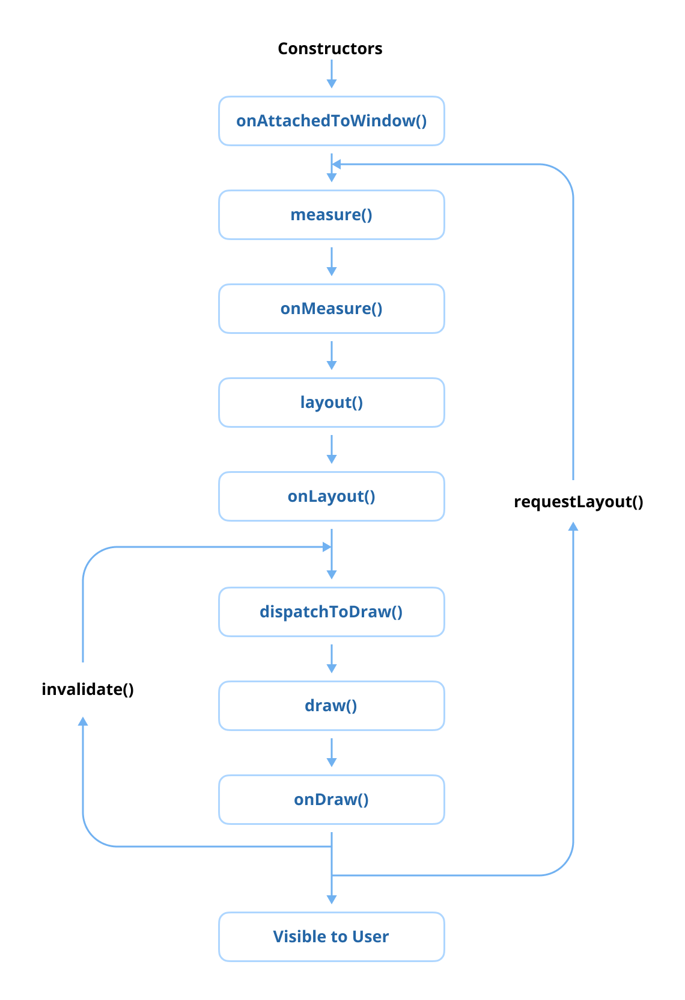

# 类别 1：Android UI — View

> 原书页码：118–184  
> 翻译状态：已完成（问题 33–48）

Android UI 是 Android 开发的核心，提供用于设计屏幕、布局、控件以及构成应用结构和交互性的各种组件。UI 系统定义了用户的第一印象，并促成有意义的用户交互；深入理解它，是创建美观且响应迅速的应用的必要条件。

如今 Jetpack Compose⁶⁴ 生态发展迅速，已广泛用于构建可投入生产的 Android UI。可以说，Jetpack Compose 代表着 Android UI 开发的未来。刚开始 Android 开发的新手无需先学习传统 View 系统，也可直接学习第 1 章“Jetpack Compose 面试题”。

不过，一些大型公司仍高度依赖 Android View 系统，因为迁移到 Jetpack Compose 具有挑战，且可能不符合短期策略。若准备这类公司的技术面试，扎实理解传统 View 系统仍然很重要。

Android View 中，所有 UI 元素默认运行在主线程，因此要构建高性能应用，必须理解 View 生命周期和常用 UI 组件。此外，理解 Window、文本单位等 Android UI 核心原理，也有助于做出正确设计决策。许多复杂设计规范还需要自定义 View；深入理解 Android UI 系统是高效开发、成为优秀 Android 开发者的重要一步。

⁶⁴ https://developer.android.com/compose

---

## 问题 33：描述 View 生命周期

Android 中的 View 生命周期是指一个 View（如 TextView 或 Button）从创建、附加到 Activity 或 Fragment、显示在屏幕上，到最终销毁或分离所经历的生命周期事件。理解 View 生命周期有助于开发者管理 View 的初始化、渲染和清理，并能根据用户操作、系统事件或资源释放时机实现自定义 View。



### View 生命周期阶段

1. **View 创建（`onAttachedToWindow`）：** 此阶段以编程方式创建 View，或通过 XML 布局填充 View。通常在此进行设置监听器、绑定数据等初始任务。当 View 被添加到父级、准备在屏幕上渲染时，会触发 `onAttachedToWindow()`。
2. **布局阶段（`onMeasure`、`onLayout`）：** 此阶段计算 View 的尺寸和位置。`onMeasure()` 根据布局参数和父级约束确定 View 的宽高；测量完成后，`onLayout()` 把 View 放置在父级中的最终位置。
3. **绘制阶段（`onDraw`）：** 尺寸和位置确定后，`onDraw()` 会在 Canvas⁶⁵ 上渲染 View 内容，例如文本或图片。自定义 View 可重写此方法定义绘制逻辑。
4. **事件处理（`onTouchEvent`、`onClick`）：** 可交互 View 在此阶段处理触摸、点击和手势等用户交互，并定义对用户输入的响应。
5. **View 分离（`onDetachedFromWindow`）：** View 从屏幕及父 ViewGroup 中移除时（例如 Activity 或 Fragment 被销毁），会调用 `onDetachedFromWindow()`。这适合清理资源或解除监听器。
6. **View 销毁：** 不再使用的 View 会被垃圾回收。开发者应确保事件监听器、后台任务等资源均被正确释放，以避免内存泄漏并优化性能。

### 小结

View 生命周期包括创建、测量、布局、绘制、事件处理和最终分离，反映了 View 在 Android 应用中显示和使用时经历的完整阶段。更多信息请参阅 [Android 官方文档](https://developer.android.com/develop/ui/views/layout/custom-views/custom-components)⁶⁶。

### 实战题

**问：** 正在创建一个需要进行昂贵初始化（例如加载图片或设置动画）的自定义 View。应在 View 生命周期的哪个阶段初始化这些资源？如何确保正确清理以避免内存泄漏？

**问：** 应用拥有复杂 UI，其中动态创建的 View 存在性能问题。如何优化 `onMeasure()` 和 `onLayout()`，在保持响应性的同时提高渲染效率？

### 精通专业提示：View 中的 `findViewTreeLifecycleOwner()` 是什么？


`findViewTreeLifecycleOwner()` 是 View 类的一项函数。它会向上遍历 View 树层级，查找并返回附加在该 View 树上的最近 `LifecycleOwner`。LifecycleOwner 表示宿主组件的生命周期范围，通常是 Activity、Fragment 或任意实现 LifecycleOwner 的自定义组件；若未找到，函数返回 `null`。

该函数对于需要与 LiveData、ViewModel 或 LifecycleObserver 等生命周期感知元素交互的自定义 View 或第三方组件特别有用。它让 View 无需显式依赖宿主 Activity 或 Fragment，便可访问关联生命周期。

使用 `findViewTreeLifecycleOwner()` 可确保：

- 生命周期感知组件正确绑定到相应生命周期。
- 生命周期结束时清除观察者，从而避免内存泄漏。

以下自定义 View 需要绑定 LifecycleObserver，因此使用该函数将观察绑定到正确生命周期：

```kotlin
class CustomView @JvmOverloads constructor(
    context: Context,
    attrs: AttributeSet? = null
) : LinearLayout(context, attrs) {

    fun bindObserver(observer: LifecycleObserver) {
        // 查找 View 树中最近的 LifecycleOwner
        val lifecycleOwner = findViewTreeLifecycleOwner()

        lifecycleOwner?.lifecycle?.addObserver(observer) ?: run {
            Log.e("CustomView", "No LifecycleOwner found for the View")
        }
    }
}
```

这里的 CustomView 会动态绑定到 View 树中最近的 LifecycleOwner，确保 LifecycleObserver 的观察绑定在适当生命周期上。

#### 主要使用场景

1. **自定义 View：** 允许自定义 View 内的生命周期感知组件观察 LifecycleObserver、LiveData，或管理资源。
2. **第三方库：** 使可复用 UI 组件可与生命周期感知资源交互，而无需显式管理生命周期。
3. **逻辑解耦：** 让 View 独立发现 View 树中的 LifecycleOwner，降低耦合。

#### 限制

该函数依赖 View 树中存在 LifecycleOwner。若不存在会返回 `null`，必须优雅处理，避免崩溃或意外行为。

### 小结

View 上的 `findViewTreeLifecycleOwner()` 是获取 View 树中最近 LifecycleOwner 的实用工具。它简化了自定义 View 或第三方库中生命周期感知组件的使用，确保正确管理生命周期并降低 View 与宿主组件之间的耦合。

⁶⁵ https://developer.android.com/reference/android/graphics/Canvas  
⁶⁶ https://developer.android.com/develop/ui/views/layout/custom-views/custom-components

---

## 问题 34：View 与 ViewGroup 有什么区别？

View 和 ViewGroup 是实现 UI 组件的基础概念。二者都属于 `android.view` 包，但在 UI 层级中用途不同。

### 什么是 View？

View 是屏幕上显示的单个矩形 UI 元素。它是 Button、TextView、ImageView 和 EditText 等所有 UI 组件的基类。每个 View 负责屏幕绘制和触摸、按键等用户交互。

```kotlin
val textView = TextView(context).apply {
    text = "Hello, World!"
    textSize = 16f
    setTextColor(Color.BLACK)
}
```


View 系统是 Android 开发的核心基础之一，是整个 UI 框架的骨架。它负责渲染、更新 UI 组件，以及管理使用户能够交互的回调系统。所有 UI 元素，从基本按钮到复杂布局，均构建在 View 类之上。

查看 AOSP 中 [View.java](https://cs.android.com/android/platform/superproject/main/+/main:frameworks/base/core/java/android/view/View.java)⁶⁷ 的内部实现会发现，它有超过 34,000 行代码。这种复杂性说明创建和管理 View 实例具有显著处理开销；不必要的 View 会影响性能、增加内存使用并减慢渲染。

为优化性能，应尽可能避免不必要的 View 实例，并减少布局树深度。过深嵌套会增加 measure、layout 和 draw pass 的耗时；保持 UI 层级浅而高效，可带来更流畅的性能、更佳响应和更低资源消耗。

### 什么是 ViewGroup？

ViewGroup 是可容纳多个 View 或其他 ViewGroup 的容器。它是 LinearLayout、RelativeLayout、ConstraintLayout 和 FrameLayout 等布局的基类。ViewGroup 管理子 View 的布局和位置，定义它们在屏幕上的测量与绘制方式。

```kotlin
val linearLayout = LinearLayout(context).apply {
    orientation = LinearLayout.VERTICAL
    addView(TextView(context).apply { text = "Child 1" })
    addView(TextView(context).apply { text = "Child 2" })
}
```


ViewGroup 继承 View，并实现 `ViewParent` 和 `ViewManager` 接口。由于它是其他 View 的容器，天然比独立 View 更复杂、资源消耗更高。ViewParent 规定作为 View 父级的类所承担的职责，包括布局测量、触摸事件处理和绘制顺序；ViewManager 则提供在 ViewGroup 层级中动态添加、移除子 View 的方法。ViewGroup 需要进行额外布局计算并管理多个子 View，因此减少不必要嵌套是优化性能和确保 UI 流畅的关键。

### View 与 ViewGroup 的关键差异

| 维度 | View | ViewGroup |
| --- | --- | --- |
| 用途 | 显示内容或与用户交互的单个 UI 元素 | 组织和管理多个子 View 的容器 |
| 层级 | UI 层级的叶节点，不能容纳其他 View | 分支节点，可容纳多个 View 或其他 ViewGroup |
| 布局行为 | 通过自身布局参数定义尺寸和位置 | 使用 LinearLayout、ConstraintLayout 等规则定义子 View 尺寸和位置 |
| 交互处理 | 处理自身触摸和按键事件 | 可通过 `onInterceptTouchEvent` 拦截、管理子元素事件 |
| 性能 | 相对简单 | 层级结构增加渲染复杂度，过度嵌套会拖慢 UI 更新 |

### 小结

View 是所有 UI 元素的基础，ViewGroup 是组织、管理多个 View 的容器。二者共同构成复杂 Android 用户界面的构建块。理解它们的角色和区别，对于优化布局并确保响应迅速的用户体验至关重要。

### 实战题

**问：** `requestLayout()`、`invalidate()` 和 `postInvalidate()` 在 View 生命周期中如何工作？何时应使用它们？

**问：** View 生命周期与 Activity 生命周期有何不同？为什么理解二者对高效 UI 渲染都很重要？

⁶⁷ https://cs.android.com/android/platform/superproject/main/+/main:frameworks/base/core/java/android/view/View.java

---

## 问题 35：是否使用过 ViewStub？如何用它优化 UI 性能？

ViewStub 是轻量、不可见的占位 View，用于延迟填充布局，直到明确需要时才创建。它常用于避免填充在应用生命周期中可能暂时不需要、甚至永远不需要的 View，从而提高性能。

### ViewStub 的关键特性

1. **轻量：** ViewStub 内存占用极小；在被填充前不占据布局空间，也不消耗资源。
2. **延迟填充：** ViewStub 指定的实际布局仅在调用 `inflate()`，或 ViewStub 变为可见时才被填充。
3. **一次性使用：** 填充后，ViewStub 会在 View 层级中被填充的布局替代，无法再次使用。

### ViewStub 的常见使用场景

1. **条件布局：** 适合按条件显示的布局，如错误消息、进度条或可选 UI 元素。
2. **缩短初始加载时间：** 延迟填充复杂或资源消耗高的 View，可改善 Activity 或 Fragment 的初始渲染时间。
3. **动态 UI 元素：** 仅在需要时向界面添加动态内容，从而优化内存使用。

### 如何使用 ViewStub

在 XML 布局中定义 ViewStub，并通过属性指定要填充的布局资源：

```xml
<LinearLayout
    xmlns:android="http://schemas.android.com/apk/res/android"
    android:layout_width="match_parent"
    android:layout_height="match_parent"
    android:orientation="vertical">

    <!-- 常规 View -->
    <TextView
        android:id="@+id/title"
        android:layout_width="wrap_content"
        android:layout_height="wrap_content"
        android:text="Main Content" />

    <!-- ViewStub 占位符 -->
    <ViewStub
        android:id="@+id/viewStub"
        android:layout_width="match_parent"
        android:layout_height="wrap_content"
        android:layout="@layout/optional_content" />
</LinearLayout>
```

```kotlin
class MainActivity : AppCompatActivity() {
    override fun onCreate(savedInstanceState: Bundle?) {
        super.onCreate(savedInstanceState)
        setContentView(R.layout.activity_main)

        val viewStub = findViewById<ViewStub>(R.id.viewStub)

        // 需要时填充布局
        val inflatedView = viewStub.inflate()

        // 访问已填充布局中的 View
        val optionalTextView = inflatedView.findViewById<TextView>(R.id.optionalText)
        optionalTextView.text = "Inflated Content"
    }
}
```

### ViewStub 的优点

1. **性能优化：** 延迟创建并非总会显示的 View，降低内存使用并改善初始渲染性能。
2. **简化布局管理：** 无需以代码手动添加、移除 View，即可管理可选 UI 元素。
3. **易于使用：** 简单 API 和 XML 集成使其成为方便的开发工具。

### ViewStub 的限制

1. **一次性：** 一旦填充，ViewStub 从 View 层级中移除，不能复用。
2. **控制有限：** 作为占位符，填充前无法处理用户交互或执行复杂操作。

### 小结

ViewStub 是通过延迟布局填充来优化性能的实用工具，尤其适合条件布局或不一定需要的 View。它可降低内存使用并提高应用响应性；正确使用能带来更高效、精简的用户体验。

### 实战题

**问：** ViewStub 被填充时会发生什么？它如何影响 View 层级的布局性能和内存使用？

---

## 问题 36：如何实现自定义 View？

当设计具有特定外观和行为、需要在多个界面复用的 UI 组件时，实现自定义 View 很重要。自定义 View 允许开发者定制视觉呈现与交互逻辑，并确保整个应用的一致性和可维护性。通过创建自定义 View，可以封装复杂 UI 逻辑、提升复用性，并简化项目不同层的结构。

当应用需要标准 UI 组件无法实现的独特设计元素时，就需要自定义 View。Android 开发中可使用 XML 创建自定义 View；基本过程如下。

### 1. 创建自定义 View 类

首先定义一个继承基础 View 类（如 View、ImageView、TextView 等）的新类。然后根据要实现的定制行为，重写必要构造函数及 `onDraw()`、`onMeasure()` 或 `onLayout()` 等方法：

```kotlin
class CustomCircleView @JvmOverloads constructor(
    context: Context,
    attrs: AttributeSet? = null,
    defStyle: Int = 0
) : View(context, attrs, defStyle) {

    override fun onDraw(canvas: Canvas) {
        super.onDraw(canvas)
        val paint = Paint().apply {
            color = Color.RED
            style = Paint.Style.FILL
        }
        // 在中心绘制红色圆形
        canvas.drawCircle(width / 2f, height / 2f, width / 4f, paint)
    }
}
```

### 2. 在 XML 布局中使用自定义 View

创建自定义 View 类后，可在 XML 布局文件中直接引用。XML 标签应使用自定义类的完整包名；也可为该 View 传递自定义属性：

```xml
<com.example.CustomCircleView
    android:layout_width="100dp"
    android:layout_height="100dp"
    android:layout_gravity="center" />
```

### 3. 添加自定义属性（可选）

在 `res/values` 目录中新建 `attrs.xml`，定义自定义属性，以便在 XML 中定制 View 的属性：

```xml
<?xml version="1.0" encoding="utf-8"?>
<resources>
    <declare-styleable name="CustomCircleView">
        <attr name="circleColor" format="color" />
        <attr name="circleRadius" format="dimension" />
    </declare-styleable>
</resources>
```

在自定义 View 构造函数中使用 `context.obtainStyledAttributes()` 获取属性：

```kotlin
class CustomCircleView @JvmOverloads constructor(
    context: Context,
    attrs: AttributeSet? = null,
    defStyle: Int = 0
) : View(context, attrs, defStyle) {

    var circleColor: Int = Color.RED
    var circleRadius: Float = 50f

    init {
        when {
            attrs != null && defStyle != 0 -> getAttrs(attrs, defStyle)
            attrs != null -> getAttrs(attrs)
        }
    }

    private fun getAttrs(attrs: AttributeSet) {
        val typedArray = context.obtainStyledAttributes(attrs, R.styleable.CustomCircleView)
        try {
            setTypeArray(typedArray)
        } finally {
            typedArray.recycle()
        }
    }

    private fun getAttrs(attrs: AttributeSet, defStyle: Int) {
        val typedArray = context.obtainStyledAttributes(
            attrs, R.styleable.CustomCircleView, defStyle, 0
        )
        try {
            setTypeArray(typedArray)
        } finally {
            typedArray.recycle()
        }
    }

    private fun setTypeArray(typedArray: TypedArray) {
        circleColor = typedArray.getColor(
            R.styleable.CustomCircleView_circleColor, Color.RED
        )
        circleRadius = typedArray.getDimension(
            R.styleable.CustomCircleView_circleRadius, 50f
        )
    }
}
```

现在可在 XML 中使用这些自定义属性：

```xml
<com.example.CustomCircleView
    android:layout_width="100dp"
    android:layout_height="100dp"
    app:circleColor="@color/blue"
    app:circleRadius="30dp" />
```

### 4. 处理布局测量（可选）

若希望控制自定义 View 如何测量尺寸，尤其是它与标准 View 行为不同时，可重写 `onMeasure()`：

```kotlin
override fun onMeasure(widthMeasureSpec: Int, heightMeasureSpec: Int) {
    val desiredSize = 200
    val width = resolveSize(desiredSize, widthMeasureSpec)
    val height = resolveSize(desiredSize, heightMeasureSpec)
    setMeasuredDimension(width, height)
}
```


自定义 View 非常适合创建针对应用需求或特定设计规范的可复用专用组件。它可以包含动画、回调、自定义属性及其他高级功能，从而提升功能和用户体验。可通过 GitHub 上多样的真实示例加深理解，例如 [ElasticViews](https://github.com/skydoves/ElasticViews)⁶⁸、[ProgressView](https://github.com/skydoves/ProgressView)⁶⁹ 和 [CircleImageView](https://github.com/hdodenhof/CircleImageView)⁷⁰。

### 小结

通过 XML 在 Android 中实现自定义 View，能带来很高的 UI 设计灵活性。利用自定义 View 系统和 Canvas⁷¹，可以创建各种自定义控件。更多细节请参考 [Android 自定义 View 文档](https://developer.android.com/guide/topics/ui/custom-components)⁷²。

### 实战题

**问：** 如何在自定义 View 中高效应用自定义属性，并确保 XML 布局的向后兼容性？

### 精通专业提示：为什么在自定义 View 主构造函数中使用 `@JvmOverloads` 时要谨慎？


Kotlin 的 `@JvmOverloads` 注解会自动为带默认参数的 Kotlin 函数或类生成多个重载方法或构造函数，从而简化与 Java 的互操作；这对 Java 原生不支持默认参数的情况很有用。

使用 `@JvmOverloads` 时，Kotlin 编译器会在字节码中生成多个方法或构造函数签名，以表示默认值参数的所有可能组合。

不过，实现自定义 View 时若不慎使用 `@JvmOverloads`，可能意外覆盖默认 View 样式，导致自定义 View 丢失预期样式。扩展 Button、TextView 等带预定义样式的 Android View 时，此问题尤为明显。

例如，定义自定义 `TextInputEditText` 时可能会这样写：

```kotlin
class ElasticTextInputEditText @JvmOverloads constructor(
    context: Context,
    attrs: AttributeSet? = null,
    defStyle: Int = 0
) : TextInputEditText(context, attrs, defStyle) {
    ..
}
```

将 `ElasticTextInputEditText` 当作普通 TextInputEditText 使用时，可能出现意外行为或功能损坏。原因是如上所示，`defStyle` 被覆写为 `0`，使自定义 View 丢失其应有样式。

从 XML 填充 View 时，会调用双参数构造函数（Context 与 AttributeSet），它又会调用三参数构造函数：

```java
public ElasticTextInputEditText(Context context, @Nullable AttributeSet attrs) {
    this(context, attrs, 0);
}
```

在自定义实现中，第三个参数 `defStyleAttr` 通常默认设为 `0`。但 Android 文档⁷³ 对此三参数构造函数的说明是：从 XML 填充时，可从主题属性应用类专属基础样式。例如 Button 的构造函数会传入 `R.attr.buttonStyle` 作为 `defStyleAttr`，让主题的 buttonStyle 能修改基础 View 属性（特别是背景）以及 Button 自身属性。

若没有提供合适的 `defStyleAttr`（例如为 ElasticTextInputEditText 提供 `R.attr.editTextStyle`），自定义 View 可能在 XML 填充时丢失继承的样式配置，导致样式不一致或行为异常。

查看 TextInputEditText 内部实现可发现，它会在内部将 `R.attr.editTextStyle` 作为 `defStyleAttr`：

```java
public class TextInputEditText extends AppCompatEditText {
    public TextInputEditText(@NonNull Context context) {
        this(context, null);
    }

    public TextInputEditText(@NonNull Context context, @Nullable AttributeSet attrs) {
        this(context, attrs, R.attr.editTextStyle);
    }

    public TextInputEditText(
        @NonNull Context context, @Nullable AttributeSet attrs, int defStyleAttr
    ) { .. }
}
```

为解决问题并确保正确样式，应在自定义 View 构造函数中把 `R.attr.editTextStyle` 设为 `defStyleAttr` 默认值：

```kotlin
class ElasticTextInputEditText @JvmOverloads constructor(
    context: Context,
    attrs: AttributeSet? = null,
    defStyleAttr: Int = androidx.appcompat.R.attr.editTextStyle
) : TextInputEditText(context, attrs, defStyleAttr) {
    // 自定义实现
}
```

显式指定 `androidx.appcompat.R.attr.editTextStyle` 为默认值后，可确保自定义 View 在 XML 填充期间继承预期基础样式，并保持与原始 TextInputEditText 一致的行为。

⁶⁸ https://github.com/skydoves/ElasticViews  
⁶⁹ https://github.com/skydoves/ProgressView  
⁷⁰ https://github.com/hdodenhof/CircleImageView  
⁷¹ https://developer.android.com/reference/android/graphics/Canvas  
⁷² https://developer.android.com/guide/topics/ui/custom-components  
⁷³ https://developer.android.com/reference/android/view/View#View(android.content.Context,%20android.util.AttributeSet,%20int)

---

## 问题 37：什么是 Canvas？如何使用它？

Canvas 是自定义绘制的关键组件，提供直接在屏幕或 Bitmap 等绘制表面上渲染图形的接口。Canvas 常用于创建自定义 View、动画和视觉效果，让开发者完全控制绘制过程。

### Canvas 的工作方式

Canvas 类表示二维绘制表面，可在其上绘制形状、文本、图片和其他内容。它与 `Paint` 类密切协作；Paint 定义绘制内容的颜色、样式和笔触宽度等外观。重写自定义 View 的 `onDraw()` 时，会传入 Canvas 对象，以定义需要绘制的内容。

```kotlin
class CustomView(context: Context) : View(context) {
    private val paint = Paint().apply {
        color = Color.BLUE
        style = Paint.Style.FILL
    }

    override fun onDraw(canvas: Canvas) {
        super.onDraw(canvas)
        canvas.drawCircle(width / 2f, height / 2f, 100f, paint)
    }
}
```

该示例中，`onDraw()` 使用 Canvas 在自定义 View 中心绘制蓝色圆形。

### Canvas 的常用操作

- **形状：** 使用 `drawCircle()`、`drawRect()`、`drawLine()` 等绘制圆形、矩形和线条。
- **文本：** `drawText()` 按指定坐标和样式渲染文本。
- **图片：** 使用 `drawBitmap()` 渲染图片。
- **自定义路径：** 将 Path 对象与 `drawPath()` 结合，绘制复杂形状。

### 变换

Canvas 支持缩放、旋转和平移等变换。这些操作会修改 Canvas 坐标系，从而易于绘制复杂场景：

- **平移：** `canvas.translate(dx, dy)` 将 Canvas 原点移动到新位置。
- **缩放：** `canvas.scale(sx, sy)` 按比例缩放绘制内容。
- **旋转：** `canvas.rotate(degrees)` 按指定角度旋转 Canvas。

这些变换具有累积性，会影响之后所有绘制操作。

### 使用场景

1. **自定义 View：** 绘制标准控件无法实现的独特 UI 组件。
2. **游戏：** 精确控制游戏图形渲染。
3. **图表和图解：** 用定制格式可视化数据。
4. **图像处理：** 以编程方式修改或组合图片。

### 小结

Canvas 为在屏幕上渲染自定义图形提供灵活、实用的方式。通过绘制形状、文本和图片的方法及各种变换，开发者可创建丰富的视觉体验。它广泛用于需要高级图形能力的自定义 View。

### 实战题

**问：** 如何创建一个用于渲染 AndroidX 库不支持的复杂形状或 UI 元素的自定义 View？会使用哪些 Canvas 方法和 API？

---

## 问题 38：View 系统中的失效重绘（Invalidation）是什么？

失效重绘是将 View 标记为“需要重新绘制”的过程，是 Android View 系统在 UI 发生变化时更新界面的基础机制。View 失效后，系统会在下一个绘制周期刷新屏幕的相应区域。

### 失效重绘如何工作

在 View 上调用 `invalidate()` 或 `postInvalidate()` 等方法，会触发失效流程。系统将 View 标为“dirty”，表示需要重新绘制；下一帧绘制时，系统会将该 View 纳入绘制过程，更新视觉呈现。

例如，当 View 的位置、尺寸或外观等属性改变时，失效重绘可确保用户看到更新后的状态。

### 失效重绘的关键方法

1. **`invalidate()`：** 用于使单个 View 失效。它将 View 标记为 dirty，通知系统在下一次布局/绘制阶段重绘；不会立即重绘，而是安排到下一帧。
2. **`invalidate(Rect dirty)`：** `invalidate()` 的重载版本，可指定需要重绘的 View 内矩形区域。通过仅重绘较小区域来优化性能。
3. **`postInvalidate()`：** 用于从非 UI 线程使 View 失效。它把失效请求投递到主线程，确保线程安全。

### 使用 invalidate() 更新自定义 View

```kotlin
class CustomView(context: Context) : View(context) {
    private var circleRadius = 50f

    override fun onDraw(canvas: Canvas) {
        super.onDraw(canvas)
        // 使用当前半径绘制圆形
        canvas.drawCircle(
            width / 2f,
            height / 2f,
            circleRadius,
            Paint().apply { color = Color.RED }
        )
    }

    fun increaseRadius() {
        circleRadius += 20f
        invalidate() // 标记 View 需要重新绘制
    }
}
```

### 失效重绘的最佳实践

- 当只有 View 特定区域需要重绘时，使用 `invalidate(Rect dirty)`，避免重绘未变化区域。
- 避免频繁或不必要地调用 `invalidate()`，特别是在动画或复杂布局中，以防止性能瓶颈。
- 从后台线程发起失效请求时使用 `postInvalidate()`，确保安全地在主线程更新。

### 小结

失效重绘是 Android 渲染管线中的关键概念，确保 UI 更新可视觉化地反映出来。开发者使用 `invalidate()`、`postInvalidate()` 等方法，可以高效刷新 View，同时保持流畅性能。正确使用可减少不必要重绘，构建经过优化、响应迅速的应用。

### 实战题

**问：** `invalidate()` 如何工作？与 `postInvalidate()` 有什么区别？请分别给出适用的真实场景。

**问：** 若要从后台线程更新 UI 元素，如何确保重绘操作安全地在主线程执行？

---

## 问题 39：什么是 ConstraintLayout？

ConstraintLayout⁷⁴ 是 Android 中用于创建复杂、响应式用户界面的灵活强大布局。它可通过相对于其他 View 或父容器的约束定义 View 的位置和尺寸，无需嵌套多个布局，从而避免过深的 View 层级并提高性能与可读性。

### ConstraintLayout 的关键特性

1. **基于约束定位：** 可相对兄弟 View 或父布局定位，以实现对齐、居中和锚定。
2. **灵活的尺寸控制：** 提供 `match_constraint`、`wrap_content` 和固定尺寸等选项，便于设计响应式布局。
3. **Chain 和 Guideline 支持：** Chain 可将 View 水平或垂直分组并均匀间隔；Guideline 支持按固定位置或百分比对齐。
4. **Barrier 与分组：** Barrier 会按被引用 View 的尺寸动态调整；Group 可简化多个 View 的可见性变更。
5. **性能提升：** 减少多层嵌套布局需求，加快布局渲染并改善应用性能。

### ConstraintLayout 示例

下列布局包含 TextView 和 Button：Button 位于 TextView 下方并水平居中。

```xml
<androidx.constraintlayout.widget.ConstraintLayout
    xmlns:android="http://schemas.android.com/apk/res/android"
    android:layout_width="match_parent"
    android:layout_height="match_parent">

    <TextView
        android:id="@+id/title"
        android:layout_width="wrap_content"
        android:layout_height="wrap_content"
        android:text="Hello, World!"
        android:layout_marginTop="16dp"
        app:layout_constraintTop_toTopOf="parent"
        app:layout_constraintStart_toStartOf="parent"
        app:layout_constraintEnd_toEndOf="parent" />

    <Button
        android:id="@+id/button"
        android:layout_width="wrap_content"
        android:layout_height="wrap_content"
        android:text="Click Me"
        app:layout_constraintTop_toBottomOf="@id/title"
        app:layout_constraintStart_toStartOf="parent"
        app:layout_constraintEnd_toEndOf="parent" />
</androidx.constraintlayout.widget.ConstraintLayout>
```

### ConstraintLayout 的优点

1. **扁平 View 层级：** 相比嵌套 LinearLayout 或 RelativeLayout，ConstraintLayout 支持扁平层级，可改善渲染性能并简化布局管理。
2. **响应式设计：** 通过百分比约束和 Barrier 等工具适配不同屏幕尺寸与方向。
3. **内置工具：** Android Studio 的 Layout Editor 支持 ConstraintLayout 可视化设计，可方便创建和调整约束。
4. **高级功能：** Chain、Guideline、Barrier 可在不增加代码或嵌套布局的情况下简化复杂 UI 设计。

### ConstraintLayout 的限制

1. **简单布局中偏复杂：** 对于 LinearLayout 或 FrameLayout 即可满足的简单布局，可能显得过度设计。
2. **学习曲线：** 需要理解约束和高级特性，对新手可能有挑战。

### 使用场景

1. **响应式 UI：** 需要精确对齐、并适应不同屏幕尺寸的设计。
2. **复杂布局：** 有多个重叠元素或复杂定位要求的 UI。
3. **性能优化：** 用单一扁平结构替换嵌套 View 层级以优化布局。

### 小结

ConstraintLayout 是设计 Android UI 的高效、通用布局。它消除了嵌套布局需求，提供高级定位和对齐工具，并改善性能。虽然存在学习曲线，掌握它可高效创建响应式且美观的布局。

### 实战题

**问：** ConstraintLayout 与嵌套 LinearLayout、RelativeLayout 相比如何改善性能？请给出更适合 ConstraintLayout 的场景。

**问：** ConstraintLayout 中 `match_constraint`（`0dp`）如何工作？与 `wrap_content`、`match_parent` 有何不同？在什么场景使用？

⁷⁴ https://developer.android.com/reference/android/support/constraint/ConstraintLayout#developer-guide

---

## 问题 40：何时应使用 SurfaceView 而不是 TextureView？

SurfaceView 是提供专用绘制表面的特殊 View，适用于在独立线程处理渲染的场景。它常用于视频播放、自定义图形渲染或游戏等性能关键任务。SurfaceView 的主要特性是会在主 UI 线程之外创建独立 Surface，因此可高效渲染而不阻塞其他 UI 操作。

Surface 通过 `SurfaceHolder` 回调方法创建和管理，可在适当时机启动、停止渲染。例如，可使用 SurfaceView 通过底层 API 播放视频，或在游戏循环中持续绘制图形。

```kotlin
class CustomSurfaceView(context: Context) : SurfaceView(context), SurfaceHolder.Callback {
    init {
        holder.addCallback(this)
    }

    override fun surfaceCreated(holder: SurfaceHolder) {
        // 在这里启动渲染或绘制
    }

    override fun surfaceChanged(holder: SurfaceHolder, format: Int, width: Int, height: Int) {
        // 处理 Surface 变化
    }

    override fun surfaceDestroyed(holder: SurfaceHolder) {
        // 在这里停止渲染或释放资源
    }
}
```

SurfaceView 对连续渲染很高效，但在缩放、旋转等变换上有所限制。因此，它适合高性能使用场景，却不太适合动态 UI 交互。

另一方面，TextureView 也可在离屏渲染内容，但不同于 SurfaceView，它可无缝集成到 UI 层级中。因此，TextureView 能够变换或制作动画，支持旋转、缩放与 Alpha 混合等特性，常用于显示实时相机预览或以自定义变换渲染视频。

TextureView 运行在主线程。虽然这让它在连续渲染任务上略低效，却也使它能更好地与其他 UI 组件集成，并支持实时变换。

```kotlin
class CustomTextureView(context: Context) : TextureView(context), TextureView.SurfaceTextureListener {
    init {
        surfaceTextureListener = this
    }

    override fun onSurfaceTextureAvailable(surface: SurfaceTexture, width: Int, height: Int) {
        // 启动渲染或使用 SurfaceTexture
    }

    override fun onSurfaceTextureSizeChanged(surface: SurfaceTexture, width: Int, height: Int) {
        // 处理 Surface 尺寸变化
    }

    override fun onSurfaceTextureDestroyed(surface: SurfaceTexture): Boolean {
        // 释放资源或停止渲染
        return true
    }

    override fun onSurfaceTextureUpdated(surface: SurfaceTexture) {
        // 处理 SurfaceTexture 更新
    }
}
```

TextureView 特别适合需要视觉变换的场景，例如给视频流加动画，或在 UI 中动态混合内容。

### SurfaceView 与 TextureView 的区别

二者的核心区别在于处理渲染和集成 UI 的方式：

- **SurfaceView：** 在独立线程运行，适合视频播放、游戏等持续渲染任务；它也会创建独立窗口，确保性能，但限制了变换和动画能力。
- **TextureView：** 与其他 UI 组件共享同一窗口，因此支持缩放、旋转和动画，适合 UI 相关场景；但它在主线程运行，不如 SurfaceView 适合高频渲染。

### 小结

SurfaceView 最适合性能优先的场景，例如游戏或持续视频渲染。TextureView 更适合需要无缝集成 UI 和视觉变换的场景，例如视频动画或实时相机预览。选择取决于应用更优先考虑渲染性能还是 UI 灵活性。

### 实战题

**问：** 如何正确管理 SurfaceView 生命周期以高效管理资源并避免内存泄漏？

**问：** 若要显示可旋转、缩放的实时相机预览，应在 SurfaceView 与 TextureView 中选择哪个？请结合实现考虑说明原因。

---

## 问题 41：RecyclerView 内部如何工作？

RecyclerView 是用于高效显示大型数据集的灵活 Android 组件。它通过复用条目 View，而不是反复填充新 View，来实现效率；这种类似对象池的 View 管理机制称为 ViewHolder 模式。

### RecyclerView 内部机制的核心概念

1. **复用 View：** RecyclerView 不会为数据集的每个条目创建新 View。当 View 滚出可见区域时，不会被销毁，而是加入 View 池（`RecyclerView.RecycledViewPool`）；新条目进入视野时，若池中存在可用 View，RecyclerView 会取出并复用，避免填充开销。
2. **ViewHolder 模式：** RecyclerView 用 ViewHolder 保存条目布局内 View 的引用，避免绑定时反复调用 `findViewById()`，从而减少布局遍历和 View 查找、提高性能。
3. **Adapter 的作用：** `RecyclerView.Adapter` 是数据源与 RecyclerView 的桥梁。Adapter 的 `onBindViewHolder()` 会在复用时把数据绑定到 View，确保只更新可见条目。
4. **RecycledViewPool：** RecycledViewPool 是存放未使用 View 的对象池。它可让 RecyclerView 在具有相似 View 类型的多个列表或区域之间复用 View，进一步优化内存使用。

### 复用机制如何工作

1. **滚动与条目可见性：** 用户滚动时，离开视野的条目会从 RecyclerView 分离，但不会销毁；而是加入 RecycledViewPool。
2. **为复用 View 重新绑定数据：** 新条目进入视野时，RecyclerView 先在 RecycledViewPool 中查找所需类型的可用 View。若找到，就通过 `onBindViewHolder()` 重新绑定新数据。
3. **无可用 View 时填充：** 池中没有合适 View 时，RecyclerView 使用 `onCreateViewHolder()` 填充新的 View。
4. **高效内存使用：** 复用 View 可减少内存分配和垃圾回收，避免在大数据集或频繁滚动时出现性能问题。

基本 RecyclerView Adapter 示例：

```kotlin
class MyAdapter(private val dataList: List<String>) :
    RecyclerView.Adapter<MyAdapter.MyViewHolder>() {

    class MyViewHolder(itemView: View) : RecyclerView.ViewHolder(itemView) {
        val textView: TextView = itemView.findViewById(R.id.textView)
    }

    override fun onCreateViewHolder(parent: ViewGroup, viewType: Int): MyViewHolder {
        val view = LayoutInflater.from(parent.context)
            .inflate(R.layout.item_layout, parent, false)
        return MyViewHolder(view)
    }

    override fun onBindViewHolder(holder: MyViewHolder, position: Int) {
        holder.textView.text = dataList[position]
    }

    override fun getItemCount(): Int = dataList.size
}
```

### 对象池方式的优势

1. **性能改善：** 复用 View 减少填充新布局的开销，带来更流畅的滚动和更好性能。
2. **高效内存管理：** 对象池通过复用 View 减少内存分配，避免频繁垃圾回收。
3. **可定制性：** 可定制 RecycledViewPool，管理每种类型 View 的最大数量，以优化特定场景行为。

### 小结

RecyclerView 使用高效对象池机制，将未使用 View 保存到 RecycledViewPool 中并在需要时复用。该设计配合 ViewHolder 模式，可减少内存使用和布局填充开销，提升性能，是 Android 中显示大型数据集的重要工具。

### 实战题

**问：** RecyclerView 的 ViewHolder 模式与 ListView 相比如何提升性能？

**问：** 请说明 RecyclerView 中 ViewHolder 从创建到复用的生命周期。

**问：** 什么是 RecycledViewPool？如何用它优化条目 View 渲染？

### 精通专业提示：如何在同一个 RecyclerView 中实现不同类型的条目？


RecyclerView 支持在同一列表中展示多种条目类型。实现时结合自定义 Adapter、条目 View 类型和相应布局；关键是区分不同类型并正确绑定。

#### 实现多条目类型的步骤

1. **定义条目类型：** 为每种类型定义唯一标识，通常是整数常量，让 Adapter 在创建和绑定 View 时区分类型。
2. **重写 `getItemViewType()`：** 在 Adapter 中为数据集的每个条目返回相应类型，帮助 RecyclerView 确定应填充何种布局。
3. **处理多个 ViewHolder：** 为每种条目类型创建独立 ViewHolder 类，各自负责将数据绑定到对应布局。
4. **按类型填充布局：** 在 `onCreateViewHolder()` 中，根据 `getItemViewType()` 返回的类型填充适当布局。
5. **按类型绑定数据：** 在 `onBindViewHolder()` 中检查条目类型，并用相应 ViewHolder 绑定数据。

```kotlin
class MultiTypeAdapter(private val items: List<ListItem>) :
    RecyclerView.Adapter<RecyclerView.ViewHolder>() {

    companion object {
        const val TYPE_HEADER = 0
        const val TYPE_CONTENT = 1
    }

    override fun getItemViewType(position: Int): Int = when (items[position]) {
        is ListItem.Header -> TYPE_HEADER
        is ListItem.Content -> TYPE_CONTENT
    }

    override fun onCreateViewHolder(parent: ViewGroup, viewType: Int): RecyclerView.ViewHolder {
        return when (viewType) {
            TYPE_HEADER -> HeaderViewHolder(
                LayoutInflater.from(parent.context).inflate(R.layout.item_header, parent, false)
            )
            TYPE_CONTENT -> ContentViewHolder(
                LayoutInflater.from(parent.context).inflate(R.layout.item_content, parent, false)
            )
            else -> throw IllegalArgumentException("Invalid view type")
        }
    }

    override fun onBindViewHolder(holder: RecyclerView.ViewHolder, position: Int) {
        when (holder) {
            is HeaderViewHolder -> holder.bind(items[position] as ListItem.Header)
            is ContentViewHolder -> holder.bind(items[position] as ListItem.Content)
        }
    }

    override fun getItemCount(): Int = items.size

    class HeaderViewHolder(itemView: View) : RecyclerView.ViewHolder(itemView) {
        private val title: TextView = itemView.findViewById(R.id.headerTitle)
        fun bind(item: ListItem.Header) { title.text = item.title }
    }

    class ContentViewHolder(itemView: View) : RecyclerView.ViewHolder(itemView) {
        private val content: TextView = itemView.findViewById(R.id.contentText)
        fun bind(item: ListItem.Content) { content.text = item.text }
    }
}

sealed class ListItem {
    data class Header(val title: String) : ListItem()
    data class Content(val text: String) : ListItem()
}
```

#### 要点

1. **效率：** RecyclerView 会复用 ViewHolder；通过 `getItemViewType()` 和正确绑定管理多类型条目，不会牺牲性能。
2. **清晰分离：** 每种条目类型拥有自身布局和 ViewHolder，确保职责分离、代码更清晰。
3. **可扩展性：** 新增类型只需定义新布局、ViewHolder，并调整 `getItemViewType()` 和 `onCreateViewHolder()` 逻辑。

### 小结

要在 RecyclerView 中实现多条目类型，应使用 `getItemViewType()` 判断每个条目类型、用独立 ViewHolder 绑定、并为每种类型定义独立布局。该方式使 RecyclerView 在支持多样内容的同时保持高效和可扩展。

### 精通专业提示：如何提升 RecyclerView 性能？


可使用 `ListAdapter`⁷⁵ 与 `DiffUtil`⁷⁶ 提升 RecyclerView 性能。DiffUtil 会计算两份列表之间的差异，并高效更新 RecyclerView Adapter。这样可避免不必要地调用 `notifyDataSetChanged()`；后者会低效地重新渲染列表所有条目。DiffUtil 会在细粒度识别变化，只更新受影响条目。

RecyclerView 的默认行为是在数据变化时重新绑定、重绘所有可见条目，即使大部分条目未改变；大型数据集上会损害性能。DiffUtil 计算最小更新集合（插入、删除、修改）并直接应用到 Adapter，从而优化此行为。

#### 使用 DiffUtil 的步骤

1. **创建 DiffUtil 回调：** 实现自定义 `DiffUtil.ItemCallback` 或继承 `DiffUtil.Callback`，定义如何计算旧列表与新列表的差异。
2. **向 Adapter 提供列表更新：** 收到新数据时传给 Adapter，使用 DiffUtil 计算差异；使用 ListAdapter 时调用 `submitList()`，自定义 Adapter 时可调用 `notifyItemChanged()` 等方法。
3. **将 DiffUtil 与 RecyclerView Adapter 绑定：** 集成 DiffUtil，让 Adapter 自动处理更新。

```kotlin
class MyDiffUtilCallback : DiffUtil.ItemCallback<MyItem>() {
    override fun areItemsTheSame(oldItem: MyItem, newItem: MyItem): Boolean {
        // 检查是否代表同一条数据，例如 ID 是否相同
        return oldItem.id == newItem.id
    }

    override fun areContentsTheSame(oldItem: MyItem, newItem: MyItem): Boolean {
        // 检查条目内容是否相同
        return oldItem == newItem
    }
}

class MyAdapter : ListAdapter<MyItem, MyViewHolder>(MyDiffUtilCallback()) {
    override fun onCreateViewHolder(parent: ViewGroup, viewType: Int): MyViewHolder {
        val view = LayoutInflater.from(parent.context)
            .inflate(R.layout.item_layout, parent, false)
        return MyViewHolder(view)
    }

    override fun onBindViewHolder(holder: MyViewHolder, position: Int) {
        holder.bind(getItem(position))
    }
}

class MyViewHolder(itemView: View) : RecyclerView.ViewHolder(itemView) {
    private val textView: TextView = itemView.findViewById(R.id.textView)
    fun bind(item: MyItem) { textView.text = item.name }
}
```

```kotlin
val adapter = MyAdapter()
recyclerView.adapter = adapter

val oldList = listOf(MyItem(1, "Old Item"), MyItem(2, "Another Item"))
val newList = listOf(MyItem(1, "Updated Item"), MyItem(3, "New Item"))

// 自动计算差异并更新 RecyclerView
adapter.submitList(newList)
```

#### DiffUtil 的主要优点

1. **性能提升：** 仅更新变更条目，而不是刷新整个列表，减少渲染开销。
2. **细粒度更新：** 分别处理条目插入、删除和修改，使动画更流畅自然。
3. **与 ListAdapter 无缝集成：** ListAdapter 是 Jetpack 提供的现成 Adapter，直接集成 DiffUtil，可减少样板代码。

#### 注意事项

1. **大型列表的开销：** 虽然 DiffUtil 高效，但为超大列表计算差异仍可能消耗较多计算资源，应谨慎使用。
2. **不可变数据：** 确保数据模型不可变；可变数据会使 DiffUtil 计算差异时产生不一致。

### 小结

在 RecyclerView 中使用 DiffUtil，可只应用必要更新而非重新渲染整个列表，从而提升性能。结合 `DiffUtil.ItemCallback` 与 `ListAdapter`，可高效管理更新、创建更流畅的动画，并提高 UI 整体响应性；这对于数据频繁变化或列表较大的应用尤其有价值。

⁷⁵ https://developer.android.com/reference/androidx/recyclerview/widget/ListAdapter  
⁷⁶ https://developer.android.com/reference/androidx/recyclerview/widget/DiffUtil

---

## 问题 42：Dp 和 Sp 有什么区别？

设计 Android 用户界面时，需要考虑 UI 组件如何适应不同屏幕尺寸和分辨率。Dp（Density-independent Pixels，密度无关像素）和 Sp（Scale-independent Pixels，缩放无关像素）是实现这一目标的两个重要单位。二者都有助于跨设备保持一致性，但用途不同。

### 什么是 Dp？

Dp 是用于 padding、margin、宽度等 UI 元素的测量单位。它旨在使 UI 组件在不同屏幕密度的设备上保持一致的物理尺寸。160 DPI 屏幕上 1dp 等于 1 个物理像素，Android 会自动按设备密度缩放 dp。

例如，将 Button 宽度设为 `100dp` 后，它在低密度与高密度屏幕上看起来大小大致相同，只是渲染所需像素数量不同。

### 什么是 Sp？

Sp 专用于文本大小。它与 Dp 类似，但还会考虑用户设置的字体大小偏好。因此，Sp 会根据屏幕密度及设备无障碍设置缩放文本，非常适合确保文本可读、可访问。

例如，将 TextView 设为 `16sp`，会根据屏幕密度缩放；用户增大系统字体后，它也会相应调整。

### Dp 与 Sp 的关键区别

1. **用途：** Dp 用于尺寸，例如按钮大小和 padding；Sp 用于文本大小。
2. **无障碍性：** Sp 尊重用户定义的字体大小偏好，Dp 不会。
3. **一致性：** 二者都会随屏幕密度缩放，但 Sp 确保文本对所有用户保持可访问、可读。

### 何时使用 Dp 或 Sp

- 使用 **Dp** 表示 View 尺寸、margin、padding 等 UI 组件尺寸，以保持跨设备布局一致。
- 使用 **Sp** 表示文本，以尊重无障碍字体偏好，同时保持视觉一致性。

### 小结

Dp 使 UI 组件的物理尺寸在跨设备时保持一致；Sp 则使文本尺寸适配屏幕密度和用户偏好。区分二者对创建美观且无障碍的 Android 应用至关重要。

### 精通专业提示：使用 Sp 时如何处理布局被撑坏？


Sp 对文本无障碍很关键，因为它会按屏幕密度和用户字体偏好缩放。但用户设置极大字体时，可能造成 UI 组件重叠或溢出屏幕等布局撑坏问题。妥善处理这些场景，才能维持友好体验。

#### 防止布局撑坏的策略

1. **正确使用 `wrap_content`：** 确保 TextView、Button 等文本组件的尺寸设为 `wrap_content`，让容器按文本大小动态扩展，避免文本截断或溢出。

   ```xml
   <TextView
       android:layout_width="wrap_content"
       android:layout_height="wrap_content"
       android:textSize="16sp"
       android:text="Sample Text" />
   ```

2. **使用 TextView 的 `minLines` 或 `maxLines`：** 用它们控制文本扩展，同时配合 `ellipsize` 优雅处理溢出。

   ```xml
   <TextView
       android:layout_width="match_parent"
       android:layout_height="wrap_content"
       android:textSize="16sp"
       android:maxLines="2"
       android:ellipsize="end"
       android:text="This is a long sample text that might break the layout if not handled properly." />
   ```

3. **为关键 UI 组件使用固定尺寸：** 对需要稳定尺寸的按钮等关键组件可使用 Dp，使组件大小不随字体缩放变化；在这些组件内部谨慎使用 Sp 文本以降低布局破坏。

   ```xml
   <Button
       android:layout_width="100dp"
       android:layout_height="50dp"
       android:textSize="14sp"
       android:text="Button" />
   ```

4. **在极大字体下测试：** 始终使用设备设置可选的最大系统字体测试应用，识别破坏或重叠的 UI 组件，并改进布局以优雅适配大文本。

5. **结合 ConstraintLayout 动态布局：** 使用 ConstraintLayout 增加组件定位、尺寸的灵活性；为文本元素定义约束，即使文字缩放也避免与其他 UI 重叠。

   ```xml
   <ConstraintLayout
       android:layout_width="match_parent"
       android:layout_height="wrap_content">

       <TextView
           android:id="@+id/sampleText"
           android:layout_width="0dp"
           android:layout_height="wrap_content"
           android:textSize="16sp"
           app:layout_constraintStart_toStartOf="parent"
           app:layout_constraintEnd_toEndOf="parent"
           app:layout_constraintTop_toTopOf="parent"
           android:text="Dynamic Layout Example" />
   </ConstraintLayout>
   ```

6. **使用 Dp 而非 Sp：** 这取决于团队策略。有些公司为避免用户调整字体造成布局问题而对文本使用 Dp；但这会损害用户体验，因为 Sp 专为无障碍设计，确保文本随用户偏好变化而保持可读。

### 小结

处理 Sp 导致的布局撑坏，应结合 `wrap_content`、约束和文本扩展限制等实践。使用极端字体大小测试并动态管理布局，可确保应用既保持视觉一致，又对所有用户无障碍。

### 实战题

**问：** 使用 Sp 表示文字大小时，可能出现哪些布局破坏问题？如何防止？

---

## 问题 43：九宫格（Nine-Patch）图片有什么用途？

Nine-Patch 图片是经过特殊格式化的 PNG 图像，可在不损失视觉质量的前提下拉伸或缩放，是创建灵活、可适配 Android UI 组件的重要工具。它主要用于按钮、背景和容器等需要根据不同屏幕尺寸、内容尺寸动态调整大小的元素。

### Nine-Patch 图片的关键特性

1. **可拉伸区域：** Nine-Patch 图片可定义可拉伸区域，同时保持其他部分不变。这通过图片最外层 1 像素边框中的黑色引导线实现。
2. **内容区域定义：** 黑色引导线还可指定图片内部内容区域，确保文字或其他 UI 元素在 Drawable 内正确对齐。
3. **动态调整大小：** 可按比例调整，确保 UI 元素在不同屏幕尺寸设备上仍保持精致外观。

### XML 中的使用示例

下列代码将 Nine-Patch 图片作为 Button 的背景：

```xml
<Button
    android:layout_width="wrap_content"
    android:layout_height="wrap_content"
    android:background="@drawable/button_background.9"
    android:text="Click Me" />
```

### Nine-Patch 图片的限制

1. **手动创建：** 需要仔细创建和测试，以确保缩放和对齐正确。
2. **适用场景有限：** 最适合矩形或方形元素，对复杂或不规则形状效果较差。

### 小结

Nine-Patch 图片是创建可缩放、视觉一致 UI 组件的灵活高效方案。通过定义可拉伸区域和内容区域，它能让按钮、背景等元素无缝适配不同屏幕尺寸和动态内容，同时保持精致外观。

### 实战题

**问：** Nine-Patch 图片与普通 PNG 图片有何区别？应在什么场景使用 Nine-Patch 图片？

---

## 问题 44：什么是 Drawable？它如何用于 UI 开发？

Drawable 是可在屏幕上绘制的任何内容的通用抽象。它是图片、矢量图形和基于形状元素等各类图形内容的基类。Drawable 广泛用于背景、按钮、图标和自定义 View 等 UI 组件。

Android 提供多种 Drawable 对象，每种适合不同场景。

### 1. BitmapDrawable（位图）

BitmapDrawable 用于显示 PNG、JPG、GIF 等位图图片，支持缩放、平铺和过滤。

```xml
<bitmap xmlns:android="http://schemas.android.com/apk/res/android"
    android:src="@drawable/sample_image"
    android:tileMode="repeat" />
```

它常用于 ImageView 中显示图片或作为背景。

### 2. VectorDrawable（可缩放矢量图形）

VectorDrawable 使用 XML 路径表示类似 SVG 的可缩放矢量图。与位图不同，矢量图在任意分辨率下都能保持质量。

```xml
<vector xmlns:android="http://schemas.android.com/apk/res/android"
    android:width="24dp"
    android:height="24dp"
    android:viewportWidth="24"
    android:viewportHeight="24">
    <path
        android:fillColor="#FF0000"
        android:pathData="M12,2L15,8H9L12,2Z" />
</vector>
```

它适合图标、Logo 及可缩放 UI 元素，可避免不同屏幕密度下的像素化问题。

### 3. NinePatchDrawable（带内边距的可缩放图片）

NinePatchDrawable 是一种特殊 Bitmap，可在保留特定区域（如圆角或内边距）的同时调整大小。适合聊天气泡和按钮等可拉伸 UI 组件。Nine-Patch 图片（`.9.png`）含有额外的 1 像素边框，用于定义可拉伸与固定区域。

```xml
<nine-patch xmlns:android="http://schemas.android.com/apk/res/android"
    android:src="@drawable/chat_bubble.9.png" />
```

可使用 Android Studio 的 NinePatch 工具创建 `.9.png` 并定义拉伸区域。

### 4. ShapeDrawable（自定义形状）

ShapeDrawable 使用 XML 定义，无需图片即可创建圆角矩形、椭圆等简单形状。

```xml
<shape xmlns:android="http://schemas.android.com/apk/res/android"
    android:shape="rectangle">
    <solid android:color="#FF5733" />
    <corners android:radius="8dp" />
</shape>
```

它适用于按钮、背景和自定义 UI 组件。

### 5. LayerDrawable（多 Drawable 叠加）

LayerDrawable 用于将多个 Drawable 组合为一个分层结构，适合复杂 UI 背景。

```xml
<layer-list xmlns:android="http://schemas.android.com/apk/res/android">
    <item>
        <shape android:shape="rectangle">
            <solid android:color="#000000" />
        </shape>
    </item>
    <item android:drawable="@drawable/icon" android:top="10dp" />
</layer-list>
```

它适合创建叠加效果和层叠视觉效果。

### 小结

Drawable 类为处理 Android 中不同类型图形提供灵活方式。应根据设计需求、可缩放性和 UI 复杂度选择合适的 Drawable 类型；充分利用各种 Drawable，可创建经过优化且视觉吸引力强的 UI 组件。

### 实战题

**问：** 如何仅使用 Drawable 创建一个会随用户交互改变形状和颜色的动态背景 Button？

---

## 问题 45：Android 中的 Bitmap 是什么？如何高效处理大 Bitmap？

Bitmap 是内存中图片的表示，存储像素数据，常用于在屏幕上渲染来自资源、文件或远程来源的图片。Bitmap 对象会持有大量像素数据，尤其是高分辨率图片；处理不当很容易导致内存耗尽和 `OutOfMemoryError`。

### 大 Bitmap 的问题

许多图片（例如相机照片或网络下载图片）远大于显示它们的 UI 组件所需尺寸。无必要地加载完整分辨率图片会：

- 消耗过多内存；
- 带来性能开销；
- 因内存压力使应用崩溃。

### 不分配像素内存地读取 Bitmap 尺寸

加载 Bitmap 前，应先检查尺寸以判断是否需要完整加载。`BitmapFactory.Options` 支持将 `inJustDecodeBounds` 设置为 `true`；这不会分配像素数据内存，但仍会解码图片元数据：

```kotlin
val options = BitmapFactory.Options().apply {
    inJustDecodeBounds = true
}
BitmapFactory.decodeResource(resources, R.id.myimage, options)

val imageWidth = options.outWidth
val imageHeight = options.outHeight
val imageType = options.outMimeType
```

这样可判断图片尺寸是否符合显示需求，避免不必要的内存分配。

### 使用采样加载缩小的 Bitmap

获取尺寸后，可通过 `inSampleSize` 将 Bitmap 缩小到目标尺寸。它按 2、4 等倍数进行子采样，从而减少内存使用。例如，使用 `inSampleSize = 4` 加载一张 `2048×1536` 图片，会得到 `512×384` Bitmap：

```kotlin
fun calculateInSampleSize(
    options: BitmapFactory.Options,
    reqWidth: Int,
    reqHeight: Int
): Int {
    val (height, width) = options.run { outHeight to outWidth }
    var inSampleSize = 1

    if (height > reqHeight || width > reqWidth) {
        val halfHeight = height / 2
        val halfWidth = width / 2
        while (
            halfHeight / inSampleSize >= reqHeight &&
            halfWidth / inSampleSize >= reqWidth
        ) {
            inSampleSize *= 2
        }
    }
    return inSampleSize
}
```

这可平衡图片质量与内存效率。

### 使用子采样的完整解码流程

使用 `calculateInSampleSize()` 可分两步解码：

1. 只解码图片边界；
2. 设置计算出的 `inSampleSize`，再解码缩小后的 Bitmap。

```kotlin
fun decodeSampledBitmapFromResource(
    res: Resources,
    resId: Int,
    reqWidth: Int,
    reqHeight: Int
): Bitmap {
    return BitmapFactory.Options().run {
        inJustDecodeBounds = true
        BitmapFactory.decodeResource(res, resId, this)

        inSampleSize = calculateInSampleSize(this, reqWidth, reqHeight)
        inJustDecodeBounds = false

        BitmapFactory.decodeResource(res, resId, this)
    }
}

imageView.setImageBitmap(
    decodeSampledBitmapFromResource(resources, R.id.myimage, 100, 100)
)
```

该方式可确保 UI 得到尺寸合适的图片，并优化内存使用。

### 小结

Bitmap 是 Android 中内存密集型的图片表示。为避免性能问题和崩溃，应先用 `inJustDecodeBounds` 检查图片尺寸，再用 `inSampleSize` 对大 Bitmap 子采样，只加载所需内容；最后使用两遍解码策略高效缩放。这对内存受限设备上的图片密集型应用至关重要。

### 实战题

**问：** 将大 Bitmap 加载到内存有哪些风险？如何避免？

### 精通专业提示：如何在自定义图片加载系统中缓存大 Bitmap？


高效管理大 Bitmap 对构建流畅、内存安全的 Android 应用非常重要，特别是处理图片列表、网格或轮播图时。Android 中可结合两种有效策略：使用 `LruCache` 的内存缓存，以及使用 `DiskLruCache`⁷⁷ 的磁盘缓存。

#### 使用 LruCache 的内存缓存

LruCache 是推荐的 Bitmap 内存缓存方案。它对最近使用项保持强引用，并会在内存紧张时自动淘汰最久未使用项：

```kotlin
object LruCacheManager {
    val maxMemory = (Runtime.getRuntime().maxMemory() / 1024).toInt()
    val cacheSize = maxMemory / 8

    val memoryCache = object : LruCache<String, Bitmap>(cacheSize) {
        override fun sizeOf(key: String, bitmap: Bitmap): Int = bitmap.byteCount / 1024
    }
}
```

通常分配可用内存约八分之一以保证安全。它能快速访问图片并避免重复解码。加载时先查询缓存；未命中则显示占位图，并通过 WorkManager 在后台解码、加入缓存：

```kotlin
fun loadBitmap(imageId: Int, imageView: ImageView) {
    val key = imageId.toString()
    LruCacheManager.memoryCache.get(key)?.let {
        imageView.setImageBitmap(it)
    } ?: run {
        imageView.setImageResource(R.drawable.image_placeholder)
        val workRequest = OneTimeWorkRequestBuilder<BitmapDecodeWorker>()
            .setInputData(workDataOf("imageId" to imageId))
            .build()
        WorkManager.getInstance(context).enqueue(workRequest)
    }
}
```

Worker 在后台使用上述采样解码方法，再把 Bitmap 放入 LruCache。不要用 `SoftReference` 或 `WeakReference` 做缓存，因为激进的垃圾回收使它们不再可靠。

#### 使用 DiskLruCache 的磁盘缓存

内存是有限且易失的。为了使 Bitmap 跨应用会话保留并避免重复计算，可使用 DiskLruCache⁷⁸ 将 Bitmap 存储在磁盘。它特别适合资源消耗高的图片或可滚动图片列表。

可实现一个 `DiskCacheManager` 包装 DiskLruCache，负责用安全哈希生成文件名和 I/O：

```kotlin
class DiskCacheManager(val context: Context) {
    private val cacheFile = File(context.cacheDir.path + File.separator + "images")
    private val diskLruCache = DiskLruCache.open(cacheFile, 1, 1, 10 * 1024 * 1024)

    fun filenameForKey(key: String): String = MessageDigest
        .getInstance("SHA-1")
        .digest(key.toByteArray())
        .joinToString("") { Integer.toHexString(0xFF and it.toInt()) }

    fun get(key: String): Bitmap? = try {
        BitmapFactory.decodeStream(diskLruCache.get(filenameForKey(key)).getInputStream(0))
    } catch (e: Exception) {
        null
    }

    fun set(key: String, bitmap: Bitmap) {
        val filename = filenameForKey(key)
        if (diskLruCache.get(filename) == null) {
            val editor = diskLruCache.edit(filename)
            val outputStream = editor.newOutputStream(0)
            bitmap.compress(Bitmap.CompressFormat.JPEG, 100, outputStream)
            editor.commit()
            outputStream.close()
        }
    }
}
```

该类能安全生成基于 SHA-1 的磁盘文件名、执行安全 I/O 并避免重复写入。随后使用 WorkManager 的 `CoroutineWorker` 在主线程外组合两级缓存：优先读取磁盘，未命中则解码；再把结果写入内存和磁盘缓存。缓存实例应放入 Application 或通过依赖注入获取；每次 Worker 执行都新建实例则失去磁盘缓存意义。

### 小结

要高效缓存大 Bitmap，应使用 LruCache 实现快速的最近访问内存缓存，使用 DiskLruCache 让 Bitmap 跨应用会话持久化。将两种策略组合并在配置变更中保留内存缓存，再借助 WorkManager 执行后台工作，可显著提升大 Bitmap 场景中的性能和用户体验。

⁷⁷ https://github.com/JakeWharton/DiskLruCache  
⁷⁸ https://github.com/JakeWharton/DiskLruCache

---

## 问题 46：如何实现动画？

动画可通过平滑过渡、强调变化和提供视觉反馈来改善用户体验。Android 提供从基础属性变化到复杂布局动画的多种实现方式。

### View 属性动画

API 11 引入的 View Property Animation 可对 View 的 `alpha`、`translationX`、`translationY`、`rotation`、`scaleX` 等属性执行动画，适合简单变换：

```kotlin
val view: View = findViewById(R.id.my_view)
view.animate()
    .alpha(0.5f)
    .translationX(100f)
    .setDuration(500)
    .start()
```

### ObjectAnimator

ObjectAnimator 不只可动画化 View，还可动画化具有 setter 方法的任意对象属性，因此更适合自定义属性：

```kotlin
val animator = ObjectAnimator.ofFloat(view, "translationY", 0f, 300f)
animator.duration = 500
animator.start()
```

### AnimatorSet

AnimatorSet 可让多个动画顺序或同时运行，适合协调复杂动画：

```kotlin
val fadeAnimator = ObjectAnimator.ofFloat(view, "alpha", 1f, 0f)
val moveAnimator = ObjectAnimator.ofFloat(view, "translationX", 0f, 200f)

val animatorSet = AnimatorSet()
animatorSet.playSequentially(fadeAnimator, moveAnimator)
animatorSet.duration = 1000
animatorSet.start()
```

### ValueAnimator

ValueAnimator 可在任意值之间执行动画，具有很高灵活性。通过插值器控制动画进度，可实现宽高、透明度或其他属性的精确动态变化：

```kotlin
val valueAnimator = ValueAnimator.ofInt(0, 100)
valueAnimator.duration = 500
valueAnimator.addUpdateListener { animation ->
    val animatedValue = animation.animatedValue as Int
    binding.progressbar.updateLayoutParams {
        width = ((screenSize / 100) * animatedValue).toInt()
    }
}
valueAnimator.start()
```

### 基于 XML 的 View 动画

XML 动画在资源文件中定义，便于复用，可影响位置、缩放、旋转或透明度：

```xml
<!-- res/anim/slide_in.xml -->
<translate xmlns:android="http://schemas.android.com/apk/res/android"
    android:fromXDelta="-100%"
    android:toXDelta="0%"
    android:duration="500" />
```

```kotlin
val animation = AnimationUtils.loadAnimation(this, R.anim.slide_in)
view.startAnimation(animation)
```

### MotionLayout

MotionLayout 构建于 ConstraintLayout 之上，适合创建复杂的运动与布局动画；可使用 XML 定义状态间的动画和过渡：

```xml
<MotionScene xmlns:android="http://schemas.android.com/apk/res/android"
    xmlns:app="http://schemas.android.com/apk/res-auto">
    <Transition
        app:constraintSetStart="@id/start"
        app:constraintSetEnd="@id/end"
        app:duration="500">
        <OnSwipe
            app:touchAnchorId="@id/box"
            app:touchAnchorSide="top"
            app:dragDirection="dragDown" />
    </Transition>
</MotionScene>
```

它适合需要精确控制状态和过渡的高级动画。

### Drawable 动画

Drawable 动画通过 `AnimationDrawable` 逐帧切换，适合加载指示器等简单动画：

```xml
<animation-list xmlns:android="http://schemas.android.com/apk/res/android"
    android:oneshot="false">
    <item android:drawable="@drawable/frame1" android:duration="100" />
    <item android:drawable="@drawable/frame2" android:duration="100" />
</animation-list>
```

```kotlin
val animationDrawable = imageView.background as AnimationDrawable
animationDrawable.start()
```

### 基于物理的动画

基于物理的动画会模拟真实世界的动态效果。Android 提供 `SpringAnimation` 和 `FlingAnimation` API，创建自然的运动效果：

```kotlin
val springAnimation = SpringAnimation(view, DynamicAnimation.TRANSLATION_Y, 0f)
springAnimation.spring.stiffness = SpringForce.STIFFNESS_LOW
springAnimation.spring.dampingRatio = SpringForce.DAMPING_RATIO_HIGH_BOUNCY
springAnimation.start()
```

### 小结

Android 提供从简单属性变化到复杂状态驱动过渡的多种动画工具。对缩放、平移等简单变换，View Property Animation 和 ObjectAnimator 很有效；复杂场景可用 AnimatorSet 协调多个动画，ValueAnimator 则适用于任意值变化。

### 实战题

**问：** 如何实现点击时平滑放大、缩小的 Button 动画，并确保性能高效？

**问：** 何时应使用 MotionLayout 而非传统 View 动画？它有哪些优势？

### 精通专业提示：插值器如何与动画协作？


Interpolator 通过修改动画值随时间变化的速率，定义动画如何推进。它控制动画的加速、减速或匀速移动，使动画更自然或更具视觉吸引力。

插值器定义动画起止值之间的行为。例如，可以让动画缓慢开始、逐渐加速、停止前再减速，从而突破线性推进的限制。Android 提供的常用插值器包括：

1. **LinearInterpolator：** 匀速动画，没有加速或减速。
2. **AccelerateInterpolator：** 开始较慢，逐渐加速。
3. **DecelerateInterpolator：** 开始较快，接近结束时减速。
4. **AccelerateDecelerateInterpolator：** 结合加速和减速，形成平滑效果。
5. **BounceInterpolator：** 模拟物理弹跳效果。
6. **OvershootInterpolator：** 超过最终值后再回到目标位置。

可将插值器用于 ObjectAnimator、ValueAnimator 或 ViewPropertyAnimator，通过 `setInterpolator()` 设置：

```kotlin
val animator = ObjectAnimator.ofFloat(view, "translationY", 0f, 500f)
animator.duration = 1000
animator.interpolator = OvershootInterpolator()
animator.start()
```

这里 OvershootInterpolator 会让 View 超过目标位置后再回落，形成有动感的效果。也可实现 `Interpolator` 接口并重写 `getInterpolation()` 创建自定义插值器：

```kotlin
class CustomInterpolator : Interpolator {
    override fun getInterpolation(input: Float): Float {
        // 自定义动画时间逻辑
        return input * input
    }
}

animator.interpolator = CustomInterpolator()
```

该自定义插值器使动画按二次曲线推进，开始慢、随后加速。插值器通过控制动画的时间与进度提升 Android 动画表现；除内置插值器外，也可定义独特行为。想以图表和公式深入理解各种插值器，可阅读 [Understanding Interpolators in Android](https://medium.com/mindorks/understanding-interpolators-in-android-ce4e8d1d71cd)⁷⁹。

---

## 问题 47：什么是 Window？

Window 是承载 Activity 或其他显示在屏幕上的 UI 组件中所有 View 的容器。它是 View 层级的顶层元素，充当应用 UI 与显示屏之间的桥梁。

每个 Activity、Dialog 或 Toast 都关联一个 Window 对象；Window 为其包含的 View 提供布局参数、动画和过渡。

### Window 的关键特性

1. **DecorView：** Window 包含 DecorView，作为 View 层级根 View，通常含状态栏、导航栏和应用内容区域。
2. **布局参数：** Window 使用尺寸、位置、可见性等布局参数定义 View 如何排列和显示，并可通过代码定制。
3. **输入处理：** Window 处理触摸手势、按键等输入事件，并将它们分发到相应 View。
4. **动画和过渡：** 支持打开、关闭或屏幕切换时的动画。
5. **系统装饰：** 可显示或隐藏状态栏、导航栏等系统 UI 元素。

### Window 管理

Window 由 `WindowManager` 管理；WindowManager 是负责添加、移除和更新 Window 的系统服务，使应用窗口、系统对话框、通知等不同 Window 能在设备上正确共存和交互。

### Window 的常见使用场景

1. **定制 Activity Window：** 可通过 `getWindow()` 修改 Activity 的窗口行为，例如隐藏状态栏或改变背景：

   ```kotlin
   window.decorView.systemUiVisibility = View.SYSTEM_UI_FLAG_FULLSCREEN
   window.setBackgroundDrawable(ColorDrawable(Color.BLACK))
   ```

2. **创建 Dialog：** Dialog 使用专用 Window 实现，因此可悬浮于其他 UI 元素之上。
3. **使用 Overlay：** 可通过 `TYPE_APPLICATION_OVERLAY` 创建系统级功能或悬浮通知等 Overlay。
4. **处理多窗口模式：** Android 支持多窗口，可实现分屏或画中画。

### 小结

Window 类是 Android 中的核心组件，为应用 View 和 UI 元素提供顶层容器。它支持定制应用与屏幕、系统 UI、用户输入的交互方式；WindowManager 的管理则确保应用与 Android 环境无缝集成。

### 实战题

**问：** 显示具有简单布局的 Activity 时，屏幕上存在多少个 Window？它们分别是什么？

### 精通专业提示：什么是 WindowManager？


WindowManager 是 Android 中管理屏幕上 Window 位置、尺寸和外观的系统服务，是应用和 Android 系统之间的窗口管理接口；应用可借此创建、修改或移除 Window。Android 中的 Window 可以是全屏 Activity，也可以是悬浮 Overlay。

WindowManager 负责管理系统 Window 层级，确保 Window 根据 z-order（层叠顺序）以及与其他系统 Window 的交互而正确显示。例如，它处理 Window 的焦点变化、触摸事件和动画。

#### 常见使用场景

- **添加自定义 View：** 可在应用标准 Activity 之外显示自定义 View，例如浮动小部件或系统 Overlay。
- **修改已有 Window：** 可更新 Window 属性，例如调整大小、重新定位或改变透明度。
- **移除 Window：** 可调用 `removeView()` 以编程方式移除 Window。

#### 使用 WindowManager

可通过 `Context.getSystemService(Context.WINDOW_SERVICE)` 获取 WindowManager。以下示例将浮动 View 添加到屏幕：

```kotlin
val windowManager = context.getSystemService(Context.WINDOW_SERVICE) as WindowManager
val floatingView = LayoutInflater.from(context).inflate(R.layout.floating_view, null)

val params = WindowManager.LayoutParams(
    WindowManager.LayoutParams.WRAP_CONTENT,
    WindowManager.LayoutParams.WRAP_CONTENT,
    WindowManager.LayoutParams.TYPE_APPLICATION_OVERLAY,
    WindowManager.LayoutParams.FLAG_NOT_FOCUSABLE,
    PixelFormat.TRANSLUCENT
)

windowManager.addView(floatingView, params)
```

其中 `TYPE_APPLICATION_OVERLAY` 允许 View 显示在其他应用上方；`FLAG_NOT_FOCUSABLE` 等 flag 会使 Window 不接收用户输入，除非另行指定。

#### 限制与权限

系统 Overlay 等某些类型的 Window 需要 `SYSTEM_ALERT_WINDOW` 等特殊权限。自 Android 8.0（API 级别 26）起，系统出于安全原因对 Overlay Window 施加更严格限制。

### 小结

WindowManager 是 Android 中管理 Window 的基础 API，使开发者可在标准 Activity 生命周期外以编程方式添加、更新、移除 View。正确使用可实现浮动组件或 Overlay 等高级功能，但必须审慎考虑权限和用户体验。

### 精通专业提示：什么是 PopupWindow？


PopupWindow 是用于在现有布局上显示浮动弹出 View 的 UI 组件。它不同于通常覆盖屏幕、需要用户交互才能关闭的 Dialog；PopupWindow 更灵活，可定位在屏幕特定位置，常用于菜单、提示等临时或上下文 UI 元素。

- 显示可定制的浮动 View 内容。
- 不需要使屏幕变暗或阻塞，因此可与弹窗后方其他 UI 组件交互。
- 可包含自定义布局、动画和关闭行为。
- 支持基于触摸的关闭和焦点控制。

```kotlin
class MainActivity : AppCompatActivity() {
    override fun onCreate(savedInstanceState: Bundle?) {
        super.onCreate(savedInstanceState)
        setContentView(R.layout.activity_main)

        val popupView = layoutInflater.inflate(R.layout.popup_layout, null)
        val popupWindow = PopupWindow(
            popupView,
            ViewGroup.LayoutParams.WRAP_CONTENT,
            ViewGroup.LayoutParams.WRAP_CONTENT,
            true // 可获取焦点
        )

        popupView.setOnTouchListener { _, _ ->
            popupWindow.dismiss()
            true
        }

        findViewById<Button>(R.id.button).setOnClickListener {
            popupWindow.showAsDropDown(it)
        }
    }
}
```


尽管 PopupWindow 看似继承 Window，它实际上是独立类；内部使用 WindowManager 在屏幕上添加、移除 Window。PopupWindow 可使用自定义布局并灵活定位，很适合创建不打断主流程的上下文菜单、提示和临时弹窗。

⁷⁹ https://medium.com/mindorks/understanding-interpolators-in-android-ce4e8d1d71cd

---

## 问题 48：如何渲染网页？

WebView 是多用途 Android 组件，可在应用内直接显示和交互 Web 内容。它就像嵌入应用的小型浏览器：可渲染网页、加载 HTML 内容，甚至执行 JavaScript。为安全使用设备上最新 WebView 能力，可考虑使用 AndroidX Webkit⁸⁰；该库提供向后兼容 API，使不同 Android 版本均可访问现代功能。

### 初始化 WebView

可在布局文件中加入 WebView，也可通过代码创建：

```xml
<!-- activity_main.xml -->
<WebView
    android:id="@+id/webView"
    android:layout_width="match_parent"
    android:layout_height="match_parent" />
```

```kotlin
val webView = WebView(this)
setContentView(webView)
```

### 加载网页

调用 WebView 的 `loadUrl()` 加载网页。若页面需要网络访问，要在 Manifest 中声明相应权限：

```kotlin
val webView: WebView = findViewById(R.id.webView)
webView.loadUrl("https://www.example.com")
```

```xml
<uses-permission android:name="android.permission.INTERNET" />
```

### 启用 JavaScript

若 Web 内容需要 JavaScript，可修改 WebSettings：

```kotlin
val webSettings = webView.settings
webSettings.javaScriptEnabled = true
```

### 定制 WebView 行为

- **拦截页面导航：** 使用 WebViewClient 在 WebView 内处理页面导航，而不是打开外部浏览器。

  ```kotlin
  webView.webViewClient = object : WebViewClient() {
      override fun shouldOverrideUrlLoading(view: WebView, url: String): Boolean {
          view.loadUrl(url)
          return true
      }
  }
  ```

- **处理下载：** 使用 DownloadListener 管理由 WebView 发起的文件下载。

  ```kotlin
  webView.setDownloadListener { url, userAgent, contentDisposition, mimeType, contentLength ->
      // 在此处理文件下载
  }
  ```

- **在 WebView 中执行 JavaScript：** 通过 `evaluateJavascript()` 或 `loadUrl("javascript:...")` 注入 JavaScript。

  ```kotlin
  webView.evaluateJavascript("document.body.style.backgroundColor = 'red';") { result ->
      Log.d("WebView", "JavaScript execution result: $result")
  }
  ```

### 将 JavaScript 绑定到 Android 代码

结合 JavaScript 与 Android 代码，可让 Hybrid Web 应用中的客户端脚本和 Android 原生功能无缝交互。使用 `addJavascriptInterface()` 可将 Java 对象绑定到 WebView 的 JavaScript 上下文，使 JS 可通过接口名访问其方法。例如，可从 JS 调用原生 Android Dialog 或 Toast，而不是使用 JavaScript 的 `alert()`。

```kotlin
class WebAppInterface(private val context: Context) {
    @JavascriptInterface
    fun showToast(message: String) {
        Toast.makeText(context, message, Toast.LENGTH_SHORT).show()
    }
}

val webView: WebView = findViewById(R.id.webview)
webView.settings.javaScriptEnabled = true
webView.addJavascriptInterface(WebAppInterface(this), "Android")
```

上述 WebAppInterface 将标有 `@JavascriptInterface` 的 `showToast` 暴露给 JavaScript；`addJavascriptInterface()` 以 `Android` 名称绑定接口。HTML 中可调用：

```html
<button onclick="callAndroidFunction()">Click Me</button>
<script type="text/javascript">
function callAndroidFunction() {
    Android.showToast("Hello from JavaScript!");
}
</script>
```

点击按钮后，JavaScript 会调用 Android 接口的 `showToast`，显示原生 Toast。

### 安全注意事项

`addJavascriptInterface()` 虽有用，却有明显安全风险。若 WebView 加载不可信或动态 HTML，攻击者可能注入恶意 JavaScript，利用暴露的接口执行非预期 Android 代码。

- 除非必要，不要启用 JavaScript。
- 谨慎使用 `setAllowFileAccess()` 与 `setAllowFileAccessFromFileURLs()`，防止未授权文件访问。
- 始终验证用户输入、清理 URL，以防 XSS、URL 欺骗等攻击。
- 确保通过 `@JavascriptInterface` 暴露的方法不会引入安全漏洞。

### 小结

WebView 是 Android 应用中渲染 Web 内容的基础组件。通过 WebViewClient 定制行为并在需要时启用 JavaScript，可为用户创建无缝体验；但集成 Web 内容时始终应考虑安全与性能影响。更多内容请参考 [Build Web Apps in WebView](https://developer.android.com/develop/ui/views/layout/webapps/webview#kotlin)⁸¹。

### 实战题

**问：** 如何有效处理 WebView 导航，防止用户点击外部链接时离开应用？

⁸⁰ https://developer.android.com/reference/androidx/webkit/package-summary  
⁸¹ https://developer.android.com/develop/ui/views/layout/webapps/webview#kotlin
