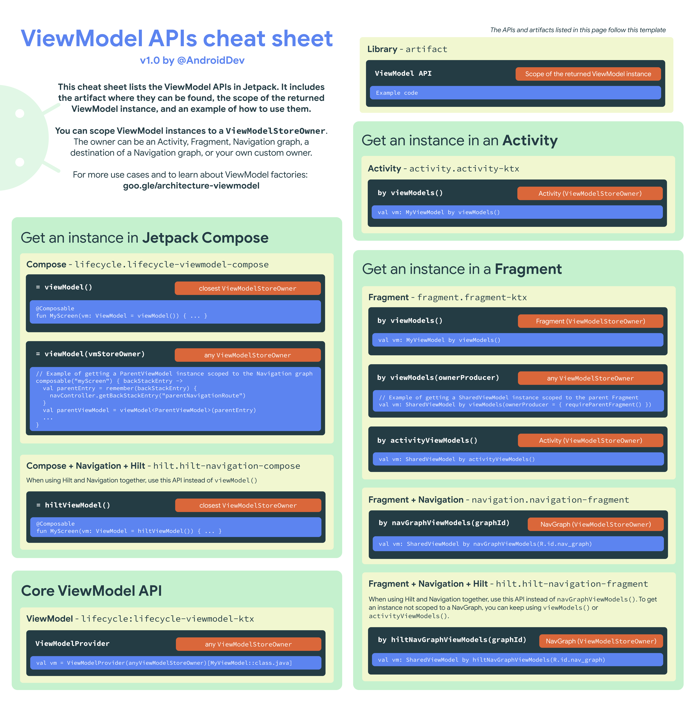
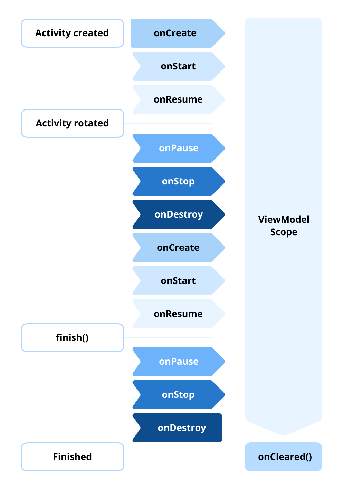
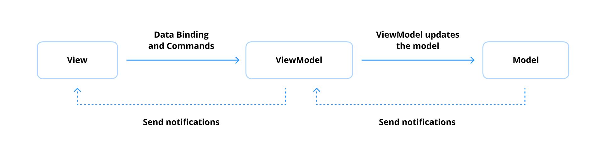
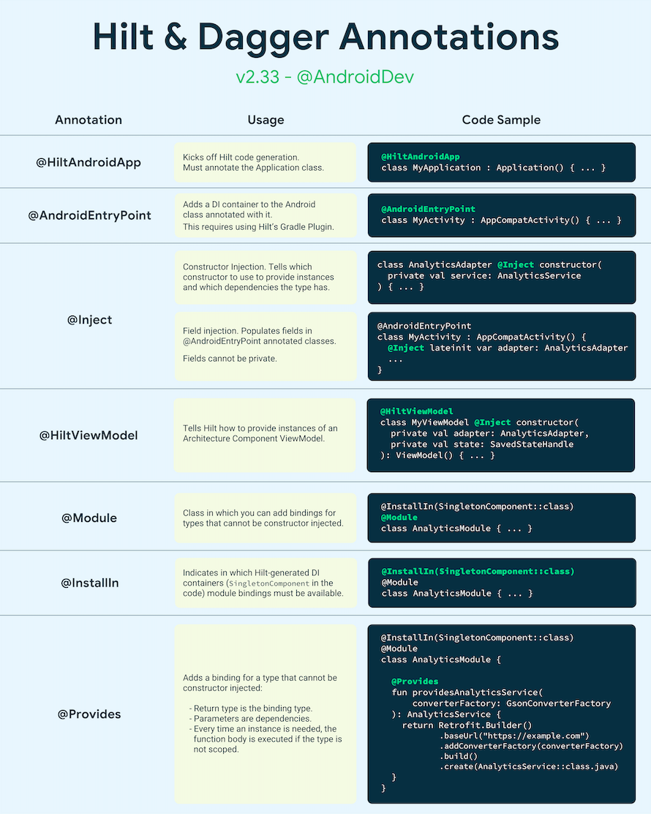
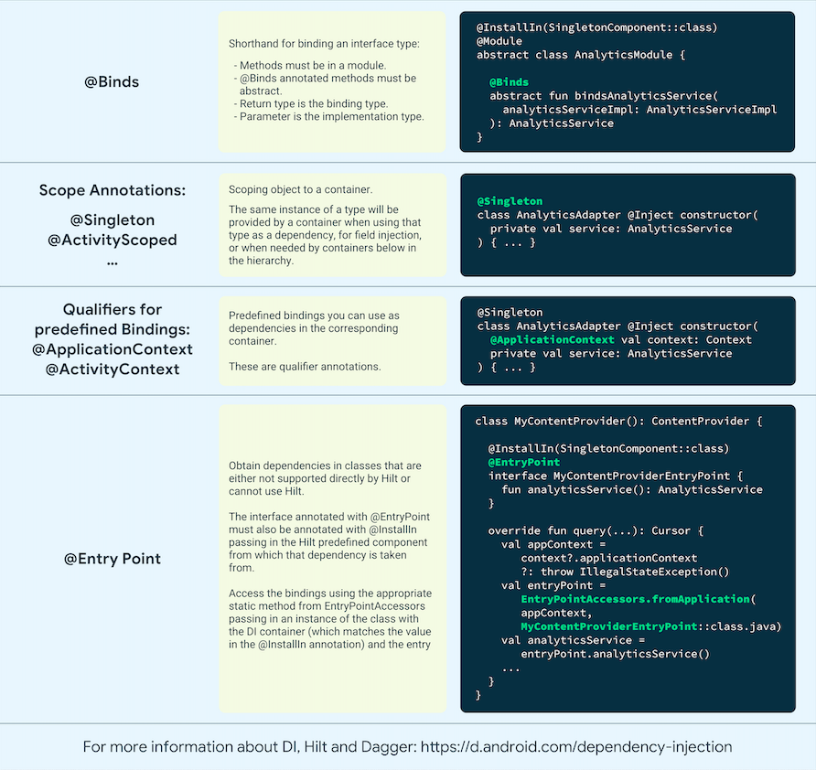
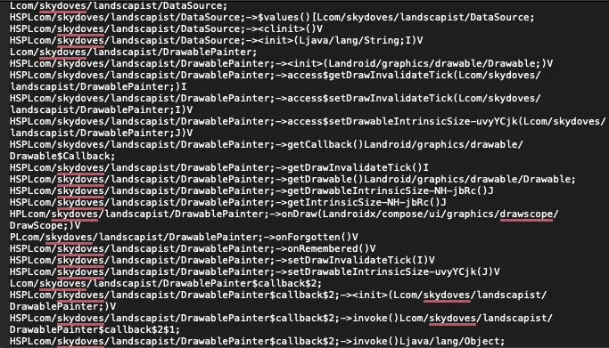

# 类别 2：Jetpack 库

> 原书页码：185–234  
> 翻译状态：已完成（问题 49–58）

Jetpack 是 Google 提供的一组库与工具，帮助 Android 开发者更高效、可维护地构建应用。这些库覆盖生命周期管理、UI 导航、后台任务和数据存储等常见开发挑战，并与现代 Android 开发实践无缝协作。

Jetpack 库采用模块化设计，开发者可仅引入项目所需组件。例如，使用 ViewModel 管理状态、Navigation 处理页面切换、Room 管理本地数据库，而不必依赖单一庞大框架。Jetpack 为 Android 核心能力提供补充，但并非强制使用；特定场景中替代方案或自定义实现仍可能更合适。理解这些组件在 Android 生态中的位置，有助于做出恰当技术选型。

本分类不涵盖所有 Jetpack 库，而是聚焦 Android 应用开发中广泛、常用的库。若要探索其他库，请查阅 [Android 官方 Jetpack 文档](https://developer.android.com/jetpack)⁸³。

---

## 问题 49：什么是 AppCompat 库？

AppCompat⁸⁴ 是 Android Jetpack 套件的一部分，旨在帮助开发者保持与旧版 Android 的兼容性。它允许应用使用现代功能和设计模式，同时确保能在较早 Android 版本上向后兼容；对于需要覆盖不同 Android 版本、广泛设备范围的应用尤其有用。

AppCompat 提供一系列向后兼容组件和工具，用于提升应用功能与设计一致性，主要包括：

- **UI 组件的向后兼容：** 引入 AppCompatActivity 等现代 UI 组件。AppCompatActivity 继承 FragmentActivity 并确保与旧版 Android 兼容，因此开发者可在旧设备上使用 ActionBar 等功能。
- **Material Design 支持：** 让开发者在旧 Android 版本设备上采用 Material Design 原则，包括 AppCompatButton、AppCompatTextView 等控件；它们会根据设备 API 级别自动调整外观和行为。
- **主题和样式支持：** 可使用 `Theme.AppCompat` 等主题，确保所有 API 级别具有一致外观。这些主题将矢量 Drawable 支持等现代样式能力带给旧版 Android。
- **动态功能支持：** 提供动态资源加载和矢量 Drawable 支持，使现代设计元素既易于高效实现，也能保持向后兼容。

### 为什么使用 AppCompat？

使用 AppCompat 的主要原因是确保现代 Android 功能和 UI 组件在所有支持的 API 级别上表现一致。它降低了为运行旧版 Android 的设备维护兼容性的复杂度，让开发者可专注构建现代、功能丰富的应用。

### AppCompatActivity 示例

```kotlin
import androidx.appcompat.app.AppCompatActivity
import android.os.Bundle

class MainActivity : AppCompatActivity() {
    override fun onCreate(savedInstanceState: Bundle?) {
        super.onCreate(savedInstanceState)
        setContentView(R.layout.activity_main)
    }
}
```

此示例中，AppCompatActivity 确保该 Activity 能在旧 Android 设备上使用 ActionBar 等功能。

### 小结

AppCompat 是构建兼容广泛设备和 API 级别 Android 应用的实用库。它提供向后兼容组件、Material Design 支持和一致主题，既简化开发，也改善旧设备上的用户体验。

### 实战题

**问：** AppCompat 如何在旧 Android 版本上支持 Material Design？哪些关键 UI 组件能从中获益？

**答：** AppCompat 的核心作用是把许多现代 UI 行为、主题能力和控件实现向低版本 Android 回移，让应用即使运行在旧系统上，也能获得接近现代 Android 的外观与交互。它通过 `Theme.AppCompat`、`AppCompatDelegate`、向后兼容的资源解析、tint、矢量图支持、`DayNight` 主题以及一组 `AppCompat*` 控件实现这一点；真正完整的 Material 组件通常由 MDC 提供，但 AppCompat 是它们能在旧版本上稳定运行的重要基础。最直接受益的组件包括 `Toolbar`/ActionBar、`AppCompatButton`、`AppCompatTextView`、`AppCompatEditText`、`AppCompatImageView`、`AppCompatCheckBox`、`AppCompatRadioButton`、`AppCompatSpinner`、`AlertDialog` 等，这些控件能在不同 API 级别上保持更一致的样式、状态反馈和主题行为。

⁸³ https://developer.android.com/jetpack  
⁸⁴ https://developer.android.com/jetpack/androidx/releases/appcompat

---

## 问题 50：什么是 Material Design Components（MDC）？

Material Design Components（MDC）⁸⁵ 是一组基于 Google Material Design 指南⁸⁶、可定制的 UI 控件和工具。这些组件旨在提供一致、友好的界面，同时让开发者可定制外观和行为，以符合应用的品牌和设计需求。

MDC 属于 Material Components for Android（MDC-Android）库⁸⁷，可无缝集成到 Android 项目，确保有效实现现代设计原则。

### Material Design Components 的关键功能

- **Material Theming：** MDC 通过 Material Theming⁸⁸ 支持全局或组件级的排版、形状和颜色定制。因此可在整个应用中保持一致性，同时使 UI 符合品牌标识。
- **预构建 UI 组件：** 提供按钮、卡片、App Bar、导航抽屉、Chip 等大量即用型控件；这些组件已针对无障碍、性能和响应性优化。
- **动画支持：** Material Design 强调运动和过渡。MDC 内置共享元素过渡、涟漪效果和视觉反馈等动画支持，可增强用户交互。
- **深色模式支持：** 提供便于实现深色模式的工具；可定义浅色和深色主题，同时保持视觉一致性。
- **无障碍：** MDC 遵循无障碍标准，提供更大的触摸目标、语义标签和正确焦点管理等特性，确保 UI 对所有用户都具有包容性。

### 使用 MaterialButton 示例

```xml
<com.google.android.material.button.MaterialButton
    android:layout_width="wrap_content"
    android:layout_height="wrap_content"
    android:text="Click Me"
    app:cornerRadius="8dp"
    app:icon="@drawable/ic_example"
    app:iconGravity="start"
    app:iconPadding="8dp" />
```

这里的 MaterialButton 使用圆角、图标和内边距进行了定制，符合 Material Design 原则。

### 小结

Material Design Components 使开发者可创建遵循 Google Material Design 指南、现代且一致的视觉界面。借助主题、预构建控件、动画支持和无障碍工具，MDC 简化了高质量 UI 的实现，同时保证在不同设备与屏幕尺寸上的适应性和响应性。

### 实战题

**问：** MDC 中的 Material Theming 如何帮助维持整个应用的设计一致性？

**答：** Material Theming 会把颜色、排版、形状、间距和组件状态等设计决策集中沉淀为一套主题 token，然后由所有 Material 组件统一消费。这样做的价值在于：品牌色、字号层级、圆角体系、暗色模式和组件交互反馈都不需要在每个页面手写一遍，而是通过全局主题、主题覆盖和组件样式自动继承。结果是设计改动可以一次调整、全局生效，减少页面之间“同一按钮长得不一样”“深色模式漏改”“不同团队各自定义样式”的问题，也让设计系统更容易扩展和治理。

⁸⁵ https://developer.android.com/design/ui/mobile/guides/components/material-overview  
⁸⁶ https://m2.material.io/design/guidelines-overview  
⁸⁷ https://github.com/material-components/material-components-android  
⁸⁸ https://m2.material.io/design/material-theming/overview.html#material-theming  
⁸⁹ https://m2.material.io/design/motion/understanding-motion.html#principles

---

## 问题 51：使用 ViewBinding 有什么优势？

ViewBinding⁹⁰ 是 Android 引入的功能，用于简化与布局中 View 的交互。它无需手动调用 `findViewById()`，并以类型安全的方式访问 View，从而减少样板代码并降低潜在运行时错误。

### ViewBinding 的工作方式

启用 ViewBinding 后，Android 会为每个 XML 布局文件生成一个 Binding 类。类名由布局文件名转换而来：每个下划线（`_`）转为驼峰命名，末尾加上 `Binding`。例如，`activity_main.xml` 会生成 `ActivityMainBinding`。

Binding 类包含布局中所有 View 的引用，可直接访问，无需类型转换或调用 `findViewById()`：

```kotlin
class MainActivity : AppCompatActivity() {
    private lateinit var binding: ActivityMainBinding

    override fun onCreate(savedInstanceState: Bundle?) {
        super.onCreate(savedInstanceState)
        binding = ActivityMainBinding.inflate(layoutInflater)
        setContentView(binding.root)

        binding.textView.text = "Hello, ViewBinding!"
    }
}
```

这里的 ActivityMainBinding 是 `activity_main.xml` 对应的生成类。使用 `inflate()` 创建 Binding 实例，再将 `binding.root` 传给 `setContentView()` 设置布局。

### ViewBinding 的优势

- **类型安全：** 直接访问 View，无需转换类型，避免因类型不匹配导致的运行时错误。
- **代码更简洁：** 不再需要 `findViewById()`，减少样板代码。
- **空安全：** 自动处理可空 View，在访问可选 UI 组件时更安全。
- **性能：** 与 DataBinding 不同，ViewBinding 不使用绑定表达式或额外 XML 解析，因此运行时开销极小。

### 与 DataBinding 的比较

DataBinding 功能更多，例如绑定表达式和双向数据绑定，但更复杂且存在运行时开销。ViewBinding 仅专注于简化 View 交互，性能更轻量；当不需要 LiveData 绑定等高级功能时，它是理想选择。

### 启用 ViewBinding

在 `build.gradle` 中添加：

```groovy
android {
    viewBinding {
        enabled = true
    }
}
```

启用后，项目所有 XML 布局都会自动生成 Binding 类。

### 补充提示


Google 正式支持 ViewBinding 之前，ButterKnife⁹¹ 曾广泛用于通过注解处理将 View 实例注入字段，以避免 `findViewById()`；它通过依赖注入提供类型安全。ButterKnife 曾是 Android 生态的重要创新项目，推动了开发方式的变化。尽管官方采用 ViewBinding 后已弃用，但它仍是了解依赖注入模式的有价值资源。

### 小结

ViewBinding 是与 Android View 交互的轻量、类型安全方式，可减少样板代码并提升代码安全性。它是 `findViewById()` 的直接替代方案；不需要 DataBinding 高级功能时，启用 ViewBinding 能简化 UI 交互，并提高可维护性与运行时安全性。

### 实战题

**问：** 相比 `findViewById()`，ViewBinding 如何提升类型安全和空安全？这种方式有什么好处？

**答：** ViewBinding 会在编译期为每个布局生成对应 Binding 类，并把布局中的 View 暴露成强类型字段，因此开发者不再需要手动写 `findViewById()`、也不需要做强制类型转换。这样一来，如果布局里没有这个 ID、或者把 `TextView` 当成 `ImageView` 使用，问题会在编译期暴露，而不是拖到运行时崩溃；对于只在部分布局配置中存在的 View，生成代码也会反映其可空性，调用侧必须显式处理。它带来的好处是代码更简洁、重构更安全、运行时因 ID 写错或类型转换错误导致的崩溃更少，同时几乎没有 DataBinding 那样的额外运行时成本，因此是现代 XML 页面访问 View 的默认优选方案。

⁹⁰ https://developer.android.com/topic/libraries/view-binding  
⁹¹ https://github.com/JakeWharton/butterknife

---

## 问题 52：DataBinding 如何工作？

DataBinding⁹² 是 Android 库，可把 XML 布局中的 UI 组件直接绑定到应用数据源。它以声明式方式处理部分 UI 设计：减少 `findViewById()` 等样板代码，并让 UI 和底层数据模型间实现实时更新。它也是 MVVM（Model-View-ViewModel）架构的重要概念；MVVM 源于 Microsoft⁹³，是用于分离 UI 逻辑和业务逻辑的设计模式。

### 启用 DataBinding

在 `build.gradle` 中添加：

```groovy
android {
    dataBinding {
        enabled = true
    }
}
```

### DataBinding 的工作方式

DataBinding 会为每个使用 `<layout>` 标签的 XML 布局生成 Binding 类。该类可直接访问 View，并可通过表达式在 XML 中直接绑定数据。

```xml
<layout xmlns:android="http://schemas.android.com/apk/res/android">
    <data>
        <variable
            name="user"
            type="com.example.User" />
    </data>

    <LinearLayout
        android:layout_width="match_parent"
        android:layout_height="match_parent"
        android:orientation="vertical">

        <TextView
            android:layout_width="wrap_content"
            android:layout_height="wrap_content"
            android:text="@{user.name}" />

        <TextView
            android:layout_width="wrap_content"
            android:layout_height="wrap_content"
            android:text="@{user.age}" />
    </LinearLayout>
</layout>
```

这里将 User 对象绑定到 XML 布局，`user.name` 和 `user.age` 会动态显示在 TextView 中。

### 在代码中绑定数据

```kotlin
class MainActivity : AppCompatActivity() {
    override fun onCreate(savedInstanceState: Bundle?) {
        super.onCreate(savedInstanceState)
        val binding: ActivityMainBinding = DataBindingUtil.setContentView(
            this, R.layout.activity_main
        )

        val user = User("Alice", 25)
        binding.user = user
    }
}

data class User(val name: String, val age: Int)
```

此处将 user 作为布局数据源；数据变化时 UI 会自动更新。

### DataBinding 的功能

1. **双向数据绑定：** 自动同步 UI 和底层数据模型，特别适合表单与输入字段。

   ```xml
   <EditText
       android:layout_width="match_parent"
       android:layout_height="wrap_content"
       android:text="@={user.name}" />
   ```

2. **绑定表达式：** 可在 XML 直接使用简单逻辑，如字符串拼接或条件表达式。

   ```xml
   <TextView
       android:layout_width="wrap_content"
       android:layout_height="wrap_content"
       android:text="@{user.age > 18 ? `Adult` : `Minor`}" />
   ```

3. **生命周期感知：** 仅当生命周期处于适当状态（如 Activity、Fragment 活跃）时自动更新 UI。

### DataBinding 的优点

- **减少样板代码：** 不必使用 `findViewById()` 或显式更新 UI。
- **实时 UI 更新：** 自动反映数据变化。
- **声明式 UI：** 将逻辑移至 XML，简化复杂布局。
- **提高可测试性：** UI 与代码解耦，二者均更易独立测试。

### DataBinding 的缺点

- **性能开销：** 相比 ViewBinding 等轻量方案，会增加运行时开销。
- **复杂性：** 对小型或简单项目可能引入不必要复杂度。
- **学习曲线：** 需要熟悉绑定表达式和生命周期管理。

### 小结

DataBinding 能在 XML 中把 UI 元素直接绑定到数据源，减少样板代码并实现声明式 UI 编程。它支持双向绑定、绑定表达式等高级能力，适合动态 UI 更新。虽然会增加复杂性和性能开销，但对于需要实时、交互式 UI 且希望减少手动干预的应用，是强大选择。

### 实战题

**问：** DataBinding 和 ViewBinding 的主要差异是什么？分别适合什么场景？

**答：** ViewBinding 只解决“安全、方便地拿到 View 引用”这个问题，本质是 `findViewById()` 的编译期替代品；它不支持表达式、双向绑定或把数据直接从 ViewModel 驱动到 XML。DataBinding 则更进一步，允许在 XML 中写绑定表达式、绑定可观察数据、使用双向绑定，并把一部分 UI 逻辑声明式地下沉到布局层。实践上，绝大多数普通页面更推荐使用 ViewBinding，因为它简单、构建更快、调试成本更低；只有当项目已经深度采用 XML + MVVM，且确实需要表达式绑定、表单双向同步、减少大量样板 glue code 时，才更适合选择 DataBinding。

**问：** DataBinding 在 MVVM 架构中扮演什么角色？它如何在 Android 开发中分离 UI 逻辑和业务逻辑？

**答：** 在 MVVM 中，DataBinding 充当 View 与 ViewModel 之间的声明式连接层。ViewModel 暴露状态和事件入口，XML 通过绑定表达式订阅这些状态并把点击等交互回调到 ViewModel，从而减少 Activity/Fragment 中大量“取值再 setText”“监听点击再转调 ViewModel”的样板代码。这样 UI 展示逻辑会更多地保留在 XML 和组件样式层，业务规则、数据校验、提交流程等仍应放在 ViewModel 或更下层的 use case / repository 中；也就是说，DataBinding 能帮助分离展示绑定逻辑和业务逻辑，但前提是不要把复杂业务判断、网络调用或过重表达式塞进 XML。

### 精通专业提示：ViewBinding 与 DataBinding 有什么区别？


二者均可减少应用中处理 View 时的样板代码，但用途和功能不同。

ViewBinding 为每个 XML 布局生成 Binding 类，包含布局中所有带 ID View 的直接引用，简化 View 访问并提高类型安全。它不支持绑定表达式或数据驱动更新。

DataBinding 更复杂、灵活，允许将 UI 组件直接绑定至数据源。它支持绑定表达式、可观察数据和双向绑定，适合 MVVM 架构。

| 维度 | ViewBinding | DataBinding |
| --- | --- | --- |
| 用途 | 简化 View 访问 | 高级、数据驱动的 UI 绑定 |
| 生成类 | 生成 View 的直接引用 | 还会生成内置数据绑定能力的附加类 |
| XML 表达式 | 不支持 | 支持绑定表达式和动态绑定 |
| 双向绑定 | 不支持 | 支持 |
| 性能 | 更快、开销更小 | 需处理数据绑定逻辑，开销更高 |

简单项目中，若只需直接引用 View、避免 `findViewById()`，应使用 ViewBinding。处理复杂数据驱动 UI 或 MVVM 架构时，可选择 DataBinding；它与 LiveData、StateFlow、可观察属性或标记 `@Bindable`⁹⁴ 的方法集成良好。尽管 DataBinding 更通用，简单场景中其额外开销未必必要。

⁹² https://developer.android.com/topic/libraries/data-binding  
⁹³ https://learn.microsoft.com/en-us/dotnet/architecture/maui/mvvm  
⁹⁴ https://developer.android.com/reference/android/databinding/Bindable

---

## 问题 53：什么是 LiveData？

LiveData⁹⁵ 是 Android Jetpack Architecture Components 提供的可观察数据持有类。它具有生命周期感知能力，会遵循其关联 Android 组件（如 Activity、Fragment、View）的生命周期；这确保 LiveData 仅在关联组件处于活跃状态（如 started 或 resumed）时更新 UI。

LiveData 的主要目标是让 UI 组件观察数据变化；底层数据改变时，UI 自动更新。因此它是实现 Android 响应式 UI 模式的重要工具。

### LiveData 的优势

1. **生命周期感知：** 观察组件生命周期，仅在组件活跃时更新数据，降低崩溃和内存泄漏风险。
2. **自动清理：** 与组件绑定的 Observer 在生命周期销毁时会自动移除和清理。
3. **观察者模式：** 通过 Observer，在 LiveData 数据改变时自动更新 UI 组件。
4. **线程安全：** LiveData 被设计为线程安全，可从后台线程更新。

以下示例在 ViewModel 中用 LiveData 管理 UI 相关数据：

```kotlin
// ViewModel
class MyViewModel : ViewModel() {
    private val _data = MutableLiveData<String>() // 内部可修改
    val data: LiveData<String> get() = _data // 对外只读

    fun updateData(newValue: String) {
        _data.value = newValue
    }
}

// Fragment 或 Activity
class MyFragment : Fragment() {
    private val viewModel: MyViewModel by viewModels()

    override fun onViewCreated(view: View, savedInstanceState: Bundle?) {
        super.onViewCreated(view, savedInstanceState)
        viewModel.data.observe(viewLifecycleOwner) { updatedData ->
            // 更新 UI
            textView.text = updatedData
        }
    }
}
```

在此示例中，MyViewModel 持有数据，Fragment 观察 LiveData。每次调用 `updateData()`，UI 都自动更新。

### MutableLiveData 与 LiveData 的差异

- **MutableLiveData：** 可通过 `setValue()` 或 `postValue()` 修改数据，通常在 ViewModel 内保持 private，防止外部直接修改。
- **LiveData：** 只读版本，阻止外部组件修改数据，确保更好的封装性。

### LiveData 的使用场景

1. **UI 状态管理：** 作为网络响应、数据库等数据源的容器，无缝绑定到 UI；底层数据变化时自动更新界面，使 UI 与应用状态同步。
2. **实现观察者模式：** LiveData 是发布者，Observer 是订阅者；LiveData 值变化时实时更新订阅者，适合动态 UI 或数据驱动交互。
3. **一次性事件：** 如显示 Toast、导航到其他页面；但这类事件更适合使用 SingleLiveEvent⁹⁶ 或类似实现。

### 补充提示：LiveData 与 Flow


LiveData 常被与 Kotlin 的 StateFlow、SharedFlow 比较。许多开发者迁移或考虑迁移至 Flow；但声称 StateFlow 出现后 LiveData 已过时，是一种误解。Flow 本身与平台无关，并不了解 Android 生命周期，因此必须按生命周期边界显式收集和取消。

若没有正确的生命周期感知收集，即使 UI 不活跃，Flow 仍可能持续收集，增加内存泄漏风险。相反，LiveData 原生具备生命周期感知：它绑定 LifecycleOwner 并自动处理取消订阅，因此视情况而定可能更安全、更实用。

“从 LiveData 迁移到 Flow 可移除 Android 依赖”的说法也并不十分有说服力。实际中 LiveData 往往只存在于 ViewModel 边界；将网络、数据、领域等各层替换为完全模块化、JVM-only 架构，能带来的性能或结构收益在统计上并不明确。与其盲从趋势，不如只在能明确获益的场景（如需要高级数据转换或响应式流）使用 Flow。有关安全收集 Flow 的实践，可参考 Manuel Vivo 的文章 [A safer way to collect flows from Android UIs](https://medium.com/androiddevelopers/a-safer-way-to-collect-flows-from-android-uis-23080b1f8bda)⁹⁷。

### 小结

LiveData 以生命周期感知的方式管理、观察数据变化，简化 Android 响应式 UI 状态构建，减少样板代码以及崩溃、内存泄漏风险。它是现代 Android 开发的重要组成部分，尤其适合 MVVM 架构。

### 实战题

**问：** LiveData 如何确保生命周期感知？相比 RxJava、EventBus 等传统可观察对象有什么优势？

**答：** LiveData 在 `observe(owner, observer)` 时会绑定一个 `LifecycleOwner`，只有当该 owner 处于 `STARTED`/`RESUMED` 等活跃状态时才分发数据；当生命周期销毁时，Observer 会自动移除，因此不需要像普通观察者模式那样手动解绑。这一点相比 RxJava、EventBus 等传统可观察对象的主要优势，是它天然面向 Android UI 生命周期，能降低页面销毁后继续回调导致的内存泄漏、空指针或重复更新风险；同时 API 简单、非常适合把 ViewModel 的 UI 状态暴露给 Activity/Fragment。它的代价是能力没有 RxJava/Flow 那么丰富，因此更适合 UI 边界层，而不是复杂流式处理的核心管道。

**问：** LiveData 的 `setValue()` 和 `postValue()` 有何区别？应分别在何时使用？

**答：** `setValue()` 只能在主线程调用，并且会同步更新当前值、尽快通知活跃观察者，适合已经在主线程上、需要立刻更新 UI 状态的场景。`postValue()` 可以在后台线程调用，它会把更新投递回主线程异步执行，因此适合网络、数据库、IO 回调等后台上下文。需要注意的是，短时间连续多次 `postValue()` 可能会发生合并，最终只分发最后一次值；因此如果你需要严格逐次分发或立即可见的结果，应优先在主线程使用 `setValue()`。

**问：** LiveData 有哪些限制？当多个 UI 事件（如导航、显示 Toast）需要观察且不能在配置变更后重复触发时，应如何处理？

**答：** LiveData 更适合表示“当前状态”，不适合表达“一次性事件”；因为它会持有最新值，新观察者订阅后可能再次收到旧事件，导致旋转屏幕后重复导航、重复弹 Toast。它还缺少 Flow/Rx 那样完备的操作符、背压和组合能力，因此复杂异步链路里通常不够灵活。对于一次性 UI 事件，推荐优先在 ViewModel 中使用 `SharedFlow`、`Channel` 或明确的事件流建模，让 UI 按生命周期收集；如果项目仍以 LiveData 为主，也可以使用事件包装类，但 `SingleLiveEvent` 这类实现要谨慎，避免在多观察者场景下行为不透明。

### 精通专业提示：LiveData 中的 setValue() 与 postValue() 有何区别？


二者都用于更新 LiveData 持有的数据，但在线程与同步行为上不同。

#### setValue()

`setValue()` 同步更新数据，且只能在主线程（UI 线程）调用。它用于需要立即更新值，并确保同一帧内将变化反映给 Observer 的场景：

```kotlin
val liveData = MutableLiveData<String>()

fun updateOnMainThread() {
    liveData.setValue("Updated Value") // 只能在主线程工作
}
```

它适合已经处于主线程的 UI 事件或 Android 生命周期组件交互。若从后台线程调用，会抛出异常。

#### postValue()

`postValue()` 异步更新数据，适合后台线程。调用后会把更新安排到主线程，从而确保线程安全而不阻塞当前线程：

```kotlin
val liveData = MutableLiveData<String>()

fun updateInBackground() {
    Thread {
        liveData.postValue("Updated Value") // 可从任意线程调用
    }.start()
}
```

它特别适合网络请求、数据库查询等后台操作，无需显式切换到主线程。

从内部实现看，`postValue()` 使用后台执行器将值投递到主线程：它先以 `mDataLock` 同步并更新 `mPendingData`；若已有待处理任务则避免重复投递，否则通过 `ArchTaskExecutor` 在主线程执行 `mPostValueRunnable`。这确保后台线程安全更新。

若在主线程执行：

```kotlin
liveData.postValue("a")
liveData.setValue("b")
```

`"b"` 会立即被设置；之后主线程处理已投递任务时，`"a"` 会覆盖 `"b"`。这是因为 postValue 异步安排更新，而 setValue 同步更新。若主线程处理投递任务前多次调用 postValue，则只会分发最后一个值，因为 `mPendingData` 只保留最新值。

| 维度 | setValue() | postValue() |
| --- | --- | --- |
| 线程 | 必须在主线程调用 | 可在任意线程调用 |
| 同步方式 | 立即同步更新 | 异步安排至主线程 |
| 使用场景 | 主线程发起的 UI 更新或事件 | 后台线程更新、异步任务 |
| Observer 通知 | 同一帧立即触发 | 主线程处理后在下一帧触发 |

通常，主线程中由用户交互或生命周期事件发起更新时使用 `setValue()`；数据库读取、网络调用等后台线程或耗时任务中使用 `postValue()`。

⁹⁵ https://developer.android.com/topic/libraries/architecture/livedata  
⁹⁶ https://gist.github.com/skydoves/60f83bf678803e3b65742d541aba935f#file-singleliveevent-kt  
⁹⁷ https://medium.com/androiddevelopers/a-safer-way-to-collect-flows-from-android-uis-23080b1f8bda

---

## 问题 54：什么是 Jetpack ViewModel？

Jetpack ViewModel 是 Android Architecture Components 的关键组件，旨在以生命周期感知的方式存储和管理 UI 相关数据。它通过分离 UI 逻辑和业务逻辑，帮助开发者构建健壮、易维护的应用；同时确保屏幕旋转等配置变更后数据仍能保留。

ViewModel 的主要目标是跨配置变更保存 UI 相关数据。例如用户旋转设备时，Activity 或 Fragment 会销毁并重建，但 ViewModel 会确保数据保持不变。

```kotlin
data class DiceUiState(
    val firstDieValue: Int? = null,
    val secondDieValue: Int? = null,
    val numberOfRolls: Int = 0,
)

class DiceRollViewModel : ViewModel() {
    // 暴露屏幕 UI 状态
    private val _uiState = MutableStateFlow(DiceUiState())
    val uiState: StateFlow<DiceUiState> = _uiState.asStateFlow()

    // 处理业务逻辑
    fun rollDice() {
        _uiState.update { currentState ->
            currentState.copy(
                firstDieValue = Random.nextInt(from = 1, until = 7),
                secondDieValue = Random.nextInt(from = 1, until = 7),
                numberOfRolls = currentState.numberOfRolls + 1,
            )
        }
    }
}
```

这个示例中，即使 Activity 因配置变更而重建，状态值仍会保留。

### ViewModel 的特性

1. **生命周期感知：** ViewModel 的作用域绑定到 Activity 或 Fragment 生命周期；关联 UI 组件不再使用时（例如离开该页面），它会自动销毁。
2. **跨配置变更持久化：** Activity、Fragment 在配置变更时会销毁和重建，但 ViewModel 保留状态，避免数据丢失及重复获取数据。
3. **关注点分离：** 将 UI 相关逻辑和业务逻辑分开，得到更清晰、可维护的代码。UI 层观察 ViewModel 更新，更容易实践响应式编程。

### 创建和使用 ViewModel

对 ComponentActivity，可通过 `activity-ktx` 提供的 Kotlin `by viewModels()` 委托轻松创建 ViewModel：

```kotlin
class DiceRollActivity : AppCompatActivity() {
    private val viewModel: DiceRollViewModel by viewModels()

    override fun onCreate(savedInstanceState: Bundle?) {
        super.onCreate(savedInstanceState)
        // 系统首次调用 onCreate() 时创建 ViewModel；重建后的 Activity 会获得同一实例。
        lifecycleScope.launch {
            repeatOnLifecycle(Lifecycle.State.STARTED) {
                viewModel.uiState.collect {
                    // 更新 UI 元素
                }
            }
        }
    }
}
```

ViewModel 实例可限定到 `ViewModelStoreOwner`。该 Owner 负责管理 ViewModel 生命周期，可以是 Activity、Fragment、Navigation Graph、Navigation Graph 中的目的地，或开发者定义的自定义 Owner。Jetpack 库提供灵活的作用域选择；完整说明可参阅 [ViewModel API 速查表](https://developer.android.com/topic/libraries/architecture/viewmodel/viewmodel-cheatsheet)⁹⁹。



### 小结

Jetpack ViewModel 用于存储和管理 UI 相关数据，并确保这些数据跨配置变更无缝保留。它具有生命周期感知能力，与 MVVM 模式有效集成，可简化状态管理，并在屏幕旋转等事件中保留数据。

### 实战题

**问：** ViewModel 如何跨配置变更保留数据？它与使用 `onSaveInstanceState()` 保存状态有什么区别？

**答：** ViewModel 实例存放在 `ViewModelStore` 中，只要所属的 `ViewModelStoreOwner` 没有真正销毁，配置变更时新的 Activity/Fragment 会拿回同一个 ViewModel，因此内存中的 UI 状态、缓存数据和进行中的协程任务都能继续存在，不需要重新拉取。`onSaveInstanceState()` 则是把少量可序列化状态写进 `Bundle`，用于进程被系统杀死后恢复简单状态。两者的职责不同：ViewModel 适合保存内存态、业务态和长生命周期异步任务；`onSaveInstanceState()` 更适合保存页面恢复所需的轻量参数，如当前 tab、输入框内容、选中 ID。若需要兼顾配置变更与进程死亡恢复，通常会结合 `SavedStateHandle` 一起使用。

**问：** ViewModelStoreOwner 的作用是什么？如何在同一 Activity 的多个 Fragment 之间共享 ViewModel？

**答：** `ViewModelStoreOwner` 的作用是提供一个 `ViewModelStore`，从而定义 ViewModel 的作用域和生命周期边界。Activity、Fragment、NavBackStackEntry 都可以是 `ViewModelStoreOwner`；把 ViewModel 取自谁，就意味着它跟谁同生共死。若要在同一 Activity 的多个 Fragment 之间共享 ViewModel，应让这些 Fragment 以宿主 Activity 为 owner 获取同一个实例，例如使用 `activityViewModels()`，或在 Navigation 场景里以同一个导航图的 `NavBackStackEntry` 为 owner。这样多个 Fragment 就能共享同一份状态、事件流和缓存数据，而不必通过接口回调层层转发。

**问：** 在 ViewModel 中用 StateFlow 或 LiveData 管理 UI 状态，有哪些优点与潜在缺点？

**答：** 这两种方式都能让 ViewModel 成为单一状态源，提升状态可观察性、测试性和配置变更后的稳定性。`StateFlow` 的优点是 Kotlin-first、与协程生态一致、可与 Flow 操作符无缝组合，适合现代架构；缺点是它本身不感知 Android 生命周期，UI 层需要用 `repeatOnLifecycle`、`collectAsStateWithLifecycle()` 等方式安全收集。LiveData 的优点是原生生命周期感知、接入传统 XML 页面简单；缺点是操作符能力有限、一次性事件建模别扭，也不如 Flow 适合复杂流组合。现代项目里，ViewModel 内部通常优先用 `StateFlow` 管理状态，在必要时再向旧 UI 边界暴露 LiveData。

### 精通专业提示：ViewModel 的生命周期是什么？


ViewModel 的生命周期与关联 `ViewModelStoreOwner` 绑定；该 Owner 可以是 Activity、Fragment 或其他生命周期感知组件。只要 ViewModelStoreOwner 仍在作用域内，ViewModel 就一直存在，从而使数据和状态跨屏幕旋转等配置变更保留。

以 Activity 为例，ViewModel 会一直保留，直至 Activity 被完全 finish 并从内存移除。配置变更时 Activity 虽会暂时销毁、重建，但 ViewModel 会被保留，因而状态不会丢失。

当 ViewModelStoreOwner 首次创建时，ViewModel 实例初始化；只要 Owner 仍在内存中，同一 ViewModel 实例就会保留。发生旋转等配置变更时，Owner 被重建，但会复用已有 ViewModel，避免重新加载或初始化数据，从而改善性能和体验。



当 ViewModelStoreOwner 被永久销毁时，ViewModel 会被清除。例如 Activity finish，或 Fragment 从父级移除且预计不会返回时，会调用 ViewModel 的 `onCleared()`。可在其中取消协程、关闭数据库连接等以清理资源，防止内存泄漏。更多详情见 [官方文档](https://developer.android.com/topic/libraries/architecture/viewmodel#lifecycle)¹⁰⁰。

### 精通专业提示：ViewModel 为什么能在配置变更后保留？


Jetpack ViewModel 能跨屏幕旋转、设备语言更新等配置变更存活。为 UI 组件创建 ViewModel 时，它会绑定组件的生命周期 Owner：Activity 通常是 ComponentActivity，Fragment 则是 Fragment 自身。关键机制是 `ViewModelStore`；它会在配置变更中被保留，因此 ViewModel 不必重建即可保存数据。

Jetpack 内部实现中，`androidx.activity.ComponentActivity`¹⁰¹ 和 `androidx.fragment.app.Fragment`¹⁰² 都实现 `ViewModelStoreOwner`¹⁰³。该接口让 Activity、Fragment 拥有各自 ViewModelStore。ViewModelStore 通过以唯一 String key 关联每个 ViewModel 的 Map 管理实例：

```kotlin
public open class ViewModelStore {
    private val map = mutableMapOf<String, ViewModel>()

    public fun put(key: String, viewModel: ViewModel) {
        val oldViewModel = map.put(key, viewModel)
        oldViewModel?.clear()
    }

    public operator fun get(key: String): ViewModel? = map[key]
    public fun keys(): Set<String> = HashSet(map.keys)

    public fun clear() {
        for (vm in map.values) vm.clear()
        map.clear()
    }
}
```

ComponentActivity 会观察自身生命周期。Activity 进入 `ON_DESTROY` 时，若不是配置变更导致的销毁，便清空 ViewModelStore；因此既能在预期配置变更时保留实例，又能在真正销毁时高效清理资源：

```java
getLifecycle().addObserver(new LifecycleEventObserver() {
  @Override
  public void onStateChanged(@NonNull LifecycleOwner source, Lifecycle.Event event) {
    if (event == Lifecycle.Event.ON_DESTROY) {
      mContextAwareHelper.clearAvailableContext();
      if (!isChangingConfigurations()) {
        getViewModelStore().clear();
      }
      mReportFullyDrawnExecutor.activityDestroyed();
    }
  }
});
```

ViewModel 因存储在由 Activity、Fragment 等生命周期组件管理的 ViewModelStore 中而跨配置变更保留。Compose Navigation 中，ViewModelStore 会限定到导航路由，确保特定屏幕的 ViewModel 正确保留。虽然可为自定义场景手动管理 ViewModelStore，但配置变更时的取回逻辑复杂，通常不建议这样做。

### 精通专业提示：Jetpack ViewModel 与 Microsoft MVVM 架构中的 ViewModel 有何区别？


官方文档¹⁰⁵ 将 Jetpack ViewModel 定义为生命周期感知的 **业务逻辑或屏幕级状态持有者**。它管理并向 UI 暴露状态，同时封装相关业务逻辑；其关键优势是缓存状态并跨屏幕旋转、Activity 重建等配置变更保留状态，避免 UI 不必要地重新获取数据。因此 Jetpack ViewModel 针对 Android 应用中的生命周期感知状态管理进行优化。

而 Microsoft 提出的 MVVM（Model-View-ViewModel）架构中，ViewModel 是 View 与 Model 之间的桥梁。MVVM ViewModel 实现可被 View 数据绑定的属性和命令，并通过变化通知事件告知 View 状态变化；它协调 View 与 Model 交互，将业务逻辑从 UI 抽象出来。与专注状态管理和生命周期感知的 Jetpack ViewModel 不同，MVVM ViewModel 强调数据绑定机制，使 View 被动响应状态变化，从而实现更声明式、模块化的设计。



Jetpack ViewModel 与 MVVM ViewModel 在目的和范式上不同：前者提供生命周期感知状态管理，主要保存跨配置变更的 UI 状态；后者充当 View 与 Model 的协调者，处理绑定，并确保 UI 专注显示数据。Jetpack ViewModel 的名称看似与 MVVM 对齐，但单独使用它并不能完全满足 MVVM 的要求；要实现 MVVM 初衷，还需提供额外绑定机制，使 UI 被动响应 ViewModel 数据，进而分离 UI 层和底层业务逻辑并提升可测试性。

对于 Compose，直接观察 ViewModel 数据可简化实现；对于 XML UI，需要 DataBinding 才能实现 MVVM 的绑定目标。开发者应根据所使用的架构和 UI 框架审慎选择方案。

⁹⁸ https://developer.android.com/jetpack/androidx/releases/activity  
⁹⁹ https://developer.android.com/topic/libraries/architecture/viewmodel/viewmodel-cheatsheet  
¹⁰⁰ https://developer.android.com/topic/libraries/architecture/viewmodel#lifecycle  
¹⁰¹ https://cs.android.com/androidx/platform/frameworks/support/+/androidx-main:activity/activity/src/main/java/androidx/activity/ComponentActivity.kt;l=111?q=ComponentActivity  
¹⁰² https://cs.android.com/androidx/platform/frameworks/support/+/androidx-main:fragment/fragment/src/main/java/androidx/fragment/app/Fragment.java;l=126?q=androidx.fragment.app.Fragment  
¹⁰³ https://developer.android.com/reference/androidx/lifecycle/ViewModelStoreOwner  
¹⁰⁴ https://developer.android.com/develop/ui/compose/navigation  
¹⁰⁵ https://developer.android.com/topic/architecture/ui-layer/stateholders

---

## 问题 55：什么是 Jetpack Navigation 库？

Jetpack Navigation 库¹⁰⁶ 是 Android 提供的框架，用于简化和标准化应用内导航。开发者可声明式地定义不同页面之间的导航路径和过渡，从而减少样板代码并改善整体体验。

该库可管理 Activity、Fragment 和 Composable 的导航，还支持深层链接、返回栈管理与动画等高级功能。以下核心组件协同处理导航。

### Navigation Graph

导航图是定义导航流程和目的地（页面）关系的 XML 资源。每个 destination 代表一个页面，例如 Fragment、Activity 或自定义 View：

```xml
<?xml version="1.0" encoding="utf-8"?>
<navigation xmlns:android="http://schemas.android.com/apk/res/android"
    android:id="@+id/nav_graph"
    app:startDestination="@id/homeFragment">

    <fragment
        android:id="@+id/homeFragment"
        android:name="com.example.app.HomeFragment"
        android:label="Home">
        <action
            android:id="@+id/action_home_to_details"
            app:destination="@id/detailsFragment" />
    </fragment>

    <fragment
        android:id="@+id/detailsFragment"
        android:name="com.example.app.DetailsFragment"
        android:label="Details" />
</navigation>
```

### NavHostFragment

NavHostFragment 是导航图的容器，承载各目的地并管理它们之间的导航。用户导航时，它会在容器内动态替换 Fragment：

```xml
<androidx.fragment.app.FragmentContainerView
    android:id="@+id/nav_host_fragment"
    android:name="androidx.navigation.fragment.NavHostFragment"
    android:layout_width="match_parent"
    android:layout_height="match_parent"
    app:navGraph="@navigation/nav_graph" />
```

### NavController

NavController 负责处理导航操作和管理返回栈。可使用它在目的地间以代码导航，或操控导航流程：

```kotlin
class MainActivity : AppCompatActivity() {
    override fun onCreate(savedInstanceState: Bundle?) {
        super.onCreate(savedInstanceState)
        setContentView(R.layout.activity_main)

        val navController = findNavController(R.id.nav_host_fragment)
        findViewById<Button>(R.id.navigateButton).setOnClickListener {
            navController.navigate(R.id.action_home_to_details)
        }
    }
}
```

### Safe Args

Safe Args 是 Gradle 插件，可生成类型安全的导航和参数传递代码，避免在目的地间传递数据时手动创建 Bundle：

```kotlin
val action = HomeFragmentDirections.actionHomeToDetails(itemId = 42)
findNavController().navigate(action)
```

### 深层链接

Navigation 库支持深层链接，允许用户通过 URL、通知等外部来源直接跳转至特定页面：

```xml
<fragment
    android:id="@+id/detailsFragment"
    android:name="com.example.app.DetailsFragment">
    <deepLink app:uri="https://example.com/details/{itemId}" />
</fragment>
```

### Jetpack Navigation 的优点

1. **集中式导航：** 在单个 XML 文件管理所有导航流程，结构清晰、易维护。
2. **类型安全参数：** 用生成的 Safe Args 类在目的地间安全传递数据。
3. **返回栈管理：** 自动处理返回栈，提供一致的导航体验。
4. **深层链接支持：** 无缝处理外部导航请求，改善用户体验。
5. **与 Jetpack 组件集成：** 与 Fragment、ViewModel、LiveData 协同良好，实现生命周期感知导航。

### 小结

Jetpack Navigation 通过声明式、集中式方式管理导航路径、过渡和参数，简化 Android 应用导航。它与其他 Jetpack 组件无缝集成，支持深层链接并通过 Safe Args 提供类型安全参数传递，减少样板代码并确保一致导航模式。

### 实战题

**问：** Jetpack Navigation 如何处理返回栈？如何使用 NavController 以编程方式操控它？

**答：** Jetpack Navigation 会为每次导航创建一个 `NavBackStackEntry` 并压入返回栈，栈顶 entry 对应当前目的地；按返回键或调用返回 API 时，栈顶 entry 出栈并恢复到前一个目的地。`NavController` 是操控这套返回栈的核心入口，常用操作包括 `navigate()` 入栈新目的地、`popBackStack()` 返回上一个或返回到指定目的地、`navigateUp()` 处理“向上导航”、以及通过 `NavOptions` 的 `popUpTo`、`launchSingleTop`、`restoreState` 等参数实现清栈、避免重复入栈和恢复状态。面试里可以补一句：Navigation 的返回栈不仅管理页面切换，也定义了每个目的地的 `SavedStateHandle`、Lifecycle 和 ViewModel 作用域边界。

**问：** 什么是 Safe Args？它如何提升 Jetpack Navigation Component 中目的地间传参的类型安全？

**答：** Safe Args 是 Navigation 提供的 Gradle 插件，它会根据导航图中的参数声明自动生成 `Directions` 和 `Args` 类，让页面跳转参数在编译期就具备明确类型。这样开发者不再需要手写 `Bundle` key、自己做强制类型转换，也不会因为参数名拼错、类型不匹配或漏传必填参数而把问题拖到运行时。它最适合 Fragment-based Navigation：调用方通过 `SomeFragmentDirections.action...()` 构造参数，接收方通过 `navArgs()` 或生成的 `Args` 类读取参数，既提升可读性，也让重构更安全。

¹⁰⁶ https://developer.android.com/guide/navigation

---

## 问题 56：什么是 Dagger 2 与 Hilt？

Android 有多种依赖注入（DI）库，其中 Dagger 2 与 Hilt 最为常见。二者都由 Google 开发并获得官方支持，是大型项目中可靠的选择。

### 什么是 Dagger 2？

Dagger 2¹⁰⁷ 是面向 Android 和 JVM 环境的完全静态、编译时依赖注入框架。它负责管理对象创建并自动提供依赖，可提高模块化程度并使应用更易测试。Dagger 2 在编译期生成代码，因此相比基于反射的 DI 框架有更好性能。

Dagger 2 使用 `@Module`、`@Provides`、`@Inject` 等注解声明和请求依赖。开发者通过 Component 与 Module 创建依赖图，Dagger 2 会在运行时自动解析。

```kotlin
@Module
class NetworkModule {
    @Provides
    fun provideRetrofit(): Retrofit {
        return Retrofit.Builder()
            .baseUrl("https://example.com")
            .build()
    }
}

@Component(modules = [NetworkModule::class])
interface AppComponent {
    fun inject(activity: MainActivity)
}

class MainActivity : AppCompatActivity() {
    @Inject lateinit var retrofit: Retrofit

    override fun onCreate(savedInstanceState: Bundle?) {
        super.onCreate(savedInstanceState)
        DaggerAppComponent.create().inject(this)
    }
}
```

### 什么是 Hilt？

Hilt¹⁰⁸ 是构建在 Dagger 2 之上的 Android 依赖注入库。它为 Activity、Fragment、ViewModel 等 Android 生命周期感知类提供预定义 Component，从而简化在 Android 项目中集成 Dagger 的过程。

Hilt 通过 `@HiltAndroidApp`、`@AndroidEntryPoint` 等注解减少 Dagger 2 所需的大量样板代码，也通过 `@Singleton`、`@ActivityScoped` 等 Scope 管理依赖生命周期：

```kotlin
@HiltAndroidApp
class MyApplication : Application()

@AndroidEntryPoint
class MainActivity : AppCompatActivity() {
    @Inject lateinit var retrofit: Retrofit

    override fun onCreate(savedInstanceState: Bundle?) {
        super.onCreate(savedInstanceState)
        setContentView(R.layout.activity_main)
    }
}

@Module
@InstallIn(SingletonComponent::class)
object NetworkModule {
    @Provides
    fun provideRetrofit(): Retrofit {
        return Retrofit.Builder()
            .baseUrl("https://example.com")
            .build()
    }
}
```

### Dagger 2 与 Hilt 的关键区别

1. **集成过程：** Dagger 2 需手动定义 Component 和 Injector，样板代码较多；Hilt 提供预定义 Component 和生命周期感知注解。
2. **Android 生命周期集成：** Hilt 专为 Android 定制，原生支持 Activity、Fragment、ViewModel；Dagger 2 更通用，生命周期感知组件需额外配置。
3. **作用域：** Hilt 提供与 Android 生命周期紧密集成的预定义 Scope，如 `@Singleton`、`@ActivityScoped`、`@FragmentScoped`；Dagger 2 需要手动配置 Scope 和自定义注解。
4. **代码复杂度：** Hilt 抽象大量 DI 配置，更适合入门；Dagger 2 灵活强大，但需开发者手动定义所有关系。
5. **使用场景：** Dagger 2 适合需要复杂、定制依赖图的项目；Hilt 专为 Android 设计，强调易用性和 Android 组件集成。

### Dagger 与 Hilt 提供的注解

二者共享许多注解，因为 Hilt 构建于 Dagger 之上，同时增加 Android 专属功能。

**Dagger 提供、Hilt 也使用的共享注解：**

- `@Inject`¹⁰⁹：标记构造函数、字段或方法用于依赖注入。
- `@Provides`¹¹⁰：在 `@Module` 中定义依赖创建方法。
- `@Module`¹¹¹：声明依赖提供者容器，组织相关依赖创建逻辑。
- `@Binds`¹¹²：在 Module 中把接口映射到实现，减少依赖定义样板代码。
- `@Qualifier`¹¹³：用自定义注解区分同一类型的多个绑定。
- `@Scope`¹¹⁴：定义自定义 Scope，以控制依赖生命周期。
- `@Singleton`¹¹⁵：指定依赖在其 Scope 内有一个共享实例，通常覆盖应用生命周期。
- `@Component`¹¹⁶：定义依赖图接口，将 Module 连接至注入目标并控制依赖生命周期。
- `@Subcomponent`¹¹⁷：在 Component 内创建更小的依赖图，用于特定 Scope 的子 Component。

其中 `@Inject`、`@Qualifier`、`@Scope`、`@Singleton` 源自 Java 规范 `javax.inject` 包，并非 Dagger 自身定义。

**Hilt 专属注解：**

- `@HiltAndroidApp`¹¹⁸：用于 Application，启动 Hilt 并创建整个应用的依赖图。
- `@AndroidEntryPoint`¹¹⁹：标记 Activity、Fragment、Service 等 Android 组件为注入目标，无需自定义 Dagger Component。
- `@InstallIn`¹²⁰：指定 Module 安装到的 Component，如 SingletonComponent、ActivityComponent。
- `@EntryPoint`¹²¹：用于访问 Hilt 管理的 Android 组件之外的依赖。
- `@HiltViewModel`¹²²：将 Jetpack ViewModel 与 Hilt 集成；必须与构造函数的 `@Inject` 一起使用。
- 预定义 Scope¹²³：如 `@ActivityRetainedScoped`、`@ViewModelScoped`、`@ActivityScoped`、`@FragmentScoped`、`@ViewScoped`、`@ServiceScoped`。Hilt 会自动生成预定义 Component，并与 Android 生命周期无缝集成。





### 小结

Dagger 2 与 Hilt 都是简化对象创建和管理的依赖注入框架。Dagger 2 更通用，可用于任何 Java 或 Android 项目，但需更多手动配置；Hilt 构建于 Dagger 2 之上，通过生命周期感知组件集成和减少样板代码来简化 Android DI。对大多数 Android 项目，Hilt 更方便；对非 Android 项目或高度定制 DI 图，Dagger 2 仍更合适。

### 实战题

**问：** 相比 Dagger 2，Hilt 如何简化依赖注入？在 Android 应用中使用 Hilt 有哪些关键优势？

**答：** Hilt 构建在 Dagger 2 之上，但把大量 Android 场景中的固定样板预先做好了。相比手动写 Dagger Component、Subcomponent、Factory、AndroidInjector 和一堆绑定桥接代码，Hilt 通过 `@HiltAndroidApp`、`@AndroidEntryPoint`、`@HiltViewModel`、`@InstallIn` 等注解直接把依赖图接到 Application、Activity、Fragment、Service、ViewModel 等常见组件上。它的关键优势是：更少样板代码、更清晰的生命周期作用域、与 Jetpack ViewModel / WorkManager / Navigation 等生态集成更自然，以及更低的团队上手成本。对大多数 Android 项目来说，Hilt 提供了足够强的编译期安全，同时把 Dagger 的复杂性收敛到了更容易维护的形态。

**问：** Dagger 与 Hilt 中 `@Provides`、`@Binds` 有何不同？应分别在何时使用？

**答：** `@Provides` 用在有方法体的 provider 方法上，适合依赖创建逻辑不是简单构造函数注入的场景，例如需要调用第三方 Builder、读取配置、拼装 Retrofit/OkHttp、创建 Room 数据库等。`@Binds` 则只做“接口到实现”的映射，没有方法体，要求返回抽象类型、参数是其具体实现，生成代码更少也更高效，因此当实现类已经能通过 `@Inject constructor` 创建时，优先使用 `@Binds`。简单说，能用 `@Binds` 解决的接口绑定就不要写成 `@Provides`；只有确实需要手写构造逻辑时再用 `@Provides`。

**问：** Hilt 中 `@Singleton`、`@ActivityScoped`、`@ViewModelScoped` 的 Scope 如何工作？它们如何影响应用中依赖的生命周期？

**答：** Scope 的本质是告诉 Hilt：在某个 Component 生命周期内，同一个依赖应复用同一个实例。`@Singleton` 绑定到 `SingletonComponent`，通常随整个应用进程存活，适合 Repository、数据库、网络客户端等全局单例；`@ActivityScoped` 绑定到单个 Activity 实例，对同一 Activity 中的注入点共享，但 Activity 重建后会产生新实例，因此它不跨配置变更长期保活；`@ViewModelScoped` 绑定到某个 `@HiltViewModel` 对应的 ViewModel 生命周期，同一个 ViewModel 内共享，适合该页面专属的状态持有者或 use case。面试中最好补充一句：如果想跨配置变更共享、但又不想上升到应用级单例，常常应考虑 `@ActivityRetainedScoped`，而不是 `@ActivityScoped`。

### 精通专业提示：可以手动实现依赖注入吗？


无需 DI 框架也可手动实现依赖注入，并完全控制实现。但与成熟 DI 框架相比，这种方式既有优势也有缺点。

手动 DI（运行时方案）需要投入大量精力管理对象完整生命周期，包括 Scope、分组和正确清理以避免内存泄漏。它通常带来大量样板代码，并可能演变为 Service Locator 模式¹²⁵ 或依赖全局静态访问器。Dagger 2、Hilt 等框架（编译时方案）会在编译期生成注入相关代码，简化维护并提供强大的编译期校验。

另一方面，Dagger 2、Hilt 由于注解处理¹²⁶ 和编译期代码生成会增加构建时间。仅依赖运行时初始化的手动 DI 可降低构建时间，但相比编译时优化的框架，运行时性能可能略有折损。总体而言，手动 DI 更适合小到中型项目；大型复杂应用则能从 DI 框架的可扩展性和效率中获益。选择应基于项目规模、复杂度和具体需求。

更多内容可参阅《Manifest Kotlin Interview for Android Developers》¹²⁷、官方 [Manual Dependency Injection](https://developer.android.com/training/dependency-injection/manual)¹²⁸ 指南，以及 Compose 官方示例 Jetcaster¹²⁹。

### 精通专业提示：Dagger 2 和 Hilt 的替代库有哪些？


除 Dagger 2、Hilt 外，还有 Koin 和 Anvil 等依赖注入方案，它们采用不同实现方式，各自适合特定场景。

#### Koin：轻量、易用的 DI 库

Koin¹³⁰ 强调简单性，使用 Kotlin DSL 定义依赖模块，无需注解、代码生成或大量样板。

- **无注解处理：** 依赖在 Kotlin 代码中定义，避免注解处理并提升构建速度。
- **Kotlin-first：** Kotlin DSL 使 DI 配置可读、直观。
- **易于使用：** 设置快速，适合小型项目或寻求简单方案的开发者。
- **动态解析：** 支持运行时动态解析依赖。

```kotlin
val appModule = module {
    single { Repository() }
    factory { ViewModel(get()) }
}

startKoin {
    modules(appModule)
}

class MyActivity : AppCompatActivity() {
    val viewModel: ViewModel by inject()
}
```

Koin 特别适合重视构建性能的小型项目，也适合 Kotlin Multiplatform（KMP），因为 Dagger 2、Hilt 目前不支持 KMP。Koin 4.0 stable¹³¹ 进一步巩固了其通用可靠的 DI 框架定位。

关于 Dagger 2 与 Koin 的讨论中，Jake Wharton 指出：Koin 不是传统意义的依赖注入器，而是借助巧妙 reified 技巧进行手动 DI 的 Service Locator；随着图规模增长，样板代码会不成比例地增加。Dagger 等真正注入器虽有固定开销，但绑定会自动沿注入类型传播，而手动 DI 需要自行传播绑定。小型实验应用中这差异不大；但大型应用有数百绑定、深层依赖图时，更适合生成原本需手写代码的注入器。

Koin 团队则说明，Koin 同时支持 DI 和 Service Locator，提供灵活性；但强烈建议使用构造函数注入，即通过构造函数参数传入依赖。这能提高可测试性并让代码更易理解。Koin 的设计理念是简洁、易配置，同时在需要时支持复杂配置；大多数场景推荐使用 DI。

#### Anvil：面向 Dagger 2 的编译器插件

Anvil¹³⁴ 是 Square 开发的 Dagger 编译器插件。它通过简化 Module 生成来减少 Dagger 样板，尤其适合重度使用 Dagger 的项目，工作方式与 Hilt 类似；它会简化 Factory、Module 代码创建，降低冗长 Dagger 配置。

- **简化 Dagger 设置：** 自动为带注解类生成 Dagger Component 和 Factory。
- **减少样板：** 减少手动配置，使 Dagger 更易用于大型项目。
- **与 Dagger 集成：** 可无重大改动地与现有 Dagger 配置协作。
- **构建性能：** 通过降低部分组件的注解处理开销改善构建时间。

```kotlin
@ContributesBinding(AppScope::class)
class MyRepository @Inject constructor() : Repository

@ContributesTo(AppScope::class)
interface AppModule {
    fun provideSomeDependency(): SomeDependency
}
```

Anvil 适合已使用 Dagger、希望减少样板并提高生产力的团队。Hilt 是 Google 对 Android DI 的一套意见化方案，`@InstallIn` 等能力与 Anvil 类似；如果使用 Hilt，通常无需 Anvil。但大型已有项目若拥有数千 Module、多个 Dagger Component，且只需自动合并 Module 与 Component 接口，或需要严格限制 Dagger 注解处理器应用范围以优化构建性能，迁移到 Hilt 可能不可行；这正是 Anvil 的适用场景。

### 选择合适的库

- **Koin：** 适合小型项目、DI 新手或希望避免注解处理的直接配置。
- **Anvil：** 适合已经在大型项目使用 Dagger，并希望简化工作流、保持与现有 Dagger Component 兼容的团队。

¹⁰⁷ https://dagger.dev/  
¹⁰⁸ https://dagger.dev/hilt/  
¹⁰⁹ https://docs.oracle.com/javaee/6/api/javax/inject/Inject.html  
¹¹⁰ https://dagger.dev/api/latest/dagger/Provides.html  
¹¹¹ https://dagger.dev/api/latest/dagger/Module.html  
¹¹² https://dagger.dev/api/latest/dagger/Binds.html  
¹¹³ https://docs.oracle.com/javaee/7/api/javax/inject/Qualifier.html  
¹¹⁴ https://docs.oracle.com/javaee/6/api/javax/inject/Scope.html  
¹¹⁵ https://docs.oracle.com/javaee/7/api/javax/inject/Singleton.html  
¹¹⁶ https://dagger.dev/api/latest/dagger/Component.html  
¹¹⁷ https://dagger.dev/api/latest/dagger/Subcomponent.html  
¹¹⁸ https://dagger.dev/hilt/application  
¹¹⁹ https://dagger.dev/hilt/android-entry-point  
¹²⁰ https://dagger.dev/hilt/modules  
¹²¹ https://dagger.dev/hilt/entry-points  
¹²² https://dagger.dev/hilt/view-model  
¹²³ https://dagger.dev/hilt/components  
¹²⁵ https://en.wikipedia.org/wiki/Service_locator_pattern  
¹²⁶ **注解处理：** Java、Kotlin 中使用 APT、KAPT 等工具基于注解生成额外代码或校验现有代码的编译期机制。  
¹²⁷ https://www.kotlin.skydoves.me/  
¹²⁸ https://developer.android.com/training/dependency-injection/manual  
¹²⁹ https://github.com/android/compose-samples/blob/84dc6417dfbd6408f498d71afcc1272087c6b3d7/Jetcaster/app/src/main/java/com/example/jetcaster/Graph.kt  
¹³⁰ https://github.com/InsertKoinIO/koin  
¹³¹ https://blog.insert-koin.io/koin-4-0-official-release-f4827bbcfce3  
¹³⁴ https://github.com/square/anvil

---

## 问题 57：什么是 Jetpack Paging 库？

Jetpack Paging¹³⁵ 是 Android 架构组件，用于将大型数据集按块（即“页”）加载、显示。它特别适合需要从数据库或 API 等数据源高效获取数据的应用，可降低内存使用并提升基于 RecyclerView 的 UI 性能。

Paging 库提供结构化的增量加载方式，内置数据缓存、重试机制和高效内存使用能力。它支持本地数据源（如 Room 数据库）、远程数据源（如网络 API）或两者结合。

### Paging 库的组件

1. **PagingData：** 表示增量加载的数据流，可观察并提交给 RecyclerView 等 UI 组件。
2. **PagingSource：** 定义如何从数据源加载数据，可按位置、ID 等 key 加载数据页。
3. **Pager：** PagingSource 与 PagingData 之间的中介，管理 PagingData 流生命周期。
4. **RemoteMediator：** 在组合本地缓存和远程 API 数据时处理边界条件。

### Paging 库的工作方式

Paging 库将数据拆分为页面，实现高效加载。用户滚动 RecyclerView 时，按需请求新数据页，从而最小化内存使用。它可与 Flow、LiveData 无缝协作，观察数据变化并更新 UI。

典型工作流：

1. 定义 PagingSource，指定数据获取方式。
2. 使用 Pager 创建 `Flow<PagingData>`。
3. 在 ViewModel 中观察 PagingData，并提交给 PagingDataAdapter 在 RecyclerView 中渲染。

### Jetpack Paging 示例

首先实现从网络获取数据的 PagingSource：

```kotlin
class ExamplePagingSource(
    private val apiService: ApiService
) : PagingSource<Int, ExampleData>() {

    override suspend fun load(params: LoadParams<Int>): LoadResult<Int, ExampleData> {
        val page = params.key ?: 1
        return try {
            val response = apiService.getData(page, params.loadSize)
            LoadResult.Page(
                data = response.items,
                prevKey = if (page == 1) null else page - 1,
                nextKey = if (response.items.isEmpty()) null else page + 1
            )
        } catch (e: Exception) {
            LoadResult.Error(e)
        }
    }
}
```

接着在 Repository 中创建 Pager，作为 PagingSource 与 PagingData 的中介：

```kotlin
class ExampleRepository(private val apiService: ApiService) {
    fun getExampleData(): Flow<PagingData<ExampleData>> {
        return Pager(
            config = PagingConfig(pageSize = 20),
            pagingSourceFactory = { ExamplePagingSource(apiService) }
        ).flow
    }
}
```

然后在 ViewModel 中观察 PagingData：

```kotlin
class ExampleViewModel(private val repository: ExampleRepository) : ViewModel() {
    val exampleData: Flow<PagingData<ExampleData>> = repository.getExampleData()
        .cachedIn(viewModelScope)
}
```

最后创建继承 PagingDataAdapter 的 RecyclerView Adapter 显示数据：

```kotlin
class ExampleAdapter : PagingDataAdapter<ExampleData, ExampleViewHolder>(DIFF_CALLBACK) {
    override fun onBindViewHolder(holder: ExampleViewHolder, position: Int) {
        getItem(position)?.let(holder::bind)
    }

    override fun onCreateViewHolder(parent: ViewGroup, viewType: Int): ExampleViewHolder {
        val view = LayoutInflater.from(parent.context)
            .inflate(R.layout.example_item, parent, false)
        return ExampleViewHolder(view)
    }

    companion object {
        private val DIFF_CALLBACK = object : DiffUtil.ItemCallback<ExampleData>() {
            override fun areItemsTheSame(oldItem: ExampleData, newItem: ExampleData): Boolean =
                oldItem.id == newItem.id

            override fun areContentsTheSame(oldItem: ExampleData, newItem: ExampleData): Boolean =
                oldItem == newItem
        }
    }
}
```

### 小结

Jetpack Paging 用于实现增量数据加载。PagingSource、Pager 与 PagingDataAdapter 等关键组件可帮助处理大型数据集，特别适合无限滚动、分页 API 或大型数据库场景；开发者可专注应用逻辑，由库管理数据获取与 UI 更新。

### 实战题

**问：** Paging 库如何处理数据加载错误？在分页数据流中实现错误处理与重试机制的推荐策略是什么？

**答：** Paging 3 会把加载错误建模为 `LoadState.Error`，并区分发生在 `refresh`、`append` 还是 `prepend` 阶段，因此 UI 可以针对不同阶段展示不同反馈：首屏 `refresh` 失败通常显示整页错误态，`append` 失败则更适合在列表底部显示重试 footer，同时保留已加载内容。推荐策略是让 `PagingSource.load()`、`RemoteMediator.load()` 只负责把异常转换为 `LoadResult.Error` / `MediatorResult.Error`，由 UI 层观察 `loadStateFlow` 决定展示加载中、错误、空态，并在用户点击重试时调用 `PagingDataAdapter.retry()` 或重新触发 `refresh()`。同时应在数据层区分可重试的临时错误，如网络超时、5xx、429，和不可重试的业务错误，如 4xx 参数错误；前者使用指数退避、幂等请求和本地缓存兜底，后者给出明确提示而不是无限重试。

¹³⁵ https://developer.android.com/topic/libraries/architecture/paging/v3-overview

---

## 问题 58：什么是 Baseline Profile？

Baseline Profile¹³⁶ 是 Android 的性能增强功能，旨在优化应用启动时间和运行时执行。它交付预编译代码信息，从而跳过解释执行和即时编译（JIT）¹³⁷ ¹³⁸ 等步骤，实现更快执行。它从首次启动便可带来约 20–30% 的速度提升，使体验更流畅高效。Android Runtime（ART）会在应用安装期间使用这些 Profile 识别并预编译关键代码路径，改善响应性并降低启动延迟。

Baseline Profile 通过定义 Profile 中精确的代码路径来利用预先编译（AOT）¹³⁹ ¹⁴⁰。Profile 包含类和方法信息，ART 会在安装阶段进行编译。对于库作者，Baseline Profile 可与库一同交付性能优化，让集成该库的开发者也能获益。

### Baseline Profile 的工作方式

1. **定义关键代码路径：** 开发者通过分析关键执行路径，或追踪应用启动后最常见的用户旅程，定义性能关键的方法和类。
2. **生成 Profile：** 使用 Jetpack Macrobenchmark 等工具生成 Profile，记录和测试应用行为以识别重要代码路径。
3. **包含 Profile：** 将生成的 Baseline Profile 打包到 APK 或 AAB 中并随应用发布。
4. **安装期间优化：** 用户设备安装应用时，ART 使用 Profile 把指定方法和类预编译成本机代码。

从 AGP 8.0 起，可使用 Baseline Profile Gradle 插件¹⁴¹。该插件简化 Baseline Profile 创建，提供包过滤、flavor 控制等便利功能。按照 [Create Baseline Profiles](https://developer.android.com/topic/performance/baselineprofiles/create-baselineprofile)¹⁴² 指南生成后，每个模块的 `/src/main/generated/baselineProfiles` 目录中会出现 `baseline-prof.txt`；其中包含类与方法声明。



可在 Google 团队维护的 GitHub [Now in Android](https://github.com/advocacies/nowinandroid_/tree/main/benchmarks/src/main/kotlin/com/google/samples/apps/nowinandroid)¹⁴³ 仓库中深入了解实现细节。该仓库展示如何为每个屏幕生成 Baseline Profile、描述各种用户操作路径，并说明如何有效优化性能。

### 小结

Baseline Profile 通过预编译关键代码路径、缩短应用启动时间并确保流畅运行，是优化应用性能的优秀工具。借助 Jetpack Macrobenchmark，开发者可识别、定义关键路径，使用户在不同设备上都获得更快、更具响应性的体验。更多资料可参阅 [Improve Your Android App Performance With Baseline Profiles](https://medium.com/proandroiddev/improve-your-android-app-performance-with-baseline-profiles-297f388082e6)¹⁴⁴。

### 实战题

**问：** Android Runtime（ART）如何利用 Baseline Profile 改善应用性能？与传统即时编译（JIT）相比，这种方式有哪些主要优势？

**答：** Baseline Profile 会把“应用启动和关键用户旅程中最值得优化的方法、类”提前告诉 ART。应用安装时，ART 会依据这份 profile 对这些热点代码做 AOT 预编译，因此用户第一次冷启动、首次打开核心页面时，就能直接运行更多本机代码，而不是完全依赖解释执行和运行期 JIT 慢慢把热点编译出来。相较传统 JIT，它的主要优势是：首启和冷启动更快、关键路径性能提升更稳定、不需要等用户多次使用后才逐渐变快、运行时编译带来的 CPU 抖动更少、对中低端设备和首次安装体验更友好。JIT 仍然存在并会继续优化未覆盖的新热点路径，但 Baseline Profile 把最关键的性能收益提前到了安装阶段。

¹³⁶ https://developer.android.com/topic/performance/baselineprofiles/overview  
¹³⁷ https://source.android.com/docs/core/runtime/jit-compiler#flow  
¹³⁸ **即时编译（JIT）：** 在代码即将执行前动态将字节码转换为机器码；运行时可根据实际执行模式优化代码，以提升常用代码路径性能。  
¹³⁹ https://source.android.com/docs/core/runtime#AOT_compilation  
¹⁴⁰ **预先编译（AOT）：** 在运行前将代码编译为机器码，无需在执行期间进行 JIT 编译，能提升性能并减少运行时开销。  
¹⁴¹ https://mvnrepository.com/artifact/androidx.benchmark/benchmark-baseline-profile-gradle-plugin?repo=google  
¹⁴² https://developer.android.com/topic/performance/baselineprofiles/create-baselineprofile  
¹⁴³ https://github.com/advocacies/nowinandroid_/tree/main/benchmarks/src/main/kotlin/com/google/samples/apps/nowinandroid  
¹⁴⁴ https://medium.com/proandroiddev/improve-your-android-app-performance-with-baseline-profiles-297f388082e6
