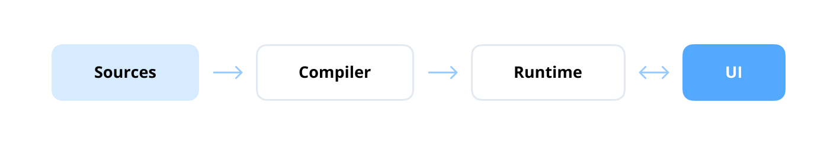
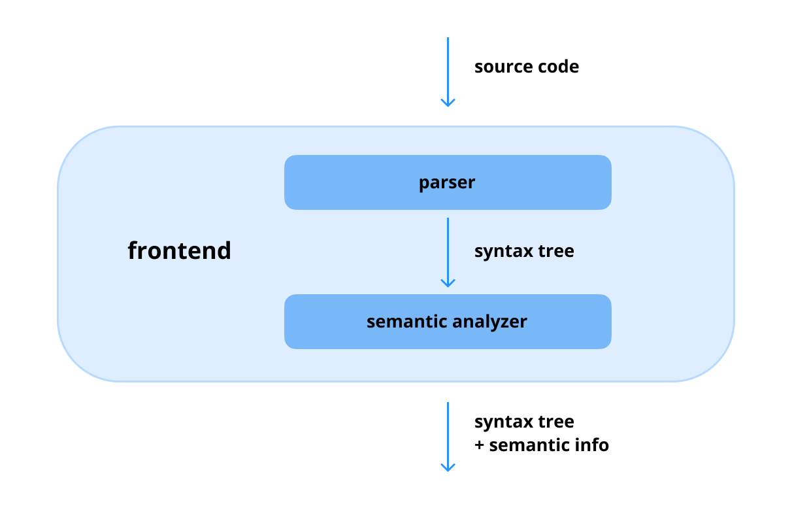
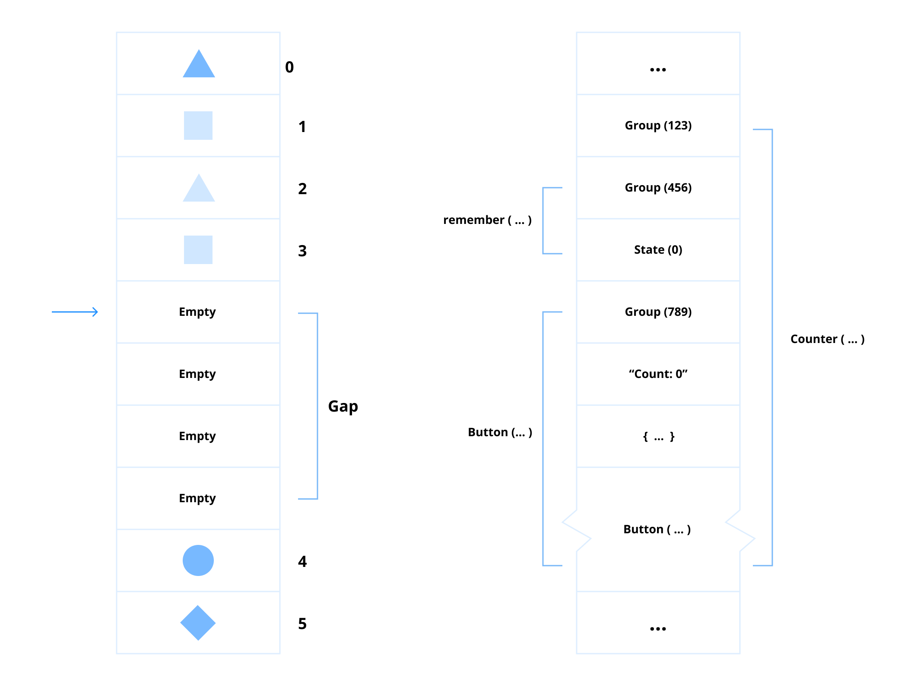
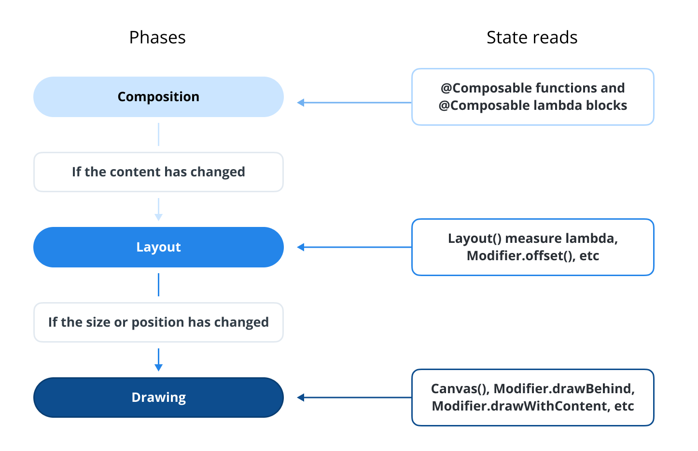
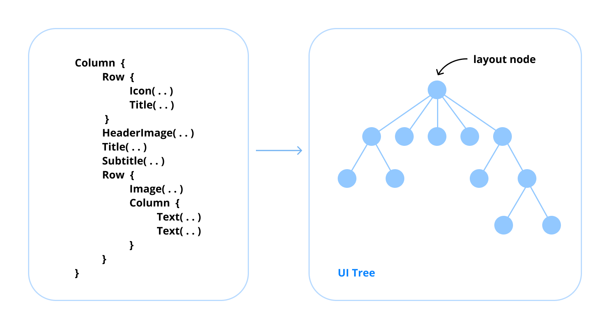
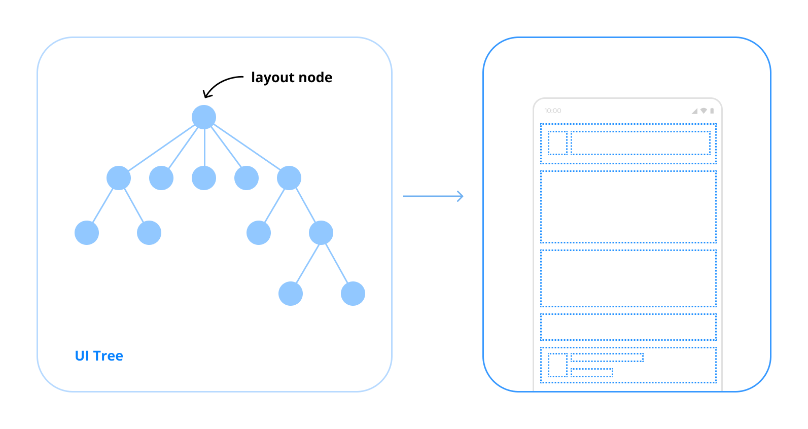
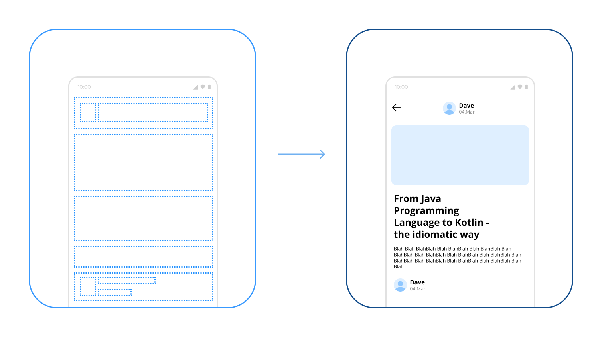
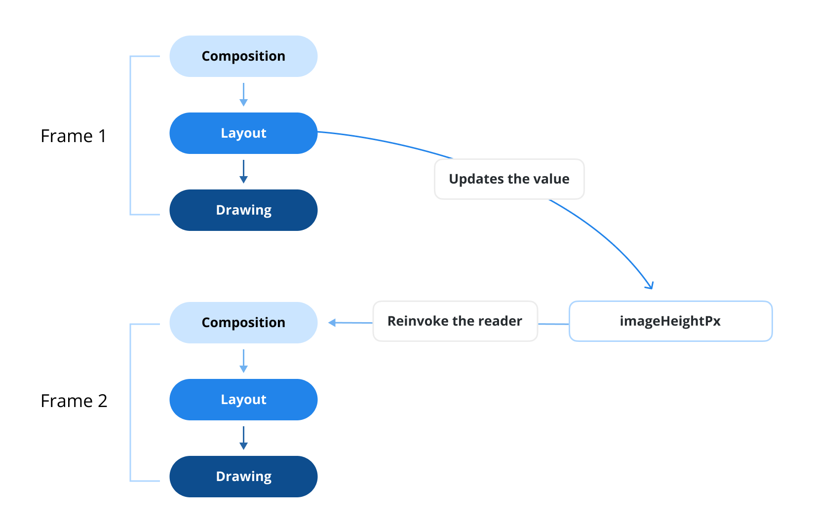
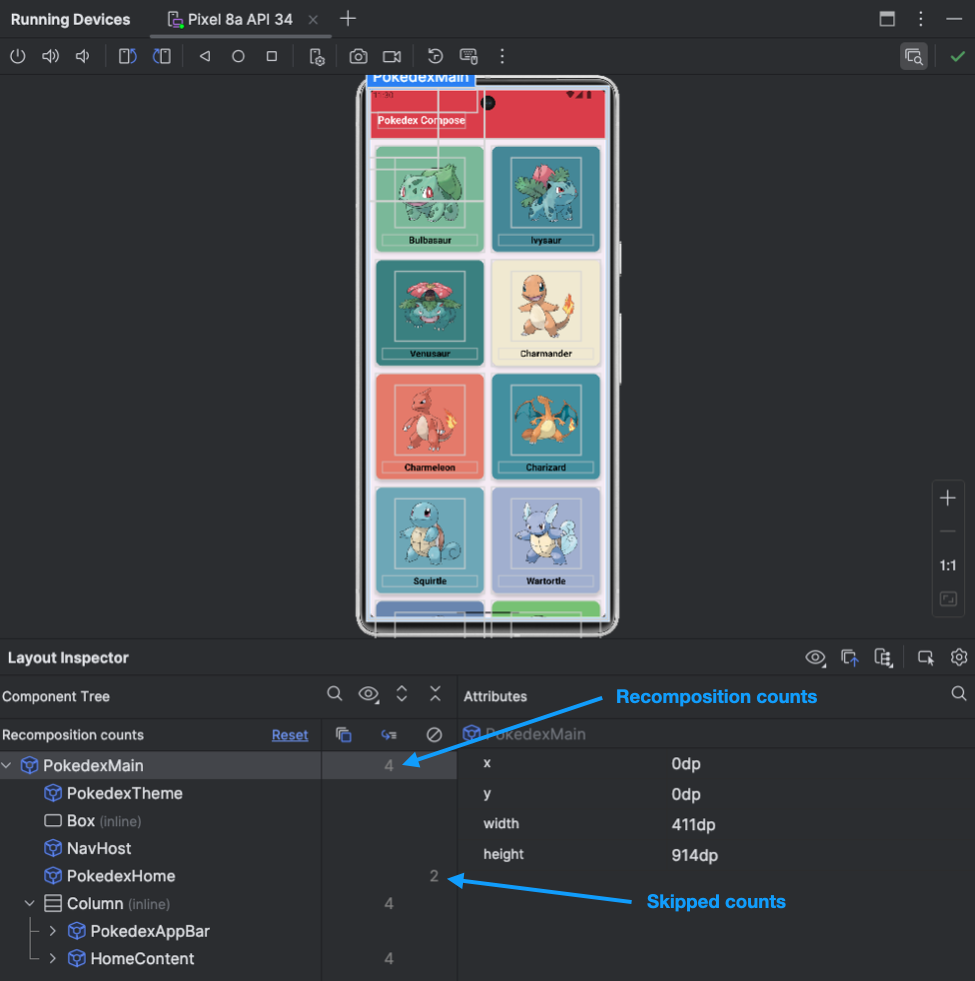

# 类别 0：Compose 基础

> 原书页码：270–319  
> 翻译状态：已完成（问题 0–10）

Jetpack Compose 由三个主要部分构成：Compose Compiler、Compose Runtime 和 Compose UI。构建 UI 界面常用的 `remember`、`LaunchedEffect`、`Box`、`Column`、`Row` 等 API，大多来自 Runtime 和 UI 层。不过，Compose 底层结构更为复杂；只要添加库依赖，它就能无缝集成进项目。

构建应用不必深入理解 Compose 内部实现，但了解整体架构有助于理解其不同角色，特别是 Compose 渲染阶段和声明式 UI 的本质。本分类会讨论一些更深入、初看较难理解的内容；若感觉复杂，可先阅读 Compose Runtime 或 Compose UI 分类，再回到这里。

---

## 问题 0：Jetpack Compose 的结构是什么？

Jetpack Compose 是使用声明式方式构建原生 Android 应用的现代 UI 工具包；JetBrains 构建的 Compose Multiplatform 还支持跨平台。它由 Compose Compiler、Compose Runtime 和 Compose UI 三部分组成；每部分都在将 UI 代码转换为可交互应用时发挥关键作用。



### Compose Compiler

Compose Compiler 负责把 Kotlin 编写的声明式 UI 代码转换为 Jetpack Compose 可执行的优化代码。它在编译期间处理 `@Composable` 函数，生成必要的 UI 更新和重组逻辑。该编译器与 Kotlin 编译器集成，确保高效代码生成，并支持状态管理、代码优化和 lambda lifting 等性能特性。

与 KAPT²、KSP³ 等传统注解处理工具不同，Compose Compiler Plugin 直接在 FIR（Frontend Intermediate Representation，前端中间表示）⁴ 上工作。这种深度集成让编译器在编译期获得更深入的静态代码信息，可动态转换 Kotlin 源码并生成优化 Java 字节码。Compose 库的 `@Composable` 等注解会与 Compose Compiler 内部机制协作，完成代码生成、重组管理和性能优化。该方式使其紧密融入 Kotlin 编译器流水线，同时提升开发效率和运行时性能。



### Compose Runtime

Compose Runtime 提供支持重组与状态管理的核心功能。它处理可变状态、管理 Snapshot，并在应用状态改变时触发 UI 更新。该组件是 Compose 响应式 UI 系统的引擎，确保根据状态变化动态更新正确的 UI 元素。

Compose Runtime 使用受 gap buffer⁶ 启发的 SlotTable⁵ 对 Composition 状态进行记忆化。在底层，它负责管理副作用⁷、用 `remember` 保留状态、状态变化时触发重组、用 CompositionLocal 存储上下文专属数据，以及构建 Compose Layout Node 以高效创建 UI 层级。该动态管理体系确保流畅、响应式的用户体验。



#### 精通专业提示：从 gap buffer 迁移到 Link Table


从 AOSP 代码⁸ 可见，Android 团队正从 gap buffer 迁移至 Link Table 数据结构。Link Table 使用链接节点组织数据，可高效插入、删除和重新排列元素。该变化旨在提升编辑 SlotTable 的性能，同时保留当前构建 SlotTable 时的效率。

### Compose UI

Compose UI 层提供构建应用的高层组件和 UI 控件，包括文本、按钮、布局容器等基础元素，以及构建自定义 UI 组件的高级 API。Compose UI 模块与 Android UI 系统集成，使基于 Compose 的 UI 能在 Android 设备上无缝渲染。

Compose UI 库提供丰富组件，用于简化 Compose Layout Tree 构建，随后由 Compose Runtime 处理。借助 Kotlin Multiplatform⁹，JetBrains 推出了稳定版 Compose Multiplatform¹⁰，使开发者能在 Android、iOS、桌面端和 WebAssembly 等多平台上用相同 Compose UI 库创建一致 UI。这种跨平台能力可简化开发并确保统一体验。


### 小结

Jetpack Compose 的结构有效分离关注点：Compose Compiler 将 UI 代码转化为可执行组件，Compose Runtime 管理状态和重组，Compose UI 层提供可直接使用的控件与 UI 组件。分层架构保证 Android 应用开发具有模块化、高效、易维护的特点。

### 实战题

**问：** Compose Compiler 的作用是什么？它与 KAPT、KSP 等传统注解处理器有何区别？

**问：** Compose Runtime 如何管理重组与状态？底层使用什么数据结构？

² https://kotlinlang.org/docs/kapt.html  
³ https://github.com/google/ksp  
⁴ **中间表示（IR）：** 编译器在编译中用来表示源代码的抽象代码结构，连接源代码与目标机器码，使平台无关优化、代码分析和高效代码生成成为可能。  
⁵ **SlotTable：** Jetpack Compose 在 Composition 阶段用于存储、管理 UI 元素状态的数据结构；它跟踪 UI 组件、关系和关联状态，以便仅更新受状态影响元素，从而优化重组。  
⁶ **gap buffer：** 常用于文本编辑器的数据结构，维护带“间隙”的连续内存块，可高效插入、删除字符，仅在必要时移动元素，降低频繁修改开销。  
⁷ **副作用：** 除返回值外还会影响程序状态或与外部环境交互的操作，例如修改变量、网络请求或更新 UI。  
⁸ https://android-review.googlesource.com/c/platform/frameworks/support/+/2644758  
⁹ https://kotlinlang.org/docs/multiplatform.html  
¹⁰ https://www.jetbrains.com/compose-multiplatform/

---

## 问题 1：Compose 的阶段是什么？

Jetpack Compose 有一条明确的渲染管线，分为三个关键阶段：**Composition、Layout、Drawing**。这些阶段按顺序协作，构建、排列并高效渲染 UI。



### Composition

Composition 阶段通过执行 `@Composable` 函数，为 Composable 创建描述并构建 UI Tree。此阶段 Compose 建立初始 UI 结构，并在 SlotTable¹¹ 数据结构中记录 Composable 之间的关系。状态改变时，Composition 阶段会重新计算受影响的 UI 部分，并在必要处触发重组。



Composition 的关键任务：

- 执行 `@Composable` 函数；
- 创建和更新 UI Tree；
- 跟踪变化以进行重组。

### Layout

Layout 阶段在 Composition 后执行。它依据提供的约束确定每个 UI 元素的尺寸和位置。每个 Composable 会测量子元素、决定自身尺寸，并定义相对于父级的位置。



Layout 的关键任务：

- 测量 UI 组件；
- 定义宽、高和位置；
- 在父容器中排列子元素。

### Drawing

Drawing 阶段将已经 Composition 和 Layout 的 UI 元素渲染到屏幕。Compose 使用 Skia 图形引擎，确保流畅的硬件加速渲染。可通过 Compose 的 Canvas API 实现自定义绘制逻辑。



Drawing 的关键任务：

- 渲染视觉元素；
- 在屏幕上绘制 UI 组件；
- 应用自定义绘制操作。

### 小结

Jetpack Compose 的三阶段渲染模型确保 UI 构建过程清晰、高效且可扩展：Composition 构建 UI Tree，Layout 排列组件，Drawing 将一切视觉化呈现。更深入内容参见 [Jetpack Compose Phases 官方文档](https://developer.android.com/develop/ui/compose/phases)¹²。

### 实战题

**问：** Composition 阶段发生什么？它与重组有什么关系？

**问：** Layout 阶段如何工作？

¹¹ **SlotTable：** Jetpack Compose 在 Composition 阶段用于存储、管理 UI 元素状态的数据结构；它跟踪 UI 组件、关系和关联状态，从而只更新受状态影响元素。  
¹² https://developer.android.com/develop/ui/compose/phases

---

## 问题 2：为什么 Jetpack Compose 是声明式 UI 框架？

Jetpack Compose 被认为是声明式 UI 框架，因为开发者描述的是 UI 在给定状态下应呈现什么样子，而非详细说明状态变化时应如何更新 UI。这与传统命令式 UI 不同：传统方式需要开发者手动操作 View、维护 UI 一致性。

### Jetpack Compose 声明式 UI 的关键特征

1. **状态驱动 UI：** 声明式框架将状态管理内置于框架。系统跟踪每个组件状态，状态改变时自动更新 UI。开发者只需定义给定状态下 UI 应有的样子，由框架处理渲染更新。Compose 的 UI 完全由状态驱动；状态变化时会触发重组，只更新受影响 UI 元素，无需手动管理 View。
2. **用函数或类定义组件：** 声明式框架鼓励将 UI 元素定义为模块化函数或类；组件同时描述 UI 布局与行为，缩小 XML 等标记语言与 Kotlin/Java 原生语言之间的鸿沟。Compose 中，`@Composable` 函数定义可复用 UI 组件，每个函数根据当前状态描述 UI，并可组合为模块化、可扩展的结构。
3. **直接数据绑定：** 模型数据可直接绑定到 UI 组件，无需手动同步，因此代码更清晰、可维护。在 Compose 中，开发者通过函数参数绑定数据，不需要中间数据绑定层或复杂 Adapter 模式。
4. **组件幂等性：** 对相同输入，无论调用多少次，组件均生成相同输出。Compose 中的 `@Composable` 函数本质上具备幂等性：提供相同输入参数时生成相同 UI，带来可预测、稳定的 UI 渲染。

### Jetpack Compose 与 XML

Compose 采用声明式 UI，可在 Kotlin 中直接嵌入状态条件，逻辑地编写 UI；状态改变时 UI 自动更新，因此状态管理、代码可读性更简单。以下按钮显示点击次数的例子体现这种方式：

```kotlin
@Composable
fun Main() {
    var count by remember { mutableStateOf(0) }
    CounterButton(count) { count++ }
}

@Composable
fun CounterButton(count: Int, onClick: () -> Unit) {
    Button(onClick = onClick) {
        Text("Clicked: $count")
    }
}
```

这个示例体现了声明式原则：`@Composable` 函数由 Compose Compiler 转换以定义 UI；`remember` 管理组件状态；`count` 参数直接绑定 UI；CounterButton 对相同输入稳定生成相同 UI。

XML 看似也具有声明式特征，因为 XML 本身描述了 UI 结构和属性，让框架处理底层渲染。但关键差异在状态和逻辑处理：XML 开发中，UI 结构、属性写在 XML，状态管理与 UI 更新则分离在 Java/Kotlin 命令式代码中，开发者需要手动同步 UI 和应用逻辑：

```kotlin
var counter = 0

binding.button.setOnClickListener {
    counter++
    binding.button.text = counter.toString()
}
```

相反，Compose 把状态管理和 UI 定义紧密整合在 Kotlin 中；状态改变时 UI 自动更新，可在同一位置定义 UI 以及其响应状态变化的方式，代码更内聚，避免分离的命令式处理器。

### 小结

Jetpack Compose 的声明式本质在于：开发者根据应用状态指定 UI 显示什么，由重组¹³ 自动处理 UI 如何更新。因此代码更清晰、易维护、可扩展；构建动态 UI 更直观，也显著降低 Android 应用开发复杂度。

### 实战题

**问：** Jetpack Compose 的声明式特性与传统命令式 XML UI 开发有何不同？它提供哪些优势？

**问：** Compose 如何在 Composable 中实现幂等性？为什么这对声明式 UI 系统很重要？

¹³ https://developer.android.com/develop/ui/compose/mental-model#recomposition

---

## 问题 3：什么是重组？何时发生？它与应用性能有什么关系？

当已经历 Composition、Layout 和 Drawing 三个主要阶段的 Compose UI 需要因状态变化而更新时，Compose 会重新执行受影响的 Composable 函数，并更新 UI。这个过程称为**重组（Recomposition）**。



重组并不会重新创建整个 UI。Compose Runtime 会追踪 Composition 中读取的 State，并在状态写入发生变化时，仅让读取了该状态的 Composable 参与重组。随后，它会尽可能跳过输入未变化且稳定的 Composable，从而避免不必要工作。

### 重组何时发生？

常见触发情形包括：

- `mutableStateOf`、`StateFlow`、`LiveData` 等可观察状态的值发生变化，并被 UI 读取；
- Composable 的参数变化；
- `CompositionLocal` 的值变化；
- 父 Composable 重组后，子 Composable 的输入也发生变化。

例如：

```kotlin
@Composable
fun Counter() {
    var count by remember { mutableStateOf(0) }

    Button(onClick = { count++ }) {
        Text("Clicked: $count")
    }
}
```

点击按钮后，`count` 改变，读取 `count` 的 `Text` 所在组合范围会重组，以显示新值。Compose 会保留未受影响的部分，而不是像传统命令式 UI 那样手动查找并修改某个 View。

### 重组与性能

重组是 Compose 响应式 UI 的基础，也直接影响性能。合理的重组只更新受状态影响的 UI，因此高效；但若状态范围过大、不稳定参数频繁变化，或在 Composable 中执行昂贵计算，可能使过多 Composable 重组，引发掉帧、卡顿和额外内存分配。

性能优化原则包括：

- 将状态下沉或拆分，缩小状态变化影响的组合范围；
- 为昂贵计算使用 `remember`、为衍生状态使用 `derivedStateOf`；
- 使用稳定、不可变的数据模型，避免在每次重组中创建新集合、lambda 或对象；
- 为列表提供稳定 key，并避免在 Composable 函数体中执行网络、数据库等副作用；
- 使用 Layout Inspector、Compose 相关工具和 release 构建测试实际性能。



### 小结

重组是 Compose 在状态或输入变化时重新执行受影响 Composable 的增量 UI 更新机制。它通过状态读取追踪与跳过机制避免重绘整个界面；正确设计状态和参数可让重组保持高效，而不恰当的状态范围和不稳定对象则会成为性能问题来源。

### 实战题

**问：** Compose 如何判断哪些 Composable 需要重组？为什么它不需要重新渲染整个界面？

**问：** 哪些代码模式会造成不必要重组？如何定位和优化这些问题？

---

## 问题 4：Composable 函数在内部如何工作？

Composable 函数是 Jetpack Compose 创建 UI 的构建块。表面上它只是标有 `@Composable` 的 Kotlin 函数，但 Compose Compiler 会在编译期转换它：为函数增加 Composition 上下文、变化追踪和重组控制所需的隐藏参数与逻辑。

调用 Composable 时，Runtime 会把它纳入 Composition，并在 SlotTable 中记录调用位置、参数和 `remember` 等状态。状态改变后，Runtime 能根据这些记录找到需要更新的组合范围。若参数未变化且函数可跳过，Compose 会跳过该函数；若参数或读取状态变化，则重新执行该函数并更新相应 UI 节点。

```kotlin
@Composable
fun Greeting(name: String) {
    Text("Hello, $name")
}
```

从开发者视角，Greeting 像普通函数；从编译结果角度，它会接收用于管理 Composition 的 Composer、changed flags 等信息。Compiler 利用这些信息决定参数是否变化、函数是否可跳过，并在需要时插入 group 边界与状态读取记录。

### 关键机制

- **Composition Group：** 每次 Composable 调用会在 Composition 中形成可追踪 group，使 Runtime 能局部更新。
- **SlotTable：** 保存 Composable 调用顺序、状态及关系，支持 `remember` 与增量重组。
- **状态读取追踪：** Composable 读取 State 时，Runtime 建立依赖；State 改变时通知对应组合范围。
- **跳过（Skipping）：** 若输入稳定且未变化，Compose 可跳过函数执行，降低重组成本。
- **副作用管理：** `LaunchedEffect`、`DisposableEffect` 等 API 将副作用绑定到 Composition 生命周期，避免在每次重组中重复启动。

### 小结

Composable 函数并非传统 View 的命令式创建器，而是 UI 状态的声明。Compose Compiler 将其转换为可被 Runtime 跟踪、跳过和重组的调用；Runtime 通过 SlotTable 与状态依赖，实现局部、增量 UI 更新。

### 实战题

**问：** Compose Compiler 对 `@Composable` 函数做了哪些关键转换？这些转换如何支持重组与跳过？

**问：** 为什么不应依赖 Composable 函数只执行一次？副作用应如何管理？

---

## 问题 5：Jetpack Compose 中的稳定性（Stability）是什么？它与性能有什么关系？

稳定性是 Compose Compiler 用来判断某个 Composable 参数是否可安全用于跳过重组的重要属性。若 Compose 知道参数是稳定的，并且比较后发现其值未变化，便可跳过相应 Composable 的执行；若参数不稳定，或 Compose 无法证明它稳定，则即使引用相同，也可能重新执行 Composable，以保证 UI 正确性。

### 稳定类型的特征

通常可将稳定类型理解为满足以下条件的类型：

- 两次相等比较结果始终一致；
- 类型公开属性发生变化时，Compose 能收到通知；
- 所有公开属性本身也是稳定的。

基本类型、String、不可变数据模型，以及包含 Compose State 的类通常更容易被识别为稳定。反之，具有公开可变属性、使用普通 `MutableList`/`MutableMap`，或来自编译器无法分析的模块的类型，可能被视为不稳定。

```kotlin
@Immutable
data class UserUiState(
    val name: String,
    val isLoading: Boolean,
)

@Composable
fun UserCard(state: UserUiState) {
    Text(state.name)
}
```

这里的不可变 `UserUiState` 易于被 Compose 视为稳定；当 state 未改变时，`UserCard` 可以被跳过。

### 稳定性与性能

稳定性本身不改变 UI 功能，但会影响 Compose 能否跳过不必要重组。稳定、不可变参数能让 Compiler 做出更准确的 skipping 决策，从而降低 CPU 工作、内存分配和布局/绘制压力。反之，不稳定参数频繁传入会扩大重组范围，尤其在复杂列表或高频状态变化场景中可能造成卡顿。

但不应为了“让类型稳定”而牺牲代码正确性或可读性。Compose 的重组通常已足够高效；只有通过性能工具确定重组是热点时，才应针对稳定性优化。

### 常见实践

- 优先使用不可变 `data class` 表示 UI state；
- 不直接把可变集合暴露给 UI；使用 `persistentListOf` 等不可变集合或每次创建新值；
- 把状态缩小到真正需要它的 Composable，避免大范围参数变化；
- 对无法推断但确实满足稳定性契约的类型，谨慎使用 `@Stable` 或 `@Immutable`；错误标注会让 UI 无法及时更新；
- 用 Compose Compiler reports、Layout Inspector、系统 Trace 验证优化收益。

### 小结

Compose 稳定性决定 Runtime 在参数未变时能否跳过 Composable。稳定、不可变的状态模型有助于减少无效重组并提升性能；但应以测量结果为依据，避免过度优化或错误注解。

### 实战题

**问：** 什么样的参数会使 Composable 难以跳过？如何将一个可变 UI 模型改造成稳定模型？

**问：** `@Stable`、`@Immutable` 应在什么情况下使用？错误使用有什么风险？

---

## 问题 6：是否有通过改善稳定性优化 Compose 性能的经验？

优化 Compose 稳定性通常从识别频繁、无效的重组开始：先通过 Compose Compiler 报告、布局检查器或 Macrobenchmark 找出热点，再检查传给热点 Composable 的参数是否是可变集合、不稳定对象或每次重组新建的 lambda、列表和包装对象。

常见优化方式包括：

1. **使用不可变 UI state：** 将 UI 状态建模为不可变 data class，更新时使用 `copy()` 创建新状态，而不是修改公开字段。
2. **避免在 Composition 中创建不稳定对象：** 对需要跨重组保留的对象使用 `remember`，例如格式化器、回调包装器或昂贵计算结果。
3. **使用 `rememberUpdatedState`：** 对长期运行的副作用保存最新回调或值，避免因 lambda 更新而重启 Effect。
4. **使用 `derivedStateOf`：** 对滚动位置、筛选条件等高频状态建立衍生状态，只在真正结果变化时触发下游重组。
5. **将列表项拆分为较小 Composable：** 使用稳定 key 与不可变 item，确保单项变化不会使整个列表内容重组。
6. **谨慎标注稳定性：** 当类型确实满足稳定性契约、但编译器无法推断时，才使用 `@Immutable` 或 `@Stable`。

```kotlin
@Composable
fun SearchScreen(query: String, items: ImmutableList<Item>) {
    val filteredItems by remember(query, items) {
        derivedStateOf { items.filter { it.name.contains(query, ignoreCase = true) } }
    }

    LazyColumn {
        items(filteredItems, key = { it.id }) { item ->
            ItemRow(item)
        }
    }
}
```

这个示例将派生计算限制在 query 或 items 改变时，并为列表项提供稳定 key，从而减少不必要工作。

### 小结

改善稳定性的关键不是盲目给所有类型添加注解，而是让 UI state 不可变、缩小状态影响范围、避免每次重组创建新对象，并使用工具验证重组热点。这样可在保持正确性的同时提升 Compose 性能。

### 实战题

**问：** 如何使用 Compiler report 或性能工具定位不稳定参数造成的重组？

**问：** 面对频繁变化的列表和筛选条件，如何设计状态、key 和派生计算以减少无效重组？

---

## 问题 7：什么是 Composition？如何创建它？

Composition 表示应用当前的 Compose UI，是执行 Composable 函数后生成的 UI 描述。它记录 Composable 调用关系、状态、效果和布局节点；当状态变化时，Runtime 依据 Composition 进行增量重组，而不是重新构建整个界面。

应用通常不需要手动创建 Composition。Android 上，`setContent { ... }` 会创建根 Composition，并将其关联到 Activity、Fragment 中的 ComposeView 或其他宿主：

```kotlin
class MainActivity : ComponentActivity() {
    override fun onCreate(savedInstanceState: Bundle?) {
        super.onCreate(savedInstanceState)
        setContent {
            MaterialTheme {
                App()
            }
        }
    }
}
```

在 View 系统中嵌入 Compose 时，可使用 `ComposeView`：

```kotlin
val composeView = ComposeView(context).apply {
    setViewCompositionStrategy(
        ViewCompositionStrategy.DisposeOnViewTreeLifecycleDestroyed
    )
    setContent { App() }
}
```

Composition 与宿主生命周期绑定。宿主销毁时应正确 dispose Composition，以释放 remember 状态、Effect 和资源；ComposeView 的 CompositionStrategy 可控制处置时机。

### 小结

Composition 是 Compose UI 当前结构和状态的运行时表示。通常由 `setContent`、ComposeView 自动创建和管理；理解其生命周期有助于正确处理状态、副作用和 View/Compose 互操作。

### 实战题

**问：** Activity 的 `setContent` 与 ComposeView 的 `setContent` 如何创建 Composition？两者的生命周期管理有什么区别？

**问：** 在 Fragment 中嵌入 Compose 时，为什么应设置合适的 ViewCompositionStrategy？

---

## 问题 8：从 XML 项目迁移到 Jetpack Compose 有哪些策略？

XML View 系统与 Compose 可以长期共存，因此迁移不必一次完成。最安全的策略是渐进式迁移：优先选择独立、低风险页面或新功能，用 Compose 构建；保留复杂、稳定的既有 View 页面，随后根据业务价值逐步替换。

常见策略：

1. **新功能优先使用 Compose：** 不改动稳定旧页面，降低迁移风险。
2. **在 XML 中嵌入 Compose：** 用 `ComposeView` 替换局部区域，例如列表 item、设置模块或新卡片。
3. **在 Compose 中复用 View：** 使用 `AndroidView`、`AndroidViewBinding` 包装尚未有 Compose 替代的现有 View、WebView 或第三方控件。
4. **共享状态与业务层：** 先将 ViewModel、Repository、导航参数、设计系统等从 View 实现中抽离，使两种 UI 技术共享状态和领域逻辑。
5. **逐步迁移设计系统：** 先迁移颜色、排版、间距、组件规范，再迁移完整页面，避免视觉不一致。
6. **评估导航和测试：** 保持 Navigation、深层链接、无障碍与 UI 测试覆盖，避免迁移仅改变界面而破坏功能。

```kotlin
// 在 XML/View 层级中使用 Compose
composeView.setContent {
    MaterialTheme { ProfileCard(user) }
}

// 在 Compose 中复用既有 Android View
AndroidView(factory = { context -> LegacyChartView(context) })
```

### 小结

渐进式、可互操作的迁移比重写整个应用更可靠。让 Compose 与 XML 共存，优先新功能和独立区域，并复用共享的状态、业务逻辑和设计系统，可在控制风险的同时持续获得 Compose 的收益。

### 实战题

**问：** 迁移大型 XML 应用时如何选择首批 Compose 页面？如何降低导航、状态和设计一致性风险？

---

## 问题 9：为什么应始终在 release 模式测试 Compose 性能？

debug 构建包含调试检查、额外日志、可调试标志和较少优化；它的运行时行为、帧时间、重组成本、R8 优化结果与用户实际安装的 release 构建不同。仅在 debug 模式观察 Compose 性能，可能得到错误结论：把工具和调试开销误认为 Compose 性能问题，或忽略 release 下因 R8、Baseline Profile、真实设备调度带来的差异。

测试 Compose 性能时应使用接近生产的 release 或 benchmark build，并确保：

- 在真实或接近真实的设备、数据规模和网络条件下测试；
- 使用 Macrobenchmark、Baseline Profile、系统 Trace、JankStats 等工具；
- 关闭不必要调试开关，避免 Android Studio profiler 本身改变结果；
- 分析首帧、滚动、动画、重组次数、布局/绘制时间和内存分配；
- 对比优化前后基准，而非只凭主观感觉。

### 小结

release 模式最接近最终用户环境。Compose 性能优化必须依赖可重复的 release 基准测试，才能区分真实瓶颈与 debug 工具开销，并验证优化是否真的减少卡顿。

### 实战题

**问：** debug 与 release 构建在 Compose 性能分析中有哪些关键差异？如何建立可信的性能基准？

---

## 问题 10：Jetpack Compose 中常用哪些 Kotlin 惯用写法？

Compose 大量利用 Kotlin 的语言特性，使 UI 声明简洁、类型安全且可组合。常见惯用写法包括：

- **lambda 与 trailing lambda：** 将事件回调、内容插槽作为函数参数传入，例如 `Button(onClick = {}) { Text(...) }`。
- **属性委托：** 使用 `by remember { mutableStateOf(...) }`、`collectAsStateWithLifecycle()` 等方式简化 State 读取和更新。
- **data class 与 copy：** 用不可变 data class 表示 UI state，并用 `copy()` 更新部分字段。
- **sealed interface / sealed class：** 建模 UI state、事件和单次 Effect，保证 `when` 穷尽处理。
- **扩展函数：** 为 Modifier、状态或领域模型定义可复用、可读的 Compose 扩展。
- **作用域函数：** 使用 `let`、`run`、`apply`、`also` 构建对象、处理可空值和配置 Modifier；应避免过度嵌套导致可读性下降。
- **高阶函数与默认参数：** 构建可配置、可复用 Composable API。
- **Flow 与协程：** 在 ViewModel 暴露 StateFlow，在 UI 层通过生命周期感知 API 收集。

```kotlin
data class ProfileUiState(val name: String = "", val loading: Boolean = false)

sealed interface ProfileEvent {
    data object Retry : ProfileEvent
    data class NameChanged(val value: String) : ProfileEvent
}

@Composable
fun ProfileScreen(
    state: ProfileUiState,
    onEvent: (ProfileEvent) -> Unit,
    modifier: Modifier = Modifier,
) {
    Column(modifier.padding(16.dp)) {
        Text(state.name.ifBlank { "Anonymous" })
        Button(onClick = { onEvent(ProfileEvent.Retry) }) {
            Text("Retry")
        }
    }
}
```

### 小结

Compose 并不要求特殊 Kotlin 方言，但其声明式、状态驱动模型与 lambda、不可变 data class、委托、sealed 类型、扩展函数和协程/Flow 天然契合。合理使用这些惯用写法可让 UI 更易读、可测试、可复用。

### 实战题

**问：** 如何用 Kotlin sealed 类型和不可变 UI state 建模 Compose 屏幕状态、用户事件与一次性 Effect？

**问：** 在 Compose API 中使用默认参数、内容 lambda 与 Modifier 参数时，应遵循哪些设计原则？
