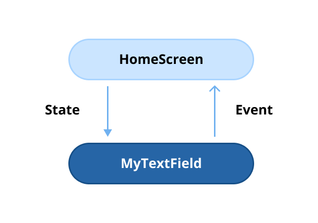
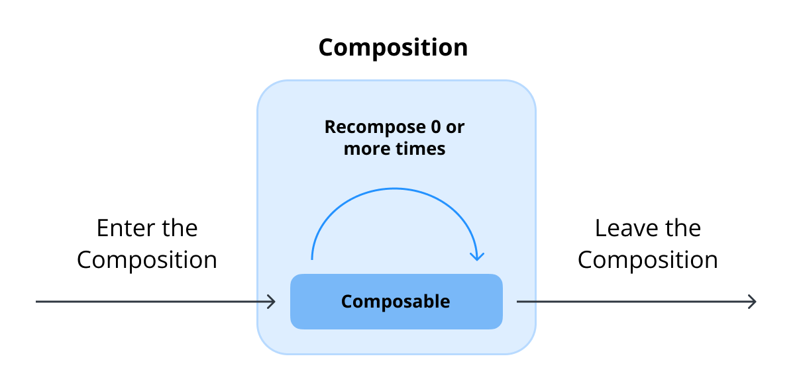
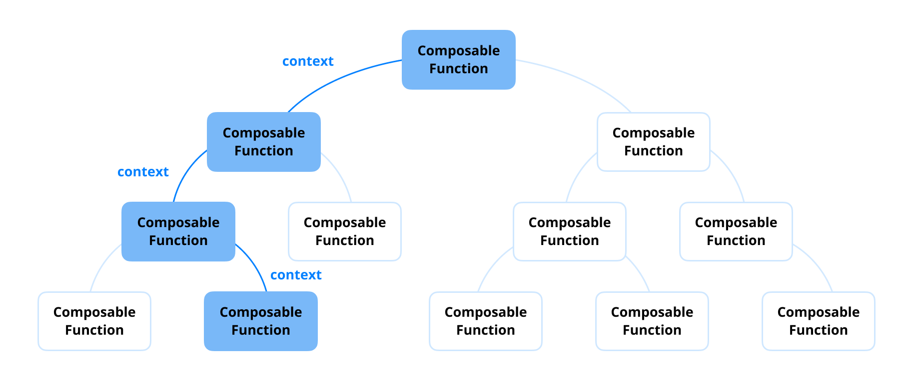
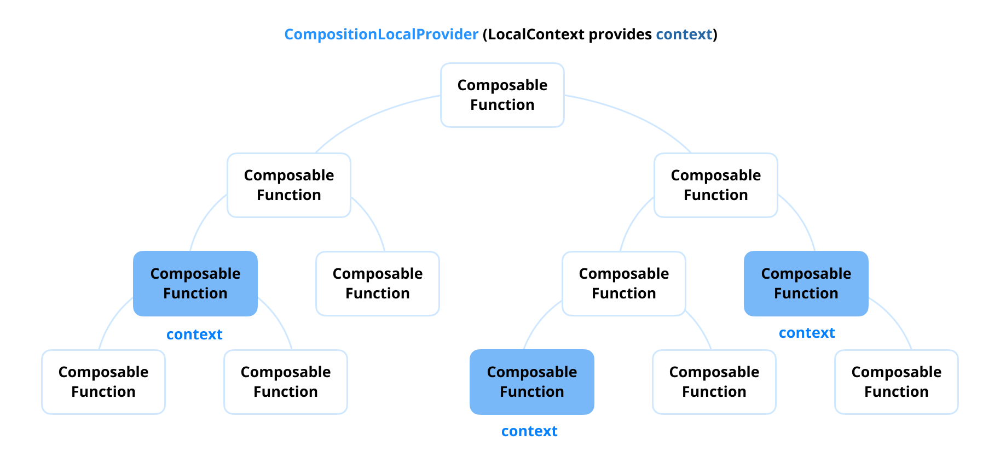

# 类别 1：Compose Runtime

> 原书页码：320–378  
> 翻译状态：已完成（问题 11–25）

Compose Runtime 是 Jetpack Compose 的基础组件，也是其编程模型和状态管理的核心引擎。Jetpack Compose 的设计足够直观，即使不了解底层组件也能顺畅使用；但理解 Compose Runtime API 对优化性能和内存管理非常重要。

Compose Runtime 会在底层自动管理状态，减少手动干预。不过，理解所用 API 的内部工作方式，有助于构建更高效的应用并减少意外副作用，尤其是在处理状态和副作用时。

---

## 问题 11：什么是 State？哪些 API 可用于管理它？

在 Jetpack Compose 中，[State](https://developer.android.com/develop/ui/compose/state)⁴⁸ 是指会随时间变化、代表应用 UI 动态部分的任意值。例如网络错误的 Snackbar 消息、表单中的用户输入，或交互触发的动画，都是状态。状态对 Compose 这类声明式框架至关重要，因为它直接驱动 UI 更新：Compose 根据当前状态计算 Composable 来渲染 UI，并在状态改变时重新计算。

### State 与 Composition

Jetpack Compose 采用声明式 UI：当以更新后的参数调用 Composable 时，UI 才会更新。这一行为与 Composition 生命周期紧密关联：

- **初始 Composition：** 执行 Composable，首次创建并渲染 UI Tree 的过程。
- **重组（Recomposition）：** 状态发生变化时，更新相关 Composable 以反映新状态。

Compose Runtime 会自动追踪状态变化并更新 UI，无需像传统 Android View 系统一样手动调用 `View.invalidate()`。只有需要反映更新状态的 Composable 函数才会重组。下面的示例展示了状态变化如何自动反映到 UI：

```kotlin
@Composable
fun HelloContent() {
    Column(modifier = Modifier.padding(16.dp)) {
        var name by remember { mutableStateOf("") }

        if (name.isNotEmpty()) {
            Text(text = "Hello, $name!", modifier = Modifier.padding(bottom = 8.dp))
        }

        TextField(
            value = name,
            onValueChange = { name = it },
            label = { Text("Name") }
        )
    }
}
```

此处 `name` 状态改变时，`Text` 和 `TextField` 会自动更新，确保 UI 始终与最新状态同步。

### 在 Compose 中管理状态

Jetpack Compose 提供多种有效管理状态的工具：

1. **`remember`：** 在初始 Composition 时将对象保存在内存中，并在重组时取回它。

   ```kotlin
   var count by remember { mutableStateOf(0) }
   ```

2. **`rememberSaveable`：** 在屏幕旋转等配置变更后保留状态。它适用于可保存进 `Bundle` 的类型，也可通过自定义 `Saver` 保存其他类型。
3. **`mutableStateOf`：** 创建可观察状态对象；其值变化时会触发重组。

   ```kotlin
   val mutableState = remember { mutableStateOf("") }
   var value by remember { mutableStateOf("") }
   val (value, setValue) = remember { mutableStateOf("") }
   ```

### 小结

State 是 Jetpack Compose 的基石，它通过自动重组使 UI 与数据变化保持同步。由于 State 会高效触发重组，开发者不必手动更新、重新渲染 UI 层级；但意外重组仍可能发生并降低性能。因此，理解 State 的工作方式是构建高效 Compose 应用的前提。

### 实战题

**问：** State 与重组有什么关系？重组期间发生了什么？

---

## 问题 12：状态提升（state hoisting）有哪些优点？

[状态提升](https://developer.android.com/develop/ui/compose/state-hoisting)⁴⁹ 是把状态从某个 Composable 移到更高层组件或父级的模式。它会将当前状态值和更新状态的 lambda 作为参数传给 Composable。状态提升遵循单向数据流原则，使 UI 更容易管理，也更容易扩展。

在状态提升中：

- 状态由父 Composable 管理；
- 子级把事件或触发器（如 `onClick`、`onValueChange`）传回父级，父级据此更新状态；
- 更新后的状态再以参数向下传递给子级，形成单向数据流。

```kotlin
@Composable
fun Parent() {
    var sliderValue by remember { mutableStateOf(0f) }

    SliderComponent(
        value = sliderValue,
        onValueChange = { sliderValue = it }
    )
}

@Composable
fun SliderComponent(value: Float, onValueChange: (Float) -> Unit) {
    Slider(value = value, onValueChange = onValueChange)
}
```

### 状态提升的主要优点

- **更好的复用性：** 通过传入状态和事件回调，Composable 可保持无状态并在不同屏幕或上下文中复用，而不依赖某个具体实现。
- **测试更简单：** 无状态 Composable 的行为完全取决于传入参数，因而可预测，也更易构造清晰的测试场景。
- **职责分离更清楚：** 将状态逻辑移至父 Composable 或 ViewModel 后，UI 元素只负责渲染；业务逻辑与 UI 代码分离，维护性更高。
- **支持单向数据流：** 状态从单一事实来源流出，能减少多个来源同时管理同一状态引起的意外行为。
- **状态管理更集中：** 可将复杂 UI 流程、实例状态保存和状态恢复集中在 ViewModel 或更高层容器中处理。

### 小结

状态提升能使代码更整洁、模块化且可测试；它以单向数据流提高复用性和可维护性。保持 Composable 无状态，可创建能适应不断变化需求的灵活 UI 组件。

### 实战题

**问：** 状态提升如何改善 Composable 函数的可复用性与可测试性？

**问：** 哪些情形下会避免状态提升，而将状态保留在 Composable 内部？

### 精通专业提示：用代码理解有状态、无状态与状态提升


状态提升是一种设计模式：通过把状态管理移至调用点，将有状态 Composable 转为无状态 Composable。它通常把内部用 `remember` 管理的状态变量替换为两个参数：当前状态值和更新状态的回调。这种职责分离能让 Composable 更整洁、更可复用、更易测试。



例如，`MyTextField` 可以直接从父级接收文本值及处理用户输入的回调，使数据流清晰。它只负责 UI 渲染，状态管理则留给调用方，从而降低复杂度、提高模块化。

下面是有状态的 `MyTextField`：

```kotlin
@Composable
fun HomeScreen() {
    MyTextField()
}

@Composable
fun MyTextField() {
    val (value, onValueChanged) = remember { mutableStateOf("") }

    TextField(value = value, onValueChange = onValueChanged)
}
```

该实现由 `MyTextField` 自己管理输入状态，调用点 `HomeScreen` 无需关心状态，写法较简单；但外部更难控制和定制其行为，跨场景复用的灵活性较低。

另一种等价实现是无状态 Composable：

```kotlin
@Composable
fun HomeScreen() {
    val (value, onValueChanged) = remember { mutableStateOf("") }

    MyTextField(
        value = value,
        onValueChanged = onValueChanged
    )
}

@Composable
fun MyTextField(
    value: String,
    onValueChanged: (String) -> Unit
) {
    TextField(value = value, onValueChange = onValueChanged)
}
```

这里 `MyTextField` 通过参数反映变化，并把状态管理委托给 `HomeScreen`。虽然代码略长，但显著提升了复用性。这正是状态从被调用者（`MyTextField`）提升到调用者（`HomeScreen`）的含义。

无状态写法还可在不修改原 Composable 的前提下轻松定制。例如，限制用户输入数字：

```kotlin
@Composable
fun HomeScreen() {
    val (value, onValueChanged) = remember { mutableStateOf("") }
    val processedValue by remember(value) {
        derivedStateOf { value.filter { !it.isDigit() } }
    }

    MyTextField(
        value = processedValue,
        onValueChanged = onValueChanged
    )
}
```

由外部控制与加工状态，使同一组件可适配不同上下文，代码库也更整洁、易维护。

---

## 问题 13：`remember` 和 `rememberSaveable` 有什么区别？

在 Jetpack Compose 中，状态管理使 UI 能够动态响应数据变化。`remember` 与 `rememberSaveable` 都能跨重组保留状态，但用途不同，适合的场景也不同。

### 理解 `remember`

- **目的：** `remember` 将值保存在内存中，并跨重组保留它；但它无法在旋转屏幕等配置变更或进程重启期间保存状态。
- **适用场景：** 状态无需跨配置变更时，例如旋转后可重置的临时计数器。

```kotlin
@Composable
fun RememberExample() {
    var count by remember { mutableStateOf(0) }

    Button(onClick = { count++ }) {
        Text("Clicked $count times")
    }
}
```

设备旋转后，`count` 会重置为 `0`，因为 `remember` 只在当前 Composition 生命周期内保存状态。

### 理解 `rememberSaveable`

- **目的：** `rememberSaveable` 在 `remember` 的基础上跨配置变更保存状态；它会自动保存、恢复可存入 `Bundle` 的值。
- **适用场景：** 需要跨配置变更保留的状态，例如表单输入或导航状态。

```kotlin
@Composable
fun RememberSaveableExample() {
    var text by rememberSaveable { mutableStateOf("") }

    OutlinedTextField(
        value = text,
        onValueChange = { text = it },
        label = { Text("Enter text") }
    )
}
```

`text` 会在旋转屏幕等配置变更后保留，带来连续的用户体验。

### 关键差异

| 特性 | `remember` | `rememberSaveable` |
| --- | --- | --- |
| 保留范围 | 仅当前 Composition 生命周期 | Composition 与配置变更 |
| 存储位置 | 内存 | 内存，并保存到 `Bundle` |
| 自定义 Saver | 不适用 | 支持复杂对象的自定义 Saver |

### 何时使用

- 对动画、临时 UI 等无需超出当前 Composition 的短暂状态使用 `remember`。
- 对用户输入、选择状态或表单数据等需要跨配置变更保存的状态使用 `rememberSaveable`。

### 小结

`remember` 适合单个 Composition 内的短暂状态，`rememberSaveable` 则能在配置变更后恢复状态。后者的额外能力也有开销，因此不必对每个状态都使用它。理解二者差异，才能为应用需求选择最高效的 API。

### 实战题

**问：** 哪些情况下应优先选用 `rememberSaveable` 而不是 `remember`？需要权衡什么？

**问：** 如何用 `rememberSaveable` 保存默认不支持的自定义非基本类型状态？

### 精通专业提示：`remember` 与 `rememberSaveable` 的内部实现


`remember` 的内部实现如下：

```kotlin
@Composable
inline fun <T> remember(crossinline calculation: @DisallowComposableCalls () -> T): T =
    currentComposer.cache(false, calculation)
```

它在 `Composer` 实例上调用 `cache`：

```kotlin
@ComposeCompilerApi
inline fun <T> Composer.cache(invalid: Boolean, block: @DisallowComposableCalls () -> T): T {
    @Suppress("UNCHECKED_CAST")
    return rememberedValue().let {
        if (invalid || it === Composer.Empty) {
            val value = block()
            updateRememberedValue(value)
            value
        } else it
    } as T
}
```

该实现会检查值是否失效或尚未初始化（`Composer.Empty`）。若是，则计算 `block`、将结果存入 Composition 数据并返回；否则直接返回已记住的值。由此，它能跨重组保留值且避免重复计算；Compose Compiler Plugin 会在确认安全时利用此机制优化 `remember` 调用。

`rememberSaveable` 的实现则在此基础上增加了保存和恢复能力：

```kotlin
@Composable
fun <T : Any> rememberSaveable(
    vararg inputs: Any?,
    saver: Saver<T, out Any> = autoSaver(),
    key: String? = null,
    init: () -> T
): T {
    val compositeKey = currentCompositeKeyHash
    val finalKey = if (!key.isNullOrEmpty()) key else compositeKey.toString(MaxSupportedRadix)
    @Suppress("UNCHECKED_CAST")
    (saver as Saver<T, Any>)
    val registry = LocalSaveableStateRegistry.current
    val holder = remember {
        val restored = registry?.consumeRestored(finalKey)?.let { saver.restore(it) }
        val finalValue = restored ?: init()
        SaveableHolder(saver, registry, finalKey, finalValue, inputs)
    }
    val value = holder.getValueIfInputsDidntChange(inputs) ?: init()
    SideEffect { holder.update(saver, registry, finalKey, value, inputs) }
    return value
}
```

其工作过程如下：

1. **生成 key：** 可使用用户提供的 `key`；未提供时，以当前 Composition 的 hash 自动生成组合 key。
2. **恢复状态：** 从 `LocalSaveableStateRegistry` 读取该 key 的既有值，并用 `Saver` 恢复。
3. **初始化默认值：** 没有已保存值时，通过 `init` lambda 创建默认值。
4. **创建 `SaveableHolder`：** 它负责管理状态、Saver、Registry 与输入。
5. **处理输入变化：** `inputs` 改变时，状态失效并重新初始化。
6. **副作用保存：** `SideEffect` 会在重组后把最新状态写入 Registry。

因此，`rememberSaveable` 借助 `LocalSaveableStateRegistry` 在旋转等配置变更乃至进程死亡后恢复状态；`saver` 参数还让开发者能为复杂对象定义序列化、反序列化逻辑。

---

## 问题 14：如何在 Composable 函数中安全地创建协程作用域？

在 Jetpack Compose 中，建议使用 [`rememberCoroutineScope`](https://developer.android.com/develop/ui/compose/side-effects#remembercoroutinescope)⁵⁰ 在 Composable 内安全创建和管理协程作用域。它会让作用域与 Composition 绑定，避免内存泄漏和不当资源使用。

### 为什么使用 `rememberCoroutineScope`？

`rememberCoroutineScope` 提供具备 Composition 感知能力的协程作用域。当 Composable 离开 Composition 时，其中所有仍在运行的协程都会自动取消。因此，无需手动管理生命周期，也可安全地从 Composable 发起协程。

```kotlin
@Composable
fun CounterWithReset() {
    var count by remember { mutableStateOf(0) }
    val coroutineScope = rememberCoroutineScope()

    Column(
        modifier = Modifier.padding(16.dp),
        horizontalAlignment = Alignment.CenterHorizontally
    ) {
        Text("Count: $count", style = MaterialTheme.typography.h5)
        Spacer(modifier = Modifier.height(8.dp))
        Button(onClick = { count++ }) {
            Text("Increment")
        }
        Spacer(modifier = Modifier.height(8.dp))
        Button(onClick = {
            coroutineScope.launch {
                // Simulate a delay for reset
                delay(1000)
                count = 0
            }
        }) {
            Text("Reset After 1s")
        }
    }
}
```

### 它如何工作

1. **Composition 感知：** 该作用域以 Composition 为边界；Composable 被移除时，其中发起的协程会取消。
2. **状态管理：** `remember` 用于保存需跨重组存在的状态；与 `rememberCoroutineScope` 配合时，可安全管理异步任务。
3. **避免内存泄漏：** 相比 `GlobalScope` 或手动创建、清理作用域，它能在 Composable 不再使用时正确释放资源。

### 最佳实践

- 对绑定 Composition 生命周期的轻量级、UI 专属任务使用 `rememberCoroutineScope`。对于持续时间更长、需超出 Composition 范围的共享任务，优先使用 `viewModelScope` 或 `lifecycleScope`，以避免任务被意外取消。
- 不要直接在 Composable 内创建协程作用域；那需要手动清理，容易造成内存泄漏。
- 即使使用 `rememberCoroutineScope`，也应限制 Composable 内的异步逻辑，特别是业务逻辑；复杂任务应交给 ViewModel 或其他架构层，以提高可维护性和性能。

### 小结

`rememberCoroutineScope` 可安全地在 Composable 内创建与 Composition 绑定的协程作用域，并在 Composable 移除时清理资源、避免内存泄漏。它默认在主线程启动，因此不应直接执行网络请求、数据库查询等业务逻辑。

### 实战题

**问：** 直接在 Composable 内启动协程有什么风险？如何避免？

### 精通专业提示：`rememberCoroutineScope` 的内部实现


`rememberCoroutineScope` 的实现如下：

```kotlin
@Composable
inline fun rememberCoroutineScope(
    crossinline getContext: @DisallowComposableCalls () -> CoroutineContext =
        { EmptyCoroutineContext }
): CoroutineScope {
    val composer = currentComposer
    val wrapper = remember {
        CompositionScopedCoroutineScopeCanceller(
            createCompositionCoroutineScope(getContext(), composer)
        )
    }
    return wrapper.coroutineScope
}
```

其核心由 `CompositionScopedCoroutineScopeCanceller` 和 `createCompositionCoroutineScope` 两部分构成。前者实现 `RememberObserver`，在对象被遗忘或放弃时取消作用域：

```kotlin
internal class CompositionScopedCoroutineScopeCanceller(
    val coroutineScope: CoroutineScope
) : RememberObserver {
    override fun onRemembered() = Unit

    override fun onForgotten() {
        coroutineScope.cancel(LeftCompositionCancellationException())
    }

    override fun onAbandoned() {
        coroutineScope.cancel(LeftCompositionCancellationException())
    }
}
```

这使它可以追踪 Composable 的生命周期：Composable 移出 Composition 后，`onForgotten` 或 `onAbandoned` 会触发，并调用 `coroutineScope.cancel()`，安全终止其中所有协程。

后者创建带给定 `CoroutineContext` 的新作用域：

```kotlin
internal fun createCompositionCoroutineScope(
    coroutineContext: CoroutineContext,
    composer: Composer
) = if (coroutineContext[Job] != null) {
    CoroutineScope(
        Job().apply {
            completeExceptionally(
                IllegalArgumentException(
                    "CoroutineContext supplied to " +
                        "rememberCoroutineScope may not include a parent job"
                )
            )
        }
    )
} else {
    val applyContext = composer.applyCoroutineContext
    CoroutineScope(applyContext + Job(applyContext[Job]) + coroutineContext)
}
```

若提供的 `CoroutineContext` 包含父 `Job`，它会报错，以确保 `rememberCoroutineScope` 创建独立作用域；否则会基于 `composer.applyCoroutineContext` 和新建 `Job` 建立作用域。由 `CompositionScopedCoroutineScopeCanceller` 观察生命周期，保证作用域在 Composable 离开时自动取消。

---

## 问题 15：如何在 Composable 函数中处理副作用？

Jetpack Compose 提供多种[副作用处理 API](https://developer.android.com/develop/ui/compose/side-effects)⁵¹，用于处理重组范围之外的操作，例如与 Android 框架交互、管理 Composition 事件，或在状态变化时触发效果。三个主要 API 是 `LaunchedEffect`、`DisposableEffect` 和 `SideEffect`。

### 1. `LaunchedEffect`：在 Composable 作用域中运行挂起函数

`LaunchedEffect` 会在 Composable 的 Composition 中启动协程。传给它的 key 改变时，协程会自动取消并重新启动。它适用于加载数据、启动动画，或在 Composable 进入 Composition 时监听事件等任务。

主要特点：

- Composable 进入 Composition 时执行一次；
- key 改变时自动取消并重新启动；
- 具有 Composition 感知能力：Composable 离开 Composition 时自动取消。

例如，用户选择列表项后需要从网络加载额外信息：

```kotlin
var selectedPoster: Poster? by remember { mutableStateOf(null) }

LaunchedEffect(key1 = selectedPoster) {
    // sending an event to a ViewModel to fetch additional information from the network
}
```

也可用 `LaunchedEffect` 安全地观察 Flow。它启动的协程会在 Composable 离开 Composition 时自动取消，且重组本身不会重新启动协程。若效果应与调用点生命周期完全一致，可传入 `Unit` 或 `true` 这类常量 key；只要 key 不变，效果就只运行一次：

```kotlin
LaunchedEffect(key1 = Unit) {
    stateFlow
        .distinctUntilChanged()
        .filter { it.marked }
        .collect { /* ... */ }
}
```

### 2. `DisposableEffect`：需要清理的效果

`DisposableEffect` 用于管理与 Composable Composition 绑定的资源或清理工作。与 `LaunchedEffect` 不同，它提供 `DisposableEffectScope` 和 `onDispose` lambda，使资源能在 Composable 离开 Composition 时释放。

主要特点：

- 适合管理监听器、观察者、订阅等资源；
- 通过 `onDispose` 确保正确清理。

例如，可使用 `LifecycleObserver` 根据生命周期事件上报分析数据。`DisposableEffect` 会在 Composable 进入时注册观察者，离开时自动注销，避免内存泄漏：

```kotlin
@Composable
fun HomeScreen(
    lifecycleOwner: LifecycleOwner = LocalLifecycleOwner.current,
    onStart: () -> Unit,
    onStop: () -> Unit
) {
    val currentOnStart by rememberUpdatedState(onStart)
    val currentOnStop by rememberUpdatedState(onStop)

    DisposableEffect(lifecycleOwner) {
        val observer = LifecycleEventObserver { _, event ->
            if (event == Lifecycle.Event.ON_START) {
                currentOnStart()
            } else if (event == Lifecycle.Event.ON_STOP) {
                currentOnStop()
            }
        }
        lifecycleOwner.lifecycle.addObserver(observer)

        onDispose {
            lifecycleOwner.lifecycle.removeObserver(observer)
        }
    }
}
```

### 3. `SideEffect`：将 Compose 状态发布给非 Compose 代码

`SideEffect` 用于在每次成功重组后立即执行操作。它保证在 Composable 完成重组后运行，适合把 Compose 状态同步给不属于 Composition 的外部系统，例如 ViewModel 状态或外部库。

主要特点：

- 每次重组后都会运行；
- 适合与非 Compose 组件同步状态。

例如，分析库可给后续事件附加“用户属性”等元数据；`SideEffect` 可保证当前用户类型持续同步：

```kotlin
@Composable
fun rememberFirebaseAnalytics(user: User): FirebaseAnalytics {
    val analytics: FirebaseAnalytics = remember { FirebaseAnalytics() }

    SideEffect {
        analytics.setUserProperty("userType", user.userType)
    }
    return analytics
}
```

另一个例子是在重组完成后才启动 Lottie 动画或触发非 Composable 操作：

```kotlin
SideEffect {
    lottieAnimationView.playAnimation()
}
```

### 小结

- 用 `LaunchedEffect` 启动基于协程的任务，或在 key 改变时重启任务；
- 用 `DisposableEffect` 管理并清理与 Composition 绑定的资源；
- 用 `SideEffect` 在每次重组后执行操作，将外部系统与 Compose 状态同步。

理解这些 API 的适用时机，能在保持声明式写法的同时有效管理副作用。有关内部机制，参见 [Understanding the Internals of Side-Effect Handlers in Jetpack Compose](https://medium.com/proandroiddev/understanding-the-internals-of-side-effect-handlers-in-jetpack-compose-d55fbf914fde)⁵²。

### 实战题

**问：** `LaunchedEffect` 如何管理 Composable 中的挂起函数？其 key 改变时会怎样？

**问：** 何时应使用 `DisposableEffect` 而不是 `LaunchedEffect`？

**问：** 请说明 `SideEffect` 的使用场景，以及它与 `LaunchedEffect` 的区别。

---

## 问题 16：`rememberUpdatedState` 的用途是什么？它如何工作？

[`rememberUpdatedState`](https://developer.android.com/develop/ui/compose/side-effects#rememberupdatedstate)⁵³ 是一个用于在 Composition 中安全处理状态更新的工具函数。即使 lambda 或回调是在较早的一次重组中创建的，它也能确保其中使用的是最新状态值。

Composable 中创建的回调或 lambda，若已在先前的 Composition 中创建，所引用的状态值不一定会自动更新。`rememberUpdatedState` 为此提供机制，确保总能取得最新状态，避免陈旧状态（stale state）导致的错误。

### 工作方式

`rememberUpdatedState` 记住最近的状态值，并在状态改变时更新它；它返回 `State<T>`，可在 Composable 或 lambda 中读取当前值：

```kotlin
@Composable
fun <T> rememberUpdatedState(newValue: T): State<T>
```

### 使用场景

它尤其适合：

1. **向长期运行的 Effect 传入回调：** lambda 或回调在较早的 Composition 创建，却需要使用最新状态。
2. **动画或副作用 API：** 配合 `LaunchedEffect`、`DisposableEffect` 或跨重组持续存在的动画使用。

```kotlin
@Composable
fun TimerWithCallback(
    onTimeout: () -> Unit,
    timeoutMillis: Long = 5000L
) {
    val currentOnTimeout by rememberUpdatedState(onTimeout)

    // Create an effect that matches the lifecycle of TimerWithCallback.
    // If TimerWithCallback recomposes, the delay shouldn't start again.
    LaunchedEffect(true) {
        delay(timeoutMillis)
        currentOnTimeout()
    }

    Text(text = "Timer running for $timeoutMillis milliseconds")
}
```

若未使用 `rememberUpdatedState`，计时器运行时 `onTimeout` 改变，延迟结束后可能仍调用初始 Composition 捕获的旧回调；使用后，延迟结束时始终调用最新回调。

### 小结

`rememberUpdatedState` 是用于管理回调或长期 Effect 中状态更新的副作用 API。它确保使用最近状态，避免陈旧数据问题。

### 实战题

**问：** Composable 使用 `LaunchedEffect` 触发延迟操作时，如何确保延迟结束后调用的是最新 lambda？

### 精通专业提示：`rememberUpdatedState` 的内部实现


其内部实现很简洁：

```kotlin
@Composable
fun <T> rememberUpdatedState(newValue: T): State<T> =
    remember { mutableStateOf(newValue) }.apply { value = newValue }
```

它把传入的 `newValue` 保存为 State，并利用 `apply` 更新其值。每次使用它的 Composable 重组时，函数都会调用，之前记住的 State 随即更新为新的 `newValue`。

---

## 问题 17：`produceState` 的用途是什么？它如何工作？

[`produceState`](https://developer.android.com/develop/ui/compose/side-effects#producestate)⁵⁴ 用新启动的协程产出一个 `State` 对象的值，是 Compose 与需要异步获取或计算的数据之间的桥梁。它特别适合管理依赖异步操作的状态，或将非 Compose 状态转换成 Compose State。

它创建可被 Composable 观察的 `State`，运行生产者协程以更新其值，并在 Composable 离开 Composition 时自动取消协程作用域。因此，它以简单、声明式的方式处理异步数据，并将其无缝整合到 UI。

### 语法

```kotlin
@Composable
fun <T> produceState(
    initialValue: T,
    vararg keys: Any?,
    producer: suspend ProduceStateScope<T>.() -> Unit
): State<T>
```

- `initialValue`：生产者开始发出更新前的初始状态值；
- `keys`：生产者的依赖项，任一 key 变化时生产者协程会重启；
- `producer`：用于更新状态值的挂起 lambda。

### 示例

下面示例使用 `produceState` 从网络获取用户数据：

```kotlin
@Composable
fun UserProfile(userId: String) {
    val userState by produceState<User?>(initialValue = null, userId) {
        value = viewModel.fetchUserFromNetwork(userId)
    }

    if (userState == null) {
        Text("Loading...")
    } else {
        Text("User: ${userState?.name}")
    }
}

suspend fun fetchUserFromNetwork(userId: String): User {
    delay(2000)
    return User(name = "skydoves")
}

data class User(val name: String)
```

`produceState` 创建初始值为 `null` 的 `State<User?>`；生产者协程异步获取用户并更新 `value`，值变化后 `UserProfile` 重组以展示最新数据。

### 优点与最佳实践

- **声明式：** 以 Compose 原生写法运行异步任务并获得 State；
- **Composition 感知：** Composable 离开时自动取消协程，降低资源泄漏风险；
- **灵活：** 可调用外部挂起函数，依赖 key 改变时可重启。

使用有意义的 key，确保生产者只在必要时重启。若未通过 `withContext` 显式切换调度器，`produceState` 默认在主线程运行；不要在其中直接执行耗时或长期阻塞的工作，或应使用 `withContext` 切换调度器。

### 小结

`produceState` 是以 Composition 感知、声明式方式启动协程任务并产出 State 的副作用 API。它让协程产生状态值，从而简化异步数据获取与 Compose UI 的整合。

### 实战题

**问：** 若需在 Composable 启动协程任务并将结果作为 State 观察，不使用 `LaunchedEffect` 和 `rememberCoroutineScope`，应如何实现？

### 精通专业提示：`produceState` 的内部实现


```kotlin
@Composable
fun <T> produceState(
    initialValue: T,
    key1: Any?,
    producer: suspend ProduceStateScope<T>.() -> Unit
): State<T> {
    val result = remember { mutableStateOf(initialValue) }
    LaunchedEffect(key1) {
        ProduceStateScopeImpl(result, coroutineContext).producer()
    }
    return result
}

private class ProduceStateScopeImpl<T>(
    state: MutableState<T>,
    override val coroutineContext: CoroutineContext
) : ProduceStateScope<T>, MutableState<T> by state {
    override suspend fun awaitDispose(onDispose: () -> Unit): Nothing {
        try {
            suspendCancellableCoroutine<Nothing> { }
        } finally {
            onDispose()
        }
    }
}
```

它通过 `remember` 和 `mutableStateOf` 创建 State，再利用 `LaunchedEffect` 在新协程作用域安全启动生产者。Composable 离开 Composition 时，该作用域会自动取消，进而确保资源得到正确管理。

---

## 问题 18：什么是 `snapshotFlow`？它如何工作？

[`snapshotFlow`](https://developer.android.com/develop/ui/compose/side-effects#snapshotFlow)⁵⁵ 将 Compose 中的状态转换为 `Flow`。它观察 Compose 用于高效管理、观察状态变更的 Snapshot 系统；被观察状态变化时，Flow 会发出更新后的值。

换言之，`snapshotFlow` 监听 Compose 状态变化并以 Flow 形式发出，因而可使用标准的协程操作符管理和响应状态更新。

### `snapshotFlow` 的特性

- **状态观察：** 通过 Snapshot 系统监听 Compose 状态变化；
- **线程安全：** 状态读取与发射都位于 Compose 的 Snapshot 隔离范围内，避免竞态条件；
- **空闲跳过：** 仅在状态值真正改变时发射，跳过空闲重组期间的更新；
- **感知取消：** 收集它的协程取消时，观察会自动取消。

### 适用场景

- **与协程互操作：** 需要把 Compose 状态桥接为 Flow，以进行转换、合并、节流等高级操作；
- **非 UI 副作用：** 例如发送分析事件或触发后端调用等不应直接绑定 UI 的工作。

```kotlin
@Composable
fun SnapshotFlowExample(viewModel: MyViewModel) {
    val count by viewModel.count.collectAsState()

    LaunchedEffect(Unit) {
        snapshotFlow { count }
            .collect { value ->
                println("Count value changed to: $value")
            }
    }

    Text(text = "Count: $count")
}
```

下面的进阶示例会在用户滚过列表首项时仅记录一次分析事件：

```kotlin
val listState = rememberLazyListState()

LazyColumn(state = listState) {
    // ...
}

LaunchedEffect(listState) {
    snapshotFlow { listState.firstVisibleItemIndex }
        .map { it > 0 }
        .distinctUntilChanged()
        .filter { it }
        .collect {
            MyAnalyticsService.sendScrolledPastFirstItemEvent()
        }
}
```

`snapshotFlow` 会在 Snapshot 观察者中执行传入 lambda；如果 lambda 读取了状态变量，Compose 会登记依赖；状态变化时，Compose 通知 `snapshotFlow` 发射新值。

### 注意事项

- **线程安全与收集：** 应在协程作用域中（通常是 `LaunchedEffect`）收集，避免在 Composition 之外收集而导致内存泄漏。
- **发射频率：** lambda 内读取的 Snapshot State 一变化就可能发射；可使用 `distinctUntilChanged()`、`debounce()` 等操作符减少不必要发射。
- **Snapshot 隔离：** 发射值遵循 Compose Snapshot 系统；与其他 Flow 或挂起函数组合时，要注意 Snapshot 生命周期中的预期行为。

### 小结

`snapshotFlow` 是连接 Compose 状态观察系统与 Kotlin 协程 Flow 的副作用 API。它适用于分析、数据同步及其他非 UI 效果；正确使用后可解锁更高级的 Compose 状态处理场景。

### 实战题

**问：** 在什么情况下会优先使用 `snapshotFlow` 而不是直接观察 ViewModel 的 Flow？如何优化其发射行为？

---

## 问题 19：`derivedStateOf` 的用途是什么？它如何优化重组？

`derivedStateOf` 是一个根据一个或多个状态对象计算派生值的 Composable API。只有依赖状态变化时才会重新计算派生值，因此可有效管理响应式状态关系。

它的关键能力是：即使依赖状态频繁更新，也只有**计算结果本身改变**时才触发重组。因此，在频繁状态更新而实际 UI 所需派生结果变化较少的场景中，它可避免不必要重组、改善性能。

不过 `derivedStateOf` 本身也有计算与维护开销，应谨慎使用，仅在避免重组的收益明显大于维护派生状态成本时使用。

### 何时使用

- **派生数据：** 需要从既有状态计算值，例如过滤后的列表、拼接后的文本；
- **避免重组：** 派生值依赖频繁变化的状态，但只希望在派生值改变时重组。

```kotlin
@Composable
fun DerivedStateExample(items: List<String>, searchQuery: String) {
    val filteredItems by remember(searchQuery, items) {
        derivedStateOf {
            items.filter { it.contains(searchQuery, ignoreCase = true) }
        }
    }

    Column {
        Text("Search results:")
        filteredItems.forEach { item ->
            Text(item)
        }
    }
}
```

这里的 `filteredItems` 由 `items` 和 `searchQuery` 派生，`derivedStateOf` 确保仅在这两个输入变化时重算列表。

### 工作方式

1. 观察 lambda 内访问的状态；
2. 任一被观察状态改变时计算新值；
3. 仅当新计算结果与旧值不同，才触发重组。

使用 `derivedStateOf` 时应与 `remember` 配合，确保派生状态能跨重组保留；计算块应保持轻量，仅在避免无谓重组至关重要时使用。

### 进阶示例：实时计算派生状态

```kotlin
@Composable
fun RealTimeDerivedStateExample() {
    var text by remember { mutableStateOf("") }
    val isInputValid by remember {
        derivedStateOf { text.length >= 5 }
    }

    Column {
        TextField(value = text, onValueChange = { text = it })
        if (isInputValid) {
            Text("Valid input")
        } else {
            Text("Input must be at least 5 characters")
        }
    }
}
```

`isInputValid` 由 `text` 派生。UI 只会在布尔结果改变时重组，而不是每输入一个字符就因该结果重组。

### 不正确的使用

“派生状态”不代表任何由其他状态计算的值都应包进 `derivedStateOf`。下面的用法没有减少重组，反而增加了开销：

```kotlin
// 不要这样使用：derivedStateOf 在这里没有收益
var firstName by remember { mutableStateOf("") }
var lastName by remember { mutableStateOf("") }

val fullNameBad by remember { derivedStateOf { "$firstName $lastName" } }
val fullNameCorrect = "$firstName $lastName"
```

`fullName` 本就应随 `firstName`、`lastName` 一样频繁更新，并不存在需避免的额外重组。只有当依赖频繁更新、但计算结果不常改变时，`derivedStateOf` 才有明确收益。

### 小结

`derivedStateOf` 用于创建响应式、经过优化的派生状态，让重组只在必要时发生。它有助于管理复杂状态关系并保持性能与声明式代码的清晰度，但不应作为所有计算值的默认包装。

### 实战题

**问：** 哪些情况下应使用 `derivedStateOf`？即使正从其他 State 计算值，哪些情况下仍应避免它？

---

## 问题 20：Composable 函数或 Composition 的生命周期是什么？

Composable 函数不像 Android View 或 Activity 那样拥有传统生命周期；它遵循由 Compose Runtime 驱动、具备 Composition 感知能力的生命周期。随着 UI 状态变化，Composable 会高效地被调用、重组和释放。



### 1. 初始 Composition

这是 Composable 函数首次执行的阶段：

- 函数根据给定状态创建初始 UI 元素；
- `LaunchedEffect`、`remember` 等副作用会初始化，并为后续重组记住；
- UI 层级构建完成后加入 Composition Tree。

```kotlin
@Composable
fun Greeting(name: String) {
    Text(text = "Hello, $name!")
}
```

### 2. 重组

当 Composable 所依赖的状态变化时发生重组：

- 只有 Composition Tree 中受影响部分会重组（智能重组）；
- Compose 会跳过无需更新的 UI Tree 部分；
- `remember` 管理的状态等副作用会跨重组持续存在。

```kotlin
@Composable
fun Counter() {
    var count by remember { mutableStateOf(0) }

    Button(onClick = { count++ }) {
        Text(text = "Clicked $count times")
    }
}
```

此例中 `count` 改变后，仅按钮内受影响的 `Text` 会重组。

### 3. 离开 Composition

当 Composable 被从 Composition 移除（例如导航到另一屏）时，它会离开 Composition：

- 与它绑定的资源会自动清理；
- `DisposableEffect` 等副作用会触发以释放资源。

```kotlin
@Composable
fun DisposableExample() {
    DisposableEffect(Unit) {
        println("Entering composition")
        onDispose {
            println("Leaving composition")
        }
    }
    Text(text = "Composable in use")
}
```

`DisposableEffect` 中的 `onDispose` 块会在该 Composable 离开 Composition 时调用。

### 小结

Composition 生命周期有三个主要阶段：初始 Composition、重组和离开 Composition。跳过机制与稳定状态管理会减少不必要更新；离开 Composition 时，`LaunchedEffect` 的协程、`DisposableEffect` 的订阅及 `remember` 创建的资源都应按 Composition 感知规则正确清理，以避免内存泄漏。

### 实战题

**问：** 请描述 Composable 函数的生命周期阶段，并说明状态变化时 Compose 如何处理重组。

---

## 问题 21：什么是 `SaveableStateHolder`？

在 Compose 实现动态或多屏 UI 时，要在导航或配置变更期间保存、恢复各屏状态并不容易。[`SaveableStateHolder`](https://developer.android.com/reference/kotlin/androidx/compose/runtime/saveable/SaveableStateHolder)⁵⁶ 可让 Composable 即使暂时被移出 Composition（如导航、页面切换）也保留状态。

`SaveableStateHolder` 是一个与 `rememberSaveable` 配合的 Compose Runtime API，用于管理并保存与唯一 key 关联的 Composable 状态。Composable 被移出 Composition 时（例如导航至另一屏），其状态会被保存；再次进入时自动恢复。

### 示例：在导航中使用 `SaveableStateHolder`

下面示例中，屏幕来回切换时各自独立保留状态：

```kotlin
@Composable
fun <T : Any> Navigation(
    currentScreen: T,
    modifier: Modifier = Modifier,
    content: @Composable (T) -> Unit
) {
    val saveableStateHolder = rememberSaveableStateHolder()

    Box(modifier) {
        saveableStateHolder.SaveableStateProvider(currentScreen) {
            content(currentScreen)
        }
    }
}

@Composable
fun SaveableStateHolderExample() {
    var screen by rememberSaveable { mutableStateOf("screen1") }

    Column {
        Row(horizontalArrangement = Arrangement.SpaceEvenly) {
            Button(onClick = { screen = "screen1" }) { Text("Go to screen1") }
            Button(onClick = { screen = "screen2" }) { Text("Go to screen2") }
        }

        Navigation(screen, Modifier.fillMaxSize()) { currentScreen ->
            if (currentScreen == "screen1") Screen1() else Screen2()
        }
    }
}

@Composable
fun Screen1() {
    var counter by rememberSaveable { mutableStateOf(0) }
    Column {
        Text("Screen 1")
        Button(onClick = { counter++ }) { Text("Counter: $counter") }
    }
}

@Composable
fun Screen2() {
    var text by rememberSaveable { mutableStateOf("") }
    Column {
        Text("Screen 2")
        TextField(
            value = text,
            onValueChange = { text = it },
            label = { Text("Enter text") }
        )
    }
}
```

### 示例中的关键概念

1. **导航包装器：** `Navigation` 以 `SaveableStateProvider` 包装当前屏幕；每个屏幕依据自身 key 独立保存、恢复状态。
2. **状态保留：** `Screen1` 的计数器、`Screen2` 的文本输入均使用 `rememberSaveable` 保留。
3. **动态状态处理：** 使用导航按钮切换屏幕时，各屏状态均被保存，不会丢失数据。

### 优点

- **跨屏保存状态：** 离开某屏后仍能保留其状态；
- **简化状态管理：** 自动处理保存、恢复，减少样板代码；
- **支持配置变更：** 与 `rememberSaveable` 无缝协作，处理旋转等配置变更。

### 小结

将 `SaveableStateHolder` 整合进导航后，可在不增加太多复杂度的前提下保留各个屏幕状态，从而构建优先兼顾状态保留与体验的动态多屏应用。即使使用 [Compose Jetpack Navigation](https://developer.android.com/develop/ui/compose/navigation)⁵⁷，在多个 UI 状态需要跨切换持续存在的场景中，`SaveableStateProvider` 仍很有价值。

### 实战题

**问：** 不使用 Jetpack Navigation 时，如何在多标签 UI 中让每个标签跨屏幕切换保留滚动位置或输入状态？

---

## 问题 22：Snapshot 系统的用途是什么？

Compose 的状态管理由 Snapshot 系统驱动。它能捕获应用中所有可观察对象在某一时刻的状态。`Snapshot.takeSnapshot()` 创建当前状态的只读 Snapshot，可在不修改已捕获值的前提下检查或临时使用它，因而适合调试和实现依赖状态的功能。

可以把 Snapshot 想成游戏存档：它表示特定时刻所有可观察数据的状态。创建 Snapshot 后，所有 `MutableState` 的状态都会冻结，你可以安全读取值，而无需担心程序其他部分发生的变化。

### 为什么使用 `Snapshot.takeSnapshot()`？

它的主要用途是创建当前状态的只读视图，特别适合：

- 调试或分析当前状态而不影响原值；
- 基于当前状态做计算或临时操作；
- 在多线程环境中安全读取状态，避免并发修改问题。

```kotlin
class User {
    var name: MutableState<String> = mutableStateOf("")
}

fun main() {
    val user = User()
    user.name.value = "skydoves"

    val snapshot = Snapshot.takeSnapshot()
    user.name.value = "Android"

    println("Current name: ${user.name.value}") // Output: Android

    snapshot.enter {
        println("Snapshot name: ${user.name.value}") // Output: skydoves
    }
    snapshot.dispose()
}
```

示例中：先把 `name` 设为 `"skydoves"`，再获取 Snapshot；之后即便把实时状态改为 `"Android"`，在 `snapshot.enter` 块中仍读取到捕获时的 `"skydoves"`。最后应调用 `dispose()` 释放资源。

### 特性和优点

1. **只读：** `Snapshot.takeSnapshot()` 得到的 Snapshot 严格只读；试图在其中修改状态会抛出 `IllegalStateException`。
2. **线程安全：** 冻结状态后可不受并发修改影响地读取。
3. **隔离：** Snapshot 外的状态变更不会影响已捕获值；Snapshot 本身也不会影响程序实时状态。

它可为调试提供一致的状态视图，防止检查状态时意外修改值，并通过隔离状态降低意外副作用风险。深入了解可参阅 Zach Klippenstein 的 [Introduction to the Compose Snapshot System](https://blog.zachklipp.com/introduction-to-the-compose-snapshot-system/)⁵⁸。

### 实战题

**问：** 请举例说明，什么场景下使用 `Snapshot.takeSnapshot()` 比在 Composable 中直接观察状态更合适？

### 精通专业提示：如何创建可变 Snapshot？


`Snapshot.takeMutableSnapshot()` 可创建可变 Snapshot。它提供隔离状态：可以安全修改状态值，但不会立即影响全局状态；只有显式调用 `apply()` 后，修改才会提交到全局状态。它特别适合测试、试验或进行临时状态修改。

可变 Snapshot 允许：

- 在不影响全局状态的情况下局部修改；
- 安全测试或验证修改后再提交；
- 必要时丢弃不需要的修改。

```kotlin
class User {
    var name: MutableState<String> = mutableStateOf("")
}

fun main() {
    val user = User()
    user.name.value = "skydoves"
    println("Initial name: ${user.name.value}") // Output: skydoves

    val mutableSnapshot = Snapshot.takeMutableSnapshot()
    mutableSnapshot.enter {
        user.name.value = "Android"
        println("Inside snapshot: ${user.name.value}") // Output: Android
    }

    println("After snapshot but before apply: ${user.name.value}") // Output: skydoves
    mutableSnapshot.apply()
    println("After applying snapshot: ${user.name.value}") // Output: Android
    mutableSnapshot.dispose()
}
```

在 Snapshot 内修改 `name` 只会影响局部视图；退出后全局状态仍为 `"skydoves"`，调用 `apply()` 后才变为 `"Android"`。若不调用 `apply()`，在 Snapshot 被 `dispose()` 时修改会丢弃。

可变 Snapshot 的优势包括安全试验状态、方便撤销不需要的修改，以及在多个 Snapshot 修改同一状态时使用默认或自定义策略解决冲突。它适用于需要隔离、验证的高级状态操作，如撤销/重做。

---

## 问题 23：什么是 `mutableStateListOf` 与 `mutableStateMapOf`？

State 与 Compose Snapshot 系统协作，值变化时触发重组，是动态更新 UI 的关键工具。但对 `List`、`Map` 等集合，标准修改方法不会通知 State 已变化。因此，直接修改包裹在 State 中的可变集合不会触发重组，Compose 无法追踪集合内部元素的变化：

```kotlin
val mutableList by remember { mutableStateOf(mutableListOf("skydoves", "android")) }

LazyColumn {
    item {
        Button(onClick = { mutableList.add("kotlin") }) {
            Text(text = "Add")
        }
    }

    items(items = mutableList) { item ->
        Text(text = item)
    }
}
```

这里向 `mutableList` 添加元素不会通知 Compose，UI 因而不会按预期更新。为正确追踪集合元素变化，Compose 提供 `mutableStateListOf` 和 `mutableStateMapOf`：这两类专用集合接入 Snapshot 系统，元素改变时触发相应重组。

### `mutableStateListOf`

`mutableStateListOf` 创建 `SnapshotStateList`。它的行为类似普通 `MutableList`，但针对 Compose 优化；仅使用其数据的地方会在列表变化时重组。

```kotlin
val items = mutableStateListOf("android", "kotlin", "skydoves")

items.add("Jetpack Compose")
items.removeAt(0)
```

### `mutableStateMapOf`

`mutableStateMapOf` 创建 `SnapshotStateMap`，行为类似 `MutableMap`，同时在数据变化时确保 State 与 UI 更新：

```kotlin
val userSettings = mutableStateMapOf(
    "theme" to "dark",
    "notifications" to "enabled"
)

userSettings["theme"] = "light"
userSettings.remove("notifications")
```

### 常见用途

两者常用于保存与 UI 相关且需保持响应性的列表、映射状态。由于接入 Snapshot 系统，只有必要的 UI 组件会重组。例如可以由 ViewModel 私有持有可观察集合，并以只读/不可变的 Flow 形式对外暴露：

```kotlin
class UserViewModel : ViewModel() {
    private val mutableUserList = mutableStateListOf("skydoves", "kotlin", "android")
    val userList: StateFlow<List<String>> = MutableStateFlow(mutableUserList)

    fun addUser(user: String) {
        mutableUserList.add(user)
    }

    fun removeUser(user: String) {
        mutableUserList.remove(user)
    }
}
```

### 小结

`mutableStateListOf` 与 `mutableStateMapOf` 是状态感知集合，能在 Compose 中高效触发重组。它们适合管理列表、映射形式的状态，例如网络或数据库领域逻辑返回的数据，使 Composable 能无缝观察变化并更新 UI。

### 实战题

**问：** 为什么修改包在 `mutableStateOf` 中的普通 `mutableListOf` 不会触发重组？应如何解决？

**问：** 在 `LazyColumn` 中动态添加、删除列表项时，如何高效追踪 UI 更新？

---

## 问题 24：如何在 Composable 中安全收集 Kotlin Flow 并防止内存泄漏？

在 Composable 中收集 Flow 常用于处理 UI 状态和响应数据变化；但处理不当可能造成内存泄漏、过度重组或性能问题。在 Compose 中安全收集 Flow 的两个主要方式是 `collectAsState` 和 `collectAsStateWithLifecycle`。理解二者差异和使用时机，是获得良好性能与正确生命周期管理的关键。

### 使用 `collectAsState`

`collectAsState` 是便捷 API：它收集 Flow 并将其转换为 `State`，从而可在 Composable 中直接使用，且 Flow 发出新值时触发重组。

```kotlin
@Composable
fun UserProfileScreen(viewModel: UserViewModel) {
    val userName by viewModel.userNameFlow.collectAsState(initial = "skydoves")

    Column {
        Text(text = "User: $userName")
    }
}
```

在这个示例中，ViewModel 的 `userNameFlow` 被收集为 State；每次 Flow 发出新值，UI 都会重组。观察在 Composition 内发生，并会在 Composable 离开 Composition 时停止。

`collectAsState` 在很多场景表现良好，但它不是 Android 生命周期感知 API。Composable 虽仍在内存中却未显示（例如用户导航离开）时，Flow 可能继续被收集，造成不必要资源消耗。

### 使用 `collectAsStateWithLifecycle`

`collectAsStateWithLifecycle` 是更安全的替代方案：它将 Flow 收集绑定到 UI 生命周期，Composable 不在前台时会自动暂停收集，避免后台做无意义工作。它来自 `androidx.lifecycle:lifecycle-runtime-compose`，具备 Android 生命周期感知能力。

```kotlin
@Composable
fun UserProfileScreen(viewModel: UserViewModel) {
    val userName by viewModel.userNameFlow
        .collectAsStateWithLifecycle(initialValue = "skydoves")

    Column {
        Text(text = "User: $userName")
    }
}
```

`collectAsStateWithLifecycle` 的优点：

- 遵循宿主 Activity 或 Fragment 的 `Lifecycle`；
- UI 位于后台（如旋转、导航期间）时自动暂停收集；
- 不再需要时不会让 Flow 持续运行，从而避免内存泄漏和资源浪费。

### 如何选择

- 当 Flow 应在 Composable 位于 Composition 期间始终保持收集时，使用 `collectAsState`；
- 当收集应遵循 Android 生命周期、在 UI 不可见时暂停以减少无谓工作时，使用 `collectAsStateWithLifecycle`。

### 小结

安全收集 Flow 的重点是正确处理生命周期。`collectAsState` 会在状态变化时重组 UI，但 UI 不活跃时并不暂停收集；`collectAsStateWithLifecycle` 会在 UI 进入后台时暂停，从而减少无谓工作并避免内存泄漏。应按是否需要持续收集选择合适 API。更深入说明见 [Consuming flows safely in Jetpack Compose](https://medium.com/androiddevelopers/consuming-flows-safely-in-jetpack-compose-cde014d0d5a3)⁵⁹。

### 实战题

**问：** `collectAsState` 不具备生命周期感知能力，UI 不可见时仍可能继续收集。如何解决？

---

## 问题 25：CompositionLocal 的作用是什么？

[`CompositionLocal`](https://developer.android.com/develop/ui/compose/compositionlocal)⁶⁰ 是 Jetpack Compose 的一种机制，可将数据沿 Composition Tree 隐式向下传递，而不必在每层 Composable 函数中显式传参。它能减少层层透传参数，使 UI 架构更整洁、更具可扩展性。

当布局根部提供的数据需要在嵌套很深的 Composable 中使用时，若由每一层接收并转发，会很繁琐。在复杂层级中，`CompositionLocal` 允许任意层级访问该数据，特别适合主题、全局配置以及文本样式、颜色方案、导航处理器等依赖。





通常，`CompositionLocal` 用于初始化后很少改变的相对静态信息。常见例子是 `MaterialTheme`，它通过一组 `CompositionLocal` 为 Compose UI 组件维持统一设计：

```kotlin
@Composable
fun MaterialTheme(/* ... */) {
    CompositionLocalProvider(
        LocalColors provides rememberedColors,
        LocalContentAlpha provides ContentAlpha.high,
        LocalIndication provides rippleIndication,
        LocalRippleTheme provides MaterialRippleTheme,
        LocalShapes provides shapes,
        LocalTextSelectionColors provides selectionColors,
        LocalTypography provides typography
    ) {
        // ...
    }
}
```

### 示例

下例用 `CompositionLocal` 在多个 Composable 之间共享用户对象：

```kotlin
val LocalUser = compositionLocalOf { "skydoves" }

@Composable
fun UserProfile() {
    Column {
        Text(text = "User: ${LocalUser.current}")
        UserDetails()
    }
}

@Composable
fun UserDetails() {
    Text(text = "Welcome, ${LocalUser.current}!")
}

@Composable
fun App() {
    CompositionLocalProvider(LocalUser provides "Android") {
        UserProfile()
    }
}
```

`LocalUser` 在高层 `App` 中提供，`UserProfile` 和 `UserDetails` 无需通过参数接收即可隐式访问它。

### 小结

`CompositionLocal` 支持在 Compose Tree 中隐式共享数据，减少显式参数透传，尤其适合主题、用户会话、导航处理器等全局或上下文配置。

### 实战题

**问：** 什么是 `CompositionLocal`？哪些场景应使用它而不是在 Composable 函数之间逐层传参？

**问：** `CompositionLocalProvider` 如何工作？若访问未提供值的 `CompositionLocal`，会发生什么？

### 精通专业提示：为什么应谨慎使用 `CompositionLocal`？


`CompositionLocal` 可在 UI Tree 中隐式传递数据，能提升复用性并简化数据传播；但滥用可能造成额外重组、影响性能。Compose 提供 `compositionLocalOf` 和 `staticCompositionLocalOf` 两种创建 API，理解差异对高效状态管理很重要。

#### `compositionLocalOf`：细粒度重组的动态状态

`compositionLocalOf` 是动态 `CompositionLocal`：其值改变时，只有读取它的 Composable 才会重组，适合会频繁变化但仅需在局部更新的状态。

```kotlin
val LocalUser = compositionLocalOf { "skydoves" }

@Composable
fun UserScreen() {
    var user by remember { mutableStateOf("skydoves") }

    Column {
        Button(onClick = { user = "android" }) {
            Text("Change User")
        }
        CompositionLocalProvider(LocalUser provides user) {
            UserProfile()
        }
    }
}

@Composable
fun UserProfile() {
    Text("User: ${LocalUser.current}")
}
```

此处 `LocalUser` 保存动态值；点击按钮后 `UserScreen` 更新该值，只有读取 `LocalUser.current` 的 `UserProfile` 需要重组。

#### `staticCompositionLocalOf`：适合静态值

`staticCompositionLocalOf` 不追踪 Composition 中的读取。提供的值变化时，Compose 会使设置 Provider 的整个内容块失效，触发更大范围的重组。

```kotlin
val LocalThemeColor = staticCompositionLocalOf { Color.Black }

@Composable
fun ThemedScreen() {
    var themeColor by remember { mutableStateOf(Color.Blue) }

    Column {
        Button(onClick = { themeColor = Color.Green }) {
            Text("Change Theme")
        }
        CompositionLocalProvider(LocalThemeColor provides themeColor) {
            ThemedContent()
        }
    }
}

@Composable
fun ThemedContent() {
    Box(modifier = Modifier.background(LocalThemeColor.current).size(100.dp))
}
```

这里的 `LocalThemeColor` 表示静态主题颜色。`themeColor` 更新时，整个 `CompositionLocalProvider` 内容块会重组；不同于 `compositionLocalOf`，它不会将更新限制在具体消费者上，因此适合主题、配置等很少变更的全局值。

### 重组方面的差异

| API | 重组行为 | 合适的使用场景 |
| --- | --- | --- |
| `compositionLocalOf` | 仅 `current` 被读取的位置重组 | 经常变化的局部状态，例如用户偏好、局部本地化 UI 更新 |
| `staticCompositionLocalOf` | 整个 Provider 内容块重组 | 全局静态值，例如主题、配置 |

为优化性能：

- 对很少变化的全局值使用 `staticCompositionLocalOf`；
- 对需要限定更新范围、会变化的状态使用 `compositionLocalOf`；
- 不要把高频动态数据放入 `CompositionLocal`；局部 UI 状态应考虑 `remember` 或 `State`。

### 小结

`CompositionLocal` 是在 Compose 层级内部传递数据的有用工具，但必须谨慎使用，避免不必要重组。`compositionLocalOf` 为频繁变化的值提供细粒度控制，`staticCompositionLocalOf` 更适合稳定的全局配置。选择合适 API 后，才能构建更高效、性能更好的 Compose 应用。
