# 类别 2：Compose UI

> 原书页码：379–456  
> 翻译状态：已完成（问题 26–41）

Compose UI 包含 `Box`、`Column`、`Row`、`MaterialTheme` 等 UI API，也提供与设备交互所需的布局、绘制和输入等库，例如 [Compose Material](https://developer.android.com/jetpack/androidx/releases/compose-material)⁶¹、[Compose Foundation](https://developer.android.com/jetpack/androidx/releases/compose-foundation)⁶² 与 [Compose UI](https://developer.android.com/jetpack/androidx/releases/compose-ui)⁶³。

Compose UI 主要面向原生 Android，并构建在 Compose Runtime 之上。Compose Compiler、Compose Runtime 与平台无关，而 Compose UI 是它们的客户端。跨平台开发可使用 JetBrains 的 [Compose Multiplatform](https://www.jetbrains.com/compose-multiplatform/)⁶⁴；它借助 [Kotlin Multiplatform](https://kotlinlang.org/docs/multiplatform.html)⁶⁵ 将 Compose UI 扩展至 Android、iOS、WebAssembly 与桌面端。本分类聚焦原生 Android 的 Compose UI。

理解 Compose UI 的核心组件很重要：部分 API 会直接影响性能以及 UI 布局构建的效率与优雅程度，尤其是 `Modifier`。本分类讨论建立 Compose UI 基础所必需的概念，而非逐一穷尽所有 API。

---

## 问题 26：什么是 Modifier？

[`Modifier`](https://developer.android.com/develop/ui/compose/modifiers)⁶⁶ 是 Jetpack Compose 的基石。它支持以链式方式为 Composable 应用样式、行为和变换，例如设置 padding、大小、对齐、点击行为、背景和交互。Compose 是声明式 UI，Modifier 让组件无需改动核心逻辑即可保持可复用、易维护。

Modifier 通过链接函数构建；链上的每个函数都会返回新的 Modifier 实例，同时保留之前的修改，因此具备不可变性，Compose 也能高效处理 UI 更新。Modifier 通常可在布局层级中自然传递：根 Composable 定义的属性可延伸到 UI，从而保持布局配置和样式的一致性。它本身无状态，是普通 Kotlin 对象，能方便地创建和组合：

```kotlin
@Composable
fun Greeting(name: String) {
    Column(
        modifier = Modifier
            .padding(24.dp)
            .fillMaxWidth()
    ) {
        Text(text = "Hello,")
        Text(text = name)
    }
}
```

这里 `padding(24.dp)` 让 `Column` 与屏幕边缘保持间距；`fillMaxWidth()` 让它扩展到可用最大宽度。

### Modifier 顺序的重要性

Modifier 是顺序链接的，每一项会包装并建立在前一项之上，最终直接影响组件外观与行为。该分层过程按从上至下的顺序应用修改。例如，先 `clickable` 再 `padding` 会让 padding 区域也可点击：

```kotlin
@Composable
fun ArtistCard(onClick: () -> Unit) {
    Column(
        modifier = Modifier
            .clickable(onClick = onClick)
            .padding(21.dp)
            .fillMaxWidth()
    ) { /* ... */ }
}
```

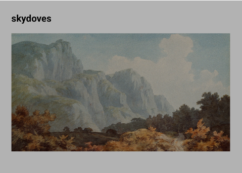

反过来，先 `padding` 再 `clickable` 时，只有内部内容可点击，padding 不响应点击：

```kotlin
modifier = Modifier
    .padding(21.dp)
    .clickable(onClick = onClick)
    .fillMaxWidth()
```

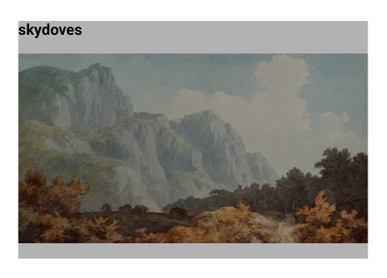

顺序也决定视觉叠层。下面的在线指示器先设定整体尺寸和外圆背景，再 padding，最后绘制内圆背景：

```kotlin
@Composable
fun OnlineIndicator(modifier: Modifier = Modifier) {
    Box(
        modifier = modifier
            .size(60.dp)
            .background(VideoTheme.colors.appBackground, CircleShape)
            .padding(4.dp)
            .background(VideoTheme.colors.infoAccent, CircleShape)
    )
}
```

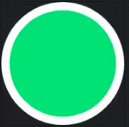

### 常用 Modifier

**尺寸与约束。** Compose 布局默认包裹子元素，可用 `size`、`fillMaxSize`、`fillMaxWidth`、`fillMaxHeight` 指定约束：

```kotlin
Row(modifier = Modifier.size(width = 400.dp, height = 100.dp)) {
    Text(text = "skydoves")
}
```

父级规则有时会忽略某些约束。若必须无视父级约束指定固定尺寸，可用 `requiredSize()`：

```kotlin
Row(modifier = Modifier.size(400.dp, 100.dp)) {
    Text(text = "skydoves", modifier = Modifier.requiredSize(150.dp))
}
```


Compose 采用父级提供约束、子级遵守约束的系统；`requiredSize` 或自定义 Layout 可覆盖它。子级忽略约束时，系统默认将其居中；可用 `wrapContentSize` 调整此行为。

**布局位置。** `offset()` 相对于原位置移动元素；不同于 `padding`，它不改变组件尺寸，只在视觉上偏移：

```kotlin
Column {
    Text(text = "skydoves")
    Text(text = "Last seen online", modifier = Modifier.offset(x = 10.dp))
}
```

第二个 `Text` 会向右移动 `10.dp`。

**作用域 Modifier。** 有些 Modifier 只能在指定 Composable 作用域使用。`matchParentSize()` 仅在 `Box` 中可用，使子项精确匹配父级大小：

```kotlin
Box(modifier = Modifier.fillMaxWidth()) {
    Spacer(
        modifier = Modifier
            .matchParentSize()
            .background(Color.LightGray)
    )
    Text(text = "skydoves")
}
```

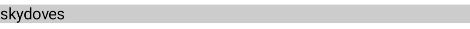

`weight()` 则仅在 `Row`、`Column` 中可用，按与同级元素的相对比例分配剩余空间：

```kotlin
Row(modifier = Modifier.fillMaxWidth()) {
    Box(modifier = Modifier.weight(2f).background(Color.Red))
    Box(modifier = Modifier.weight(1f).background(Color.Blue))
}
```


红色 Box 占蓝色 Box 两倍空间。

### 小结

Modifier 可为 Composable 应用尺寸、布局与交互行为。其顺序会影响结果，作用域 Modifier 必须在对应父 Composable 中使用。高效、正确地使用 Modifier，是构建灵活、高性能、可复用 UI 组件的基础。

### 实战题

**问：** 为什么 Modifier 顺序很重要？请举例说明改变顺序如何造成不同行为。

**答：** Modifier 是按书写顺序包裹节点的不可变链，前面的 Modifier 会影响后续 Modifier 所见的约束、绘制区域、命中区域和语义，因此顺序就是行为的一部分。例如 `Modifier.padding(16.dp).clickable {}` 的点击区域在 padding 之后的内容区域，而 `Modifier.clickable {}.padding(16.dp)` 让 padding 也处在可点击区域；`clip(CircleShape).background(...)` 与 `background(...).clip(CircleShape)` 的背景裁剪结果也不同。应按“布局约束—绘制—输入/语义”的实际需求排列，并用预览/测试验证触控范围。

### 精通专业提示：使用 Modifier 的规则


不当使用 Modifier 会产生意外行为，因此项目应建立明确规范：

1. **将 Modifier 应用到最外层布局。** 组件公开的 `modifier` 应施加给该组件最顶层的 Composable，而非任意内部层级。例如圆角按钮应把它应用到 `Button`：

   ```kotlin
   @Composable
   fun RoundedButton(modifier: Modifier = Modifier, onClick: () -> Unit) {
       Button(
           modifier = modifier.clip(RoundedCornerShape(32.dp)),
           onClick = onClick
       ) {
           Text(modifier = Modifier.padding(10.dp), text = "Rounded")
       }
   }
   ```

   若把外部传入的 `modifier` 应用给内部 `Text`，则按钮代表的视觉与交互配置无法按预期作用在按钮上，调用者也会困惑。

2. **只提供一个 Modifier 参数。** 为内部元素分别提供 `textModifier` 等多个参数看似灵活，实则会增加复杂度、降低 API 清晰度。更好的做法是保留一个外部 `modifier`，并使用 slot 暴露内部内容：

   ```kotlin
   @Composable
   fun RoundedButton(
       modifier: Modifier = Modifier,
       onClick: () -> Unit,
       content: @Composable RowScope.() -> Unit
   ) {
       Button(modifier = modifier.clip(RoundedCornerShape(32.dp)), onClick = onClick) {
           content()
       }
   }
   ```

3. **不要在多个组件间复用同一个 Modifier 参数。** 可以把稳定的 Modifier 链提取到变量并提升至更高作用域以复用，但不应把组件接收的同一个 `modifier` 依次应用给外层 `Column`、多个 `Button` 和内部 `Text`。调用点对该 Modifier 的改变会意外影响整个层级：

   ```kotlin
   MyButtons(
       modifier = Modifier
           .clip(RoundedCornerShape(32.dp))
           .background(Color.Blue)
   ) { }
   ```

正确层级、简洁 API 与避免无意复用，能使组件可预测、易维护、易使用。更多建议见 [Compose Component API Guidelines](https://github.com/advocacies/androidx/blob/6bcf9447694395f39462f000cc77949d13e607c6/compose/docs/compose-component-api-guidelines.md#parameters-vs-modifier-on-the-component)⁶⁸ 与 [Jetpack Compose Rules](https://mrmans0n.github.io/compose-rules/rules/#modifiers)⁶⁹。

### 精通专业提示：如何创建自定义 Modifier？


自定义 Modifier 能复用样式和行为，提升一致性与可维护性。主要有三种方式：Composable Modifier Factory、`composed {}` 与 `Modifier.Node`。

**Composable Modifier Factory。** [Composable Modifier Factory](https://developer.android.com/develop/ui/compose/custom-modifiers#create_a_custom_modifier_using_a_composable_modifier_factory)⁷⁰ 可调用 Compose API，适合动画、主题等高层能力。例如按启用状态应用淡化效果：

```kotlin
@Composable
fun Modifier.fade(enable: Boolean): Modifier {
    val alpha by animateFloatAsState(if (enable) 0.5f else 1.0f)
    return this.then(Modifier.graphicsLayer { this.alpha = alpha })
}
```

**`composed {}`。** 过去它用于创建依赖 Composition 的自定义 Modifier：

```kotlin
fun Modifier.customPadding(value: Dp) = composed {
    padding(value)
}
```

但它会在 Composition 中初始化、更新，产生额外重组与开销，现已不推荐；对有状态 Modifier 应优先使用 `Modifier.Node`。

**`Modifier.Node`。** [`Modifier.Node`](https://developer.android.com/develop/ui/compose/custom-modifiers#implement-custom)⁷¹ 是实现自定义 Modifier 的推荐方式，性能更好且具备生命周期管理能力。它由三部分组成：定义行为的 `Modifier.Node`、负责无状态创建或更新 Node 的 `ModifierNodeElement`，以及暴露给 UI 使用的 Modifier Factory。以下是绘制圆形的示例：

```kotlin
fun Modifier.circle(color: Color) = this.then(CircleElement(color))

private data class CircleElement(val color: Color) : ModifierNodeElement<CircleNode>() {
    override fun create() = CircleNode(color)
    override fun update(node: CircleNode) { node.color = color }
}

private class CircleNode(var color: Color) : DrawModifierNode, Modifier.Node() {
    override fun ContentDrawScope.draw() {
        drawCircle(color)
    }
}

Box(modifier = Modifier.size(150.dp).circle(Color.Blue))
```

`Modifier.Node` 能跨重组持续存在，因此比 `composed {}` 更高效，也提供更好的生命周期感知能力。Composable Factory 易于整合 Compose State；复杂行为则应使用 `Modifier.Node`。

---

## 问题 27：什么是 Layout？

`Layout` Composable 是低层 API，可完全控制子 Composable 的测量和摆放。`Column`、`Row`、`Box` 等高层组件已有预定义行为；`Layout` 则可按特定需求创建自定义布局。

### `Layout` 如何工作

它让开发者定义子项如何测量、如何定位，分为两个阶段：

1. **测量阶段：** 根据父级给出的约束，确定每个子 Composable 的尺寸。
2. **摆放阶段：** 在可用空间中定位每个已测量的子项。

```kotlin
@Composable
fun CustomLayout(
    modifier: Modifier = Modifier,
    content: @Composable () -> Unit
) {
    Layout(content = content, modifier = modifier) { measurables, constraints ->
        val placeables = measurables.map { measurable ->
            measurable.measure(constraints)
        }
        val width = constraints.maxWidth
        val height = placeables.sumOf { it.height }

        layout(width, height) {
            var yPosition = 0
            placeables.forEach { placeable ->
                placeable.placeRelative(x = 0, y = yPosition)
                yPosition += placeable.height
            }
        }
    }
}
```

`measure()` 按父级约束测量子项；`layout()` 决定布局最终宽高；`placeRelative()` 决定每个子项在布局中的位置。

### 何时使用 Layout

当 `Column`、`Row`、`Box` 无法满足设计所需的自定义程度，或需要完全控制子项测量、定位时，使用 `Layout`。它适合瀑布流、元素重叠、按内容动态调整大小等非标准布局；可直接访问约束和测量结果，也便于避免不必要的重组、重复测量。若要封装具有特定行为和样式的可复用布局，或实现精确对齐、适应式布局、独特排列，`Layout` 是正确选择。

### 小结

`Layout` 通过细粒度控制测量与摆放来构建自定义布局，适用于超出标准布局组件能力的高级 UI 场景。

### 实战题

**问：** 何时会选用 `Layout` 而不是 `Row`、`Column` 等标准组件？

**答：** 标准组件已能表达线性排列、叠放、懒列表和 ConstraintLayout 场景时优先使用它们，可读性和可维护性更好。只有需要非标准测量或摆放规则时使用 `Layout`，例如重叠标签、按基线/圆弧排布、流式换行或特殊的自适应算法；在 `MeasurePolicy` 中遵守约束、测量子项并返回布局尺寸。自定义 Layout 必须考虑 intrinsic measurement、RTL、最小触控和性能，不能为简单排版重复造 Row/Column。

**问：** 假设需实现 `LazyVerticalGrid` 无法表达的瀑布流网格，如何使用 `Layout` 实现？

**答：** 对有限数量子项，可在自定义 `Layout` 中根据列数和约束计算列宽，测量每个 item 后放入当前累计高度最小的列，并记录每项的 `(x, y)` 与各列最大高度，最终以最大列高作为布局高度。要处理 spacing、padding、RTL、未知高度和约束上限，并避免同一 child 重复测量。若数据量大，不应把所有 item 组合进普通 Layout；应优先使用 Compose Foundation 的 `LazyVerticalStaggeredGrid`，或实现基于 `LazyLayout` 的虚拟化方案，确保只组合和测量可见项。

### 精通专业提示：什么是 SubcomposeLayout？


`SubcomposeLayout` 是允许在 Layout 中动态 Composition 的低层 API。它适用于子内容尺寸依赖异步数据，或需要多次测量的情形；子组件可以独立于父布局 pass 重组。

标准布局通常在一次重组中仅测量每个 Composable 一次；若需要在知道约束后再 Composition，或需多次测量子项，`SubcomposeLayout` 提供这种灵活性。常见情形包括：

- Composition 时必须读取父级约束（如 `BoxWithConstraints`）；
- 需根据一个子项尺寸测量或定位另一个子项；
- 按可用空间惰性 Composition，仅渲染长列表中的可见项；
- 组件尺寸依赖必须在 Composition 时动态解析的内容；
- 布局逻辑需要多个独立测量、摆放阶段；
- 惰性列表头等动态 UI 只应在输入变化时重组。

```kotlin
@Composable
fun DynamicContentLayout() {
    SubcomposeLayout { constraints ->
        val measurable = subcompose("content") {
            Text(text = "Hello, skydoves!")
        }.first().measure(constraints)

        layout(measurable.width, measurable.height) {
            measurable.placeRelative(0, 0)
        }
    }
}
```

`subcompose("content")` 动态 Composition 文本，`measure` 根据约束计算其尺寸，`layout` 再定位它。`SubcomposeLayout` 灵活但有性能成本：它可以多次测量、Composition 子元素，过度使用会增加重组负担。因此仅在普通 Layout 不足、确需多阶段动态测量时使用，并保证只在必要时重组。

---

## 问题 28：什么是 Box？

`Box` 是 Jetpack Compose 的基础布局组件，可在同一父级中堆叠多个子 Composable。它根据自身边界定位子项，支持覆盖效果、对齐控制和分层，因此适合背景、图片上的图标或文字、悬浮 UI 等场景。

Box 默认将子项放在左上角，但可通过 `contentAlignment` 自定义；也可用 Modifier 设置尺寸、padding、背景和点击交互。不同于按顺序排布子项的 `Column`、`Row`，Box 以堆叠方式放置子项：

```kotlin
@Composable
fun ImageWithOverlay() {
    Box(
        modifier = Modifier.size(200.dp),
        contentAlignment = Alignment.BottomCenter
    ) {
        Image(
            painter = painterResource(id = R.drawable.skydoves_image),
            contentDescription = "Background Image"
        )
        Text(
            text = "Hello, skydoves!",
            color = Color.White,
            modifier = Modifier
                .background(Color.Black.copy(alpha = 0.5f))
                .padding(8.dp)
        )
    }
}
```

`Box` 将 `Image` 与 `Text` 放在其边界内；`contentAlignment = Alignment.BottomCenter` 把内部内容置于底部居中，半透明文字背景提高可读性。


### 小结

Box 是简单但实用的布局 Composable，用于堆叠 UI、创建覆盖/背景效果和控制元素对齐。

### 实战题

**问：** 哪些场景应优先使用 Box 而不是 Column、Row？它如何处理子 Composable？

**答：** Box 适合子项需要叠放或相对同一边界定位的场景，如图片上的渐变/文字、加载遮罩、角标、悬浮按钮和空状态覆盖层；Row/Column 则按单一轴依序排列。Box 测量子项后通常取满足约束的最大尺寸，并在同一坐标空间放置每个 child，后声明的 child 绘制在更上层。可用 `matchParentSize()` 让遮罩跟随 Box 尺寸；不要用 Box 模拟本应线性排列的内容，避免层叠影响点击和无障碍顺序。

**问：** Box 的 `contentAlignment` 与对子项使用 `Modifier.align()` 有何不同？二者能否同时使用？

**答：** `contentAlignment` 是 Box 对所有未单独指定位置的子项使用的默认对齐方式；`Modifier.align()` 是 BoxScope 中某个 child 的父数据修饰符，会覆盖该 child 的默认对齐。二者可以同时存在：例如 Box 默认 `Center`，角标用 `Modifier.align(Alignment.TopEnd)`。它们只决定摆放位置，不改变 child 尺寸；需要铺满父容器时使用 `matchParentSize`，需要外边距则再组合 padding。

### 精通专业提示：什么是 BoxWithConstraints？


`BoxWithConstraints` 是能在 Composition 时访问父级布局约束的高级布局 API。普通 Box 不提供这些约束；它则在 `Constraints` 作用域中暴露 `maxWidth`、`maxHeight`、`minWidth`、`minHeight`，可按可用空间动态决定 UI，适合响应式、适应式布局：

```kotlin
@Composable
fun ResponsiveText() {
    BoxWithConstraints(modifier = Modifier.fillMaxWidth()) {
        val textSize = if (maxWidth < 300.dp) 14.sp else 20.sp
        Text(text = "Hello, skydoves!", fontSize = textSize)
    }
}
```

此例中，宽度小于 `300.dp` 时文字为 `14.sp`，否则为 `20.sp`。它可根据屏幕、窗口或父布局尺寸切换布局、排版、组件排列。

但 `BoxWithConstraints` 比普通 Box 开销更大，因为它底层使用 `SubcomposeLayout`：

```kotlin
@Composable
fun BoxWithConstraints(
    modifier: Modifier = Modifier,
    contentAlignment: Alignment = Alignment.TopStart,
    propagateMinConstraints: Boolean = false,
    content: @Composable BoxWithConstraintsScope.() -> Unit
) {
    val measurePolicy = maybeCachedBoxMeasurePolicy(contentAlignment, propagateMinConstraints)
    SubcomposeLayout(modifier) { constraints ->
        val scope = BoxWithConstraintsScopeImpl(this, constraints)
        val measurables = subcompose(Unit) { scope.content() }
        with(measurePolicy) { measure(measurables, constraints) }
    }
}
```

因此只应在必须读取布局约束时使用，避免以它替代所有普通 Box 而增加不必要性能成本。

---

## 问题 29：Arrangement 与 Alignment 有什么区别？

`Arrangement` 和 `Alignment` 都用于布局内的 UI 定位，但职责不同。

### Arrangement

`Arrangement` 控制沿单一方向排列的多个子 Composable 的间距和分布，也就是布局的**主轴**：在 `Row` 中控制水平方向，在 `Column` 中控制垂直方向。

```kotlin
@Composable
fun RowWithArrangement() {
    Row(
        modifier = Modifier.fillMaxWidth(),
        horizontalArrangement = Arrangement.SpaceBetween
    ) {
        Text(text = "Hello")
        Text(text = "skydoves")
    }
}
```

`Arrangement.SpaceBetween` 会将两个 `Text` 分布在可用宽度两端，中间空间均分。

### Alignment

`Alignment` 决定子 Composable 在父级**交叉轴**上的位置：在 `Row` 中影响垂直位置，在 `Column` 中影响水平位置，在 `Box` 中同时影响水平和垂直位置。

```kotlin
@Composable
fun ColumnWithAlignment() {
    Column(
        modifier = Modifier.fillMaxSize(),
        horizontalAlignment = Alignment.CenterHorizontally
    ) {
        Text(text = "Hello")
        Text(text = "skydoves")
    }
}
```

Column 仍纵向堆叠子项，但两个 Text 会沿横向轴居中。

### 小结

`Arrangement` 控制多个子项沿主轴的间距与分布（Row 横向、Column 纵向）；`Alignment` 控制子项在交叉轴上相对父容器的位置。二者常需组合使用，但不能互相替代。

### 实战题

**问：** Row 中的元素既要均匀分布又要顶端对齐，应如何组合 Arrangement 与 Alignment？为什么？

**答：** 在 `Row` 中使用 `horizontalArrangement = Arrangement.SpaceEvenly`（或按设计选 `SpaceBetween/SpaceAround`）控制主轴水平方向的剩余空间分配，使用 `verticalAlignment = Alignment.Top` 控制交叉轴的顶部对齐。Row 的主轴是水平、交叉轴是垂直，两类参数分别处理不同维度，互不替代；若 child 使用 `weight`，它会先占据主轴份额，再由 Arrangement 处理剩余空间。对个别 child 可用 `Modifier.align(Alignment.CenterVertically)` 覆盖 Row 默认值。

**问：** 为什么给 Row 设置 `horizontalAlignment` 无效、给 Column 设置却有效？背后的 Compose 布局规则是什么？

**答：** Row 的主轴是水平，主轴上的多个子项由 `horizontalArrangement` 决定排列与间距；它的交叉轴为垂直，统一对齐参数是 `verticalAlignment`。Column 则主轴垂直，交叉轴水平，所以使用 `verticalArrangement` 和 `horizontalAlignment`。这反映 Compose 布局的通用规则：Arrangement 管理主轴中多个子项的空间分配，Alignment 管理交叉轴对齐；API 不提供与容器轴向不匹配的参数。

---

## 问题 30：什么是 Painter？

`Painter` 是渲染图片、矢量图和其他 Drawable 内容的抽象，支持缩放、着色以及自定义绘制逻辑。它将图片资源与展示该图片的 UI 组件解耦，因此可适配不同来源，例如加载 drawable 的 `painterResource`，或从 `ImageVector` 创建 `VectorPainter` 的 `rememberVectorPainter`。

Compose UI 内置的 Painter 包括：

- `painterResource(id)`：加载 `res/drawable` 中的图片；
- `ColorPainter(color)`：以纯色填充区域；
- `rememberVectorPainter(image = ImageVector)`：从 `ImageVector` 动态创建 `VectorPainter`。

```kotlin
@Composable
fun DisplayImage() {
    val painter = painterResource(id = R.drawable.skydoves_image)
    Image(
        painter = painter,
        modifier = Modifier.size(100.dp),
        contentDescription = "Sample Image"
    )
}

@Composable
fun DisplayVector() {
    val vectorPainter = rememberVectorPainter(image = Icons.Default.Star)
    Image(
        painter = vectorPainter,
        modifier = Modifier.size(50.dp),
        contentDescription = "Vector Icon"
    )
}
```

`Painter` 是传统 Android `Drawable` API 在 Compose 中的抽象替代；它不仅定义图片或图形如何渲染，也会影响使用它的 Composable 的测量和布局。若需自定义 Painter，可继承 `Painter` 并实现 `onDraw`，通过 `DrawScope` 完全控制绘制。更多说明见[官方文档](https://developer.android.com/develop/ui/compose/graphics/images/custompainter)⁷²。

### 小结

Painter 简化了图片与矢量图渲染，并提供缩放、定制能力。通过 `Painter`、`VectorPainter`，可使用 Compose 友好的方式高效加载位图、支持无损缩放的矢量图。

### 实战题

**问：** 是否创建过自定义 Painter？使用场景是什么，如何实现绘制逻辑？

**答：** 自定义 `Painter` 适合把可复用的绘制逻辑封装为可供 `Image`、`Modifier.paint` 等使用的资源，例如动态图表图标、渐变占位图、状态徽章或程序化背景。继承 `Painter` 并实现 `intrinsicSize` 与 `onDraw()`，在 `DrawScope` 使用 `drawPath`、`drawCircle`、`drawRect` 等 API；将颜色、进度等作为稳定参数或 State，并避免在每帧创建 Path/Paint。若只是局部 UI 自绘，`Canvas`/`drawBehind` 更直接；Painter 还应正确处理尺寸、LayoutDirection、alpha 和 ColorFilter。

---

## 问题 31：如何加载网络图片？

Jetpack Compose 不内置网络图片加载能力，但可以使用 Coil、Glide、Landscapist 等第三方库从 URL 高效加载和展示图片。它们与 Compose 或 Kotlin Multiplatform 集成良好，并提供缓存、占位图等优化。

自行实现图片加载需要处理下载、缩放、缓存、渲染和内存管理等复杂问题；要获得流畅且节省资源的体验，需要大量优化。因此一般建议使用成熟库，它们已具备缓存、转换和异步加载能力。

### Coil

[Coil](https://github.com/coil-kt/coil)⁷³ 是面向 Jetpack Compose 与 Kotlin Multiplatform 优化的图片加载库，完全由 Kotlin 编写，API 符合 Kotlin 风格。它依赖 Android 项目常用的 OkHttp、Coroutines，因而较轻量；还支持转换、动画 GIF、SVG、视频帧等：

```kotlin
AsyncImage(
    model = "https://example.com/image.jpg",
    contentDescription = null,
)
```

### Glide

[Glide](https://github.com/bumptech/glide)⁷⁴ 是广泛使用的 Android 图片加载库，提供 Compose 支持及动画 GIF、占位图、转换、缓存、资源复用等能力。原书指出其 Compose 集成在 2023 年 9 月仍为 beta，此后更新有限：

```kotlin
GlideImage(
    model = myUrl,
    contentDescription = getString(R.id.picture_of_cat),
    modifier = Modifier.padding(padding).clickable(onClick = onClick).fillParentMaxSize(),
)
```


**趣闻：** Glide 曾由一位有 Google 工作经历的工程师独自维护。

### Landscapist

[Landscapist](https://github.com/skydoves/landscapist)⁷⁵ 是面向 Jetpack Compose、Kotlin Multiplatform 的图片加载库，可基于 Glide、Coil、Fresco 内核加载网络或本地图片。它专门优化 Compose 性能，多数 Composable 可重启、可跳过，并通过 Baseline Profile 加速启动与运行；还支持 `ImageOptions`、状态监听器、自定义 Composable、Android Studio Preview、`ImageComponent`、`ImagePlugin`、占位图、圆形揭示/crossfade 动画、模糊转换和调色板提取。

```kotlin
GlideImage( // CoilImage, FrescoImage
    imageModel = { imageUrl },
    modifier = modifier,
    component = rememberImageComponent {
        +ShimmerPlugin(
            Shimmer.Flash(
                baseColor = Color.White,
                highlightColor = Color.LightGray,
            )
        )
    },
    failure = { Text(text = "image request failed.") }
)
```


**趣闻：** Landscapist 由本书作者 skydoves（Jaewoong）创建并持续维护。它在 Jetpack Compose 的早期开发者预览阶段于 2020 年首次推出，是较早专为 Compose 设计的图片加载方案之一。

### 小结

网络图片加载是现代应用的重要部分，例如用户头像与内容图片。Coil、Glide、Landscapist 均可处理网络和本地资源，并提供转换、GIF、SVG、视频帧等扩展能力；选择时应结合项目的 Compose/KMP 支持、缓存、维护状态和功能需求。

### 实战题

**问：** 在 Jetpack Compose 中用过哪些第三方图片加载库？它们之间有哪些取舍？

**答：** 常见选择是 Coil 的 `AsyncImage`/`rememberAsyncImagePainter`、Glide 的 Compose 集成，以及 Fresco 等。Coil 是 Kotlin/协程优先、API 与 Compose 贴合、体积和使用体验通常较好；Glide 在成熟项目中拥有广泛的缓存、转码和遗留生态，迁移成本低；Fresco 对特定大图/渐进式图片场景有优势但引入较重。选择应看现有依赖、格式支持、缓存策略、Compose 集成、网络栈和 APK 体积；无论哪种，都要提供稳定 model/key、指定目标尺寸和 placeholder/error，并让请求随 Composition 生命周期取消，不能在 Composable 每次重组手动创建加载器。

---

## 问题 32：如何高效渲染数百个列表项并避免 UI 卡顿？

展示数百、数千项时，使用 `Column` 等标准布局会因不必要的 Composition 和渲染产生性能问题。Compose 提供 [Lazy List](https://developer.android.com/develop/ui/compose/lists#lazy)⁷⁶：`LazyColumn`、`LazyRow`、`LazyGrid` 会按需动态 Composition、复用列表项，以避免 UI 卡顿。

### LazyColumn：垂直列表

`LazyColumn` 只 Composition 可见项，并复用屏幕外项，从而降低内存占用、改善滚动性能：

```kotlin
@Composable
fun ItemList() {
    LazyColumn {
        items(1000) { index ->
            Text(text = "Item #$index", modifier = Modifier.padding(8.dp))
        }
    }
}
```

### LazyRow 与 LazyVerticalGrid

横向列表可使用 `LazyRow`，其按需 Composition 行为与 `LazyColumn` 相同。网格可使用 `LazyVerticalGrid`；水平网格使用 `LazyHorizontalGrid`：

```kotlin
@Composable
fun GridItemList() {
    LazyVerticalGrid(
        columns = GridCells.Fixed(3),
        modifier = Modifier.fillMaxSize()
    ) {
        items(300) { index ->
            Text(text = "Item #$index", modifier = Modifier.padding(8.dp))
        }
    }
}
```

### 使用 key 优化性能

默认情况下，列表/网格项状态与其位置关联。插入、删除、重排数据后，位置改变可能使 item 丢失 `remember` 状态。为 item 分配稳定 key，可在位置变化时保留状态、减少不必要重组：

```kotlin
@Composable
fun KeyedItemList(items: List<Item>) {
    LazyColumn {
        items(items, key = { it.id }) { item ->
            Text(text = item.name, modifier = Modifier.padding(8.dp))
        }
    }
}
```

### 小结

大列表应使用 `LazyColumn`、`LazyRow`、`LazyGrid`，而非 `Column`、`Row`。对动态数据提供稳定 key，能在更新时减少重组、保留 UI 状态。相关最佳实践见[官方文档](https://developer.android.com/develop/ui/compose/performance/bestpractices#use-lazylist-keys)⁷⁷。

### 实战题

**问：** 构建实时消息聊天页时，如何组织布局以保持平滑滚动并减少重组开销？

**答：** 使用 `LazyColumn` 和稳定消息 ID 的 `key`/`contentType`，由 ViewModel 暴露不可变、分页的消息流；每个 item 只读取自身消息和最小状态，避免在 item 中读取整个列表、时间或输入框等高频全局 state。持有一个 `LazyListState`，新消息到达时仅在用户接近底部时滚到底部，否则显示“新消息”提示；图片/附件交给生命周期感知的异步加载并取消离屏请求。输入栏放在列表外，使用 `imePadding`/insets，Diff 更新而不是全量替换；滚动分析用 `derivedStateOf` 或 `snapshotFlow.distinctUntilChanged`，并对消息流做背压/合并。

**问：** 在 LazyColumn 或 LazyGrid 中使用 key，如何维护列表更新时的 UI 性能与稳定性？

**答：** 为 `items` 提供跨插入、删除、排序仍不变的业务 ID（如消息 ID），让 Compose 将 item 的 Composition、remember 状态、动画和滚动锚点与实体而非位置对应；必要时加 `contentType` 以复用相同结构。用 index 当 key 会在头部插入后让所有后项被当作不同内容，导致状态错位和更多重组；key 也必须唯一、可保存（需要状态恢复时尤其如此）且不随显示文本改变。数据源应是可观察、不可变更新，key 不能替代正确的状态管理。

---

## 问题 33：如何在惰性列表中实现分页？

分页能在保持平滑 UI 的同时高效处理大数据集。可使用 [Jetpack Paging Library](https://developer.android.com/topic/libraries/architecture/paging/v3-overview)⁷⁸，也可不依赖第三方库：当用户滚至列表末尾时动态加载更多数据，实现无限滚动。

### 通过滚动位置触发分页

常用策略是观察用户是否到达最后一个可见项，随后加载数据。可通过 `LazyListState` 实现：

```kotlin
@Composable
fun PaginatedList(viewModel: ListViewModel) {
    val listState = rememberLazyListState()
    val items by viewModel.items.collectAsStateWithLifecycle()
    val isLoading by viewModel.isLoading.collectAsStateWithLifecycle()
    val threshold = 2
    val shouldLoadMore by remember {
        derivedStateOf {
            val totalItemsCount = listState.layoutInfo.totalItemsCount
            val lastVisibleItemIndex =
                listState.layoutInfo.visibleItemsInfo.lastOrNull()?.index ?: 0
            (lastVisibleItemIndex + threshold >= totalItemsCount) && !isLoading
        }
    }

    LaunchedEffect(listState) {
        snapshotFlow { shouldLoadMore }
            .distinctUntilChanged()
            .filter { it }
            .collect { viewModel.loadMoreItems() }
    }

    LazyColumn(state = listState, modifier = Modifier.fillMaxSize()) {
        items(items) { item ->
            Text(modifier = Modifier.padding(8.dp), text = "$item")
        }
        item {
            if (isLoading) {
                CircularProgressIndicator(modifier = Modifier.padding(16.dp))
            }
        }
    }
}
```

`LazyListState` 监测滚动位置；`snapshotFlow` 跟踪最后可见项索引；当索引加上阈值到达末尾且未加载时，调用 `loadMoreItems()` 获取下一页。阈值可让请求早于真正到底时发起，避免用户看到空白等待。

### 使用 ViewModel 管理分页

ViewModel 负责增量加载数据，并用加载状态防止重复请求：

```kotlin
private class ListViewModel : ViewModel() {
    private val _items = mutableStateListOf<Int>()
    internal val items: StateFlow<List<Int>> = MutableStateFlow(_items)
    private val _isLoading = MutableStateFlow(false)
    val isLoading: StateFlow<Boolean> = _isLoading
    private var currentPage = 0

    fun loadMoreItems() {
        if (_isLoading.value) return
        _isLoading.value = true
        viewModelScope.launch {
            delay(1000) // Simulate network request
            val newItems = List(20) { (currentPage * 20) + it }
            _items += newItems
            currentPage++
            _isLoading.value = false
        }
    }
}
```

`_items` 保存状态列表，`loadMoreItems()` 取得新页数据，`isLoading` 阻止加载期间重复请求。

### 小结

利用 `LazyListState` 判断是否需要加载更多，可在惰性列表中高效分页。`derivedStateOf` 避免无谓计算，`snapshotFlow` 将滚动状态转换为 Flow，`distinctUntilChanged()` 避免连续相同条件重复触发；按需加载可让大数据集保持流畅滚动和良好资源管理。

### 实战题

**问：** 应使用哪些 API 或状态机制判断需要加载更多列表项？

**答：** 常用判断依据是 `LazyListState.layoutInfo` 提供的 `visibleItemsInfo`、`totalItemsCount` 与最后一个可见 item 的索引，再配合 ViewModel 中的 `isLoading`、`hasMore`、当前页标记和请求中的单飞控制。若项目使用 Paging 3，则优先依赖 `LazyPagingItems` 与 `loadState.append` 判断是否需要继续加载，而不是在 UI 层重复维护分页状态。实践上通常设置“预取阈值”，例如距离末尾还剩 3 到 5 项时触发加载，而不是等滚到最后一项。

**问：** `LazyListState` 在分页中扮演什么角色？`derivedStateOf`、`snapshotFlow` 如何优化加载逻辑？为什么 `distinctUntilChanged()` 很重要？

**答：** `LazyListState` 是列表滚动状态的核心入口，能提供当前可见项范围、首项位置和布局信息，因此适合据此推导“是否接近底部”。`derivedStateOf` 适合把频繁变化的滚动信息收敛为一个低频布尔值，如 `shouldLoadMore`，避免每次像素级滚动都触发下游重组；`snapshotFlow` 则可把这个状态安全转换为 Flow，在 `LaunchedEffect` 中收集并触发加载。`distinctUntilChanged()` 很重要，因为用户持续滚动到底部附近时，同一个 `true` 条件可能被多次发出；去重后只有条件从 `false -> true` 变化时才会触发，能明显减少重复请求。

**问：** 用户快速滚动时，如何防止重复网络请求或重复加载？

**答：** 应把“是否允许发起下一页请求”的判断集中放在 ViewModel 或数据层，而不是仅靠 Composable 判断。典型做法是同时校验 `isLoading`、`hasMore`、`nextPageKey`，并使用互斥锁、单飞请求或 Job 复用来保证同一页只会加载一次；请求完成后再更新分页游标。若数据源是 Flow，还可结合 `debounce`、`conflate` 或 `collectLatest` 控制上游压力，但核心仍是数据层幂等和去重，确保快速滚动不会产生并发重复加载。

---

## 问题 34：什么是 Canvas？

`Canvas` 直接提供绘图表面，可创建自定义图形、动画和视觉效果。不同于标准 UI 组件，Canvas 通过 `DrawScope` 中的绘制命令提供细粒度渲染控制。

Canvas 位于 Compose 绘制系统中，可使用 `drawRect`、`drawCircle`、`drawPath`、`drawText`、`drawImage` 等函数绘制自定义形状、图片和矢量图，并精确控制颜色、尺寸、笔画样式和变换：

```kotlin
@Composable
fun DrawCircleCanvas() {
    Canvas(modifier = Modifier.size(200.dp)) {
        drawCircle(
            color = Color.Blue,
            radius = size.minDimension / 2,
            center = center
        )
    }
}
```

Canvas 有固定大小，`drawCircle` 在中心绘制蓝色圆，`size.minDimension / 2` 保证圆形落在其边界内。

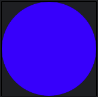

### 基本变换

Canvas 支持多种动态绘制操作：

- `scale`：按比例放大或缩小；
- `translate`：沿 X、Y 轴移动；
- `rotate`：围绕轴点旋转；
- `inset`：通过类似 padding 的方式调整绘制边界；
- `withTransform`：在一次操作中组合多种变换，性能更好；
- `drawText`：精确定位并手动绘制文字。

这些变换仅发生在 Composable 生命周期的[绘制阶段](https://developer.android.com/develop/ui/compose/phases)⁷⁹，不会改变元素的实际布局尺寸或布局位置，因此变换后的内容可能重叠或超出原布局边界。

### 小结

Canvas 可高度灵活地实现自定义绘制、变换和动画，适合高级定制 UI。通过缩放、平移、旋转及文字绘制等能力，可构建精细而动态的视觉组件。更多 API 参见 [Graphics in Compose](https://developer.android.com/develop/ui/compose/graphics/draw/overview#draw-image)⁸⁰。

### 实战题

**问：** 如何使用 Canvas 实现自定义的动画圆形进度条？

**答：** 最常见做法是先用 `Canvas` 画一条静态背景圆弧，再根据进度画前景圆弧，并把起点旋转到 12 点方向。动画上可用 `animateFloatAsState`、`Animatable` 或无限动画驱动 `sweepAngle`；绘制时使用 `drawArc`、`Stroke(width, cap = StrokeCap.Round)` 让边缘更自然。关键点是把进度建模为 `0f..1f` 的稳定状态，只让绘制阶段根据动画值更新，而不要在每帧重新创建大量对象。

```kotlin
@Composable
fun CircularProgress(
    progress: Float,
    modifier: Modifier = Modifier,
) {
    val animatedProgress by animateFloatAsState(progress.coerceIn(0f, 1f))

    Canvas(modifier = modifier.size(64.dp)) {
        val stroke = 8.dp.toPx()
        drawArc(
            color = Color.LightGray,
            startAngle = -90f,
            sweepAngle = 360f,
            useCenter = false,
            style = Stroke(stroke, cap = StrokeCap.Round)
        )
        drawArc(
            color = Color(0xFF3DDC84),
            startAngle = -90f,
            sweepAngle = 360f * animatedProgress,
            useCenter = false,
            style = Stroke(stroke, cap = StrokeCap.Round)
        )
    }
}
```

---

## 问题 35：使用过 `graphicsLayer` Modifier 吗？

`graphicsLayer` 可为 Composable 应用变换、裁剪与合成效果。它将 Composable 渲染到独立绘制层，支持隔离渲染、缓存、离屏光栅化等优化。Canvas 提供手动绘制控制，而 `graphicsLayer` 是在保持 Composable 特性的同时声明式改变外观的方式。

给 Composable 添加 `Modifier.graphicsLayer` 后，所有绘制操作在隔离图层上进行，缩放、平移、旋转、透明度、裁剪等变换不会影响相邻 Composable；借助硬件加速，这些效果可高效应用，通常无需额外重组。

```kotlin
@Composable
fun ScaledImage() {
    Image(
        painter = painterResource(id = R.drawable.skydoves_image),
        contentDescription = "Scaled Image",
        modifier = Modifier
            .graphicsLayer {
                scaleX = 1.5f
                scaleY = 1.2f
            }
            .size(200.dp)
    )
}
```

这里图片横向放大 1.5 倍、纵向放大 1.2 倍。

### 常见变换

**平移：**

```kotlin
.graphicsLayer {
    translationX = 50.dp.toPx()
    translationY = -20.dp.toPx()
}
```

`translationX` 向右移动 `50.dp`，`translationY` 向上移动 `20.dp`。

**旋转：**

```kotlin
.graphicsLayer {
    rotationX = 45f
    rotationY = 30f
    rotationZ = 90f
}
```

分别绕 X、Y 及屏幕所在 Z 轴旋转。

**裁剪与形状：**

```kotlin
Box(
    modifier = Modifier
        .size(200.dp)
        .graphicsLayer {
            clip = true
            shape = CircleShape
        }
        .background(Color.Blue)
)
```

`shape = CircleShape` 与 `clip = true` 会将内容裁为圆形。

**透明度：** `alpha = 0.5f` 使内容以 50% 透明度显示，`1.0f` 完全可见，`0.0f` 完全透明。

### 合成策略与 Bitmap 捕获

`graphicsLayer` 提供三种合成策略：

1. `Auto`（默认）：根据属性自动优化渲染；
2. `Offscreen`：先渲染至离屏纹理后再合成；
3. `ModulateAlpha`：对每个绘制操作应用 alpha，而非整个图层。

例如 `CompositingStrategy.Offscreen` 可让 `BlendMode` 等高级效果只作用于该 Composable，不影响其他内容。

从 Compose 1.7.0 起，也可用 `graphicsLayer` 将 Composable 捕获为 Bitmap：

```kotlin
val coroutineScope = rememberCoroutineScope()
val graphicsLayer = rememberGraphicsLayer()

Box(
    modifier = Modifier
        .drawWithContent {
            graphicsLayer.record { drawContent() }
            drawLayer(graphicsLayer)
        }
        .clickable {
            coroutineScope.launch {
                val bitmap = graphicsLayer.toImageBitmap()
                // Save or share the bitmap
            }
        }
        .background(Color.White)
) {
    Text("Hello Compose", fontSize = 26.sp)
}
```

这种方式能捕获 Composable 而无需重新绘制整套 UI。

### 小结

`graphicsLayer` 可高效实现缩放、旋转、平移、裁剪、透明度和合成，为自定义视觉效果提供灵活性与图层隔离能力。

### 实战题

**问：** 如何实现一个裁为圆形、透明度为 70%、缩放为 1.2 倍的图片？

**答：** 可以直接在 `Image` 上叠加 `graphicsLayer`，同时设置裁剪、形状、透明度和缩放。`graphicsLayer` 只影响绘制阶段，不会改变父布局为该图片分配的尺寸，因此若缩放后可能超出边界，还应配合外层容器或裁剪策略控制显示范围。

```kotlin
Image(
    painter = painterResource(id = R.drawable.avatar),
    contentDescription = "Avatar",
    modifier = Modifier
        .size(96.dp)
        .graphicsLayer {
            clip = true
            shape = CircleShape
            alpha = 0.7f
            scaleX = 1.2f
            scaleY = 1.2f
        }
)
```

**问：** `graphicsLayer` 的用途是什么？何时应使用它而不是 `scale`、`rotate`、`alpha` 等 Modifier？它如何影响渲染性能与 Composable 隔离？

**答：** `graphicsLayer` 用于把一个 Composable 的绘制放入独立图层，再对该图层施加缩放、平移、旋转、透明度、裁剪、相机距离或合成策略等效果。若只是单一、简单的视觉变换，直接使用 `scale`、`rotate`、`alpha` 这类更高层 Modifier 可读性通常更好；当需要组合多种变换、使用 `CompositingStrategy`、做离屏合成、隔离 `BlendMode` 影响范围或捕获位图时，更适合使用 `graphicsLayer`。性能上，图层隔离能减少兄弟节点受影响并让某些效果更高效，但额外图层和离屏缓冲也会增加内存、填充率和合成成本，因此应只在确有视觉或合成需求时使用，而不是给每个节点默认套一层。

---

## 问题 36：如何在 Jetpack Compose 中实现视觉动画？

Compose 提供声明式动画系统，可在 UI 状态之间实现平滑、具有吸引力的过渡；内置 API 可动画化可见性、内容变化、尺寸及属性变化，并在保持性能的同时改善体验。

### AnimatedVisibility：显示与隐藏

`AnimatedVisibility` 用于子项入场、退场。默认出现时淡入并展开，消失时淡出并收缩；也可用 `EnterTransition`、`ExitTransition` 自定义：

```kotlin
@Composable
fun AnimatedVisibilityExample() {
    var isVisible by remember { mutableStateOf(true) }
    Column {
        Button(onClick = { isVisible = !isVisible }) { Text("Toggle Visibility") }
        AnimatedVisibility(
            visible = isVisible,
            enter = fadeIn() + expandVertically(),
            exit = fadeOut() + shrinkVertically()
        ) {
            Box(Modifier.size(100.dp).background(Color.Blue))
        }
    }
}
```

### Crossfade 与 AnimatedContent：内容过渡

`Crossfade` 用淡化效果在两个 Composable 之间过渡，适合 tab、屏幕、图片或组件状态切换：

```kotlin
Crossfade(targetState = selectedScreen) { screen ->
    when (screen) {
        "Home" -> Text("Home Screen", fontSize = 24.sp)
        "Profile" -> Text("Profile Screen", fontSize = 24.sp)
    }
}
```

`AnimatedContent` 会在保持布局的同时平滑切换不同内容状态：

```kotlin
AnimatedContent(targetState = count) { targetCount ->
    Text(text = "Count: $targetCount", fontSize = 24.sp)
}
```

### `animate*AsState` 与 `animateContentSize`

`animate*AsState` 是最直接的单值动画 API：只需给出目标值，API 就会平滑地从当前值过渡至目标值。包括 `animateDpAsState`、`animateFloatAsState`、`animateIntAsState`、`animateOffsetAsState`、`animateSizeAsState`、`animateValueAsState` 等。

```kotlin
val boxSize by animateDpAsState(
    targetValue = if (isExpanded) 200.dp else 100.dp,
    animationSpec = tween(durationMillis = 500),
)

Box(Modifier.size(boxSize).background(Color.Green))
```

它会在 500ms 内插值 `Dp` 值。`animateContentSize` 则自动动画化布局尺寸变化，不需要额外回调：

```kotlin
Box(
    modifier = Modifier
        .background(Color.Red)
        .animateContentSize()
        .padding(16.dp)
) {
    Text(if (expanded) "Expanded Text with more content" else "Short Text")
}
```

内容改变时 Box 会平滑改变尺寸。

### 小结

- `AnimatedVisibility`：动画化显示、隐藏；
- `Crossfade`：在 UI 状态之间淡化切换；
- `AnimatedContent`：动画化内容更新；
- `animate*AsState`：插值尺寸、透明度、位置等值；
- `animateContentSize`：无需额外逻辑地动画化尺寸变化。

### 实战题

**问：** 如何为随内容改变尺寸的文本块实现平滑展开/收起效果？

**答：** 最直接的做法是在承载文本的容器上使用 `Modifier.animateContentSize()`，并用一个 `expanded` 状态切换短文案与全文、或切换 `maxLines`。这样当文本高度变化时，Compose 会自动在布局尺寸之间补间，而不需要手写高度动画；若还需要淡入淡出或箭头旋转，可再配合 `AnimatedVisibility` 或 `animateFloatAsState`。实践中应把 `animateContentSize()` 放在会发生尺寸变化的容器上，并尽量让文本状态变化保持单一来源，避免布局抖动。

**问：** 如何结合 Canvas、Painter 和动画实现加载占位用的 shimmer 动画？

**答：** Shimmer 的本质是让一段高亮渐变在占位骨架上持续平移。可以用 `rememberInfiniteTransition()` 或 `Animatable` 驱动一个偏移值，用 `Brush.linearGradient` 生成移动中的高亮刷子；占位形状较简单时直接在 `Canvas` 中绘制圆角矩形、圆形等骨架最直观，若需要在多个页面复用同一视觉效果，可把绘制逻辑封装成自定义 `Painter` 或 `Modifier.drawWithCache`。性能上应复用 Path、Brush 计算结果，避免每一帧重新分配对象，并只对真实的加载占位区域应用 shimmer，而不是整屏无差别绘制。

---

## 问题 37：如何在屏幕之间导航？

导航是现代 Android 开发的核心；即使 XML 项目也倾向单 Activity 结构。Compose 中没有 Fragment，需要专门系统管理返回栈、控制器和 UI 状态。两种主要方式是手动管理导航，以及使用 Jetpack Compose Navigation 库。

### 手动导航

可用 Compose Runtime 的 `SaveableStateHolder` 与 `rememberSaveable` 手动实现：它按唯一 key 管理、保存 Composable 状态，屏幕离开 Composition 后再次进入时自动恢复。以下写法还通过 `AnimatedContent` 加入转场动画：

```kotlin
@Composable
fun <T : Any> Navigation(
    currentScreen: T,
    modifier: Modifier = Modifier,
    content: @Composable (T) -> Unit,
) {
    val saveableStateHolder = rememberSaveableStateHolder()
    Box(modifier) {
        AnimatedContent(currentScreen) {
            saveableStateHolder.SaveableStateProvider(it) { content(it) }
        }
    }
}
```

配合 `rememberSaveable` 保存当前 screen 以及各页面的输入、计数器等状态，可让来回切屏时每个页面独立保留状态。实际导航还需处理向上返回、跳转指定页面、深层链接等；若 ViewModel 与 DI 框架结合，手动管理生命周期会更困难。因此，复杂或可扩展的项目建议使用 Navigation 库。

### Jetpack Compose Navigation

[Compose Navigation](https://developer.android.com/develop/ui/compose/navigation)⁸¹ 在 Jetpack Navigation 基础设施上提供 Composable 间导航，支持结构化导航、状态处理、深层链接及类型安全参数。

它有三个核心组件：

- **`NavHost`：** 定义导航图，关联路由与屏幕；
- **`NavController`：** 管理返回栈与目标间导航；
- **Composable Destination：** 导航图中的各个屏幕。

```kotlin
sealed interface PokedexScreen {
    @Serializable data object Home : PokedexScreen
    @Serializable data object Details : PokedexScreen
}

@Composable
fun AppNavHost(
    modifier: Modifier = Modifier,
    navController: NavHostController = rememberNavController(),
) {
    NavHost(
        modifier = modifier,
        navController = navController,
        startDestination = PokedexScreen.Home,
    ) {
        composable<PokedexScreen.Home> {
            HomeScreen(onNavigateToDetails = {
                navController.navigate(route = PokedexScreen.Details)
            })
        }
        composable<PokedexScreen.Details> { DetailsScreen() }
    }
}
```

`NavHost` 指定以 Home 为起点的导航图；各 `composable` 对应一个目标；`NavController` 负责携带参数导航、维护返回栈和当前目标。屏幕接收 `onNavigateToDetails` 回调，而不是直接耦合导航逻辑：

```kotlin
@Composable
fun HomeScreen(onNavigateToDetails: () -> Unit) {
    Button(onClick = onNavigateToDetails) {
        Text(text = "Navigate to Details")
    }
}
```

Navigation 还支持转场、[深层链接](https://developer.android.com/develop/ui/compose/navigation#deeplinks)⁸²、[类型安全路由](https://developer.android.com/guide/navigation/design/type-safety)⁸³、[嵌套导航](https://developer.android.com/develop/ui/compose/navigation#nested-nav)⁸⁴、[测试](https://developer.android.com/develop/ui/compose/navigation#testing)⁸⁵、[Hilt 集成](https://developer.android.com/training/dependency-injection/hilt-jetpack#viewmodel-navigation)⁸⁶，以及用于管理 ViewModel 生命周期的专用 `viewModelStore`。KMP 可使用 JetBrains 提供的 [Compose Navigation 路由支持](https://www.jetbrains.com/help/kotlin-multiplatform-dev/compose-navigation-routing.html)⁸⁷。

### 小结

简单场景可手动导航；需要深层链接、类型安全路由、Hilt 集成和可靠 ViewModel 生命周期管理时，应优先 Compose Navigation。可参考 Google 的 [Now in Android](https://github.com/advocacies/nowinandroid/blob/984a08052e6b858cdbefa19bafcf345517133300/app/src/main/java/com/google/samples/apps/nowinandroid/navigation/NiaNavHost.kt#L48)⁸⁸。

### 实战题

**问：** 不使用 Navigation 库时，如何在多屏 Compose 应用中管理导航并保留页面状态？

**答：** 可以把页面定义为 `sealed class` 或稳定 route key，并在根 Composable 中维护一个可保存的返回栈，如 `rememberSaveable` 的路由列表；当前栈顶决定显示哪个屏幕，点击返回时手动 `pop`。为保留每个页面自己的输入、滚动和局部状态，应使用 `rememberSaveableStateHolder()`，并用 `SaveableStateProvider(routeKey)` 包裹当前页面，让页面离开 Composition 后仍能恢复其 `rememberSaveable` 状态。这个方案适合轻量应用，但深层链接、多返回栈、嵌套图和 ViewModel 生命周期都要自行维护，复杂度会迅速上升。

**问：** Compose Navigation 的 NavHost、NavController 如何管理返回栈与 ViewModel 生命周期？

**答：** `NavController` 持有一组 `NavBackStackEntry` 作为返回栈，并负责 `navigate()`、`popBackStack()` 以及参数、深层链接等导航操作；`NavHost` 根据当前 back stack entry 匹配导航图中的 destination，并渲染对应的 Composable。每个 `NavBackStackEntry` 同时是 `LifecycleOwner`、`SavedStateRegistryOwner` 与 `ViewModelStoreOwner`，因此目的地级 ViewModel 会绑定到对应 entry 或导航图作用域，只要该 entry 仍在返回栈中，ViewModel 与保存状态就会继续存在；当 entry 被弹出时，其生命周期结束，对应 ViewModel 也会被清理。这也是 `viewModel()`、`hiltViewModel()` 能按目的地或嵌套图正确作用域化的基础。

---

## 问题 38：Preview 如何工作？如何使用它？

Compose 的 [Preview](https://developer.android.com/develop/ui/compose/tooling/previews)⁸⁹ 是 Android Studio 的重要能力：无需编译整个项目即可增量构建、可视化 UI。它直接在 Preview 窗口渲染 Composable，缩短验证 UI 改动所需时间，提升开发效率。

[Compose UI Tooling](https://developer.android.com/develop/ui/compose/tooling)⁹⁰ 提供多种注解以改善预览体验。

### 使用 `@Preview` 渲染 Composable

`@Preview` 可用于任意 Composable 函数，并支持重复标注；同一函数可附加多个 Preview，以不同配置或设备展示：

```kotlin
@Preview(name = "light mode")
@Preview(name = "dark mode", uiMode = Configuration.UI_MODE_NIGHT_YES)
@Composable
private fun MyPreview() {
    MaterialTheme {
        Text(
            text = "Lorem ipsum dolor sit amet, consectetur adipiscing elit.",
            color = if (isSystemInDarkTheme()) Color.White else Color.Yellow,
        )
    }
}
```

`@Preview` 要求 Android Studio 在 Preview 窗口渲染该函数；多注解可快速查看不同 UI 状态。

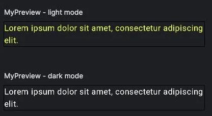

### 自定义 Preview

可通过参数定制 `@Preview`：

```kotlin
@Preview(
    name = "Dark Mode Preview",
    showBackground = true,
    backgroundColor = 0xFF000000,
    uiMode = Configuration.UI_MODE_NIGHT_YES,
    device = Devices.PIXEL_4_XL,
)
@Composable
fun DarkModePreview() {
    Greeting(name = "skydoves")
}
```

- `name`：为 Preview 命名，方便组织；
- `showBackground`：显示 Composable 后方的背景；
- `backgroundColor`：指定背景色；
- `uiMode`：模拟深色等系统模式；
- `device`：模拟特定设备尺寸，例如 Pixel 4 XL。

### 使用 `@PreviewParameter` 提供多组数据

`@PreviewParameter` 通过实现 [PreviewParameterProvider](https://developer.android.com/reference/kotlin/androidx/compose/ui/tooling/preview/PreviewParameterProvider)⁹¹ 的类向 Preview 注入实例，从而以不同输入生成多个动态预览：

```kotlin
data class User(val name: String)

class UserPreviewParameterProvider : PreviewParameterProvider<User> {
    override val values: Sequence<User>
        get() = sequenceOf(User("user1"), User("user2"))
}

@Preview(name = "UserPreview")
@Composable
private fun UserPreview(
    @PreviewParameter(provider = UserPreviewParameterProvider::class) user: User,
) {
    Text(text = user.name, color = Color.White)
}
```

Tooling 还内置 `LoremIpsum` 这个 `PreviewParameterProvider`，可提供预定义示例文本：

```kotlin
@Preview
@Composable
private fun TestPreview(
    @PreviewParameter(provider = LoremIpsum::class) text: String,
) {
    Text(text = text, color = Color.White)
}
```

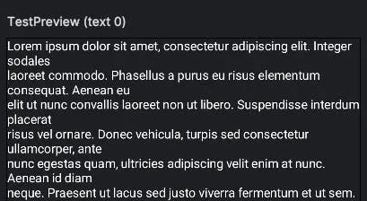

### 交互模式与 MultiPreview

Android Studio 的交互式 Preview 可直接点击组件、观察动画和状态更新，而无需运行应用：

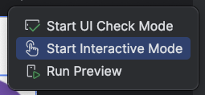

```kotlin
@Preview(showBackground = true)
@Composable
fun InteractivePreview() {
    var count by remember { mutableStateOf(0) }
    Column {
        Text("Count: $count")
        Button(onClick = { count++ }) { Text("Increment") }
    }
}
```

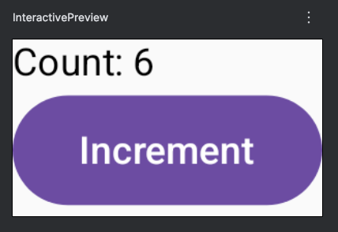

`@Preview` 可重复使用；Compose 还提供 `@PreviewLightDark`、`@PreviewFontScale`、`@PreviewDynamicColors`、`@PreviewScreenSizes` 等内置 MultiPreview 注解。例如原先分别标注浅/深色 Preview 的写法可替换为：

```kotlin
@PreviewLightDark
@Composable
private fun MyPreview() { /* ... */ }
```

把 `@PreviewScreenSizes`、`@PreviewFontScale` 等预定义注解组合起来，可一次查看不同屏幕和字体缩放配置，无需手动切换。

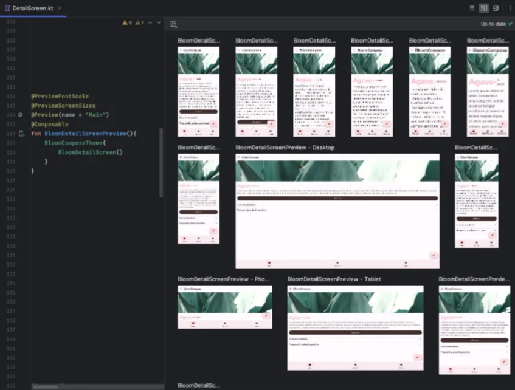

### 小结

`@Preview` 可在 Android Studio 中实时渲染、定制和交互测试 UI，支持主题、设备配置、深色模式与参数化输入，让开发者无需完整编译项目即可高效检查多种 UI 变化。

### 实战题

**问：** `@Preview` 如何改善开发流程？使用过哪些关键配置（深色主题、屏幕尺寸、MultiPreview 等）？

**答：** `@Preview` 的核心价值是把“改代码 -> 安装运行 -> 手动跳转页面”的反馈链缩短为“改代码 -> 立即看到结果”，特别适合调样式、检查边距、主题和组件状态。常用配置包括 `uiMode` 检查深浅色主题，`device` 或 `widthDp`/`heightDp` 检查屏幕尺寸，`fontScale` 检查大字号，`locale` 检查国际化，`showBackground`/`showSystemUi` 辅助观察整体效果，以及 `@PreviewParameter` 提供多组样例数据；`@PreviewLightDark`、`@PreviewScreenSizes`、`@PreviewFontScale` 等 MultiPreview 能一次展开多个配置，减少人工切换。最佳实践是让待预览组件尽量无副作用、依赖假数据而非真实网络和 DI，这样 Preview 才稳定、快速且可维护。

---

## 问题 39：如何为 Compose UI 组件或屏幕编写单元测试？

测试 Compose UI 能确保正确性、稳定性与可用性。Compose 的[测试库](https://developer.android.com/develop/ui/compose/testing)⁹³ 基于 Jetpack 的 `ComposeTestRule`，提供 UI 交互、同步与断言 API。

### 建立 Compose UI 测试

Compose 测试使用 `AndroidJUnit4`，并借助 `ComposeTestRule` 构建测试环境；它支持 UI 交互，并会在测试操作与重组间同步：

```kotlin
@get:Rule
val composeTestRule = createComposeRule()

@Test
fun verifyTextDisplayed() {
    composeTestRule.setContent {
        Text("Hello, skydoves!")
    }

    composeTestRule
        .onNodeWithText("Hello, skydoves!")
        .assertExists()
}
```

`setContent` 初始化待测 UI，`onNodeWithText` 找到指定文字的节点并验证其存在。

### 测试 UI 交互

Compose 可模拟点击、输入、滚动等用户操作：

```kotlin
@Test
fun clickButtonUpdatesText() {
    composeTestRule.setContent {
        var text by remember { mutableStateOf("Hello, skydoves!") }
        Column {
            Text(text)
            Button(onClick = { text = "Hello, Kotlin!" }) {
                Text("Click me")
            }
        }
    }

    composeTestRule.onNodeWithText("Click me").performClick()
    composeTestRule.onNodeWithText("Hello, Kotlin!").assertExists()
}
```

`performClick()` 模拟按钮点击，随后由 `assertExists()` 验证状态变化后的 UI。

### 同步与 Idling Resources

Compose UI 测试在单线程运行，Compose 会使用 Idling Resources 自动同步；但协程、动画等场景可能需要显式等待：

```kotlin
@Test
fun testLoadingState() {
    composeTestRule.setContent {
        var isLoading by remember { mutableStateOf(true) }
        LaunchedEffect(Unit) {
            delay(2000)
            isLoading = false
        }
        if (isLoading) CircularProgressIndicator() else Text("Loaded")
    }

    composeTestRule.waitUntilExactlyOneExists(hasText("Loaded"), 3000)
}
```

还可使用：

```kotlin
composeTestRule.waitUntilAtLeastOneExists(matcher, timeoutMs)
composeTestRule.waitUntilDoesNotExist(matcher, timeoutMs)
composeTestRule.waitUntilExactlyOneExists(matcher, timeoutMs)
composeTestRule.waitUntilNodeCount(matcher, count, timeoutMs)
```

详细说明参见 [Alternatives to Idling Resources in Compose tests: The waitUntil APIs](https://medium.com/androiddevelopers/alternatives-to-idling-resources-in-compose-tests-8ae71f9fc473)⁹⁴。

### 测试惰性列表与无障碍语义

对 `LazyColumn` 等可滚动内容，`assertIsDisplayed()` 验证元素位于视口内，`performScrollToNode()` 可测试屏幕外内容：

```kotlin
@Test
fun scrollToItem() {
    val list = List(100) { "item$it" }
    composeTestRule.setContent {
        LazyColumn(modifier = Modifier.testTag("lazyColumn")) {
            items(items = list) { value -> Text(value, Modifier.testTag(value)) }
        }
    }

    composeTestRule.onNodeWithTag("item50").assertDoesNotExist()
    composeTestRule.onNodeWithTag("lazyColumn").performScrollToNode(hasText("item50"))
    composeTestRule.onNodeWithTag("item50").assertIsDisplayed()
}
```

测试框架也支持语义属性，可验证内容描述等无障碍信息：

```kotlin
composeTestRule.onNodeWithContentDescription("Home Icon").assertExists()
```

### 小结

Compose UI 测试使用 `ComposeTestRule` 查找节点、执行交互、处理同步、验证惰性列表和无障碍语义，可让应用在不同状态、配置下保持可靠。完整 API 见 [Jetpack Compose Testing Cheat Sheet](https://developer.android.com/develop/ui/compose/testing/testing-cheatsheet)⁹⁵。

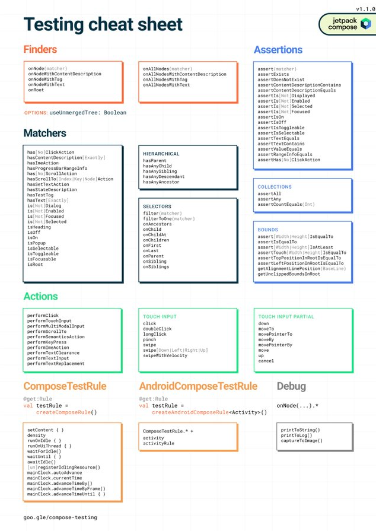

### 实战题

**问：** 如何编写单元测试，验证某个 Composable 展示了正确 UI 元素？

**答：** 使用 `createComposeRule()` 建立测试环境，在 `setContent { ... }` 中渲染待测 Composable，然后通过语义树查找节点并断言。最常用的是 `onNodeWithText()`、`onNodeWithTag()`、`onNodeWithContentDescription()` 配合 `assertExists()`、`assertIsDisplayed()`、`assertTextEquals()`；对复杂组件，建议提前添加稳定的 `testTag` 或语义属性，避免测试过度依赖文案。这样测试的重点应放在“用户能感知到的 UI 结果”而不是内部实现细节。

**问：** 如何用 `performClick()` 模拟用户操作，并通过 `assertExists()`、`assertTextEquals()` 等断言验证结果？

**答：** 测试流程通常是先渲染初始 UI，找到目标节点执行 `performClick()`，再断言点击后的界面状态是否符合预期。Compose Test Rule 会自动与重组和大部分 UI 空闲状态同步，因此点击后通常可直接断言；若涉及协程、动画或异步加载，再使用 `waitUntil...` 系列 API 等待目标状态出现。

```kotlin
@Test
fun clickButtonChangesLabel() {
    composeTestRule.setContent {
        var label by remember { mutableStateOf("Idle") }
        Column {
            Text(label)
            Button(onClick = { label = "Clicked" }) {
                Text("Tap")
            }
        }
    }

    composeTestRule.onNodeWithText("Tap").performClick()
    composeTestRule.onNodeWithText("Clicked").assertExists()
    composeTestRule.onNodeWithText("Clicked").assertTextEquals("Clicked")
}
```

---

## 问题 40：什么是截图测试？它如何保证开发中的 UI 一致性？

截图测试通过将新截图与已批准的参考图片比较，验证 UI 外观而无需在真实设备上运行应用。它能发现视觉变化、帮助团队在 Code Review 中高效识别和评估 UI 更新。

Compose 中可使用 Google 官方 Gradle 插件，以及社区库 Paparazzi、Roborazzi 三种主要方案。

### Compose Screenshot Testing Plugin

Google 官方的 [Compose Screenshot Testing Plugin](https://developer.android.com/studio/preview/compose-screenshot-testing)⁹⁶ 与 Compose [Preview](https://developer.android.com/develop/ui/compose/tooling/previews)⁹⁷ 直接集成，可生成、比较 UI 快照。截图测试会将当前快照与已批准基准图对比；有差异时测试失败并生成 HTML 报告标记改动。

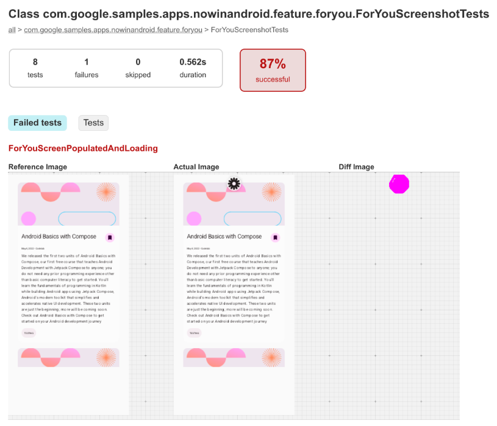

它支持：选择 Composable Preview 作为测试、生成参考图片、自动检测 UI 变化和报告、借助 `uiMode`/`fontScale` 等 `@Preview` 参数扩大覆盖范围，以及使用 `screenshotTest` source set 组织测试。

### Paparazzi

[Paparazzi](https://github.com/cashapp/paparazzi)⁹⁸ 是 Cash App 开源的截图测试库，不需要模拟器或实体设备，完全在 JVM 中运行，能够直接渲染 Compose UI 并进行像素级截图对比：

```kotlin
class LaunchViewTest {
    @get:Rule
    val paparazzi = Paparazzi(
        deviceConfig = PIXEL_5,
        theme = "android:Theme.Material.Light.NoActionBar",
    )

    @Test
    fun launchComposable() {
        paparazzi.snapshot { MyComposable() }
    }
}
```

它也能加载传统 View 并生成快照，因此无需实体设备或模拟器即可在 Android Studio 中渲染应用页面。

### Roborazzi

[Roborazzi](https://github.com/takahirom/roborazzi)⁹⁹ 是另一款 Android（含 Compose）截图测试开源库，提供简洁、灵活的截图和比较 API。它整合 [Robolectric](https://github.com/robolectric/robolectric)¹⁰⁰，可与 Hilt 一起运行并在更贴近真实的环境中交互 UI；可视为借助 Robolectric 扩展 Paparazzi 能力的方案。它还支持 [Compose Multiplatform](https://takahirom.github.io/roborazzi/compose-multiplatform.html)¹⁰¹、[Compose Preview](https://takahirom.github.io/roborazzi/preview-support.html)¹⁰²、[AI 图像断言](https://takahirom.github.io/roborazzi/ai-powered-image-assertion.html)¹⁰³ 等功能。

### 小结

截图测试能可靠追踪 UI 改动、保证设计一致性。Google 插件、Paparazzi、Roborazzi 各有适用优势；将其纳入流程可尽早发现视觉回归、改善 Code Review 协作，并持续保持 UI 品质。

### 实战题

**问：** 是否在团队流程中使用过截图测试？它如何改善开发或 Code Review，带来了哪些具体收益？

**答：** 在团队流程中，截图测试通常非常适合作为 UI 回归保护和 Code Review 辅助工具。它能把“这个 PR 到底改了哪里”从主观描述变成可视化差异图，帮助评审者快速识别间距、颜色、字体、阴影、状态切换和深浅色主题等视觉回归；同时也能把很多原本依赖人工点点看的检查前移到 CI。实际收益通常包括更早发现视觉问题、减少手工回归成本、为设计系统组件建立稳定基线，以及让 PR 讨论更聚焦于真实 UI 差异。它不是交互测试的替代品，因此仍需控制基线更新流程、固定字体和设备配置，并与功能测试、无障碍测试一起使用。

---

## 问题 41：如何确保 Jetpack Compose 的无障碍性？

确保 [Jetpack Compose 无障碍性](https://developer.android.com/develop/ui/compose/accessibility)¹⁰⁴，意味着设计可被 TalkBack 等辅助技术正确理解、操作的 UI。Compose 提供一组与声明式模型契合的 API。

### semantics Modifier

Compose 无障碍系统的核心是 `semantics` Modifier，它用于描述辅助服务应如何解释 UI 元素：

```kotlin
Modifier.semantics {
    contentDescription = "Send Button"
}
```

它可提供内容描述、角色、自定义操作等元数据。`Text`、`Button`、`Icon` 等多数标准 Composable 已有内置 semantics，因此通常只需为自定义组件手动添加。

### 图片和图标的 `contentDescription`

`Image`、`Icon` 的 `contentDescription` 是默认无障碍参数，提供视觉内容的文字语境：

```kotlin
Icon(
    imageVector = Icons.Default.Send,
    contentDescription = "Send",
)
```

纯装饰图片应传 `null`，使辅助服务跳过它：

```kotlin
Image(painter = painterResource(id = R.drawable.divider), contentDescription = null)
```

### 合并语义与自定义操作

多个元素应作为一个逻辑单元朗读时，可用 `Modifier.clearAndSetSemantics {}` 或 `Modifier.semantics(mergeDescendants = true)` 合并：

```kotlin
Column(modifier = Modifier.semantics(mergeDescendants = true) {}) {
    Text("Flight: NZ123")
    Text("Departure: 10:30 AM")
}
```

辅助技术会将内容视为单一条目。也可添加自定义操作，改善屏幕阅读器用户的交互体验：

```kotlin
Modifier.semantics {
    onClick("Double tap to bookmark") {
        // handle click
        true
    }
}
```

### 测试无障碍性

可使用 [Accessibility Scanner](https://support.google.com/accessibility/android/answer/6376570?hl=en)¹⁰⁵ 或在 Compose UI 测试中配合 `AccessibilityTestRule`，验证无障碍标签、角色和层级。Compose 也支持 semantics 断言：

```kotlin
composeTestRule.onNodeWithContentDescription("Send").assertExists()
```

### 小结

Compose 的 `semantics`、`contentDescription`、`mergeDescendants` 等结构化 API 可帮助构建无障碍 UI。正确标注视觉元素并合并相关内容，能让包括依赖辅助技术的用户在内的更多人顺畅使用应用。

### 实战题

**问：** `semantics` Modifier 的用途是什么？

**答：** `semantics` 用来为 Compose 节点声明辅助技术和测试框架可理解的语义信息，例如 `contentDescription`、`role`、`stateDescription`、`progressBarRangeInfo`、`heading`、自定义操作等。TalkBack 等无障碍服务依赖这些信息来朗读、导航和操作 UI，而 Compose UI 测试也会通过同一套语义树查找节点，因此 `semantics` 同时服务于无障碍与可测试性。只有在标准组件默认语义不足、需要补充或重写语义时才应手动添加，避免无意义覆盖内置行为。

**问：** 如何让一组 UI 元素在 Compose 中表现为单个无障碍节点？

**答：** 最常用的方法是在父容器上使用 `Modifier.semantics(mergeDescendants = true) {}`，让子节点语义合并为一个逻辑实体，适合卡片、列表项或“标题 + 副标题 + 图标”这类应整体朗读的内容。若不仅要合并，还要完全自定义对外暴露的语义，可使用 `clearAndSetSemantics { ... }` 在父节点上重建单一节点描述；同时应把纯装饰图片设为 `contentDescription = null`，避免重复朗读。合并后还要补充合适的 `role`、点击说明或状态描述，确保这个“单个节点”对 TalkBack 用户仍然完整、可理解且可操作。
